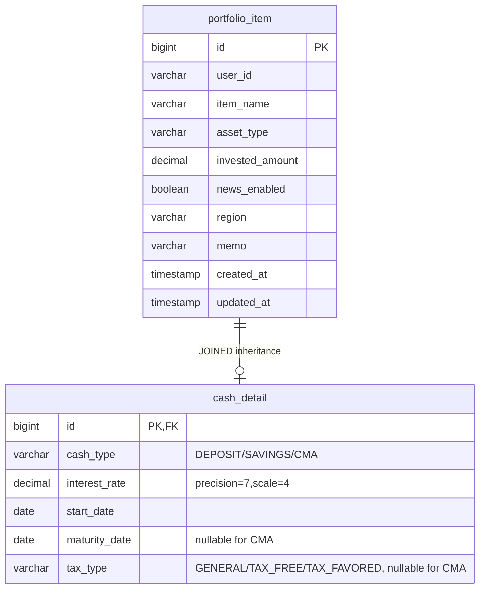

# feat: 현금성 자산(예금/적금/CMA) 이자 계산 기능

## Enhancement Summary

**Deepened on:** 2026-03-25
**Sections enhanced:** 6
**Research agents used:** JPA 상속 패턴, 이자 계산 로직, Alpine.js 폼, 아키텍처 리뷰, 데이터 무결성 리뷰, 성능 리뷰

### Key Improvements
1. **세금 계산 공식 수정**: 단순 `× 0.154`가 아닌 한국 세법 기준 소득세/주민세 분리 계산 + 10원 미만 절사
2. **이자율 정밀도 변경**: `DECIMAL(5,2)` → `DECIMAL(7,4)` (3.125% 같은 소수점 이하 금리 지원, ddl-auto로는 나중에 변경 불가)
3. **Partial update 안전성**: load-modify-save 패턴 명시, cashDetail 필드 보존
4. **general API 이중 경로 해소**: CASH는 전용 API만 사용, general에서 CASH 생성 차단

### New Considerations Discovered
- 한국 세법상 소득세/주민세를 각각 10원 미만 절사해야 정확한 세후 이자 계산 가능
- Hibernate 6에서 primitive 타입은 자동 NOT NULL — 반드시 래퍼 타입 사용
- 프론트엔드 부동소수점 이슈는 이 규모에서 `Math.floor()` 정수 연산으로 충분

---

## Overview

현금성 자산에 세부 유형(예금/적금/CMA), 이자율, 시작일, 만기일, 과세유형 정보를 추가하고, 개별 항목에 예상 수령액(세후 이자 포함)을 참고용으로 표시하는 기능.

포트폴리오 총 평가금액에는 원금(입금액)만 합산하며, 이자는 개별 항목 참고 정보로만 표시한다.

## Problem Statement / Motivation

- 현재 CASH 자산은 `investedAmount`만 저장하고 예금/적금/CMA 구분이 없음
- 이자율, 만기일 등 금융 상품 정보를 관리할 수 없음
- 사용자가 현금성 자산의 예상 수령액을 확인할 수 없음
- GitHub Issue: #12

## Key Decisions (from brainstorm)

| # | 결정 사항 | 선택 | 이유 |
|---|----------|------|------|
| 1 | 세부 유형 | 예금/적금/CMA 3종류 | enum 관리 |
| 2 | 과세 유형 | 일반과세/비과세/세금우대 | 사용자 선택 |
| 3 | 적금 계산 | 총 납입액 기반 단순 계산 | 입력 간편화 |
| 4 | CMA | 이자율 표시만, 평가금액 변동 없음 | 수시입출금 특성 |
| 5 | 총 평가금액 | 원금만 합산 (이자 미포함) | 확정 전 이자는 참고용 |
| 6 | 이자 계산 위치 | 프론트엔드 | 기존 패턴 유지 |
| 7 | 기간 산출 | 시작일(startDate) 필드 추가 | 정확한 기간 계산 |
| 8 | API 구조 | CASH 전용 엔드포인트 분리 | Bond/Fund 패턴 일관성 |
| 9 | CashStockLink | 예금/CMA만 허용, 적금 차단 | 사용자 결정 |
| 10 | 세부 유형 변경 | 변경 불가 (삭제 후 재등록) | 복잡도 감소 |
| 11 | general API | CASH 생성 차단 | 전용 API로 일원화 |

(see brainstorm: docs/brainstorms/2026-03-25-cash-interest-calculation-brainstorm.md)

## Proposed Solution

### 이자 계산 공식

**예금/적금 공통:**
```
기간(개월) = startDate ~ maturityDate 개월 수
세전이자 = Math.floor(investedAmount × (interestRate / 100) × (기간 / 12))
```

**세후이자 계산 (한국 세법 기준 — 소득세/주민세 분리 + 10원 미만 절사):**

| 과세 유형 | 계산 방식 |
|----------|----------|
| **일반과세(GENERAL)** | 소득세 = truncate10(세전이자 × 14%), 주민세 = truncate10(소득세 × 10%), 세금 = 소득세 + 주민세 |
| **세금우대(TAX_FAVORED)** | 세금 = truncate10(세전이자 × 9.5%) |
| **비과세(TAX_FREE)** | 세금 = 0 |

```
truncate10(x) = Math.floor(Math.floor(x) / 10) * 10   // 10원 미만 절사
세후이자 = 세전이자 - 세금
예상수령액 = investedAmount + 세후이자
```

> **참고**: 단순히 `세전이자 × 0.154`로 계산하면 실제 은행 계산과 차이가 발생합니다. 소득세 14%를 먼저 10원 절사한 후, 그 절사된 소득세의 10%를 주민세로 다시 10원 절사해야 합니다.

**CMA:** 이자율 표시만, 계산 없음. 예상수령액 = investedAmount

### ERD



## Technical Approach

### Architecture

BondDetail 패턴을 그대로 따르되, CASH 전용 API 엔드포인트를 분리한다.

**레이어별 변경:**

```
[Presentation] PortfolioController — POST/PUT /items/cash 추가
       ↓
[Application]  PortfolioService — addCashItem(), updateCashItem() 추가
       ↓
[Domain]       PortfolioItem + CashDetail 조합, CashSubType/TaxType enum
       ↓
[Infrastructure] CashItemEntity 필드 추가, PortfolioItemMapper 수정
```

**API 경로 일원화:** CASH 항목은 `/items/cash` 전용 API만 사용한다. 기존 `POST /items/general`에서 `assetType=CASH`로 생성하는 경로는 차단한다 (`addGeneralItem()`에서 CASH 타입 거부 검증 추가).

### Implementation Phases

#### Phase 1: 백엔드 도메인/인프라

**1-1. Enum 생성**

- `CashSubType.java` — `DEPOSIT("예금")`, `SAVINGS("적금")`, `CMA("CMA")`
- `TaxType.java` — `GENERAL("일반과세")`, `TAX_FREE("비과세")`, `TAX_FAVORED("세금우대")`
  - TaxType에는 `taxRate` 필드를 두지 않는다 — 세금 계산이 단순 비율 곱이 아닌 소득세/주민세 분리 절사이므로, 프론트엔드에서 과세 유형별 분기 처리

파일 위치: `portfolio/domain/model/enums/`

**1-2. CashDetail 도메인 모델 생성**

- `CashDetail.java` — `@Getter`, immutable, all-args constructor
- 필드: `CashSubType subType`, `BigDecimal interestRate`, `LocalDate startDate`, `LocalDate maturityDate`, `TaxType taxType`
- `maturityDate`와 `taxType`은 CMA일 때 null 허용

파일 위치: `portfolio/domain/model/CashDetail.java`

**1-3. CashItemEntity 필드 추가**

- `cashType` — `@Column(name = "cash_type", length = 20)` + `@Enumerated(EnumType.STRING)`
- `interestRate` — `@Column(precision = 7, scale = 4)` BigDecimal (래퍼 타입, nullable)
- `startDate` — `@Column(name = "start_date")` LocalDate (nullable)
- `maturityDate` — `@Column(name = "maturity_date")` LocalDate (nullable)
- `taxType` — `@Column(name = "tax_type", length = 20)` + `@Enumerated(EnumType.STRING)` (nullable)

파일: `portfolio/infrastructure/persistence/CashItemEntity.java`

> **Research Insight — JPA/Hibernate 6.x:**
> - 모든 새 필드는 반드시 **래퍼 타입**(BigDecimal, LocalDate)을 사용. Hibernate 6은 primitive 필드에 NOT NULL을 자동 부여하여 기존 데이터 ALTER TABLE 시 에러 발생 가능
> - `@Enumerated(EnumType.STRING)` 필수 — ordinal 저장은 enum 순서 변경 시 데이터 손상 위험
> - 이자율 precision을 `(7,4)`로 설정 — `ddl-auto: update`는 기존 컬럼의 precision 변경을 수행하지 않으므로 처음부터 여유 있게 설정 (max 999.9999%)

**1-4. PortfolioItem 도메인 수정**

- `CashDetail cashDetail` 필드 추가
- `createWithCash()` 팩토리 메서드 추가
- `updateCashDetail()` 메서드 추가
- 재구성 생성자에 `CashDetail` 파라미터 추가

파일: `portfolio/domain/model/PortfolioItem.java`

**1-5. PortfolioItemMapper 수정**

- `toDomain()`: `CashItemEntity` → `CashDetail` 매핑 추가
- `toEntity()`: `CASH` case에서 CashDetail 필드를 `CashItemEntity`에 설정
- **Null-safe 매핑**: `cashType`이 null이면 `CashDetail`을 null로 유지 (기존 CASH 데이터 호환)

파일: `portfolio/infrastructure/persistence/mapper/PortfolioItemMapper.java`

> **Research Insight — Mapper null 처리:**
> CashItemEntity의 cashType이 null인 경우 (기존 데이터):
> - `toDomain()`: CashDetail을 null로 설정 → PortfolioItem.cashDetail = null
> - `toEntity()`: CashDetail이 null이면 entity의 상세 필드를 null로 유지
> - null enum에 `.name()` 호출 시 NPE 발생하므로, 반드시 null 체크 후 변환

#### Phase 2: 백엔드 API

**2-1. DTO 생성**

- `CashDetailResponse.java` — `subType`, `interestRate`, `startDate`, `maturityDate`, `taxType`
- `CashItemAddRequest.java` — `itemName`, `investedAmount`, `cashType`, `interestRate`, `startDate`, `maturityDate`, `taxType`, `region`, `memo`
- `CashItemUpdateRequest.java` — `itemName`, `investedAmount`, `interestRate`, `startDate`, `maturityDate`, `taxType`, `memo` (cashType 변경 불가이므로 제외)

파일 위치: `portfolio/application/dto/`, `portfolio/presentation/dto/`

**2-2. PortfolioItemResponse 수정**

- `CashDetailResponse cashDetail` 필드 추가
- `from()` 메서드에서 CashDetail 매핑 추가

**2-3. PortfolioService 수정**

- `addCashItem()` 메서드 추가 — `PortfolioItem.createWithCash()` 호출
- `updateCashItem()` 메서드 추가
- `addGeneralItem()`에서 `AssetType.CASH` 거부 검증 추가 (전용 API 일원화)
- CashStockLink 검증: `findAndValidateCashItem()`에서 적금(SAVINGS) 차단 추가

> **Research Insight — Partial update 안전성:**
> `updateCashItem()`은 반드시 **load-modify-save 패턴**을 따라야 합니다:
> 1. 기존 PortfolioItem을 DB에서 조회 (기존 CashDetail 포함)
> 2. Request DTO에서 변경된 필드만 적용
> 3. 변경되지 않은 CashDetail 필드는 기존 값 유지
> 4. 단일 `@Transactional` 내에서 검증 + 저장
>
> DTO에서 새 CashDetail을 통째로 생성하면, 누락된 필드가 null로 덮어씌워질 위험이 있습니다.

**2-4. PortfolioController 수정**

- `POST /api/portfolio/items/cash` → `addCashItem()`
- `PUT /api/portfolio/items/cash/{itemId}` → `updateCashItem()`

#### Phase 3: 프론트엔드

**3-1. 등록 폼 수정 (index.html)**

- 자산 유형 "현금성 자산" 선택 시 CASH 전용 폼으로 전환 (기존 GENERAL 폼에서 분리)
- 세부 유형(예금/적금/CMA) 셀렉트 박스
- 세부 유형에 따라 `x-show`로 조건부 필드 표시:
  - 예금/적금: 이자율, 시작일, 만기일, 과세유형 모두 표시
  - CMA: 이자율만 표시, 나머지 숨김
- 세부 유형 변경 시 `@change`로 숨겨진 필드 초기화
- 이자율 입력: `type="number"` `x-model.number` step="0.01" min="0" max="100"
- 날짜 입력: `type="date"` — LocalDate의 `YYYY-MM-DD` 포맷과 자동 호환
- 조건부 required: `:required="cashType !== 'CMA'"`

> **Research Insight — Alpine.js 패턴:**
> - 폼 필드 토글에는 `x-show` 사용 (DOM 유지, 빠른 토글). `x-if`는 에러 메시지 등에 사용
> - `x-model.number` 수식어로 숫자 자동 변환
> - 세부 유형 변경 시 `@change="maturityDate = ''; taxType = '';"` 으로 불필요 필드 초기화
> - fetch로 제출하므로 `disabled` 필드도 JavaScript 객체에 값이 유지됨

**3-2. 수정 폼 수정 (index.html)**

- CASH 항목 수정 시 cashDetail 필드 표시
- 세부 유형은 `disabled` + 시각적 비활성 스타일(`bg-gray-100 text-gray-500 cursor-not-allowed`)로 읽기 전용 표시
- `openEditModal()`에서 `case 'CASH'` 추가하여 cashDetail 데이터 세팅

**3-3. 이자 계산 함수 추가 (app.js)**

```javascript
// 10원 미만 절사
truncateToTen(value) {
    return Math.floor(Math.floor(value) / 10) * 10;
},

// 예상 수령액 계산 (참고용, 총 평가금액에는 미포함)
getExpectedReturn(item) {
    if (item.assetType !== 'CASH' || !item.cashDetail) return null;
    if (item.cashDetail.subType === 'CMA') return null;

    const principal = item.investedAmount;
    const rate = item.cashDetail.interestRate / 100;
    const months = this.getMonthsBetween(item.cashDetail.startDate, item.cashDetail.maturityDate);
    const grossInterest = Math.floor(principal * rate * (months / 12));

    let totalTax = 0;
    if (item.cashDetail.taxType === 'GENERAL') {
        const incomeTax = this.truncateToTen(grossInterest * 0.14);
        const residentTax = this.truncateToTen(incomeTax * 0.1);
        totalTax = incomeTax + residentTax;
    } else if (item.cashDetail.taxType === 'TAX_FAVORED') {
        totalTax = this.truncateToTen(grossInterest * 0.095);
    }
    // TAX_FREE: totalTax = 0

    const netInterest = grossInterest - totalTax;
    return { grossInterest, totalTax, netInterest, expectedTotal: principal + netInterest };
},

// 개월 수 계산
getMonthsBetween(startDateStr, endDateStr) {
    const start = new Date(startDateStr);
    const end = new Date(endDateStr);
    let months = (end.getFullYear() - start.getFullYear()) * 12
                 + (end.getMonth() - start.getMonth());
    if (end.getDate() < start.getDate()) months -= 1;
    return Math.max(0, months);
},
```

- `getEvalAmount()`는 CASH에 대해 기존대로 `investedAmount` 반환 (변경 없음)

> **Research Insight — JS 부동소수점:**
> 이 규모(원금 수억 원 이하, 단리 계산)에서는 `Math.floor()`로 정수 변환하면 부동소수점 오차가 실무적으로 무시 가능합니다. `big.js` 라이브러리는 별도 의존성 추가 없이도 충분합니다. 단, "실제 금액은 금융기관 계산과 다를 수 있습니다" 안내 문구를 표시합니다.

**3-4. 목록 표시 수정 (app.js + index.html)**

- CASH 항목 카드에 세부 유형 배지 표시
- `getItemSummary()`에서 CASH 분기 추가: 이자율, 만기일 표시
- 예금/적금: 예상 수령액을 작은 글씨로 추가 표시 (예: `"예상 수령액: 10,350,000원"`)
- CMA: 이자율만 표시
- 금액 포맷: `Intl.NumberFormat('ko-KR')` 사용

**3-5. API 호출 수정 (api.js)**

- `addCashItem()` — `POST /api/portfolio/items/cash`
- `updateCashItem()` — `PUT /api/portfolio/items/cash/{itemId}`

**3-6. 등록 폼 submit 수정 (app.js)**

- `submitAddItem()`에서 CASH 분기 추가 — `API.addCashItem()` 호출
- CMA일 때 `maturityDate`, `taxType`을 null로 전송
- `submitEditItem()`에서 CASH 분기 추가 — `API.updateCashItem()` 호출

## System-Wide Impact

### CashStockLink 연동

- 적금(SAVINGS)은 `CashStockLink` 생성 시 차단 필요
- `PortfolioService.findAndValidateCashItem()`에서 cashType이 SAVINGS면 예외 발생
- 기존 CashDetail이 없는 CASH 항목(기존 데이터)은 허용 유지 (cashType == null이면 통과)

### General API CASH 생성 차단

- `addGeneralItem()`에서 `AssetType.CASH` 거부 검증 추가
- 기존 CASH 데이터의 수정은 `updateCashItem()` 전용 API로 유도
- 프론트엔드에서 CASH 선택 시 GENERAL 폼 대신 CASH 전용 폼으로 전환

### 기존 CASH 데이터 호환

- `CashItemEntity`의 새 필드는 모두 nullable (래퍼 타입 사용)
- `PortfolioItemMapper.toDomain()`에서 cashType이 null이면 CashDetail을 null로 설정
- 프론트엔드: `cashDetail`이 null이면 기존대로 원금만 표시 (이자 관련 UI 미노출)
- DDL은 JPA `ddl-auto: update`로 자동 생성 (별도 Flyway 마이그레이션 불필요)

### 성능 영향

- cash_detail 테이블에 5개 컬럼 추가는 기존 JOINED LEFT JOIN에 컬럼만 추가될 뿐, JOIN 수는 변하지 않음 — 성능 영향 없음
- 프론트엔드 이자 계산은 순수 산술 연산 — 1000건 미만에서 무시 가능

## Acceptance Criteria

### Functional Requirements

- [ ] 예금/적금/CMA 세부 유형을 선택하여 현금성 자산 등록 가능
- [ ] 세부 유형에 따라 이자율, 시작일, 만기일, 과세유형 입력 가능
- [ ] CMA 선택 시 만기일/과세유형 필드 미표시
- [ ] 예금/적금 항목에 예상 수령액(세후) 참고 표시
- [ ] 세금 계산: 일반과세 소득세(14%) + 주민세(소득세의 10%), 각각 10원 미만 절사
- [ ] 포트폴리오 총 평가금액에는 원금만 합산
- [ ] 세부 유형 변경 불가 (수정 시 읽기 전용)
- [ ] 적금(SAVINGS)은 CashStockLink 차단
- [ ] 기존 CashDetail 없는 항목은 기존대로 정상 동작
- [ ] general API에서 CASH 생성 차단

### Non-Functional Requirements

- [ ] 이자율: `precision=7, scale=4` (퍼센트 단위, 예: 3.1250)
- [ ] 금액: `precision=18, scale=2` (기존 패턴)
- [ ] Enum: `@Enumerated(EnumType.STRING)` 사용
- [ ] 모든 새 필드 래퍼 타입 (primitive 사용 금지)

## Dependencies & Risks

| 리스크 | 영향 | 완화 방안 |
|--------|------|----------|
| 기존 CASH 데이터 호환 | 기존 항목 조회 시 NPE 가능 | nullable 필드 + null-safe 매핑 |
| Partial update 시 cashDetail 손실 | 수정 시 기존 값 null 덮어쓰기 | load-modify-save 패턴, 단일 @Transactional |
| CashStockLink 적금 차단 | 기존 적금-주식 연결 존재 가능 | 기존 데이터에는 cashType 없으므로 영향 없음 |
| 이자 계산 정확도 | 단리/총액 기반 단순 계산 | brainstorm에서 합의된 범위 + 면책 문구 표시 |
| DECIMAL precision 변경 불가 | ddl-auto로 나중에 변경 안 됨 | 처음부터 (7,4)로 여유 있게 설정 |

## Sources & References

### Origin

- **Brainstorm document:** [docs/brainstorms/2026-03-25-cash-interest-calculation-brainstorm.md](docs/brainstorms/2026-03-25-cash-interest-calculation-brainstorm.md)
  - Key decisions: 총 평가금액에 이자 미포함, 적금 총액 기반 계산, CMA 이자율 표시만

### Internal References

- BondDetail 참조 패턴: `portfolio/domain/model/BondDetail.java`
- BondItemEntity 참조: `portfolio/infrastructure/persistence/BondItemEntity.java`
- PortfolioItemMapper: `portfolio/infrastructure/persistence/mapper/PortfolioItemMapper.java`
- 프론트엔드 getEvalAmount: `src/main/resources/static/js/app.js:1106`
- CashStockLink 검증: `portfolio/application/PortfolioService.java`

### External References

- 이자소득세 원천징수 10원 절사: 국고금관리법 제47조
- Alpine.js x-show/x-if: https://alpinejs.dev/directives/if
- Hibernate 6 primitive NOT NULL: https://discourse.hibernate.org/t/database-schema-validation-primitive-nullables/10894

### Related Work

- GitHub Issue: #12