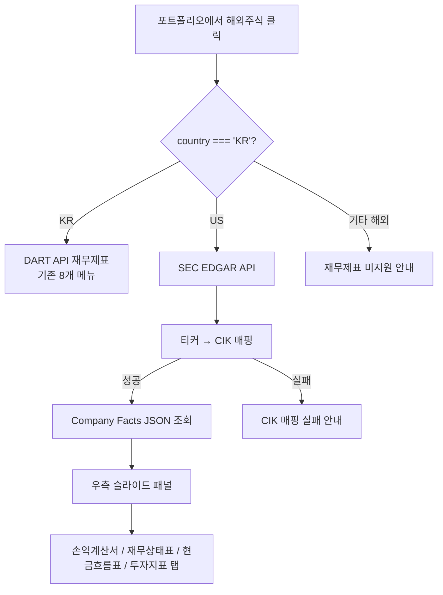

# 해외주식 재무제표 (SEC EDGAR API)

## Problem Frame

포트폴리오에 해외주식(미국)을 등록한 사용자가 해당 종목의 재무제표를 확인할 수 없다. 국내 주식은 DART API를 통해 재무제표를 제공하고 있으나, 해외주식은 재무 데이터가 전혀 없어 투자 판단에 필요한 핵심 정보가 누락된 상태다.

SEC EDGAR API를 활용하여 미국 상장 기업의 재무제표를 조회하고, 기존 재무제표 UI에 통합하여 국내/해외 주식 모두 동일한 UX로 재무 정보를 제공한다.

## User Flow

## Requirements

**데이터 조회**
- R1. SEC EDGAR Company Facts API를 사용하여 미국 상장 기업의 재무 데이터를 조회한다
- R2. 티커(Ticker) → CIK 번호 매핑을 지원한다 (SEC의 company_tickers.json 활용). 매핑 실패 시(미등록 티커, ADR 등) 별도 안내 메시지를 표시한다
- R3. 핵심 재무제표 3종을 조회한다: 손익계산서(Income Statement), 재무상태표(Balance Sheet), 현금흐름표(Cash Flow)
- R4. 투자 핵심 지표를 조회한다: EPS(주당순이익), PER(주가수익비율), ROE(자기자본이익률), 부채비율, 영업이익률
- R5. 연간(10-K) 보고서 기준 데이터만 대상으로 한다. 분기(10-Q) 데이터는 이번 범위에서 제외한다

**UI 통합**
- R6. 기존 우측 슬라이드 패널에 통합한다. 현재 `financial.js`의 `country !== 'KR'` 가드를 수정하여 해외주식도 패널을 열 수 있도록 한다
- R7. 해외주식 선택 시 메뉴를 4개 탭으로 교체한다: 손익계산서, 재무상태표, 현금흐름표, 투자지표 (기존 DART 8개 메뉴 대신)
- R8. 금액은 USD 원본으로 표시한다 ($12.3B, $456M 등 미국식 단위 포맷)
- R9. 연도별 비교가 가능하도록 최근 3개 연도(Annual) 데이터를 함께 표시한다
- R10. 패널 헤더의 통화/수량 표시를 해외주식에 맞게 조정한다 (원→$, 주→shares)

**대상 범위 및 에러 처리**
- R11. SEC EDGAR에 등록된 미국 상장 기업(us-gaap 기준)만 대상으로 한다
- R12. 미국 외 해외주식(일본, 홍콩 등)은 패널 내 "재무제표 미지원" 안내 메시지를 표시한다
- R13. SEC API 호출 실패, CIK 매핑 실패, 데이터 부분 누락 시 각각 구분된 안내 메시지를 표시한다

## Success Criteria

- 포트폴리오의 미국 주식 클릭 시 재무제표 3종 + 투자 지표가 정상 표시된다
- 국내 주식과 해외 주식 간 전환이 자연스럽고 UX가 일관된다
- CIK 매핑 실패, API 오류, 부분 데이터 누락 시 각각 적절한 안내가 표시된다

## Scope Boundaries

- 미국 외 해외 시장(일본, 홍콩, 중국 등) 재무제표는 제외
- 분기(10-Q) 보고서는 제외 — 연간(10-K)만
- IFRS 기준 제출 기업(일부 외국 기업 ADR)은 제외 — us-gaap만 지원
- 재무 데이터 DB 저장/캐싱 전략은 planning에서 결정
- 기존 DART 재무제표 기능은 변경하지 않음
- 차트(바 차트 등) 시각화는 제외 (데이터 테이블만)

## Key Decisions

- **SEC EDGAR Company Facts API 사용**: XBRL 기반 structured JSON으로 별도 파싱 없이 재무 데이터 접근 가능. 무료, API 키 불필요 (User-Agent 헤더만 필요)
- **별도 포트 생성**: 기존 `StockFinancialPort`는 DART 전용 파라미터(reportCode, fsDiv, indexClassCode)에 밀착되어 있어 SEC 데이터를 수용할 수 없음. SEC 전용 포트 + 도메인 모델을 새로 만든다
- **기존 패널 통합 + 메뉴 교체**: 패널 자체는 재사용하되, 해외주식 선택 시 메뉴를 4개 탭으로 교체. 국내 8개 메뉴와 해외 4개 탭은 완전 분리
- **USD 원본 표시**: 환율 변동에 따른 혼란 방지, 해외 투자자에게 자연스러운 단위
- **연간 보고서만**: 10-K 기준 최근 3개년 데이터. 분기 데이터는 복잡도 대비 가치가 낮아 V1에서 제외

## Outstanding Questions

### Deferred to Planning
- [Affects R1][Needs research] SEC EDGAR Company Facts API의 응답 구조와 XBRL 태그 매핑 (us-gaap taxonomy에서 필요한 항목 식별)
- [Affects R2][Technical] CIK 매핑 데이터의 캐싱/갱신 전략 (기존 `DartCorpCodeCache` 패턴 참고)
- [Affects R1][Technical] Company Facts 응답이 2-8MB로 큼. Company Facts vs Company Concept 엔드포인트 선택 및 SEC 전용 read timeout 설정
- [Affects R1][Technical] SEC API rate limit (10 req/sec) 대응 전략
- [Affects R4][Needs research] EPS는 SEC에서 직접 제공. PER는 주가(KIS API) 필요, ROE/부채비율/영업이익률은 원시 데이터에서 계산 필요 — 계산 로직 설계
- [Affects R7][Technical] 해외주식 탭별 컬럼 정의 (손익계산서/재무상태표/현금흐름표 각각의 컬럼명, 데이터 타입, 포맷)
- [Affects R8][Technical] USD 단위 포맷팅 유틸리티 구현 방식 (B/M/K 단위 변환 임계값)
- [Affects R9][Needs research] SEC 데이터에서 fiscal year 기준 최근 3개년 추출 방식

## Next Steps

→ `/ce:plan` for structured implementation planning