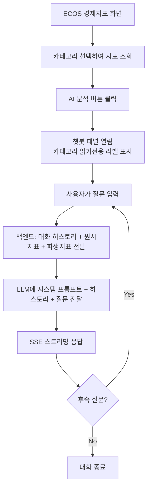

# 경제지표 챗봇 분석 기능

## Problem Frame

사용자가 ECOS 경제지표 화면에서 각 지표의 현재 값을 보고 있지만, 해당 수치가 경제적으로 어떤 의미인지, 파생지표와 함께 종합적으로 어떤 상황을 나타내는지 직관적으로 파악하기 어렵다. 기존 챗봇 인프라(Gemini LLM, SSE 스트리밍)를 활용하여 경제지표 컨텍스트를 넘기고 AI에게 해석을 요청할 수 있게 한다.

## Requirements

**챗봇 멀티턴 대화 지원 (전체 모드 공통)**
- R13. 대화 히스토리를 프론트엔드에서 관리하고 매 요청 시 백엔드에 전달한다. 현재 챗봇은 매 요청이 독립적(단일턴)이므로, `ChatRequest`에 대화 히스토리 필드(`messages`)를 추가한다
- R14. `LlmPort.stream()`을 대화 히스토리를 받을 수 있도록 확장한다. `GeminiRequest`도 멀티턴 contents 배열을 생성하도록 수정한다
- R15. 프론트엔드(`chat.js`)에서 이전 메시지를 수집하여 `API.streamChat()` 호출 시 함께 전송한다. 이 개선은 PORTFOLIO, FINANCIAL, ECONOMIC 모든 모드에 적용된다

**챗봇 모드 확장**
- R1. `ChatMode`에 `ECONOMIC` 모드를 추가한다 (R3과 함께 구현 — exhaustive switch로 인해 동시 변경 필수)
- R2. `ChatRequest`에 경제지표 카테고리 필드(`indicatorCategory`)를 추가한다. ECONOMIC 모드에서 필수(non-null), 다른 모드에서는 null. `stockCode`와 공존하며 모드에 따라 사용하는 필드가 다르다

**경제지표 컨텍스트 빌드 (백엔드)**
- R3. `ChatContextBuilder`에 ECONOMIC 모드 처리를 추가한다. 선택된 카테고리의 원시 지표(이름, 값, 단위, 기준일)를 시스템 프롬프트에 포함한다. 지표 데이터가 없거나 조회 실패 시, 시스템 프롬프트에 "현재 데이터를 조회할 수 없습니다"를 포함하여 LLM이 상황을 안내하도록 한다
- R4. 파생지표 계산 로직을 백엔드에 구현한다. 현재 프론트엔드(`ecos.js`)에서 계산하는 **12개 카테고리의 파생지표(약 40종 이상)**를 백엔드 서비스로 이전한다. 대상 카테고리: INTEREST_RATE(금리 스프레드 6종), MONEY_FINANCE(통화/금융 비율 7종), STOCK_BOND, GROWTH_INCOME, PRODUCTION, CONSUMPTION_INVESTMENT, PRICE, EMPLOYMENT_LABOR, SENTIMENT, EXTERNAL_ECONOMY, REAL_ESTATE, CORPORATE_HOUSEHOLD
- R5. 파생지표는 카테고리에 따라 조건부로 포함한다. `ecos.js`의 `getCurrentSpreads()` 디스패치 맵과 동일한 카테고리-파생지표 매핑을 따른다. 파생지표가 없는 카테고리(EXCHANGE_RATE, POPULATION, COMMODITY)는 원시 지표만 포함한다

**프론트엔드 진입점**
- R6. ECOS 경제지표 화면 헤더 영역(뷰모드 토글 옆)에 'AI 분석' 버튼을 추가한다. 지표 로딩 중이거나 지표 목록이 비어 있으면 비활성화한다
- R7. 버튼 클릭 시 챗봇 패널을 열고, ECONOMIC 모드와 현재 선택된 카테고리를 자동 설정한다. 카테고리는 챗봇 헤더에 읽기전용 라벨로 표시한다
- R8. 사용자가 직접 질문을 입력하여 대화를 시작한다 (자동 질문 생성 없음)
- R8-1. ECONOMIC 모드의 빈 상태(empty state) 안내 텍스트를 표시한다 (예: '경제지표에 대해 질문해보세요'). 기존 PORTFOLIO/FINANCIAL 모드와 동일한 패턴을 따른다

**챗봇 패널 UX**
- R10. ECONOMIC 모드는 ECOS 화면의 'AI 분석' 버튼으로만 진입 가능하다. 기존 챗봇 모드 토글(PORTFOLIO/FINANCIAL)에는 추가하지 않는다
- R11. ECOS 화면에서 카테고리를 변경하면 열려 있는 챗봇의 대화를 초기화하고 새 카테고리 컨텍스트로 갱신한다
- R12. 멀티턴 대화를 지원한다. 대화 히스토리를 프론트엔드에서 관리하며 매 요청 시 전달한다. 카테고리 컨텍스트(시스템 프롬프트)는 동일 카테고리 내 대화에서 유지된다. 카테고리 변경 시 R11에 따라 초기화된다

**시스템 프롬프트**
- R9. 경제지표 전문 어시스턴트로서의 역할을 정의하는 시스템 프롬프트를 작성한다. 지표 해석, 경기 상황 판단, 파생지표 의미 설명 등을 안내한다. 각 지표의 기준일을 명시하고, 데이터가 오래된 경우(예: 분기별 지표) LLM이 시점을 언급하도록 안내한다. R3 구현 전 R9의 프롬프트 구조가 먼저 결정되어야 한다

## Success Criteria

- ECOS 화면에서 AI 분석 버튼을 클릭하면 챗봇이 열리고, 현재 카테고리의 지표 데이터가 컨텍스트로 전달된다
- 사용자가 "현재 금리 상황이 어떤가요?" 같은 질문을 하면, 실제 지표 값과 파생지표를 기반으로 구체적인 분석 답변을 받을 수 있다
- 후속 질문("그러면 신용 스프레드는 어떤 의미인가요?")에도 이전 대화 맥락을 유지하며 답변한다
- 멀티턴 개선은 기존 PORTFOLIO, FINANCIAL 모드에도 동일하게 적용된다

## Scope Boundaries

- 글로벌 경제지표(TradingEconomics)는 이번 범위에 포함하지 않는다 (ECOS 국내 지표만)
- 히스토리 데이터(시계열 추이)는 챗봇 컨텍스트에 포함하지 않는다 (현재 최신 값만)
- ECONOMIC 모드는 기존 모드 토글에 추가하지 않는다 (ECOS 화면 전용 진입)
- 대화 히스토리는 프론트엔드 메모리에서만 관리한다 (서버 세션 저장 없음)

## Key Decisions

- **데이터 범위**: 현재 선택된 카테고리의 지표만 전달 → 컨텍스트 집중, 토큰 절약
- **파생지표 계산 위치**: 백엔드 → 재사용성 확보, 프론트엔드와 일관된 계산 보장. 12개 카테고리 40+ 파생지표 전체를 백엔드에 구현
- **진입점**: ECOS 화면 버튼 전용 → 모드 토글 미추가, 컨텍스트 자동 설정으로 사용 편의성 확보
- **기본 질문**: 사용자 직접 입력 → 다양한 질문 의도에 대응
- **멀티턴**: 진정한 멀티턴 구현 (기존 챗봇이 단일턴이었으므로 전체 모드 공통으로 대화 히스토리 전달 기능 신규 구현)
- **카테고리 변경 시**: 대화 초기화 → 오래된 컨텍스트 혼동 방지
- **ChatRequest 구조**: `indicatorCategory` 필드 + `messages` 히스토리 필드 추가

## Outstanding Questions

### Deferred to Planning
- [Affects R4][Technical] 파생지표 계산 서비스의 패키지 위치 결정 (economics 도메인 vs chatbot 도메인)
- [Affects R9][Needs research] 시스템 프롬프트 최적화 — 지표 데이터 포맷(마크다운 테이블 vs 리스트)에 따른 LLM 응답 품질 비교
- [Affects R3, R4][Technical] 카테고리별 지표 수 + 파생지표의 토큰 예산 추정 및 Gemini 컨텍스트 윈도우 내 적합성 확인
- [Affects R3][Technical] `KeyStatIndicator`에 기준일(date) 필드가 없음 — ECOS API 응답 또는 `EcosIndicatorLatest`에서 기준일 데이터 소스 확인 필요
- [Affects R13-R15][Technical] 멀티턴 대화 히스토리의 토큰 관리 전략 (최대 턴 수 또는 토큰 한도 설정)

## Next Steps

→ `/ce:plan` for structured implementation planning