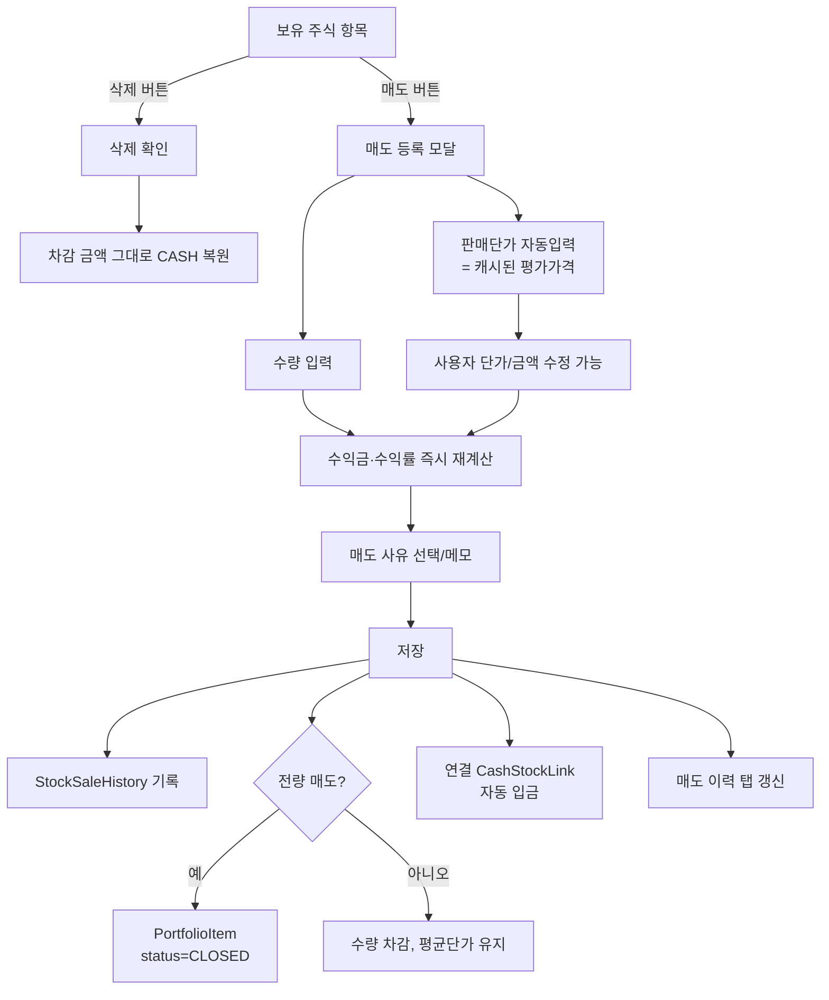

# 포트폴리오 주식 매도 기능

## Problem Frame

현재 포트폴리오 주식 항목에는 **삭제 기능만 존재**하며, 삭제 시 사용자가 입력한 `restoreAmount`만큼 연결 CASH로 복원될 뿐 **수익 회계와 매도 이력이 남지 않는다**. 결과적으로:

- 삭제(잘못 입력 정정)와 매도(실제 처분 기록)가 한 동작으로 섞여 있다.
- 부분/전량 매도, 매도 단가 직접 입력, 매도 이력/타임라인 조회가 불가능하다.
- 종목과 함께 철회되었던 수익금/수익률 데이터를 회고할 도구가 없다.

이번 작업의 목표는 **삭제와 매도를 분리**하고, **주식 매도 기록과 타임라인**을 도입하여 사용자가 직접 입력한 매도 가격 기준으로 수익을 추적하는 것이다.

본 시스템의 운영 원칙은 **'실시간 시장가 추적'이 아닌 '사용자가 진행한 투자 기록'**이다. 모든 매수/매도 가격, 평균단가, 복원 금액의 진실 공급원(SoT)은 사용자 입력값이며, 캐시된 KIS 시장가는 입력 보조용 참고값일 뿐이다.

## Scope Boundaries

### 포함
- 주식(`AssetType.STOCK`) 항목의 부분/전량 매도 — **국내/해외 모두**
- 매도 시 가중평균단가(WAC) 기준 수익금·수익률 계산 (해외 주식은 종목 통화 기준 + KRW 환산 병기)
- 매도 시 연결된 CashStockLink로 매도금액 자동 입금
- 전량 매도 시 PortfolioItem Soft archive 처리
- 매도 이력 저장·조회·타임라인(포트폴리오 페이지 내 탭)
- 매도 이력 사후 수정 (수량/단가/사유/메모)
- 매도 사유 선택/입력
- 삭제 동작 정의 정정 (사용자 입력 금액 그대로 복원, 시장가 무관)

### 제외 (후속)
- 주식 외 자산(채권/부동산/펀드/현금/코인 등)의 매도/매각/인출/처분 통합 모델 — **별도 후속 브레인스토밍**
- 자산 분류별 목표 비중 설정·초과/부족 표시 (이슈 #29의 1~2번) — **별도 후속 브레인스토밍**
- FIFO/세금 계산 등 고급 원가 흐름
- 외부 증권사 매도 데이터 연동

## User Flow

## Requirements

### 매도 등록

- **R1.** 주식 항목 카드에 **삭제 버튼과 별도로 '매도' 버튼**을 둔다.
- **R2.** 매도 등록 모달은 **수량, 판매단가(또는 판매금액), 매도일, 사유, 메모** 입력을 받는다.
- **R3.** 판매단가는 진입 시 **`PortfolioEvaluationService` 캐시 평가가격**을 기본값으로 자동 채운다. 사용자는 직접 수정할 수 있다. 캐시 가격이 제공되지 않는 경우(KIS 호출 실패, 캐시 미스 등) 입력란을 비우고 "현재가를 가져올 수 없습니다. 직접 입력하세요." 안내 문구를 노출하며 사용자가 직접 입력해야 저장이 가능하다.
- **R4.** 화면 안내 문구를 명시한다:
  - "현재 조회된 가격 기준으로 자동 입력되었습니다."
  - "실제 판매금액과 다를 경우 수정할 수 있습니다."
  - "수익금과 수익률은 입력한 판매금액 기준으로 자동 계산됩니다."
- **R5.** 부분 매도 수량이 보유 수량보다 클 수 없다. 매도 수량은 정수(주) 단위로만 입력 가능하다(소수점 매도는 본 범위 외).
- **R6.** 매도일 기본값은 오늘이며, 미래 날짜는 입력할 수 없다.

### 수익 계산

- **R7.** 수익금/수익률 계산 기준은 **`StockDetail.avgBuyPrice`(가중평균단가)** 이다.
- **R8.** 수익금 = (판매단가 − 평균단가) × 매도 수량. 판매금액으로 입력한 경우에도 동일 결과가 되도록 단가는 자동 환산한다. 통화는 종목의 `priceCurrency`를 따른다.
- **R9.** **종목 수익률(%)** = 수익금 ÷ (평균단가 × 매도 수량) × 100, 소수점 둘째 자리 반올림. (해당 매도 1건 자체의 손익률)
- **R9-1.** **자산 기여율(%)** = 매도 수익금 ÷ 매도 시점 전체 자산 평가금액 × 100, 소수점 둘째 자리 반올림. (이번 매도가 전체 자산에 기여한 비중) 매도 시점 전체 자산 평가금액(`totalAssetAtSale`)은 `PortfolioEvaluationService.evaluatePortfolios`로 계산한 사용자 전체 평가금액 합계(현금 포함)이며, 매도 이력에 스냅샷 저장한다.
- **R10.** 사용자가 단가 또는 판매금액을 수정하면 수익금·수익률이 **즉시 재계산되어 화면에 반영**된다.
- **R11.** 사용자 입력값(단가/수량)이 진실 공급원이며, 서버는 동일 공식으로 재계산하여 저장하고 응답으로 반환한다. 클라이언트 표시는 서버 응답값을 우선하며, 화면 미리보기는 UX 보조 수단이다.
- **R11-1.** (해외 주식) 종목의 `priceCurrency`가 KRW가 아닌 경우, 매도 시점 환율(`fxRate`)을 함께 입력 또는 적용하여 `salePriceKrw`(KRW 환산 판매금액) 및 `profitKrw`(KRW 환산 수익금)을 함께 계산·저장한다. 환율 미적용 시 KRW 환산값은 null로 저장하되 사용자에게 안내한다.

### 매도 이력 (StockSaleHistory)

- **R12.** 매도 1건당 다음 항목을 저장한다: 매도일, 매도 수량, 평균단가(스냅샷), 판매단가, 판매금액, 수익금, **종목 수익률(R9), 자산 기여율(R9-1), 매도 시점 전체 자산 평가금액 스냅샷(`totalAssetAtSale`)**, 사유, 메모, 종목 코드/이름 스냅샷, **통화(currency), 환율(fxRate), KRW 환산 판매금액(salePriceKrw), KRW 환산 수익금(profitKrw)**, **`unrecordedDeposit` 플래그**(CASH 항목 0개로 입금 누락된 경우 true).
- **R13.** 종목 코드/이름은 **스냅샷 저장**한다 (이후 PortfolioItem이 archive 되어도 이력 단독 조회 가능). 자산 분류 스냅샷은 본 범위(STOCK 단일)에서 가치가 없으므로 제외하며, 후속 자산 통합 매도 모델 도입 시 함께 추가한다.
- **R14.** 매도 이력은 사용자(userId) 단위로 조회 가능해야 한다. 본 범위에서는 매도 이력 탭(R25)이 단일 진입점이며, 다중 포트폴리오 가정은 적용하지 않는다.
- **R14-1.** **매도 이력 사후 수정**: 사용자는 등록한 매도 이력의 수량/단가/사유/메모를 수정할 수 있다. 수량 또는 단가 수정 시 보유 수량, 평균단가(WAC), CASH 입금액을 일관되게 재계산한다. 전량 매도가 부분 매도로 바뀌면 PortfolioItem 상태를 `CLOSED` → `ACTIVE`로 복원한다. 모든 수정은 단일 트랜잭션으로 처리한다.

### PortfolioItem 상태 변화

- **R15.** PortfolioItem에 **상태 필드**를 도입한다: `ACTIVE`(보유 중) / `CLOSED`(전량 매도 완료).
- **R16.** 부분 매도 시 수량과 investedAmount가 차감되며, 평균단가는 유지된다. 상태는 `ACTIVE`.
- **R17.** 전량 매도 시 상태를 `CLOSED`로 전환하고 보유 목록에서 숨긴다. 매도 이력은 그대로 유지된다.
- **R18.** `CLOSED` 항목은 추가 매수·매도가 불가하다. (재매수는 새 PortfolioItem으로 등록)
- **R18-1.** **상태 필터 정책**: 모든 기존 PortfolioItem 조회 경로(Allocation, Evaluation, 보유 목록, 뉴스 구독, deposit/purchase 이력)는 기본적으로 `ACTIVE` 항목만 반환하도록 일괄 적용한다. `CLOSED` 항목은 다음에서만 조회된다: (1) 매도 이력 탭, (2) 누적 실현 수익 회고용 별도 화면(후속 도입 시).
- **R18-2.** **트랜잭션 및 동시성**: 매도 등록(이력 기록·수량 차감·CASH 입금·상태 전환)은 단일 `@Transactional` 경계로 묶고, 부분 실패 시 전체 롤백한다. PortfolioItem에 `@Version` 필드(낙관적 락)를 추가하여 동시 매도 시도(브라우저 다중 탭 등)를 충돌 감지로 차단한다.

### 현금 연동

- **R19.** 매도 시 **연결된 CashStockLink가 있으면 해당 CASH 항목에 판매금액을 자동 입금**한다. 해외 주식의 경우 KRW 환산 판매금액(`salePriceKrw`)으로 입금하며, 환율 미적용 시 입금을 보류하고 사용자에게 안내한다.
- **R20.** 연결이 없으면 매도 등록 모달에서 사용자가 **입금 대상 CASH 항목을 선택**한다. CASH 항목이 0개로 선택할 대상이 없는 경우, 매도는 허용하되 모달에서 "판매금액이 어디에도 입금되지 않으며 추후 수동 조정이 필요합니다"를 명시적으로 확인받고 매도 이력에 `unrecordedDeposit=true` 플래그를 저장한다. 자산 합계 invariant 경고는 매도 이력 화면에서도 노출한다.
- **R21.** 매도 후 CashStockLink는 다음과 같이 처리한다:
  - 부분 매도: 링크 유지
  - 전량 매도(`CLOSED`): 링크 해제

### 삭제 동작 명확화

- **R22.** 삭제는 "잘못 입력한 항목 정정"용으로, **차감되었던 금액 그대로 연결 CASH에 복원**한다(현재가/매도 무관).
- **R23.** 매도 이력이 1건 이상 존재하는 PortfolioItem은 **삭제할 수 없다**(이력 무결성). 매도 후 정리는 `CLOSED` 상태로 유지하면 된다. `CLOSED` 항목 또한 매도 이력이 부착되어 있으므로 삭제 불가하며, 보유 목록에서 숨김 처리만 한다.
- **R24.** 매도 버튼과 삭제 버튼은 **시각적으로 명확히 구분**한다 (삭제는 아이콘+위험 색상, 매도는 1차 액션).

### 매도 이력 화면

- **R25.** 포트폴리오 페이지 내에 **'매도 이력' 탭**을 추가한다.
- **R26.** 탭 화면은 **월별 그룹** 타임라인으로 매도 건을 나열한다. 한 행은 매도일, 종목, 수량, 판매금액, 수익금(±), **종목 수익률(±%, R9)**, **자산 기여율(±%, R9-1)** 두 수익률을 함께 포함한다. 정밀도는 모두 소수 둘째 자리 반올림.
- **R27.** (제외 — 후속) 자산 분류별 필터 UI는 본 범위(STOCK 단일)에서 의미가 없으므로 제공하지 않는다. 자산 통합 매도 모델 후속 브레인스토밍 시점에 함께 도입한다.
- **R28.** 월별 합계(매도 건수, 총 판매금액, 총 수익금)을 표시한다.

### 매도 사유

- **R29.** 사유는 **사전 정의 enum + 자유 메모** 조합이다. enum 후보:
  - `TARGET_PRICE_REACHED` 목표가 도달
  - `STOP_LOSS` 손절
  - `CASH_NEEDED` 현금 확보
  - `REBALANCING` 리밸런싱
  - `OTHER` 기타
  - (`ALLOCATION_OVER`은 목표 비중 기능 후속 도입 시 함께 추가)
- **R30.** 메모는 선택 입력. 사유가 `OTHER`인 경우에도 메모는 필수가 아니다(권장만).

## Success Criteria

- 사용자는 보유 주식을 부분/전량 매도할 수 있고, 매도 시점의 실제 판매단가를 직접 입력할 수 있다.
- 매도 1건은 수익금·수익률·사유가 함께 기록되며, 후일 매도 이력 탭에서 월별로 회고할 수 있다.
- 잘못 등록한 항목은 매도 흐름과 별개로 삭제하여 차감 금액 그대로 복원된다.
- 매도 이력이 있는 항목은 삭제로 사라지지 않으며, 전량 매도된 항목도 이력 화면에서 계속 확인할 수 있다.
- 매도금액은 연결 CashStockLink가 있는 경우 자동 입금되어 별도 수동 갱신이 필요 없다.

## Key Decisions

- **사용자 입력값이 진실 공급원(SoT)**: 본 시스템은 실시간 시장가 추적이 아닌 사용자가 진행한 투자 기록 시스템. 모든 매수/매도 가격, 평균단가, 복원 금액의 SoT는 사용자 입력. KIS 캐시 시장가는 입력 보조용 참고값.
- **원가 기준은 가중평균단가(WAC)**: 기존 `StockDetail.avgBuyPrice`를 그대로 사용. FIFO는 도메인 복잡도 대비 효용 낮음 (개인 포트폴리오 관리 용도).
- **현재가 소스는 `PortfolioEvaluation` 캐시**: KIS 실시간 호출 비용/지연 회피, 기존 평가 서비스 재사용. 정확도가 부족하면 사용자가 직접 수정.
- **전량 매도는 Soft archive**: 매도 이력과 원본 항목의 연결 유지. 보유 목록 노이즈 제거. (재매수 시 새 항목으로 처리하여 평균단가 혼동 방지)
- **현금 자동 입금은 CashStockLink 우선**: 기존 매수/삭제 흐름과 동일 패턴. 링크 없을 때만 사용자 선택. CASH 0개 사용자는 `unrecordedDeposit` 플래그로 허용.
- **해외 주식 포함, 통화 기준 + KRW 환산 병기**: `priceCurrency` 기준 수익금/수익률 계산, 환율 적용 시 KRW 환산값 함께 저장.
- **매도 이력 사후 수정 허용**: 정정 경로 확보를 위해 수량/단가/사유/메모를 수정할 수 있게 함. 수정 시 보유 수량·평균단가·CASH 입금을 일관되게 재계산.
- **단일 트랜잭션 + 낙관적 락**: 매도 등록의 4개 부수 작업(이력·수량·CASH·상태)은 단일 트랜잭션 경계, `@Version`으로 동시 매도 충돌 방지.
- **종목 코드/이름 스냅샷 저장**: 원본 PortfolioItem이 closed/삭제되어도 이력 화면이 깨지지 않게 함. 자산 분류 스냅샷은 STOCK 단일 범위에서 가치가 없으므로 제외.
- **매도 이력 있는 항목은 삭제 금지**: 삭제와 매도 의미를 깨끗하게 분리. closed 상태로 정리하면 충분. 정정은 R14-1의 이력 수정 경로로 처리.
- **상태 필터는 기본 ACTIVE**: 모든 기존 조회 경로에 ACTIVE 필터 일괄 적용, CLOSED 노출은 명시적 화면(매도 이력 탭)에서만.

## Dependencies / Assumptions

- `PortfolioEvaluationService`에 **per-PortfolioItem 평가 메서드(예: `evaluateOne(portfolioItemId)`)를 신설**하고 `ItemEvaluation` DTO에 `portfolioItemId`를 추가하여 매도 모달이 단일 종목 평가가격을 직접 조회할 수 있게 한다.
- KIS 실시간 호출은 본 범위에서 사용하지 않는다(캐시 가격에 의존, 캐시 미스 시 R3 fallback).
- 기존 CashStockLink 차감/복원 로직(`PortfolioItem.deductAmount`/`restoreAmount`)을 매도 흐름에서도 재사용한다.
- `StockSaleHistory` 엔티티 신설 및 `PortfolioItem.status`, `PortfolioItem.@Version` 컬럼 추가는 CLAUDE.md 규칙상 **사전 승인 필수**. 설계(`/ce:plan`) 단계에서 ERD/컬럼 정의 별도 승인을 받는다.

## Outstanding Questions

### Resolve Before Planning
(없음 — P1 결정 완료. 잔여 P2/P3 항목은 설계 단계에서 처리)

### Deferred to Planning
- (R12, R14) 매도 이력 엔티티 위치(`portfolio` vs 신규 하위 패키지)와 stock/portfolio 도메인 경계 결정.
- (R15~R18, R18-1) ACTIVE 필터 일괄 적용 대상 조회 경로 전수 식별 (Allocation/Evaluation/News/Deposit/Purchase).
- (R26~R28) 매도 이력 화면 페이징 정책 — 무한 스크롤 vs 월 단위 페이징 (사용자 매도 누적량 추정 후 결정).
- (R11-1, R19) 해외 주식 환율(`fxRate`) 입력 UX — 사용자 직접 입력 vs 한국수출입은행 환율 API 자동 조회 vs 매도일 기준 자동 fallback.
- (모달 인터랙션) 매도 모달의 idle/loading/submitting/error/success 상태 사양, 매도 이력 탭 빈 상태/로딩/에러 상태, 단가↔금액 양방향 입력 인터랙션, 반응형/접근성.
- (R26 행 인터랙션) 매도 이력 행 상세 모달, 매도 이력 사후 수정(R14-1) UI 진입점.

## Next Steps

→ `/ce:plan` 으로 구조 설계 단계로 진행