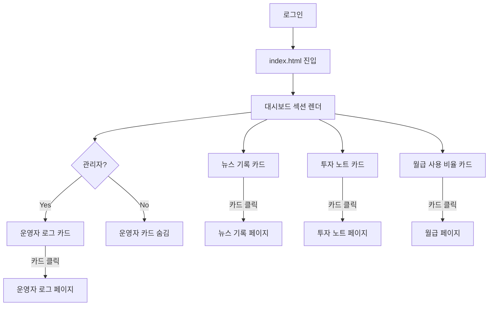

# 통합 대시보드 추가

## Problem Frame

태형님이 운영 중인 주식/포트폴리오 플랫폼은 기능이 늘어나면서(뉴스 기록, 투자 노트, 월급 사용 비율, 운영자 로그) 사용자가 각 페이지를 일일이 탐색해야 최근 활동/현황을 파악할 수 있다. 메인 진입 시점에 4개 영역의 핵심 요약을 한눈에 보여주는 대시보드 섹션을 도입해 진입 비용을 낮춘다.

## User Flow

## Requirements

**배치 / 진입점**
- R1. 대시보드는 `index.html` 메인 페이지의 상단 섹션으로 편입되며, 로그인 직후 첫 화면에서 노출된다.
- R2. 대시보드는 페이지 진입 시 1회만 데이터를 조회한다. 자동/수동 갱신 버튼은 제공하지 않는다(브라우저 새로고침으로 갱신).

**카드 콘텐츠**
- R3. 뉴스 기록 카드: 최근 등록한 뉴스 이벤트 3건(제목 + 등록일)과 **카테고리별 총 건수**를 함께 표시한다.
- R4. 투자 노트 카드: 최근 작성한 투자 노트 3건(종목명 + 작성일 + 요약 한 줄)을 표시한다.
- R5. 월급 사용 비율 카드: 이번 달의 카테고리별 사용 비율을 파이/도넛 차트 형태로 표시한다.
- R6. 운영자 로그 카드: 오늘 발생한 장애 건수 단일 숫자만 표시한다(텍스트/리스트 없음).

**권한 / 가시성**
- R7. 운영자 로그 카드는 관리자 계정에 한해 노출된다. 일반 사용자에게는 카드 자체가 보이지 않으며, 빈 자리도 남기지 않는다.

**인터랙션**
- R8. 4개 카드 모두 카드 영역 전체가 클릭 영역이며, 클릭 시 해당 기능의 상세 페이지로 이동한다.
- R9. 데이터가 없을 때(예: 뉴스 0건, 이번 달 월급 미입력)에는 "데이터 없음" 안내와 해당 기능 페이지로 가는 동일한 클릭 동작을 유지한다.

## Success Criteria

- 로그인 직후 첫 화면에서 4개(또는 관리자가 아닐 경우 3개) 카드 요약이 한 번의 페이지 로드로 표시된다.
- 각 카드 클릭으로 해당 기능 페이지로 정확히 이동한다.
- 관리자가 아닌 계정에서는 운영자 로그 카드가 DOM에 노출되지 않는다.
- 데이터가 없는 상태에서도 카드 레이아웃이 깨지지 않고 "데이터 없음" 표시가 일관되게 보인다.

## Scope Boundaries

- 자동 갱신/실시간 푸시는 제외(R2).
- 운영자 로그 카드는 "오늘 장애 건수" 외 다른 지표(누적, 주간 추이 등)는 제외(R6).
- 카드별 위젯 커스터마이즈/순서 변경/숨김 등 사용자 설정 기능은 제외.
- 별도 대시보드 전용 라우트(`/dashboard.html`) 신설은 제외(메인 통합 결정).
- 신규 도메인 모델 추가 없음 — 기존 모듈(newsjournal, stocknote, salary, logging)의 조회 API 조합으로 구성.

## Key Decisions

- **메인 페이지 통합 (별도 페이지 X)**: 진입 비용 최소화 + 가장 많이 보는 페이지에 핵심 요약을 노출.
- **1회 조회만 (자동 갱신 X)**: 운영자 로그 카드도 "오늘 장애 건수" 수준의 거시 지표라 실시간성이 필요 없음. 자동 갱신은 추후 필요 시 별도 요구로 분리.
- **카드 전체 클릭 → 페이지 이동**: "더보기" 링크 방식보다 직관적이고 모바일에서도 탭 영역이 넓어 유리.
- **운영자 카드는 단일 숫자**: 정보를 보고 즉시 운영자 로그 페이지로 이동하는 흐름이 기본이므로 카드 자체에서 상세를 보여줄 이유가 없음.

## Dependencies / Assumptions

- 기존 `logging` 모듈에 `AdminGuardInterceptor`/`AdminLogController`가 존재하며 관리자 식별/로그 조회가 이미 가능함을 확인함 (코드 검증 완료).
- 기존 `newsjournal`, `stocknote`(프론트 컴포넌트 존재), `salary` 모듈의 조회 API/데이터로 카드 콘텐츠 구성이 가능함을 가정함. 정확한 조회 메서드 확보/엔드포인트 신설 여부는 planning에서 확정한다.
- 관리자 여부는 기존 사용자 프로필 응답(`UserProfileResponse`)에 노출되는 값을 활용한다고 가정 — planning에서 검증 필요.

## Outstanding Questions

### Resolve Before Planning

- (없음)

### Deferred to Planning

- [Affects R3][Technical] 뉴스 기록 "최근 3건" 및 "카테고리별 총 건수"를 단일 요약 엔드포인트로 제공할지, 기존 목록/카테고리 API 조합으로 처리할지 결정.
- [Affects R4][Technical] 투자 노트의 "요약" 한 줄을 어디서 가져올지(노트 본문 일부 truncate vs 별도 요약 필드) 확인.
- [Affects R5][Technical] 월급 사용 비율의 카테고리별 비율을 도출하기 위한 기존 `SalaryService` 메서드 재사용 가능 여부 확인.
- [Affects R6, R7][Technical] "오늘 발생 장애 건수"의 정의(로그 레벨 ERROR 기준? 특정 카테고리?) 및 카운트 API 신설/재사용 여부.
- [Affects R7][Needs research] 프론트에서 관리자 카드 노출 분기를 위해 사용할 사용자 프로필 응답 필드 확인(`UserProfileResponse`의 role/admin 표기).
- [Affects R1][Technical] index.html 상단에 대시보드 섹션을 삽입할 위치(기존 컨텐츠 위/아래/탭화) 및 Alpine.js 컴포넌트 구조.
- [Affects R8, R9][Technical] 카드 클릭 영역 처리(div role="link" vs `<a>` 래핑) 및 데이터 없음 상태의 공통 컴포넌트화 여부.

## Next Steps

→ `/ce:plan` 으로 구조화된 구현 계획 작성