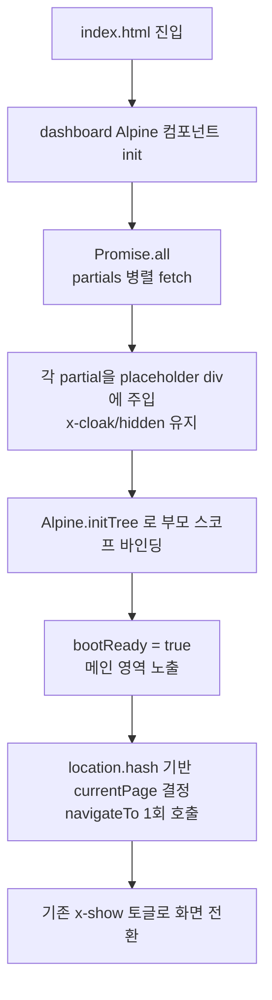

# 프론트엔드 index.html 메뉴별 partial 분리

## Problem Frame

`src/main/resources/static/index.html`이 **5,007줄**까지 비대해져 있다. 10개 메뉴(home, keywords, news-search, ecos, global, portfolio, salary, stocknote, news-journal, admin-logs)의 마크업과 헤더/사이드바/공용 모달이 한 파일에 혼재한다. (favorite는 독립 라우트가 아니라 home 대시보드의 사이드 위젯이며 home partial에 포함된다.) 결과:

- 변경 시 영향 범위 파악이 어렵고 PR 리뷰 비용이 높다
- 메뉴별 책임 경계가 흐려 충돌·회귀가 잦다
- 신규 메뉴 추가/수정 시 동선이 길다

본 작업의 핵심 제약은 **기능 변경 0, 회귀 0** 이다.

## User Flow (변경 후)

> **순서 보장 핵심**: navigateTo / hashchange / 페이지별 init 코드는 `bootReady === true` 이전에 발동되지 않는다. partial 주입 + initTree 완료 후에 단 1회 dispatch한다.

## Requirements

**파일 구조**
- R1. index.html은 헤더 / 사이드바 / 메인 placeholder만 남기고, 메뉴별 마크업은 `src/main/resources/static/partials/<menu>.html` 로 분리한다. 메인 영역에는 메뉴별 placeholder div(예: `

`) 를 두고 fetch 결과를 그대로 주입한다.
- R2. 분리 단위는 메뉴 1개 = partial 1개로 한다(home, keywords, news-search, ecos, global, portfolio, salary, stocknote, news-journal, admin-logs). favorite는 home partial 내부에 포함한다.
- R3. 헤더·사이드바·모바일 드로어 등 메뉴 전환 무관 공용 마크업은 `partials/_header.html`, `partials/_sidebar.html` 로 분리한다. 모달은 **호출 컨텍스트 단위**로 분류한다 — 단일 메뉴에서만 사용되는 모달(예: 키워드 추가 모달)은 해당 메뉴 partial에 포함하고, 여러 메뉴에서 호출되는 진짜 공용 모달만 `partials/_modals.html` 에 둔다(없다면 파일 생략).

**로딩 동작**
- R4. 부트 시 `dashboard().init()` 에서 모든 partial을 `Promise.all` 로 **병렬 사전 로딩**한 뒤 placeholder에 주입한다(lazy 금지). 주입 → initTree → `bootReady=true` 셋이 모두 끝나기 전까지는 `navigateTo` / hashchange / 페이지별 init 훅이 발동되지 않도록 부트 게이트를 둔다.
- R5. 주입 후 `Alpine.initTree(target)` 로 부모 `dashboard()` 스코프 안에서 바인딩되도록 보장한다. (Alpine 버전 검증은 Resolve Before Planning 참조.)
- R6. partial 안에서는 새로운 `x-data` 를 도입하지 않는다(기존 단일 부모 스코프 유지). 기존 `x-show="currentPage === '...'"` 토글 메커니즘은 그대로 유지한다.
- R7. partial 마크업 안에 `<script>` 태그·인라인 핸들러(`onclick=`, `onload=` 등)를 두지 않는다 — `innerHTML` 로 주입된 `<script>` 는 실행되지 않으므로 회귀 위험이 있다. 기존 인라인 코드가 발견되면 분리 단계에서 외부 `js/components/*.js` 또는 Alpine 디렉티브로 옮긴다.
- R8. 모든 partial 루트 컨테이너는 `x-cloak`(또는 동등한 hidden 처리)로 시작하여 initTree 직후에만 노출한다. Tailwind global에 `[x-cloak]{display:none!important}` 가 적용되어 있는지 확인하고, 없다면 1차 PR에서 보강한다(FOUC/미바인딩 마크업 1프레임 노출 방지).
- R8a. partial fetch는 `Promise.allSettled` 로 처리한다. 실패한 partial은 해당 placeholder에 inline 에러 카드(메시지 + '다시 시도' 버튼)를 렌더하고, 다른 메뉴는 정상 동작한다. 재시도 시 동일 partial만 재 fetch + initTree 적용한다. 셸(헤더/사이드바)의 공용 partial 실패도 동일하게 inline 에러 카드 처리한다(셸 자체가 보이는 한 다른 메뉴 이동은 가능).

**기능 동등성**
- R9. 분리 전후로 모든 메뉴의 화면·인터랙션·API 호출·상태 동작이 동일해야 한다(시각적·기능적 회귀 0).
- R10. 본 라운드에서 `js/components/*.js` 와 `app.js` 의 라우팅/페이지별 cleanup 로직(`navigateTo` switch case 본문)은 **수정하지 않는다**. 단, `dashboard().init()` 의 부트 흐름에 partial fetch + 주입 + initTree + bootReady 게이트를 삽입하는 **셋업 로직 추가는 허용**한다(R4 이행에 필수).

**점진적 진행**
- R11. 메뉴 단위로 점진 분리하되 PR 단위는 1개 이상의 메뉴를 묶을 수 있다(독립성·크기에 따라 결정). 각 PR은 (a) 해당 PR에서 분리된 메뉴와 (b) 그때까지 인라인으로 남아 있는 메뉴 모두에서 R9를 만족해야 한다(혼합 상태 acceptance bar).

## Success Criteria

- index.html 줄 수가 **1,500줄 이하** (셸 + placeholder 수준)로 축소 — **최종 PR 기준**, 중간 PR은 비례 감소
- 10개 메뉴 모두 hash 직접 진입(`#portfolio` 등) / 메뉴 클릭 / 새로고침에서 기존 동작과 동일
- Alpine devtools 또는 콘솔에서 `x-data` 스코프 누락·중복 경고 없음
- partial 주입 시 미바인딩 마크업이 1프레임도 보이지 않음(FOUC 0)
- `#portfolio` 등 hash-direct 진입 시 home 화면 잔상 0 프레임(중간 깜빡임 금지)
- 기존 단위 동작(차트 인스턴스 정리, 페이지 전환 cleanup, 메뉴별 init API 호출 횟수·시점) 회귀 없음
- partial fetch 부분 실패 시 해당 메뉴 placeholder에 inline 에러 카드 + '다시 시도' 버튼이 노출되고, 다른 메뉴는 정상 작동(R8a)

## Scope Boundaries

- **out of scope**: `portfolio.js`(1679), `financial.js`(934), `salary.js`(668), `stocknote.js`(659), `api.js`(621) 등 **JS 파일 분리는 본 라운드에서 제외**. 후속 라운드에서 별도 브레인스토밍.
- **out of scope**: Thymeleaf 등 서버사이드 템플릿 도입, Vite/번들러 도입, Alpine → Vue/React 마이그레이션.
- **out of scope**: 라우팅 방식 변경(현재 hash 라우팅 유지), 디자인/UX 변경, 새 기능 추가.

## Key Decisions

- **Client-side partial fetch 채택**: 빌드 도구·서버 변경 없이 정적 자원 환경 그대로 적용 가능. 점진 도입 용이.
- **부트 시 전체 병렬 사전 로딩**: 라우팅 lazy load는 Alpine 재초기화 타이밍 버그 위험이 크고 기존 `x-show` 토글 동작과의 동등성을 깨뜨릴 수 있어 회피.
- **단일 `dashboard()` 부모 스코프 유지**: partial 내부에서 새 `x-data` 를 만들지 않아 기존 상태 공유 구조와 cleanup 로직을 그대로 유지.
- **공용 마크업은 `_` 접두 partial**: 헤더/사이드바/모달의 메뉴 전환 무관한 자산임을 파일명으로 명시.

## Dependencies / Assumptions

- 정적 리소스는 동일 origin 으로 서빙되어 `fetch('/partials/home.html')` 가 CORS 이슈 없이 동작한다(현재 Spring Boot 정적 리소스 매핑 가정).
- Alpine.js v3 사용 확정(`alpinejs@3` + `@alpinejs/collapse@3` CDN). `Alpine.initTree(target)` 는 v3 공식 API이며 후행 마운트 시 closest ancestor의 `x-data` 스코프를 자동 상속 → 단일 `dashboard()` 부모 스코프 유지 가능(R5/R6 충족).
- partial 마크업 자체는 인증 정보·시크릿을 포함하지 않으며 비인증 사용자도 GET 가능한 정적 자원으로 서빙된다(권한 검사는 API/데이터 레벨에서 유지).
- 배포 시 `index.html`(셸)과 `/partials/*.html` 의 캐시 일관성을 보장해야 한다 — 한 쪽만 stale 캐시일 때 placeholder ID·바인딩 키 불일치로 R9가 깨진다. 빌드 도구가 없으므로 (a) `index.html` 은 `Cache-Control: no-cache` 또는 짧은 TTL, (b) partial fetch URL에 deploy hash 쿼리 부여 중 한 가지 정책을 plan 단계에서 채택한다.
- 메뉴 추가/제거는 본 작업 진행 중에 발생하지 않거나, 발생 시 partial 분리 단계에 통합된다.

## Outstanding Questions

### Resolve Before Planning
없음(모두 해소).

### Resolved (검증 완료)
- ✅ [Success Criteria / R8a] partial fetch 실패 UX = **(a) 부분 실패 inline 에러 카드 + '다시 시도' 버튼**. `Promise.allSettled` 채택, 다른 메뉴는 정상 동작.
- ✅ [R5/R6] Alpine.js v3 확정 (`alpinejs@3` CDN). `Alpine.initTree()` 후행 마운트 + 부모 `x-data` 스코프 자동 상속 동작 → R5/R6 가정 유효.
- ✅ [R4/R7 idempotency] index.html 인라인 코드 인벤토리 결과:
  - 인라인 `<script>` / `onclick=` / `onload=` / `onsubmit=`: 0건(R7 위반 없음)
  - `x-init` 2곳: (a) home의 favorite chart canvas 2개(`renderFavoriteChart`) — home partial 내부 `x-for` 스코프 의존, initTree 후 정상 동작 / (b) news-journal `
` — **partial 주입 시점의 즉시 실행 + navigateTo case의 `newsJournalLoad()` 중복 호출 위험**
  - `x-effect` 1곳(portfolio editForm), `$watch` 등록 코드는 reactive 등록만이라 회귀 영향 없음
  - **결정**: idempotency 가드는 **partial 측** 책임. news-journal partial 분리 시 `x-init`의 즉시 실행 라인 제거(watcher 등록만 유지), bootReady 게이트 후 `navigateTo` 가 1회만 호출되어 `newsJournalLoad()` 가 정확히 1회 발동되도록 한다.

### Deferred to Planning
- [Affects R11][Technical] 1차 PR 대상 메뉴 선정 기준(가장 독립적인 home or admin-logs 권장 후보).
- [Affects R9][Needs research] 차트(Chart.js) 인스턴스가 `x-show` 비표시 → 표시 전환 시 partial 주입 타이밍과 충돌하지 않는지 회귀 검증 체크리스트 도출.
- [Affects Dependencies][Technical] 운영 환경(Spring Boot + nginx + Cloudflare Tunnel)에서 HTTP/2 또는 HTTP/3 협상 여부 및 partial 14개 GET의 TTI 영향 측정.
- [Affects Dependencies][Technical] partial / index.html 캐시 정책(no-cache vs deploy hash) 채택 결정.

## Next Steps

→ `/ce:plan` 으로 구현 계획 수립 권장