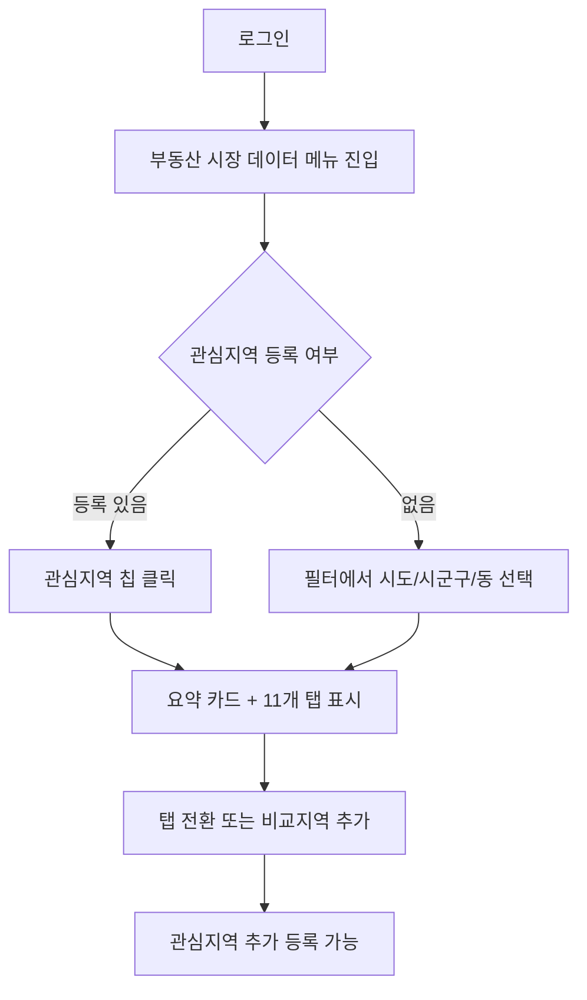

# 부동산 시장 데이터 대시보드

## Problem Frame

실수요 주택 매수/임차인이 특정 지역의 매매·전월세·공급·청약 흐름을 한 화면에서 확인할 수 있는 수치형 대시보드가 필요하다. 기존 stock-market 서비스에는 부동산 보유 자산 등록(`portfolio.RealEstateItem`)만 존재하며, 시장 흐름을 관찰하는 기능은 없다.

대시보드는 **수치·변화율·시계열·지역 비교**만 제공하며, 매수/매도/관망/등급/저평가/고평가 등 해석 라벨은 제공하지 않는다.

## Requirements

**화면 구조 (11개 탭)**

- R1. 상단 필터 영역 제공 (시도, 시군구, 읍면동, 주택유형, 면적, 기간, 비교지역)
- R2. 요약 영역에 핵심 지표 카드 + 데이터 기준일/출처 노출
- R3. 11개 탭 모두 MVP에 포함하여 동일 깊이로 제공
  - T1 매매 거래 / T2 매매 가격 / T3 전월세 / T4 공식 통계 / T5 공급 / T6 미분양 / T7 청약 / T8 분양 리스크 / T9 지역 특화 / T10 지역 비교 / T11 데이터 출처

**지역 커버리지**

- R4. MVP는 서울특별시 + 경기도 시군구를 우선 지원
- R5. T9 지역 특화 탭은 서울/경기 외 지역 선택 시 비노출 또는 비활성 안내
- R6. 비교 지역(T10)은 선택 지역과 같은 시도 또는 인접 시군구 중에서 선택

**데이터 갱신**

- R7. 모든 외부 API 데이터는 매일 새벽 6시 KST 일괄 배치로 갱신
- R8. 모든 화면 카드/차트에 데이터 기준일과 마지막 갱신 시각을 표시
- R9. 일부 데이터 소스(예: 미분양, R-ONE)는 월간/분기 통계라 기준월과 갱신일이 다를 수 있음 — 기준월을 함께 표시

**사용자 기능**

- R10. 로그인 사용자만 대시보드 접근 가능 (기존 ECOS/News/Portfolio 패턴 유지)
- R11. 관심지역 등록/해제 기능 제공, 상단에 관심지역 칩으로 빠른 진입
- R12. 관심지역은 사용자별로 저장하며 시도+시군구+읍면동(선택) 단위

**데이터 표시 정책**

- R13. 가격 표시는 평균값과 중위값을 동시에 제공 (이상치 영향 분리)
- R14. 매매 실거래는 해제 거래 여부를 별도 표시
- R15. 전세가율은 추정값임을 명시 라벨로 표시
- R16. 어떤 카드/차트든 판단형 문구 (강함/약세/저평가/매수추천 등) 사용 금지
- R17. 데이터 누락/지연 시 빈 영역에 출처와 사유, 다음 갱신 예상 시점 노출

## User Flow

## 탭별 주요 데이터 소스

| 탭 | 핵심 데이터 출처 |
|---|---|
| T1 매매 거래 | 국토교통부 실거래가 (아파트/연립/단독/오피스텔/토지) |
| T2 매매 가격 | 국토교통부 실거래가 + 한국부동산원 R-ONE (매매가격지수, 실거래가격지수) |
| T3 전월세 | 국토교통부 전월세 실거래가 + R-ONE (전세/월세가격지수) |
| T4 공식 통계 | R-ONE (가격지수/거래호수/지가변동률/오피스텔지수) |
| T5 공급 | 건축HUB (인허가/주택인허가) |
| T6 미분양 | KOSIS / 국토교통부 미분양주택현황 |
| T7 청약 | 청약홈 (경쟁률/특별공급/분양정보) |
| T8 분양 리스크 | HUG (분양보증사고/사고금액/사고세대수) |
| T9 지역 특화 (서울) | 서울 열린데이터광장 (실거래/전월세/정비사업) |
| T9 지역 특화 (경기) | 경기도 데이터드림 (실거래/시군분석마트) |
| T10 지역 비교 | T1–T8 데이터를 같은 기간/단위로 가공 |
| T11 데이터 출처 | 위 출처별 기준일/갱신시각/API 메타 |

## Success Criteria

- 서울특별시 25개 자치구와 경기도 31개 시군의 주요 지역에서 11개 탭 전체가 수치/차트를 정상 노출한다.
- 모든 카드와 차트에 출처와 기준일이 빠짐없이 표기된다.
- 관심지역 등록/해제/빠른 진입 동선이 정상 작동한다.

## Scope Boundaries

- 매수/매도/관망 추천 또는 등급 판단 라벨 제공하지 않음
- 챗봇 컨텍스트 주입 미포함 (별도 후속 과제)
- 기존 `portfolio.RealEstateItem` 보유 자산과의 자동 연계 미포함 (별도 후속 과제)
- 부동산 시장 데이터 알림/구독 미포함
- 매물 검색/단지 검색/실거래 알림 미포함
- 모바일 앱 미포함 (기존 웹 반응형 정책 따름)

## Key Decisions

- **수치형 원칙 유지**: 이슈 원안의 "판단 없이 수치만" 기조 그대로 유지. 챗봇 연계도 MVP 제외하여 해석 충돌 가능성 차단.
- **MVP에 11개 탭 전체 포함**: 사용자가 합의. 깊이는 동일 수준으로 가되, 탭별 핵심 카드/차트만 우선 구현하고 보조 표/차트는 plan에서 우선순위 조정.
- **지역은 서울/경기 우선**: 두 지역에 자체 데이터 포털(T9)이 존재하여 정합성 확보 용이. 전국 시군구 확장은 후속 과제.
- **일배치 새벽 6시**: 기존 ECOS 패턴과 동일. 외부 API 부하/비용 최소화. 실거래는 신고 기반이라 일 단위로 충분.
- **신규 도메인으로 분리**: `portfolio.RealEstateItem`은 보유 자산 도메인. 시장 데이터는 신규 도메인(가칭 `realestatemarket`)으로 분리하여 책임 경계 명확화.
- **로그인 필수 + 관심지역 즐겨찾기**: 기존 ECOS 즐겨찾기 패턴 재사용 가능.

## Dependencies / Assumptions

- data.go.kr, R-ONE, KOSIS, 청약홈, 서울 열린데이터광장, 경기도 데이터드림 각 포털의 인증키 발급과 트래픽 제한이 운영상 허용 범위 내라고 가정.
- 일배치 스케줄러는 기존 `ecos.scheduler` 패턴을 참조해 신규 도메인에 동일한 구조로 추가 가능하다고 가정.
- KOSIS는 통계표별 API라 `orgId`, `tblId` 매핑이 필요하며, 인증키 발급 후 plan 단계에서 항목 코드 확정 필요.

## Outstanding Questions

### Resolve Before Planning

- 없음

### Deferred to Planning

- [Affects R3][Technical] 11개 탭 전체를 한 페이지에서 lazy-load 할지, 라우팅 분리할지 (프론트 구조)
- [Affects R7][Needs research] 외부 API별 일일 호출 한도와 인증키 발급 절차 — 특히 KOSIS, R-ONE, 건축HUB 트래픽 정책 확인 필요
- [Affects R7][Technical] 일배치 시 30+개 API의 동시 호출 정책, 실패 재시도, 부분 실패 시 화면 정책
- [Affects R13][Technical] 평균/중위값 계산을 백엔드 집계로 둘지, 원천 거래 데이터를 프론트로 보내고 프론트 집계할지 (issue #35 "프론트→백엔드 이동" 정책과 정합)
- [Affects R6][Technical] 비교지역 선택 UX (지도 / 검색 / 인접지역 자동 추천)
- [Affects R1][Technical] 면적 단위 표시 (㎡ vs 평) 및 사용자 토글 여부
- [Affects R8][Technical] 데이터 기준일/갱신시각 표시를 카드별로 둘지, 탭 헤더에 한 번만 둘지
- [Affects R17][Technical] 데이터 소스 일부 장애 시 graceful degradation 정책
- [Affects 전반][Technical] 신규 도메인 명칭 확정 (`realestatemarket` / `realestate.market` / `realty` 등)

## Next Steps

→ `/ce:plan` for structured implementation planning
