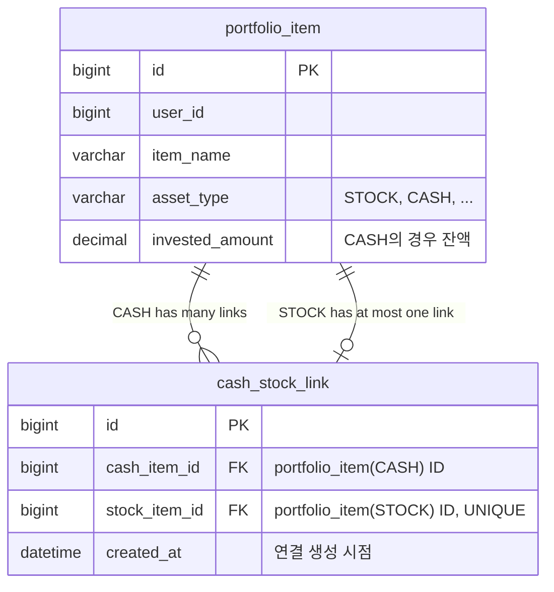

# feat: 주식 매수 시 원화(CASH) 자동 차감 연동

## Enhancement Summary

**Deepened on:** 2026-03-18
**Agents used:** Architecture Strategist, Data Integrity Guardian, Security Sentinel, Performance Oracle, Code Simplicity Reviewer, Repo Explorer

### Key Improvements (from deepening)
1. **CashStockLinkService 제거** → PortfolioService private 메서드로 통합 (애그리거트 경계 보호)
2. **CashStockLinkRequest/Response 제거** → 기존 DTO 필드 확장으로 대체 (YAGNI)
3. **삭제 시 현재가 API 호출 제거** → `restoreAmount` 필수화 (트랜잭션 내 외부 API 호출 방지)
4. **N+1 방지 전략 추가** → `findByStockItemIdIn()` 배치 조회
5. **데이터 무결성 강화** → 스냅샷 순서 명시, updateAmount 충돌 방어, BigDecimal compareTo 사용
6. **cashItemId 검증 3단계** → 존재 + userId 소유 + AssetType.CASH 확인

### Resolved Decisions
- [x] **연결 교체 불허 (v1)** — 해제 후 재연결만 허용. 구현 분기 최소화
- [x] **CASH 직접 수정 허용** — 연결된 주식이 있어도 `updateGeneralItem`으로 CASH 잔액 자유 수정 가능. 정합성 책임은 사용자

---

## Overview

포트폴리오에서 주식을 추가/매수할 때, 등록된 원화(CASH) 항목을 선택적으로 연결하여 매수 금액만큼 원화 잔액이 자동 차감되는 기능. 하나의 CASH 항목에 여러 주식을 연결할 수 있는 1:N 구조이며, 별도 매핑 테이블(`cash_stock_link`)로 관리한다.

(see brainstorm: docs/brainstorms/2026-03-17-cash-stock-link-brainstorm.md)

## Problem Statement / Motivation

현재 포트폴리오에서 주식 매수와 원화(현금) 관리가 독립적으로 동작한다. 실제로는 하나의 증권 계좌에서 원화로 여러 주식을 매수하므로, 주식 매수 시 원화 잔액이 자동 차감되면 실제 계좌 운용 현황을 더 정확하게 반영할 수 있다.

## Key Decisions (from brainstorm)

| 결정 사항 | 선택 | 이유 |
|---|---|---|
| 적용 범위 | 주식(Stock)만 | YAGNI 원칙 |
| 외화 주식 차감 기준 | investedAmountKrw | 사용자 입력 원화 환산 금액 |
| 잔액 부족 시 | 매수 차단 | 에러 반환, 매수 불가 |
| 삭제 시 복원 | 선택적 + restoreAmount 필수 입력 | 프론트에서 현재가 제시, 사용자가 확인/수정 |
| 연결 구조 | 1:N (CASH 1 : Stock N) | 실제 계좌 운용 패턴 |
| 설계 방식 | 별도 매핑 테이블 | 도메인 분리, 확장성 |
| 매수이력 수정/삭제 | CASH 연동 (차액 조정) | 데이터 정합성 |
| 외화 추가 매수 | StockPurchaseRequest에 investedAmountKrw 추가 | 클라이언트 직접 전달 |
| CASH 삭제 시 | 연결된 주식 있으면 삭제 차단 | 데이터 안전성 |
| 동시성 처리 | 1차 미적용 | 개인 사용, 발생 확률 극히 낮음 |
| 연결 교체 | v1에서 불허 (해제 후 재연결) | 구현 분기 최소화 |

## Proposed Solution

### ERD



### Architecture (Revised)

기존 portfolio 모듈 내에 `CashStockLink` 도메인/인프라를 추가한다. **별도 Application Service 없이** `PortfolioService`가 직접 오케스트레이션한다.

```
portfolio/
  domain/
    model/
      CashStockLink.java              ← NEW: 도메인 모델 (create 팩토리만)
    repository/
      CashStockLinkRepository.java     ← NEW: 도메인 포트
  infrastructure/
    persistence/
      CashStockLinkEntity.java         ← NEW: JPA Entity
      CashStockLinkJpaRepository.java  ← NEW: Spring Data JPA
      CashStockLinkRepositoryImpl.java ← NEW: 어댑터
```

> **변경 사유 (Architecture Strategist 리뷰):**
> `CashStockLinkService`가 `PortfolioItemRepository`를 주입받아 CASH의 `investedAmount`를 직접 수정하면 **애그리거트 경계 침범**이 발생한다. `PortfolioItem` 수정 책임은 `PortfolioService`가 소유해야 하므로, CASH 잔액 변경은 `PortfolioService` 내부에서 직접 처리한다. `CashStockLinkRepository`는 `PortfolioService`가 직접 주입받아 연결 관계만 조회/저장한다.

> **Simplicity 리뷰 반영:**
> `CashStockLinkRequest`, `CashStockLinkResponse` DTO는 불필요하다. `cashItemId`는 기존 `StockItemAddRequest`에 필드로 추가하고, 응답은 `PortfolioItemResponse`에 `linkedCashItemId` 필드만 추가하면 충분하다.

## Technical Considerations

### 차감 금액 계산 기준

| 상황 | 통화 | 차감 기준 |
|---|---|---|
| 주식 추가 (addStockItem) | KRW | `quantity × purchasePrice` |
| 주식 추가 (addStockItem) | 외화 | `investedAmountKrw` (요청값) |
| 추가 매수 (addStockPurchase) | KRW | `quantity × purchasePrice` |
| 추가 매수 (addStockPurchase) | 외화 | `investedAmountKrw` (요청값, 필드 추가) |
| 주식 수정 (updateStockItem) | KRW | 수정 전후 `investedAmount` 차액 |
| 주식 수정 (updateStockItem) | 외화 | 수정 전후 `investedAmountKrw` 차액 |
| 매수이력 수정/삭제 | KRW/외화 | 재계산 전후 `investedAmount` 차액 |
| 주식 삭제 복원 | KRW/외화 | `restoreAmount` (클라이언트 필수 입력) |

### 연결 변경/해제 규칙

- **해제** (cashItemId → null): 기존 차감된 원화 복원 없음
- **교체 불허** (v1): CASH-A → CASH-B 직접 교체 불가. 해제 후 재연결 필요
- **신규 연결** (null → cashItemId): 현재 investedAmount 전액 차감

### CASH 삭제 방어

연결된 주식이 1개 이상 존재하면 CASH 삭제를 차단한다. 에러 메시지: "연결된 주식이 있어 삭제할 수 없습니다. 주식의 원화 연결을 먼저 해제해 주세요."

### cashItemId 검증 (3단계)

cashItemId가 요청에 포함된 경우 반드시 다음 3단계 검증을 수행한다:
1. **존재 확인**: `portfolioItemRepository.findById(cashItemId)` — 없으면 에러
2. **소유권 확인**: `cashItem.getUserId() == userId` — 불일치 시 에러
3. **타입 확인**: `cashItem.getAssetType() == AssetType.CASH` — 불일치 시 에러

### 에러 처리

기존 패턴(`IllegalArgumentException`)을 따른다:
- 잔액 부족: `"원화 잔액이 부족합니다. (잔액: {balance}원, 필요: {required}원)"`
- CASH 항목 미존재: `"원화 항목을 찾을 수 없습니다."`
- CASH 소유권 불일치: `"접근 권한이 없습니다."`
- CASH 타입 불일치: `"원화(CASH) 타입이 아닙니다."`
- CASH 삭제 차단: `"연결된 주식이 있어 삭제할 수 없습니다."`

### PortfolioItem 도메인 메서드

`deductAmount(BigDecimal)` / `restoreAmount(BigDecimal)` 추가. 기존 `updateAmount()`는 변경하지 않는다.

**구현 주의사항:**
- `deductAmount`: 잔액 비교 시 **반드시 `compareTo` 사용** (`equals` 금지 — BigDecimal scale 차이로 오작동)
- `deductAmount`: 결과가 0원이 되는 것은 허용 (기존 `updateAmount()`의 `> 0` 검증과 다름)
- `restoreAmount`: 별도 검증 없이 `investedAmount += amount`

### CASH 직접 수정 정책

연결된 주식이 있는 CASH의 `investedAmount`를 `updateGeneralItem()`으로 직접 수정하는 것을 **허용**한다. 정합성 관리 책임은 사용자에게 있다. 별도 경고나 차단 로직을 추가하지 않는다.

### 스냅샷 캡처 순서 (Critical)

`updatePurchaseHistory`, `deletePurchaseHistory`에서 `recalculateFromPurchaseHistories()` 호출 시, **반드시 재계산 이전에 기존 `investedAmount`를 캡처**해야 한다:

```java
// 올바른 순서
BigDecimal oldAmount = item.getInvestedAmount();   // ← 반드시 재계산 이전에 캡처
item.recalculateFromPurchaseHistories(histories);
BigDecimal newAmount = item.getInvestedAmount();
BigDecimal diff = newAmount.subtract(oldAmount);
// diff > 0 → CASH 추가 차감, diff < 0 → CASH 복원
```

### N+1 방지 전략 (Performance)

`getItems()` 에서 각 STOCK 항목의 `linkedCashItemId`를 포함하려면 배치 조회가 필수:

```java
// N+1 방지: IN 절로 한 번에 조회
List<Long> stockItemIds = items.stream()
    .filter(i -> i.getAssetType() == AssetType.STOCK)
    .map(PortfolioItem::getId)
    .toList();

Map<Long, Long> linkMap = cashStockLinkRepository.findByStockItemIdIn(stockItemIds)
    .stream()
    .collect(toMap(CashStockLink::getStockItemId, CashStockLink::getCashItemId));
```

**`CashStockLinkRepository`에 `findByStockItemIdIn(List<Long>)` 메서드 추가 필수.**

> **Simplicity 리뷰 반영:** v1에서는 `linkedCashItemName`은 생략한다. 프론트에서 이미 CASH 항목 목록을 보유하고 있으므로 `linkedCashItemId`만으로 매핑 가능.

### 삭제 시 복원 로직 (Revised)

> **Performance/Simplicity 리뷰 반영:** 삭제 트랜잭션 내에서 외부 가격 API를 호출하면 커넥션 홀드 + API 실패 시 삭제 전체 롤백 위험이 있다.

**변경:** `restoreCash=true`인 경우 `restoreAmount`를 **필수 입력**으로 변경한다. 프론트에서 이미 포트폴리오 화면에 현재가를 표시하고 있으므로, 사용자가 해당 금액을 확인 후 입력한다. 서버에서 현재가 API를 호출하지 않는다.

### 트랜잭션 경계 (Data Integrity)

- `CashStockLinkRepository` 메서드에 `@Transactional(propagation = REQUIRES_NEW)` **사용 금지** — `PortfolioService`의 트랜잭션에 참여해야 함
- 잔액 검증은 **모든 쓰기 작업 이전**에 배치:
  ```
  read(stock) → read(link) → read(cash) → validate(balance) → write(history) → write(stock) → write(cash)
  ```

### 인덱스 전략

```java
@Table(name = "cash_stock_link",
    uniqueConstraints = @UniqueConstraint(columnNames = "stock_item_id"),
    indexes = @Index(columnList = "cash_item_id"))
```

- `stock_item_id`: UNIQUE — 1개 주식은 최대 1개 CASH에만 연결 (비즈니스 규칙 DB 레벨 강제)
- `cash_item_id`: INDEX — CASH 삭제 방어 시 역방향 조회용

## System-Wide Impact

- **PortfolioService 변경**: `addStockItem`, `addStockPurchase`, `updateStockItem`, `updatePurchaseHistory`, `deletePurchaseHistory`, `deleteItem` 메서드에 CASH 연동 로직 추가
- **PortfolioController 변경**: 기존 주식 관련 Request DTO에 `cashItemId` 필드 추가
- **StockPurchaseRequest 변경**: `investedAmountKrw` 필드 추가 (외화 주식 추가 매수용)
- **deleteItem 분기**: CASH 타입 삭제 시 연결 주식 존재 여부 확인 추가. `private validateCashDeletion()`, `private handleStockDeletion()` 메서드로 추출
- **API 하위 호환성**: `cashItemId`는 선택적 필드이므로 기존 API 호환성 유지

### 프론트엔드 통합 (기존 패턴 기반)

기존 Alpine.js 모달 패턴을 따라 통합:

- **추가 모달**: STOCK 전용 섹션에 "연결 현금 자산" `<select>` 드롭다운 추가 (`x-model="portfolio.addForm.cashItemId"`)
- **수정 모달**: `openEditModal(item)` 시 `form.cashItemId = item.linkedCashItemId || null` 초기화
- **CASH 목록**: 기존 `portfolio.items`에서 `assetType === 'CASH'` 필터링으로 재사용 (추가 API 불필요)
- **삭제 확인**: 연결된 CASH가 있으면 복원 옵션 UI 표시, `restoreAmount` 입력 필드에 프론트 측 현재가 기본값 세팅

## Acceptance Criteria

### 주식 추가 시 원화 연결
- [x] 주식 추가 요청에 `cashItemId` (선택) 전달 가능
- [x] `cashItemId` 지정 시 3단계 검증 (존재 + 소유권 + CASH 타입)
- [x] 검증 통과 시 해당 CASH 항목의 `investedAmount`에서 매수 금액 차감
- [x] KRW 주식: `quantity × purchasePrice` 차감
- [x] 외화 주식: `investedAmountKrw` 차감
- [x] `cashItemId` 미지정 시 기존과 동일하게 동작
- [x] CASH 잔액 부족 시 매수 차단 + 잔액/필요금액 포함 에러 메시지
- [x] `cash_stock_link` 테이블에 연결 정보 저장
- [x] `stockItemId` UNIQUE 제약 — 1개 주식은 최대 1개 CASH에만 연결

### 추가 매수 시 자동 차감
- [x] 연결된 CASH가 있으면 추가 매수 금액 자동 차감
- [x] 외화 주식 추가 매수 시 `investedAmountKrw` 필드로 차감액 전달
- [ ] CASH 잔액 부족 시 매수 차단

### 주식 수정 시 차액 조정
- [ ] **수정 전 `investedAmount` 스냅샷 캡처 후** 수정 실행
- [ ] 수정 전후 `investedAmount` 차이만큼 CASH 자동 조정
- [ ] 외화 주식: `investedAmountKrw` 차이 기준
- [ ] 투자금액 증가 시 CASH 추가 차감 (잔액 검증)
- [ ] 투자금액 감소 시 CASH 복원

### 매수이력 수정/삭제 시 CASH 연동
- [ ] **재계산 전 `investedAmount` 스냅샷 캡처**
- [ ] 매수이력 수정으로 `investedAmount`가 변경되면 차액만큼 CASH 조정
- [ ] 매수이력 삭제로 `investedAmount`가 감소하면 차액만큼 CASH 복원

### 원화 연결 해제
- [ ] 수정 시 `cashItemId`를 null로 변경하여 해제 가능
- [ ] 해제(null) 시 기존 차감 복원 없음
- [ ] 교체(CASH-A → CASH-B) 직접 불허 — cashItemId 변경 시 기존 연결이 있으면 에러, 해제 후 재연결 필요

### 주식 삭제 시 선택적 복원
- [ ] 삭제 요청에 `restoreCash` (boolean) + `restoreAmount` (BigDecimal, **restoreCash=true이면 필수**) 파라미터
- [ ] `restoreCash=true`이면 CASH 잔액 복원 (`restoreAmount` 금액만큼)
- [ ] `cash_stock_link` 삭제

### CASH 삭제 방어
- [ ] CASH 삭제 시 연결된 주식이 있으면 삭제 차단
- [ ] 에러 메시지로 연결 해제 안내

### N+1 방지
- [ ] `getItems` 조회 시 `findByStockItemIdIn()` 배치 조회로 linkedCashItemId 포함
- [ ] 쿼리 수: items 조회(1) + links 배치 조회(1) = 총 2~3개

## Implementation Phases

### Phase 1: 도메인 & 인프라 기반

**목표:** CashStockLink 도메인 모델, Entity, Repository 구축

- [ ] `CashStockLink` 도메인 모델 생성 (`portfolio/domain/model/CashStockLink.java`)
  - 필드: `id`, `cashItemId`, `stockItemId`, `createdAt`
  - static factory: `create(cashItemId, stockItemId)` — 단일 메서드만
- [ ] `CashStockLinkRepository` 포트 인터페이스 생성 (`portfolio/domain/repository/CashStockLinkRepository.java`)
  - `save()`, `findByStockItemId()`, `findByCashItemId()`, `findByStockItemIdIn(List<Long>)`, `deleteByStockItemId()`, `existsByCashItemId()`
- [ ] `CashStockLinkEntity` JPA Entity 생성 (`portfolio/infrastructure/persistence/CashStockLinkEntity.java`)
  - `@Table(name = "cash_stock_link")`, `stock_item_id` UNIQUE 제약, `cash_item_id` 인덱스
  - 컬럼: `id` (IDENTITY), `cash_item_id` (NOT NULL), `stock_item_id` (NOT NULL), `created_at` (NOT NULL)
- [ ] `CashStockLinkJpaRepository` 생성 (`portfolio/infrastructure/persistence/CashStockLinkJpaRepository.java`)
  - `findByStockItemId()`, `findByCashItemId()`, `findByStockItemIdIn(List<Long>)`, `deleteByStockItemId()`, `existsByCashItemId()`
- [ ] `CashStockLinkRepositoryImpl` 어댑터 생성 (`portfolio/infrastructure/persistence/CashStockLinkRepositoryImpl.java`)
  - `StockPurchaseHistoryRepositoryImpl` 패턴 참고 (inline mapper)
- [ ] `PortfolioItem` 도메인에 `deductAmount(BigDecimal)`, `restoreAmount(BigDecimal)` 메서드 추가
  - `deductAmount`: `investedAmount.compareTo(amount) >= 0` 검증 후 `investedAmount = investedAmount.subtract(amount)`
  - `restoreAmount`: `investedAmount = investedAmount.add(amount)`
  - BigDecimal 비교는 반드시 `compareTo` 사용

**참고 코드:**
- `StockPurchaseHistoryEntity.java` — Entity 구조 참고
- `StockPurchaseHistoryRepositoryImpl.java` — RepositoryImpl 패턴 참고
- `PortfolioItem.java:146` — `updateAmount()` 기존 패턴

### Phase 2: PortfolioService 통합

**목표:** PortfolioService에 CASH 연동 로직 추가

- [ ] `PortfolioService`에 `CashStockLinkRepository` 주입 추가
- [ ] private 헬퍼 메서드 추가:
  - `private PortfolioItem findAndValidateCashItem(Long userId, Long cashItemId)` — 3단계 검증
  - `private void deductCashBalance(Long stockItemId, BigDecimal amountKrw)` — 연결된 CASH 조회 + 차감 + 저장
  - `private void restoreCashBalance(Long stockItemId, BigDecimal amountKrw)` — 연결된 CASH 조회 + 복원 + 저장
  - `private void validateCashDeletion(Long itemId)` — CASH 삭제 방어
  - `private void handleStockDeletion(PortfolioItem item, boolean restoreCash, BigDecimal restoreAmount)` — 주식 삭제 시 복원 처리
- [ ] `addStockItem()` 수정 — cashItemId 있으면 검증 + 연결 저장 + 차감
- [ ] `addStockPurchase()` 수정 — 연결된 CASH 있으면 추가 차감
- [ ] `updateStockItem()` 수정 — 스냅샷 캡처 → 수정 → 차액 조정 + 연결 변경/해제
- [ ] `updatePurchaseHistory()` 수정 — 스냅샷 캡처 → 재계산 → 차액 CASH 조정
- [ ] `deletePurchaseHistory()` 수정 — 스냅샷 캡처 → 재계산 → 차액 CASH 복원
- [ ] `deleteItem()` 수정
  - Stock 삭제: `handleStockDeletion()` + cash_stock_link 삭제
  - CASH 삭제: `validateCashDeletion()` — 연결 있으면 차단

### Phase 3: Presentation (Controller + DTO)

**목표:** API 엔드포인트 수정 및 DTO 확장

- [ ] `StockItemAddRequest`에 `Long cashItemId` 필드 추가 (선택)
- [ ] `StockItemUpdateRequest` (또는 기존 파라미터)에 `Long cashItemId` 필드 추가
- [ ] `StockPurchaseRequest`에 `BigDecimal investedAmountKrw` 필드 추가 (선택, 외화용)
- [ ] `deleteItem` 엔드포인트에 `restoreCash` (boolean) + `restoreAmount` (BigDecimal) 파라미터 추가
- [ ] `PortfolioItemResponse`에 `linkedCashItemId` 필드 추가
- [ ] `getItems` 서비스 메서드에서 `findByStockItemIdIn()` 배치 조회 → `PortfolioItemResponse` 조립 시 매핑

### Phase 4: 프론트엔드 통합

**목표:** 기존 Alpine.js 모달에 원화 연결 UI 추가

- [ ] 추가 모달: STOCK 전용 섹션에 "연결 현금 자산" `<select>` 드롭다운 추가
  - 옵션 소스: `portfolio.items.filter(i => i.assetType === 'CASH')` (추가 API 불필요)
  - "연결 안 함" 기본 옵션 포함
- [ ] 수정 모달: `cashItemId` 드롭다운 추가, 기존 연결 값으로 초기화
- [ ] 삭제 확인: 연결된 CASH가 있으면 복원 옵션 체크박스 + `restoreAmount` 입력 필드 (현재가 기본값)
- [ ] CASH 잔액 부족 에러 메시지 표시

## Sources & References

### Origin

- **Brainstorm document:** [docs/brainstorms/2026-03-17-cash-stock-link-brainstorm.md](docs/brainstorms/2026-03-17-cash-stock-link-brainstorm.md)
  - Key decisions: 별도 매핑 테이블 방식, 주식만 적용, 1:N 구조, 잔액 부족 시 매수 차단

### Internal References

- `PortfolioItem.java:146` — `updateAmount()` (deductAmount/restoreAmount 추가 위치)
- `PortfolioItem.java:306` — `validateRequired()` — `investedAmount > 0` 검증 (deductAmount는 이 검증 우회)
- `StockPurchaseHistoryRepositoryImpl.java` — RepositoryImpl 패턴 참고
- `StockPurchaseHistoryEntity.java` — Entity 구조 참고
- `PortfolioService.java:163` — `updateStockItem()` (차액 조정 통합 지점)
- `PortfolioService.java:186` — `addStockPurchase()` (추가 매수 차감 통합 지점)
- `PortfolioService.java:362` — `deleteItem()` (삭제 시 복원/차단 통합 지점)
- `PortfolioController.java` — 기존 엔드포인트 구조
- `StockPurchaseRequest.java` — investedAmountKrw 필드 추가 대상
- `.claude/designs/frontend/portfolio/examples/add-modal-example.md` — 추가 모달 UI 패턴
- `.claude/designs/frontend/portfolio/examples/edit-modal-example.md` — 수정 모달 UI 패턴

### Out of Scope

- 매도 기능
- 주식 외 자산 타입 원화 연동
- 환율 자동 계산
- 차감 이력 조회 UI
- 동시성 처리 (향후 @Version 또는 SELECT FOR UPDATE 검토)
- linkedCashItemName (v1에서는 linkedCashItemId만 반환, 프론트에서 매핑)

### 향후 고려사항 (v2)

- DB CHECK 제약 조건 추가 (`invested_amount >= 0`) — 동시성 미처리 시 마지막 방어선
- `@Version` 컬럼 또는 `SELECT FOR UPDATE` 도입 — 동시 차감 방지
- `cash_stock_link` FK 제약 조건 추가 — 참조 무결성 DB 레벨 강제
- 차감 이력 테이블 (`cash_deduction_history`) — 이력 추적 UI
