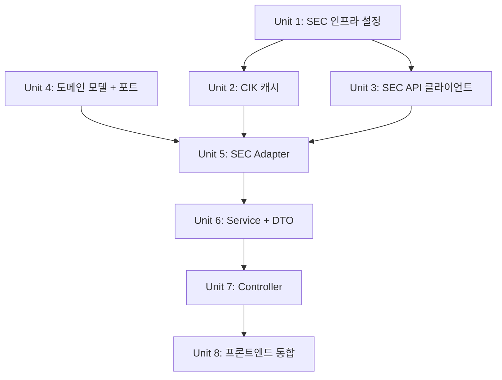

---
title: "feat: SEC EDGAR API 해외주식 재무제표 조회 및 프론트엔드 통합"
type: feat
status: active
date: 2026-04-01
origin: docs/brainstorms/2026-04-01-sec-overseas-financial-statements-requirements.md
deepened: 2026-04-01
---

# feat: SEC EDGAR API 해외주식 재무제표 조회 및 프론트엔드 통합

## Overview

포트폴리오에 등록된 미국 주식의 재무제표(손익계산서, 재무상태표, 현금흐름표)와 투자 지표(EPS, PER, ROE, 부채비율, 영업이익률)를 SEC EDGAR Company Facts API로 조회하여 기존 우측 슬라이드 패널에 통합 표시한다.

## Problem Frame

국내 주식은 DART API로 재무제표를 제공하지만, 해외주식(미국)은 재무 데이터가 전혀 없어 투자 판단에 핵심 정보가 누락되어 있다. SEC EDGAR API(무료, API 키 불필요)를 활용하여 미국 상장 기업의 재무제표를 조회하고, 기존 패널에서 국내/해외를 자동 분기하여 일관된 UX를 제공한다. (see origin: docs/brainstorms/2026-04-01-sec-overseas-financial-statements-requirements.md)

## Requirements Trace

- R1. SEC EDGAR Company Facts API로 미국 상장 기업 재무 데이터 조회
- R2. 티커 → CIK 매핑 (company_tickers.json), 매핑 실패 시 안내
- R3. 재무제표 3종: 손익계산서, 재무상태표, 현금흐름표
- R4. 투자 지표: EPS, PER, ROE, 부채비율, 영업이익률
- R5. 연간(10-K) 보고서만 대상
- R6. 기존 패널 통합, `financial.js` country 가드 수정
- R7. 해외주식 시 4개 탭으로 메뉴 교체
- R8. USD 원본 표시 ($12.3B, $456M 형식)
- R9. 최근 3개 연도(Annual) 비교 표시
- R10. 패널 헤더 통화/수량 조정 (원→$, 주→shares)
- R11. us-gaap 기준 미국 상장 기업만 대상
- R12. 미국 외 해외주식은 "재무제표 미지원" 안내
- R13. SEC API 실패, CIK 매핑 실패, 부분 누락 시 구분된 안내

## Scope Boundaries

- 미국 외 해외 시장 재무제표 제외
- 분기(10-Q) 제외 — 연간(10-K)만
- IFRS 기준 제출 기업 제외 — us-gaap만
- 차트 시각화 제외 (데이터 테이블만)
- 기존 DART 재무제표 기능 변경 없음

## Context & Research

### Relevant Code and Patterns

**포트-어댑터 패턴 (SEC 통합 시 동일 패턴 적용)**:
- Port: `stock/domain/service/StockFinancialPort.java` — 인터페이스, 순수 Java
- Adapter: `stock/infrastructure/stock/dart/DartFinancialAdapter.java` — `@Component`, corpCodeCache → apiClient → domain record 매핑
- API Client: `stock/infrastructure/stock/dart/DartApiClient.java` — Spring `RestClient`, `JdkClientHttpRequestFactory`
- Config: `stock/infrastructure/stock/dart/config/DartProperties.java` + `DartRestClientConfig.java`
- Cache: `stock/infrastructure/stock/dart/DartCorpCodeCache.java` — Caffeine `Cache<String, Map>`, 24h TTL, `@Scheduled(fixedRate=23h)` refresh
- Exception: `stock/infrastructure/stock/dart/exception/DartApiException.java` — `RuntimeException` 확장
- Domain Model: `stock/domain/model/FullFinancialStatement.java` — Java record
- Response DTO: `stock/application/dto/FullFinancialStatementResponse.java` — `@Getter @RequiredArgsConstructor`, `static from()`
- Service: `stock/application/StockFinancialService.java` — port 의존, stream+map to DTO
- Controller: `stock/presentation/StockFinancialController.java` — `@RequestMapping("/api/stocks")`
- GlobalExceptionHandler: `infrastructure/web/GlobalExceptionHandler.java`

**프론트엔드 패턴**:
- API: `static/js/api.js` — `fetch()` 기반, Bearer token, 메서드별 엔드포인트
- Financial: `static/js/components/financial.js` — country 가드(line 303), `financialColumns`, `loadSelectedFinancial()`
- Portfolio: `static/js/components/portfolio.js` — `financialMenus` 배열(8개), `selectedFinancialMenu`

**인프라 구조 컨벤션**: `infrastructure/stock/{vendor}/` 하위에 `config/`, `dto/`, `exception/` 패키지

### Institutional Learnings

- Alpine.js: `x-show` + `x-transition` 사용 (not `x-if`), `@click.outside` (v3)
- 복잡한 class 로직은 메서드로 추출

### External References

- SEC EDGAR Company Facts: `https://data.sec.gov/api/xbrl/companyfacts/CIK{cik10}.json`
- Company Tickers: `https://www.sec.gov/files/company_tickers.json`
- Rate limit: 10 req/sec, `User-Agent` 헤더 필수 (이름 + 이메일)
- 연간 필터: `form == "10-K"` AND `fp == "FY"`
- CIK 패딩: `String.format("CIK%010d", cik)` (10자리)

## Key Technical Decisions

- **Company Facts API 선택 (vs Company Concept)**: 15개 이상 XBRL 태그가 필요하므로 1회 호출로 전체 데이터를 가져오는 Company Facts가 적합. Company Concept는 태그당 1회 호출이라 15+회 API 콜 필요. 다만 응답이 2-8MB로 크므로 SEC 전용 RestClient에 read timeout 15초 설정 필요
- **별도 포트 생성**: 기존 `StockFinancialPort`는 DART 전용 파라미터(reportCode, fsDiv, indexClassCode)에 밀착. SEC는 완전히 다른 데이터 구조(XBRL taxonomy, form type)이므로 `SecFinancialPort` 신규 생성 (see origin)
- **투자 지표 계산 전략**: EPS는 SEC에서 직접 제공(`EarningsPerShareBasic`). ROE/부채비율/영업이익률은 Adapter에서 원시 데이터로 계산. **PER는 Application Service에서 계산** — `StockPricePort`(KIS API)와 `SecFinancialPort`(SEC API)의 조합이므로 아키텍처 규칙상 "여러 도메인 조합"은 Application 레이어 책임
- **XBRL 태그 Fallback**: 회사마다 사용하는 태그가 다름. 1순위 태그 조회 실패 시 대안 태그로 fallback (예: `Revenues` → `RevenueFromContractWithCustomersExcludingAssessedTax`)
- **CIK 캐시**: `DartCorpCodeCache` 패턴 그대로 적용 — Caffeine Cache, 24h TTL, 23h 주기 갱신
- **프론트엔드 메뉴 교체**: 해외주식 선택 시 `financialMenus`를 4개 탭(손익계산서/재무상태표/현금흐름표/투자지표)으로 동적 교체. 국내 복귀 시 기존 8개 메뉴 복원

## Open Questions

### Resolved During Planning

- **Company Facts vs Company Concept**: Company Facts 1회 호출 선택 (15+ 태그 필요, 다중 호출 대비 단순)
- **투자 지표 계산 위치**: 서버사이드. EPS/ROE/부채비율/영업이익률은 Adapter에서 계산하여 도메인 모델로 반환. PER은 Service에서 `StockPricePort` + EPS 조합으로 계산 (cross-port 의존을 피하기 위해)
- **Free Cash Flow**: us-gaap 표준 태그 없음. 현금흐름표의 행 항목으로 `영업CF - CapEx`를 계산하여 표시 (XBRL 태그 매핑 테이블의 CapEx 항목 활용). Unit 5 Adapter에서 계산하여 현금흐름표 SecFinancialItem에 포함
- **Rate limit 대응**: 단일 사용자 앱이므로 rate limit 도달 가능성 낮음. `User-Agent` 헤더 설정 + 403 에러 처리로 충분. 별도 rate limiter 불필요
- **응답 캐싱**: Company Facts 응답에서 추출/필터링된 데이터를 Caffeine으로 캐싱 (raw 응답 2-8MB를 그대로 캐싱하면 메모리 부담). TTL 24h, max 100개

### Deferred to Implementation

- XBRL 태그 매핑의 정확한 fallback 순서 — 실제 API 응답으로 확인 필요
- 일부 기업에서 데이터 누락 시 null 처리의 구체적 범위

## High-Level Technical Design

> *This illustrates the intended approach and is directional guidance for review, not implementation specification. The implementing agent should treat it as context, not code to reproduce.*

```mermaid
flowchart TB
    subgraph Frontend
        A[portfolio.js<br/>해외주식 클릭] --> B[financial.js<br/>country 분기]
        B -->|US| C[api.js<br/>SEC 재무제표 API 호출]
        B -->|KR| D[기존 DART 흐름]
        B -->|기타| E[미지원 안내]
    end

    subgraph Backend
        C --> F[SecFinancialController<br/>/api/stocks/{ticker}/sec/financial]
        F --> G[SecFinancialService]
        G --> H[SecFinancialPort]
        G --> M[StockPricePort<br/>현재주가 for PER]
        H --> I[SecFinancialAdapter]
        I --> J[SecCikCache<br/>ticker→CIK 매핑]
        I --> K[SecApiClient<br/>Company Facts API]
        I --> L[투자지표 계산<br/>EPS/ROE/부채비율/영업이익률]
    end

    subgraph External
        J --> N[SEC company_tickers.json]
        K --> O[SEC Company Facts API]
    end
```

### XBRL 태그 매핑 (us-gaap)

| 재무제표 | 항목 | 1순위 태그 | Fallback 태그 | 단위 |
|---------|------|-----------|--------------|------|
| **손익계산서** | 매출 | `Revenues` | `RevenueFromContractWithCustomersExcludingAssessedTax` | USD |
| | 매출원가 | `CostOfGoodsAndServicesSold` | `CostOfRevenue` | USD |
| | 매출총이익 | `GrossProfit` | — | USD |
| | 영업이익 | `OperatingIncomeLoss` | — | USD |
| | 순이익 | `NetIncomeLoss` | `ProfitLoss` | USD |
| **재무상태표** | 총자산 | `Assets` | — | USD |
| | 유동자산 | `AssetsCurrent` | — | USD |
| | 총부채 | `Liabilities` | — | USD |
| | 유동부채 | `LiabilitiesCurrent` | — | USD |
| | 자기자본 | `StockholdersEquity` | `StockholdersEquityIncludingPortionAttributableToNoncontrollingInterest` | USD |
| **현금흐름표** | 영업CF | `NetCashProvidedByUsedInOperatingActivities` | `...ContinuingOperations` 변형 | USD |
| | 투자CF | `NetCashProvidedByUsedInInvestingActivities` | `...ContinuingOperations` 변형 | USD |
| | 재무CF | `NetCashProvidedByUsedInFinancingActivities` | `...ContinuingOperations` 변형 | USD |
| | CapEx | `PaymentsToAcquirePropertyPlantAndEquipment` | — | USD |
| **지표** | EPS(기본) | `EarningsPerShareBasic` | — | USD/shares |
| | EPS(희석) | `EarningsPerShareDiluted` | — | USD/shares |

### 프론트엔드 탭별 컬럼 정의

| 탭 | 컬럼 | 표시 형식 |
|---|------|----------|
| **손익계산서** | 항목명, FY-2, FY-1, FY(당기) | USD 포맷 ($12.3B) |
| **재무상태표** | 항목명, FY-2, FY-1, FY(당기) | USD 포맷 |
| **현금흐름표** | 항목명, FY-2, FY-1, FY(당기) | USD 포맷 |
| **투자지표** | 지표명, 값, 설명 | EPS: $, PER: x배, ROE/부채비율/영업이익률: % |

## Implementation Units



> **Note:** Unit 4(도메인 모델/포트)는 순수 Java로 인프라 의존성이 없으므로 Unit 1~3과 독립적으로 또는 병렬 진행 가능.

- [x] **Unit 1: SEC 인프라 설정 (Properties, RestClient, Exception)**

**Goal:** SEC EDGAR API 호출을 위한 기반 인프라 구성

**Requirements:** R1, R11

**Dependencies:** None

**Files:**
- Create: `src/main/java/com/thlee/stock/market/stockmarket/stock/infrastructure/stock/sec/config/SecProperties.java`
- Create: `src/main/java/com/thlee/stock/market/stockmarket/stock/infrastructure/stock/sec/config/SecRestClientConfig.java`
- Create: `src/main/java/com/thlee/stock/market/stockmarket/stock/infrastructure/stock/sec/exception/SecApiException.java`
- Modify: `src/main/resources/application.yml`
- Modify: `src/main/resources/application-prod.yml`
- Test: `src/test/java/com/thlee/stock/market/stockmarket/stock/infrastructure/stock/sec/config/SecPropertiesTest.java`

**Approach:**
- `SecProperties`: `@Component` + `@Getter` + `@Setter` + `@ConfigurationProperties(prefix = "sec.api")` — `baseUrl` (https://data.sec.gov), `userAgent` (환경변수 `${SEC_USER_AGENT}`)
- `SecRestClientConfig`: `RestClient` 빈 생성 — `@Qualifier("secRestClient")`, `JdkClientHttpRequestFactory` 사용, connect timeout 3초, **read timeout 15초** (응답 2-8MB 고려), default `User-Agent` 헤더 설정
- `SecApiException`: `RuntimeException` 확장, `DartApiException` 패턴 따름
- `application.yml`에 `sec.api.base-url`, `sec.api.user-agent` 추가

**Patterns to follow:**
- `DartProperties` — `@ConfigurationProperties` 구조
- `DartRestClientConfig` — `RestClient` 빈 + `JdkClientHttpRequestFactory`
- `DartApiException` — 예외 클래스 구조

**Test scenarios:**
- Happy path: SecProperties에 baseUrl, userAgent 값이 정상 바인딩되는지 확인

**Verification:**
- SEC 관련 설정이 application context에 정상 로드됨
- `GlobalExceptionHandler`에 `SecApiException` 핸들링 추가

---

- [x] **Unit 2: CIK 매핑 캐시 (SecCikCache)**

**Goal:** SEC company_tickers.json을 로드하여 티커 → CIK 매핑 캐시 구축

**Requirements:** R2

**Dependencies:** Unit 1

**Files:**
- Create: `src/main/java/com/thlee/stock/market/stockmarket/stock/infrastructure/stock/sec/SecCikCache.java`
- Create: `src/main/java/com/thlee/stock/market/stockmarket/stock/infrastructure/stock/sec/dto/SecCompanyTicker.java`
- Test: `src/test/java/com/thlee/stock/market/stockmarket/stock/infrastructure/stock/sec/SecCikCacheTest.java`

**Approach:**
- `SecCikCache`: `@Component`, Caffeine `Cache<String, Map<String, Long>>` (ticker→CIK), `expireAfterWrite(24h)`, `maximumSize(1)`
- `@Scheduled(fixedRate = 23, timeUnit = HOURS)` 갱신
- `@PostConstruct`로 초기 로드
- `https://www.sec.gov/files/company_tickers.json` → JSON 파싱 → ticker(대문자) → CIK 매핑
- `getCik(String ticker)`: CIK 반환, 없으면 `Optional.empty()`
- CIK → 10자리 패딩 유틸 메서드: `String.format("CIK%010d", cik)`
- `SecCompanyTicker`: `@Getter @NoArgsConstructor` 클래스 + `@JsonProperty` (infrastructure DTO는 record가 아닌 mutable class — Jackson 역직렬화 패턴)

**Patterns to follow:**
- `DartCorpCodeCache` — Caffeine 캐시 + 스케줄 갱신 패턴

**Test scenarios:**
- Happy path: 캐시에 ticker "AAPL" 존재 시 해당 CIK를 Optional로 반환
- Happy path: CIK 10자리 패딩 — CIK 320193 → "CIK0000320193"
- Edge case: 캐시에 존재하지 않는 ticker 조회 시 Optional.empty() 반환
- Edge case: ticker 대소문자 무관하게 매핑 (aapl → AAPL)

**Verification:**
- 캐시 초기화 후 주요 미국 기업 ticker(AAPL, MSFT, GOOGL)로 CIK 조회 성공

---

- [x] **Unit 3: SEC API 클라이언트 (SecApiClient)**

**Goal:** SEC EDGAR Company Facts API 호출 및 응답 파싱

**Requirements:** R1, R5, R11

**Dependencies:** Unit 1

**Files:**
- Create: `src/main/java/com/thlee/stock/market/stockmarket/stock/infrastructure/stock/sec/SecApiClient.java`
- Create: `src/main/java/com/thlee/stock/market/stockmarket/stock/infrastructure/stock/sec/dto/SecCompanyFactsResponse.java`
- Test: `src/test/java/com/thlee/stock/market/stockmarket/stock/infrastructure/stock/sec/SecApiClientTest.java`

**Approach:**
- `SecApiClient`: `@Component`, `@Qualifier("secRestClient")` RestClient 주입
- `fetchCompanyFacts(String cik10)`: `/api/xbrl/companyfacts/{cik10}.json` 호출 → `SecCompanyFactsResponse` 반환
- `SecCompanyFactsResponse`: `@Getter @NoArgsConstructor` 클래스 — SEC JSON 응답 매핑. `facts` → `us-gaap` → 태그별 `units` → `USD`/`USD/shares` 배열
- 응답 구조: `Map<String, Map<String, Map<String, List<SecFactEntry>>>>` — `facts.{taxonomy}.{tag}.units.{unit}`
- `SecFactEntry`: `@Getter @NoArgsConstructor` 클래스 — `val`, `end`, `start`, `accn`, `fy`, `fp`, `form`, `filed`, `frame` 필드 (infrastructure DTO는 mutable class 패턴)
- 에러 처리: HTTP 404(기업 미등록) → `SecApiException`, 403(rate limit) → `SecApiException`, 기타 → `RestClientException` 래핑

**Patterns to follow:**
- `DartApiClient` — RestClient 사용, URI 빌드, 에러 처리 패턴

**Test scenarios:**
- Happy path: CIK로 Company Facts 호출 시 SecCompanyFactsResponse가 정상 파싱됨 (JSON fixture 사용)
- Error path: CIK 미존재 시(404) SecApiException 발생
- Error path: Rate limit 초과 시(403) SecApiException 발생

**Verification:**
- Company Facts 응답이 도메인에서 사용 가능한 DTO로 정상 역직렬화됨

---

- [x] **Unit 4: 도메인 모델 + 포트 인터페이스**

**Goal:** SEC 재무제표 도메인 모델과 포트 인터페이스 정의

**Requirements:** R1, R3, R4, R5

**Dependencies:** None (순수 Java — 인프라 의존성 없음)

**Files:**
- Create: `src/main/java/com/thlee/stock/market/stockmarket/stock/domain/model/SecFinancialStatement.java`
- Create: `src/main/java/com/thlee/stock/market/stockmarket/stock/domain/model/SecInvestmentMetric.java`
- Create: `src/main/java/com/thlee/stock/market/stockmarket/stock/domain/service/SecFinancialPort.java`

**Approach:**
- `SecFinancialStatement`: Java record — `statementType`(INCOME/BALANCE/CASHFLOW), `items`(List<SecFinancialItem>)
- `SecFinancialItem`: Java record — `label`(한글명), `labelEn`(영문명), 연도별 값 (`Map<Integer, Long>` — fiscalYear → amount)
- `SecInvestmentMetric`: Java record — `name`, `value`(Double), `unit`(String: "$", "%", "x"), `description`
- `SecFinancialPort`: 인터페이스 — `getFinancialStatements(String ticker)` → `List<SecFinancialStatement>`, `getInvestmentMetrics(String ticker)` → `List<SecInvestmentMetric>` (PER 제외 — PER은 Service에서 계산)

**Patterns to follow:**
- `FullFinancialStatement` — Java record 도메인 모델 패턴
- `StockFinancialPort` — 포트 인터페이스 패턴 (순수 Java, 프레임워크 의존성 없음)

**Test expectation: none** — 순수 record/interface 정의, 로직 없음

**Verification:**
- 도메인 모델과 포트가 컴파일되고 infrastructure 의존성 없음

---

- [x] **Unit 5: SEC Financial Adapter**

**Goal:** Company Facts 응답을 도메인 모델로 변환하는 핵심 어댑터 구현

**Requirements:** R1, R2, R3, R4, R5, R9, R11, R13

**Dependencies:** Unit 2, Unit 3, Unit 4

**Files:**
- Create: `src/main/java/com/thlee/stock/market/stockmarket/stock/infrastructure/stock/sec/SecFinancialAdapter.java`
- Test: `src/test/java/com/thlee/stock/market/stockmarket/stock/infrastructure/stock/sec/SecFinancialAdapterTest.java`

**Approach:**
- `@Component`, `SecFinancialPort` 구현
- 핵심 로직:
  1. `secCikCache.getCik(ticker)` → CIK 확인 (없으면 예외)
  2. `secApiClient.fetchCompanyFacts(cik10)` → 전체 데이터
  3. `us-gaap` 네임스페이스에서 XBRL 태그 추출
  4. `form == "10-K"` AND `fp == "FY"` 필터로 연간 데이터만 추출
  5. `fy` 기준 내림차순 정렬 → 최근 3개년 추출
  6. 태그별 fallback 로직: 1순위 태그 없으면 대안 태그 시도
  7. 재무제표 3종 각각에 대해 `SecFinancialStatement` + `SecFinancialItem` 리스트 구성
- 투자 지표 계산 (PER 제외 — PER은 Service에서 계산):
  - EPS: `EarningsPerShareBasic` 직접 사용
  - ROE: `NetIncomeLoss / StockholdersEquity * 100`
  - 부채비율: `Liabilities / StockholdersEquity * 100`
  - 영업이익률: `OperatingIncomeLoss / Revenues * 100`
- Caffeine 캐시: Company Facts에서 추출/필터링된 데이터 캐싱 (ticker → 추출 데이터, TTL 24h, max 100). raw 응답(2-8MB)은 캐싱하지 않음
- 부분 데이터 누락 시 해당 항목만 null로 표시, 전체 실패 아님

**Patterns to follow:**
- `DartFinancialAdapter` — `@Component`, port 구현, cache → client → domain mapping

**Test scenarios:**
- Happy path: 전체 데이터가 있는 Company Facts 응답에서 손익계산서/재무상태표/현금흐름표 각 항목이 최근 3개년으로 정상 매핑
- Happy path: EPS, ROE, 부채비율, 영업이익률이 정확히 계산됨 (PER은 Service 테스트에서 검증)
- Edge case: 1순위 XBRL 태그(`Revenues`) 없을 때 fallback 태그(`RevenueFromContractWithCustomersExcludingAssessedTax`)로 조회
- Edge case: 최근 3개년 중 일부 연도 데이터 없을 때 해당 연도만 null
- Error path: CIK 매핑 실패 시 적절한 예외 발생
- Error path: Company Facts API 호출 실패 시 SecApiException 전파

**Verification:**
- 다양한 XBRL 응답 fixture로 모든 재무제표/지표 계산 결과가 올바름

---

- [x] **Unit 6: Application Service + Response DTOs**

**Goal:** SEC 재무제표 서비스 레이어와 응답 DTO 구현

**Requirements:** R3, R4, R13

**Dependencies:** Unit 4, Unit 5

**Files:**
- Create: `src/main/java/com/thlee/stock/market/stockmarket/stock/application/SecFinancialService.java`
- Create: `src/main/java/com/thlee/stock/market/stockmarket/stock/application/dto/SecFinancialStatementResponse.java`
- Create: `src/main/java/com/thlee/stock/market/stockmarket/stock/application/dto/SecInvestmentMetricResponse.java`
- Test: `src/test/java/com/thlee/stock/market/stockmarket/stock/application/SecFinancialServiceTest.java`

**Approach:**
- `SecFinancialService`: `@Service`, `SecFinancialPort` + `StockPricePort` 의존 주입
- `getFinancialStatements(ticker)` → `List<SecFinancialStatementResponse>`
- `getInvestmentMetrics(ticker)` → `List<SecInvestmentMetricResponse>` — Port에서 EPS/ROE 등 가져온 후, **PER은 Service에서 계산**: `StockPricePort`로 현재가 조회 → `현재가 / EPS`. KIS 장애 시 PER만 null, 나머지 정상 반환
- Response DTO: `@Getter @RequiredArgsConstructor`, `static from(DomainModel)` 팩토리

**Patterns to follow:**
- `StockFinancialService` — port 의존, stream/map to DTO 패턴
- `FullFinancialStatementResponse` — `static from()` 팩토리

**Test scenarios:**
- Happy path: port에서 반환된 도메인 모델이 Response DTO로 정상 변환됨
- Happy path: 재무제표 3종 각각의 DTO가 올바른 구조(statementType, items with 연도별 값)
- Happy path: PER 계산 — 주가 100, EPS 5 → PER 20.0
- Edge case: EPS가 0 또는 음수일 때 PER은 null
- Edge case: StockPricePort 호출 실패 시 PER만 null, 나머지 지표 정상

**Verification:**
- Service가 Port를 통해 데이터를 조회하고 DTO로 변환하는 흐름이 완성됨

---

- [x] **Unit 7: SEC Financial Controller**

**Goal:** SEC 재무제표 REST API 엔드포인트 제공

**Requirements:** R1, R3, R4, R13

**Dependencies:** Unit 6

**Files:**
- Create: `src/main/java/com/thlee/stock/market/stockmarket/stock/presentation/SecFinancialController.java`
- Modify: `src/main/java/com/thlee/stock/market/stockmarket/infrastructure/web/GlobalExceptionHandler.java`
- Test: `src/test/java/com/thlee/stock/market/stockmarket/stock/presentation/SecFinancialControllerTest.java`

**Approach:**
- `@RestController`, `@RequestMapping("/api/stocks")`
- `GET /{ticker}/sec/financial/statements` → 재무제표 3종 (손익/재무상태/현금흐름 한번에)
- `GET /{ticker}/sec/financial/metrics` → 투자 지표 (EPS, PER, ROE 등)
- `GlobalExceptionHandler`에 `SecApiException` 전용 핸들러 추가 (`DartApiException` 패턴처럼 dedicated handler): `SecApiException`에 에러 타입 필드를 두고 CIK 매핑 실패(404), API 오류(502), rate limit(429) 분기
- Spring Security 설정 확인: 새 엔드포인트가 기존 `/api/stocks/**` 패턴에 포함되는지 검증, 필요 시 SecurityConfig 수정

**Patterns to follow:**
- `StockFinancialController` — `@RequestMapping`, `ResponseEntity` 반환 패턴

**Test scenarios:**
- Happy path: GET /AAPL/sec/financial/statements → 200 + 3개 재무제표 JSON
- Happy path: GET /AAPL/sec/financial/metrics → 200 + 투자 지표 JSON
- Error path: 존재하지 않는 ticker → 404 응답
- Error path: SEC API 장애 시 → 502 응답

**Verification:**
- API 엔드포인트가 정상 동작하고 에러 상황별 적절한 HTTP 상태 코드 반환

---

- [x] **Unit 8: 프론트엔드 통합 (financial.js, api.js, portfolio.js)**

**Goal:** 기존 우측 슬라이드 패널에서 해외주식 재무제표를 표시

**Requirements:** R6, R7, R8, R9, R10, R12, R13

**Dependencies:** Unit 7

**Files:**
- Modify: `src/main/resources/static/js/api.js`
- Modify: `src/main/resources/static/js/components/financial.js`
- Modify: `src/main/resources/static/js/components/portfolio.js`
- Modify: `src/main/resources/static/js/utils/format.js`

**Approach:**

**api.js:**
- `getSecFinancialStatements(ticker)` → `GET /api/stocks/{ticker}/sec/financial/statements`
- `getSecInvestmentMetrics(ticker)` → `GET /api/stocks/{ticker}/sec/financial/metrics`

**format.js:**
- `Format.usd(amount)` 유틸 추가: `≥1T → $X.XT`, `≥1B → $X.XB`, `≥1M → $X.XM`, `≥1K → $X.XK`, `<1K → $X`
- `Format.percent(value)` — `X.X%` 형식
- `Format.multiple(value)` — `X.Xx` 형식 (PER용)

**financial.js:**
- country 가드 수정 (line 303): `country === 'KR'` → `country === 'KR' || country === 'US'` (기타 해외는 미지원 메시지)
- `secFinancialColumns` 추가: 손익/재무상태/현금흐름 각각 { key, label, type } 정의
- `secInvestmentColumns` 추가: 지표명, 값, 설명
- `loadSecFinancial(ticker, menuKey)` 메서드: 해외주식용 데이터 로드
- 국내/해외 분기: `loadSelectedFinancial()` 내에서 country 체크 후 적절한 API 호출

**portfolio.js:**
- `secFinancialMenus` 배열 추가: `[{key: 'income', label: '손익계산서'}, {key: 'balance', label: '재무상태표'}, {key: 'cashflow', label: '현금흐름표'}, {key: 'metrics', label: '투자지표'}]`
- 해외주식 선택 시 `financialMenus`를 `secFinancialMenus`로 교체 + `selectedFinancialMenu`를 index 0으로 리셋 (이전 인덱스가 새 배열 범위를 초과하는 것 방지)
- 패널 헤더: country별 통화/단위 표시 분기 (원/주 → $/shares)

**에러 UI:**
- CIK 매핑 실패: "해당 종목의 SEC 재무 데이터를 찾을 수 없습니다"
- API 오류: "SEC 데이터 조회 중 오류가 발생했습니다. 잠시 후 다시 시도해주세요"
- 미지원 시장: "해당 시장의 재무제표는 현재 지원하지 않습니다"

**Patterns to follow:**
- 기존 `financialColumns`, `loadSelectedFinancial()`, `API.getFinancialAccounts()` 패턴
- `x-show` + `x-transition` 애니메이션 패턴

**Test expectation: none** — 프론트엔드 UI 코드, 수동 검증

**Verification:**
- 포트폴리오에서 미국 주식 클릭 시 우측 패널에 4개 탭과 재무 데이터 표시
- 국내 주식 클릭 시 기존 8개 메뉴로 복귀
- 일본/홍콩 주식 클릭 시 미지원 안내 메시지 표시
- USD 금액이 $12.3B 형식으로 표시

## System-Wide Impact

- **Interaction graph:** 포트폴리오 패널(`financial.js`)의 `loadSelectedFinancial()` → country 분기 → 새 SEC API 호출 경로 추가. 기존 DART 흐름은 변경 없음
- **Error propagation:** `SecApiException` → `GlobalExceptionHandler` → HTTP 응답(404/429/502). `SecApiException`에 에러 타입 필드 추가하여 `DartApiException` 패턴처럼 상태 코드 분기 (dedicated handler). 프론트엔드에서 상태 코드별 메시지 분기
- **State lifecycle risks:** CIK 캐시는 `@Scheduled(fixedRate=23h)` 패턴으로 초기화 (DartCorpCodeCache와 동일). Company Facts 추출 데이터 캐시는 24h TTL로 stale 데이터 위험 낮음
- **API surface parity:** 기존 `/api/stocks/{stockCode}/financial/*` (DART)와 새 `/api/stocks/{ticker}/sec/financial/*` (SEC)는 경로로 구분. 동일 base path(`/api/stocks`)를 공유하는 두 컨트롤러지만 `/sec/` 세그먼트로 충돌 없음
- **Cross-domain dependency — ChatContextBuilder:** `chatbot/application/ChatContextBuilder`가 `StockFinancialService`를 의존하여 챗봇 재무 컨텍스트를 구축함. 현재는 DART 전용이므로 미국 주식에 대한 챗봇 재무 질문 시 빈 결과 반환. **알려진 제한사항으로 문서화하며, 챗봇 SEC 데이터 지원은 후속 작업으로 분리**
- **Frontend state management:** 메뉴 배열 교체(KR 8개 → US 4개) 시 `selectedFinancialMenu`를 반드시 index 0으로 리셋. 이전 선택 인덱스가 새 배열 범위를 초과할 수 있음
- **Security config:** 새 엔드포인트 `/api/stocks/{ticker}/sec/financial/*`가 Spring Security 설정에서 접근 가능한지 확인 필요 (기존 `/api/stocks/**` 패턴이 있다면 자동 포함)
- **Unchanged invariants:** 기존 `StockFinancialPort`, `StockFinancialService`, `StockFinancialController`의 DART 관련 기능은 일절 수정하지 않음. 기존 프론트엔드의 국내 주식 재무제표 흐름도 변경 없음

## Risks & Dependencies

| Risk | Mitigation |
|------|------------|
| Company Facts 응답이 2-8MB로 커서 파싱 시간이 길 수 있음 | SEC 전용 RestClient read timeout 15초 + Caffeine 캐시(24h)로 재호출 최소화 |
| XBRL 태그가 회사마다 다를 수 있음 | 태그별 fallback 리스트 구현 + 누락 시 null 허용 (부분 표시) |
| SEC API rate limit (10 req/sec) | 단일 사용자 앱이므로 현실적 위험 낮음. User-Agent 헤더 필수 설정 + 403 시 에러 메시지 |
| company_tickers.json에 없는 티커 (신규 상장, ADR 등) | CIK 매핑 실패 시 사용자에게 명확한 안내 메시지 |
| PER 계산에 실시간 주가 필요 (KIS API 의존) | 기존 `StockPricePort` 활용. KIS 장애 시 PER만 null 처리, 나머지 지표는 정상 |

## Sources & References

- **Origin document:** [docs/brainstorms/2026-04-01-sec-overseas-financial-statements-requirements.md](docs/brainstorms/2026-04-01-sec-overseas-financial-statements-requirements.md)
- Related code: `stock/infrastructure/stock/dart/` (DART 통합 패턴 참조)
- Related code: `stock/infrastructure/stock/kis/` (KIS API 클라이언트 패턴 참조)
- SEC EDGAR API: https://data.sec.gov/api/xbrl/companyfacts/
- SEC Company Tickers: https://www.sec.gov/files/company_tickers.json
- SEC EDGAR Developer Guide: https://www.sec.gov/edgar/searchedgar/companysearch