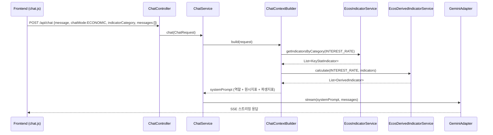
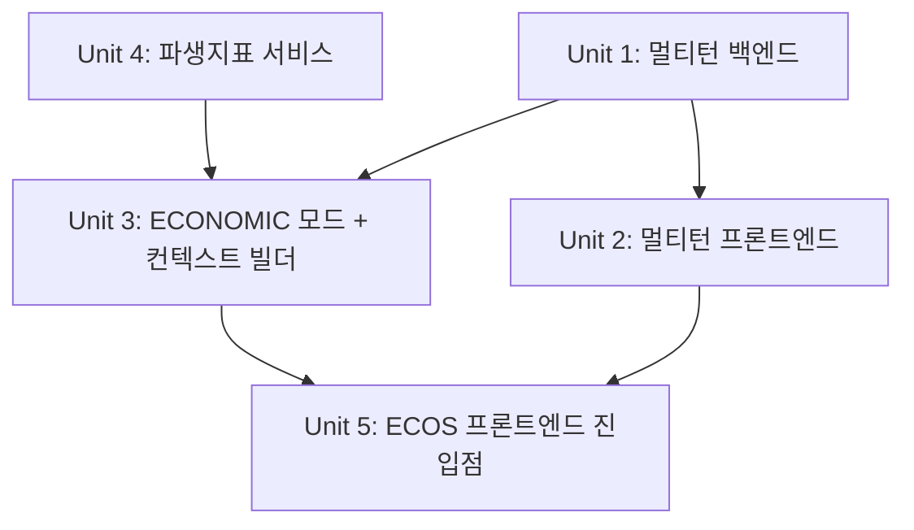

# feat: ECOS 경제지표 챗봇 분석 기능 + 멀티턴 대화

## Overview

ECOS 경제지표 화면에서 AI 분석 버튼을 클릭하면 챗봇이 열리고, 선택된 카테고리의 원시 지표와 파생지표를 컨텍스트로 LLM에 전달하여 경제 상황 분석을 받을 수 있게 한다. 동시에 기존 챗봇의 단일턴 구조를 멀티턴으로 개선하여 모든 모드(PORTFOLIO, FINANCIAL, ECONOMIC)에서 후속 질문이 가능하도록 한다.

## Problem Frame

사용자가 경제지표 수치를 보고 있지만 해당 값의 경제적 의미를 직관적으로 파악하기 어렵다. 기존 Gemini LLM + SSE 스트리밍 인프라를 활용하여 지표 데이터를 컨텍스트로 넘기고 AI 해석을 요청할 수 있게 한다. (see origin: docs/brainstorms/2026-04-07-ecos-chatbot-integration-requirements.md)

## Requirements Trace

- R13. ChatRequest에 대화 히스토리 필드(`messages`) 추가
- R14. LlmPort, GeminiRequest를 멀티턴으로 확장
- R15. 프론트엔드에서 대화 히스토리 수집/전송 (전체 모드 공통)
- R1. ChatMode에 ECONOMIC 추가 (R3과 동시 구현)
- R2. ChatRequest에 `indicatorCategory` 필드 추가
- R3. ChatContextBuilder에 ECONOMIC 모드 처리 + 데이터 조회 실패 시 안내
- R4. 12개 카테고리 40+ 파생지표 백엔드 구현
- R5. 카테고리별 조건부 파생지표 포함 (getCurrentSpreads() 매핑 기준)
- R6. ECOS 헤더에 AI 분석 버튼 (비활성 조건 포함)
- R7. 버튼 클릭 시 챗봇 패널 열기 + 카테고리 읽기전용 라벨
- R8/R8-1. 사용자 직접 질문 + ECONOMIC 빈 상태 텍스트
- R9. 경제지표 전문 시스템 프롬프트 (기준일 표시, 시점 안내)
- R10. ECONOMIC 모드 ECOS 전용 진입 (토글 미추가)
- R11. 카테고리 변경 시 대화 초기화
- R12. 멀티턴 대화 지원 (히스토리 프론트엔드 관리)

## Scope Boundaries

- 글로벌 경제지표(TradingEconomics) 제외 — ECOS 국내 지표만
- 시계열 추이 데이터 제외 — 최신 값만 컨텍스트에 포함
- ECONOMIC 모드는 기존 모드 토글에 추가하지 않음
- 대화 히스토리는 프론트엔드 메모리에서만 관리 (서버 세션 저장 없음)

## Context & Research

### Relevant Code and Patterns

**챗봇 백엔드 (Port-Adapter 패턴)**:
- `ChatContextBuilder` — switch 기반 모드 디스패치, 각 모드별 `buildXxxContext()` 메서드
- `LlmPort` — `Flux<String> stream(systemPrompt, userMessage)` 단일 메서드 인터페이스
- `GeminiAdapter` — WebClient SSE로 Gemini API 호출, `GeminiRequest.of()` 팩토리
- `GeminiRequest` — `systemInstruction` + `contents` 배열 구조. 현재 단일 Content만 생성
- `ChatController.ChatMessageRequest` — `(message, chatMode, stockCode)` inner record

**ECOS 도메인**:
- `EcosIndicatorService.getIndicatorsByCategory()` — Caffeine 캐시 → API fallback
- `KeyStatIndicator` — `(className, keystatName, dataValue, previousDataValue, cycle, unitName)`. **날짜 필드 없음**, `cycle`이 기간 정보 ("2026/03" 등)
- `EcosIndicatorCategory` — 15개 enum, 각 카테고리는 `classNames` 세트 보유
- `ecos.js getCurrentSpreads()` — 12개 카테고리→파생지표 디스패치 맵

**프론트엔드**:
- Alpine.js 스프레드 합성 패턴: `dashboard()` → `{...ChatComponent, ...EcosComponent, ...}`
- 챗봇 패널 `x-show="currentPage === 'portfolio'"` — **ECOS 페이지 지원 필요**
- `API.streamChat()` — fetch POST → ReadableStream → SSE data: 라인 파싱

### Institutional Learnings

- Alpine.js Proxy 충돌: 외부 객체는 `Object.defineProperty(..., { enumerable: false })` 사용 (docs/solutions/)
- 스트리밍 레이스 컨디션: generation counter 패턴으로 stale 응답 폐기
- 모바일: `h-dvh` 사용, `chatPanelClasses()` 반응형 패턴 유지

## Key Technical Decisions

- **파생지표 패키지 위치**: `economics/application/` 하위에 `EcosDerivedIndicatorService` 생성. 파생지표는 경제지표 도메인 로직이며 chatbot이 소비하는 구조. chatbot → economics 의존 방향은 ARCHITECTURE.md의 application 레이어 간 참조로 허용
- **멀티턴 구현 방식**: `LlmPort.stream()`에 `List<ChatMessage>` 파라미터 추가. `ChatMessage`는 `(role, content)` record. GeminiRequest에서 Content 배열로 변환
- **기준일 데이터**: `KeyStatIndicator.cycle` 필드를 기준일 대용으로 사용 ("2026/03" → "2026년 3월 기준"). 별도 날짜 필드 추가 불필요
- **토큰 예산**: 카테고리별 최대 20개 원시지표 × ~20토큰 + 파생지표 7종 × ~30토큰 ≈ 600토큰. Gemini 1M 컨텍스트에서 충분. 멀티턴 히스토리도 대화 10턴 × ~200토큰 = 2K토큰으로 무시 가능
- **시스템 프롬프트 데이터 포맷**: 마크다운 리스트 형태. 테이블보다 LLM이 개별 항목을 참조하기 용이. 구현 시 실제 응답 품질 확인 후 조정 가능
- **챗봇 페이지 가시성**: `x-show` 조건을 `currentPage === 'portfolio' || currentPage === 'ecos'`로 확장

## Open Questions

### Resolved During Planning

- **파생지표 패키지 위치**: `economics/application/EcosDerivedIndicatorService` — 도메인 로직이므로 economics 모듈에 배치
- **기준일 데이터 소스**: `KeyStatIndicator.cycle` 필드 활용 — 별도 필드 추가 불필요
- **토큰 예산**: 카테고리별 ~600토큰, 멀티턴 10턴 ~2K토큰. Gemini 1M 컨텍스트에서 문제 없음
- **챗봇 페이지 가시성**: `portfolio || ecos` 조건으로 확장

### Deferred to Implementation

- 시스템 프롬프트 데이터 포맷 최적화 — 마크다운 리스트로 시작, 실제 응답 품질 확인 후 조정
- 멀티턴 히스토리 최대 턴 수 — 10턴으로 시작, 필요시 조정
- 파생지표 계산 시 원시 지표 누락 처리 — null 반환으로 skip (FE 패턴과 동일)

## High-Level Technical Design

> *This illustrates the intended approach and is directional guidance for review, not implementation specification. The implementing agent should treat it as context, not code to reproduce.*

## Implementation Units

- [x] **Unit 1: 멀티턴 대화 백엔드 인프라**

**Goal:** LlmPort, ChatService, GeminiAdapter, GeminiRequest를 멀티턴 대화를 지원하도록 확장

**Requirements:** R13, R14

**Dependencies:** 없음 (기반 작업)

**Files:**
- Create: `src/main/java/com/thlee/stock/market/stockmarket/chatbot/application/dto/ChatMessage.java`
- Modify: `src/main/java/com/thlee/stock/market/stockmarket/chatbot/application/dto/ChatRequest.java`
- Modify: `src/main/java/com/thlee/stock/market/stockmarket/chatbot/application/port/LlmPort.java`
- Modify: `src/main/java/com/thlee/stock/market/stockmarket/chatbot/application/ChatService.java`
- Modify: `src/main/java/com/thlee/stock/market/stockmarket/chatbot/infrastructure/gemini/GeminiAdapter.java`
- Modify: `src/main/java/com/thlee/stock/market/stockmarket/chatbot/infrastructure/gemini/dto/GeminiRequest.java`
- Modify: `src/main/java/com/thlee/stock/market/stockmarket/chatbot/presentation/ChatController.java`
- Test: `src/test/java/com/thlee/stock/market/stockmarket/chatbot/infrastructure/gemini/dto/GeminiRequestTest.java`
- Test: `src/test/java/com/thlee/stock/market/stockmarket/chatbot/application/ChatServiceTest.java`

**Approach:**
- `ChatMessage` record: `(String role, String content)` — role은 "user" 또는 "model"
- `ChatRequest`에 `List<ChatMessage> messages` 필드 추가 (빈 리스트 기본값)
- `LlmPort.stream()` 시그니처를 `stream(String systemPrompt, List<ChatMessage> messages)`로 변경
- `ChatService.chat()`에서 현재 메시지를 messages 끝에 추가하여 LlmPort에 전달
- `GeminiRequest.of()`를 `of(String systemPrompt, List<ChatMessage> messages)`로 확장 — messages를 Content 배열로 변환
- `GeminiAdapter`는 새 시그니처로 `GeminiRequest.of()` 호출
- `ChatController.ChatMessageRequest`에 `List<ChatMessage> messages` 필드 추가
- 기존 PORTFOLIO/FINANCIAL 모드는 빈 messages로 호출되므로 하위 호환 유지

**Patterns to follow:**
- 기존 `GeminiRequest.of()` 팩토리 패턴
- `Content(role, List<Part>)` 구조 — Gemini API에서 role은 "user"/"model"

**Test scenarios:**
- Happy path: messages가 3턴(user→model→user)일 때, GeminiRequest의 contents에 systemInstruction + 3개 Content가 생성됨
- Happy path: 빈 messages + 현재 메시지만 있으면 기존과 동일하게 단일 Content 생성 (하위 호환)
- Edge case: messages가 null이면 현재 메시지만으로 요청 생성
- Edge case: messages에 빈 content인 항목이 있으면 필터링하여 제외

**Verification:**
- 기존 PORTFOLIO/FINANCIAL 모드로 챗봇 대화 시 정상 동작 (단일턴 하위 호환)
- 멀티턴 messages를 포함한 요청이 Gemini API에 올바른 형식으로 전달됨

---

- [x] **Unit 2: 멀티턴 대화 프론트엔드**

**Goal:** chat.js에서 대화 히스토리를 수집하여 API 요청에 포함

**Requirements:** R15

**Dependencies:** Unit 1

**Files:**
- Modify: `src/main/resources/static/js/components/chat.js`
- Modify: `src/main/resources/static/js/api.js`

**Approach:**
- `sendChatMessage()`에서 전송 전 현재 `chat.messages` 배열에서 히스토리 추출
- 히스토리 형식: `[{role: 'user', content: '...'}, {role: 'model', content: '...'}]` — 마지막 (아직 비어있는) assistant 메시지 제외
- `API.streamChat()`에 `messages` 파라미터 추가, fetch body에 포함
- 최대 10턴(20개 메시지)으로 제한 — 오래된 메시지부터 잘라냄
- 기존 3개 모드 모두 동일하게 히스토리 전송

**Patterns to follow:**
- 기존 `sendChatMessage()` 흐름: push → API 호출 → onChunk → onDone
- `API.streamChat()` fetch body 구조

**Test scenarios:**
- Test expectation: none — 프론트엔드 JS 단위테스트 인프라 없음. Unit 1 백엔드 테스트와 수동 E2E로 검증

**Verification:**
- 브라우저 네트워크 탭에서 /api/chat 요청 body에 messages 배열이 포함됨
- 2번째 메시지부터 이전 대화 맥락을 반영한 LLM 응답을 받음

---

- [x] **Unit 3: ECONOMIC 모드 + ChatContextBuilder + 시스템 프롬프트**

**Goal:** ChatMode.ECONOMIC 추가, ChatContextBuilder에 경제지표 컨텍스트 빌드 로직 구현, 시스템 프롬프트 작성

**Requirements:** R1, R2, R3, R9

**Dependencies:** Unit 1 (ChatRequest 변경 포함), Unit 4 (파생지표 서비스)

**Files:**
- Modify: `src/main/java/com/thlee/stock/market/stockmarket/chatbot/application/dto/ChatMode.java`
- Modify: `src/main/java/com/thlee/stock/market/stockmarket/chatbot/application/dto/ChatRequest.java`
- Modify: `src/main/java/com/thlee/stock/market/stockmarket/chatbot/application/ChatContextBuilder.java`
- Modify: `src/main/java/com/thlee/stock/market/stockmarket/chatbot/presentation/ChatController.java`
- Test: `src/test/java/com/thlee/stock/market/stockmarket/chatbot/application/ChatContextBuilderTest.java`

**Approach:**
- `ChatMode`에 `ECONOMIC` 추가 — R1과 R3은 동시 변경 필수 (exhaustive switch)
- `ChatRequest`에 `String indicatorCategory` 필드 추가 (ECONOMIC에서 필수, 나머지 null)
- `ChatController.ChatMessageRequest`에 `String indicatorCategory` 추가, ChatRequest 생성 시 전달
- `ChatContextBuilder`에 `EcosIndicatorService` + `EcosDerivedIndicatorService` 의존성 주입
- `buildEconomicContext(indicatorCategory)` 메서드:
  1. `EcosIndicatorCategory.valueOf(indicatorCategory)`로 카테고리 해석
  2. `ecosIndicatorService.getIndicatorsByCategory()`로 원시 지표 조회
  3. `ecosDerivedIndicatorService.calculate()`로 파생지표 계산
  4. 시스템 프롬프트 조립: 역할 정의 + 원시지표 리스트 + 파생지표 리스트
  5. 조회 실패 시 "현재 데이터를 조회할 수 없습니다" 안내 포함
- 시스템 프롬프트 구조:
  - 역할: "한국 경제지표 전문 분석 어시스턴트"
  - 지침: 지표 해석, 경기 판단, 파생지표 의미, 기준일(cycle) 시점 언급
  - 데이터: 마크다운 리스트 (이름, 값, 단위, 기준일)

**Patterns to follow:**
- `buildPortfolioContext()`, `buildFinancialContext()` 패턴 — StringBuilder로 시스템 프롬프트 조립

**Test scenarios:**
- Happy path: INTEREST_RATE 카테고리로 요청 시, 원시지표 + 금리 스프레드 6종이 시스템 프롬프트에 포함됨
- Happy path: EXCHANGE_RATE 카테고리(파생지표 없음)로 요청 시, 원시지표만 포함
- Error path: 잘못된 카테고리 문자열 → IllegalArgumentException 처리 (빈 프롬프트 또는 안내 메시지)
- Error path: 지표 조회 실패 시 "데이터를 조회할 수 없습니다" 메시지 포함
- Edge case: 지표가 0건인 카테고리 → 데이터 없음 안내 포함

**Verification:**
- ECONOMIC 모드 요청이 정상적으로 시스템 프롬프트를 생성하고 LLM 응답을 반환
- 기존 PORTFOLIO/FINANCIAL 모드에 영향 없음

---

- [x] **Unit 4: 파생지표 계산 서비스**

**Goal:** ecos.js의 12개 카테고리 파생지표 계산 로직을 백엔드 서비스로 구현

**Requirements:** R4, R5

**Dependencies:** 없음 (독립적 도메인 서비스)

**Files:**
- Create: `src/main/java/com/thlee/stock/market/stockmarket/economics/application/EcosDerivedIndicatorService.java`
- Create: `src/main/java/com/thlee/stock/market/stockmarket/economics/domain/model/DerivedIndicator.java`
- Test: `src/test/java/com/thlee/stock/market/stockmarket/economics/application/EcosDerivedIndicatorServiceTest.java`

**Approach:**
- `DerivedIndicator` record: `(String name, Double value, String unit, String formula, String description)` — ecos.js 스프레드 구조 매핑
- `EcosDerivedIndicatorService`:
  - `List<DerivedIndicator> calculate(EcosIndicatorCategory category, List<KeyStatIndicator> indicators)` 메서드
  - 내부에 `Map<String, Double>` 인디케이터 맵 구성 (`keystatName` → `dataValue` 파싱)
  - 카테고리별 계산 메서드 디스패치 (ecos.js `getCurrentSpreads()` 패턴과 동일)
  - 각 계산에서 원시 지표 누락 시 해당 파생지표 skip (null → 제외)
  - 12개 카테고리 각각의 계산 로직을 ecos.js에서 이식
  - EXCHANGE_RATE, POPULATION, COMMODITY → 빈 리스트 반환

**Patterns to follow:**
- ecos.js의 `calc(a, b)`, `ratio(a, b)` 헬퍼 패턴
- ecos.js의 각 `getXxxSpreads()` 메서드의 지표명 조회 및 계산식

**Test scenarios:**
- Happy path: INTEREST_RATE + 모든 원시지표 제공 → 6개 스프레드 반환, 값이 ecos.js 계산과 일치
- Happy path: MONEY_FINANCE + 모든 원시지표 → 7개 비율 반환, grade 기준 포함
- Happy path: EXCHANGE_RATE → 빈 리스트 반환
- Edge case: 일부 원시지표 누락 (예: '국고채수익률(5년)' 없음) → 해당 스프레드만 null로 skip, 나머지는 정상 계산
- Edge case: dataValue가 숫자가 아닌 경우 (예: "-") → NumberFormatException 방지, 해당 지표 skip
- Happy path: 12개 카테고리 각각에 대해 계산 메서드가 존재하고 빈 리스트가 아닌 결과 반환

**Verification:**
- 모든 12개 카테고리에 대해 계산이 정상 수행됨
- ecos.js의 계산 결과와 동일한 값이 나옴 (소수점 3자리 반올림)

---

- [x] **Unit 5: ECOS 프론트엔드 진입점 + 챗봇 패널 통합**

**Goal:** ECOS 화면에 AI 분석 버튼 추가, 챗봇 패널을 ECOS 페이지에서 사용 가능하게 하고, ECONOMIC 모드 UX 구현

**Requirements:** R6, R7, R8, R8-1, R10, R11, R12

**Dependencies:** Unit 2, Unit 3

**Files:**
- Modify: `src/main/resources/static/index.html`
- Modify: `src/main/resources/static/js/components/ecos.js`
- Modify: `src/main/resources/static/js/components/chat.js`
- Modify: `src/main/resources/static/js/api.js`

**Approach:**
- **index.html**:
  - 챗봇 버블 버튼(line ~2250)과 챗봇 패널(line ~2263) 모두의 `x-show` 조건을 `currentPage === 'portfolio' || currentPage === 'ecos'`로 변경
  - ECOS 섹션 헤더(뷰모드 토글 옆)에 'AI 분석' 버튼 추가: `x-bind:disabled="ecos.loading || ecos.indicators.length === 0"`, `@click="openEcosChat()"`
  - 챗봇 헤더에 ECONOMIC 모드일 때 카테고리 읽기전용 라벨 표시: `x-show="chat.chatMode === 'ECONOMIC'"`, `x-text="getEcosCategoryLabel(chat.indicatorCategory)"`
  - 빈 상태 텍스트 3항 분기: PORTFOLIO/FINANCIAL/ECONOMIC
  - ECONOMIC 모드에서 모드 토글 숨기기: `x-show="chat.chatMode !== 'ECONOMIC'"`

- **ecos.js**:
  - `openEcosChat()` 메서드 추가: `chat.chatMode = 'ECONOMIC'`, `chat.indicatorCategory = ecos.selectedCategory`, 대화 초기화, 챗봇 패널 열기
  - 카테고리 변경 감지: 기존 `loadEcosIndicators()`에서 챗봇이 ECONOMIC 모드로 열려 있으면 대화 초기화 + 새 카테고리 설정

- **chat.js**:
  - `chat` 상태에 `indicatorCategory: null` 추가
  - `sendChatMessage()`에서 ECONOMIC 모드일 때 indicatorCategory 유효성 검사
  - `API.streamChat()` 호출 시 `indicatorCategory` 전달
  - `setChatMode()`에서 ECONOMIC이 아닌 모드로 전환 시 `indicatorCategory = null`

- **api.js**:
  - `streamChat()` 시그니처에 `indicatorCategory` 파라미터 추가
  - fetch body에 `indicatorCategory` 포함

**Patterns to follow:**
- 기존 `setChatMode()` 패턴 — stockCode/stockName 초기화
- 기존 `x-show` 조건부 렌더링 패턴
- `chatPanelClasses()` 반응형 패턴 유지

**Test scenarios:**
- Test expectation: none — 프론트엔드 단위테스트 인프라 없음. 수동 E2E 검증

**Verification:**
- ECOS 페이지에서 AI 분석 버튼이 보이고, 로딩 중/빈 목록에서 비활성화됨
- 버튼 클릭 시 챗봇이 ECONOMIC 모드로 열리고, 카테고리 라벨이 표시됨
- 모드 토글이 숨겨져 있고, 빈 상태 텍스트가 '경제지표에 대해 질문해보세요'
- 카테고리 변경 시 대화가 초기화됨
- 질문 전송 시 경제지표 기반 분석 답변을 받음
- 후속 질문 시 이전 대화 맥락이 유지됨

## System-Wide Impact

- **Interaction graph**: `ChatContextBuilder` → `EcosIndicatorService`, `EcosDerivedIndicatorService` 의존성 추가. ChatController → ChatService → LlmPort 체인에 messages 파라미터 추가
- **Error propagation**: ECOS API 실패 → EcosIndicatorService 캐시 miss → ChatContextBuilder에서 "데이터 조회 불가" 안내 → LLM이 사용자에게 상황 안내. Gemini API 실패 → 기존 `onErrorResume` 패턴 유지
- **State lifecycle risks**: 프론트엔드 chat.messages 배열이 메모리에만 존재. 페이지 이동/새로고침 시 소실 (의도적)
- **API surface parity**: ChatController POST /api/chat의 request body에 `indicatorCategory`, `messages` 추가 — 기존 클라이언트는 이 필드 없이 보내도 null/빈배열로 처리되므로 하위 호환
- **Unchanged invariants**: PORTFOLIO, FINANCIAL 모드 동작 불변. EcosIndicatorService, EcosIndicatorController 기존 API 불변

## Risks & Dependencies

| Risk | Mitigation |
|------|------------|
| 파생지표 40+ 종 이식 시 계산 오류 | ecos.js와 동일한 입력으로 단위 테스트, 소수점 3자리 반올림 일치 검증 |
| 한국어 지표명 하드코딩 (예: '국고채수익률(5년)') 의존 | ECOS API 변경 시 FE/BE 모두 깨짐 — 기존 프론트엔드와 동일한 리스크 수준. 향후 메타데이터 기반 매핑 고려 |
| Gemini 한국어 경제지표 분석 품질 불확실 | 시스템 프롬프트에 역할/지침 상세 명시. 구현 후 실제 데이터로 품질 확인, 프롬프트 튜닝 |
| LlmPort 시그니처 변경이 GeminiAdapter에만 영향 | 인터페이스 구현체가 GeminiAdapter 단일이므로 영향 범위 제한적 |

## Sources & References

- **Origin document:** [docs/brainstorms/2026-04-07-ecos-chatbot-integration-requirements.md](docs/brainstorms/2026-04-07-ecos-chatbot-integration-requirements.md)
- Related code: `ChatContextBuilder`, `EcosIndicatorService`, `GeminiRequest`, `ecos.js getCurrentSpreads()`
- Institutional learnings: `docs/solutions/architecture-patterns/ecos-timeseries-chart-visualization.md` (Alpine.js Proxy, generation counter)
- Institutional learnings: `docs/solutions/ui-bugs/responsive-design-tailwind-alpine.md` (chatPanelClasses, h-dvh)