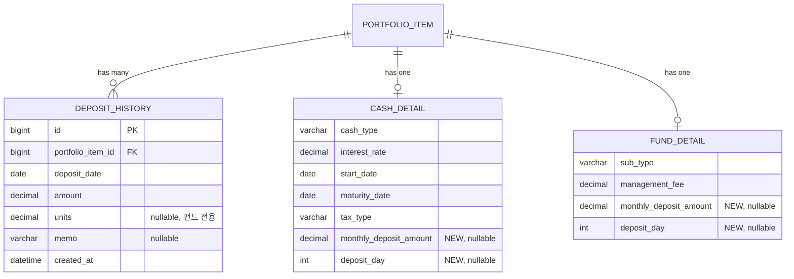

# feat: 포트폴리오 추가 납입 이력 관리 기능

## Overview

포트폴리오의 현금성 자산(예금/적금/CMA)과 펀드에 대한 **추가 납입 이력 관리 기능**을 구현한다.
기존 `StockPurchaseHistory` 패턴을 활용하여 `DepositHistory`를 구현하고, 자동납입 설정/미납 표시/만기 예상 금액 계산을 제공한다.
(see brainstorm: docs/brainstorms/2026-04-10-deposit-history-brainstorm.md)

## Problem Statement / Motivation

현재 포트폴리오에서 적금/CMA/펀드 등의 자산을 등록할 수 있지만, **납입 이력을 추적하는 기능이 없다**.
사용자는 매월 얼마를 납입했는지, 총 납입 금액이 얼마인지, 적금 만기 시 예상 수령액이 얼마인지를 확인할 수 없다.
주식에는 `StockPurchaseHistory`(매수이력)가 있으므로, 동일한 패턴으로 현금성/펀드 자산의 납입 이력을 관리한다.

## Proposed Solution

### 핵심 결정 (브레인스토밍에서 확정)

1. **`DepositHistory` 엔티티 신규 생성** — `PortfolioItem`과 ID 기반 참조, JPA 연관관계 없음
2. **자동납입 설정은 필드 추가** — `CashDetail`/`FundDetail`에 `monthlyDepositAmount`, `depositDay` 추가
3. **만기 예상 금액은 도메인 로직** — 이자 계산은 서비스/도메인 모델에서 처리
4. **미납 표시** — UI에서 납입 예정일 경과 시 시각적 배지 표시
5. **펀드는 금액 + 좌수 함께 기록**

### 아키텍처

```
presentation (Controller/DTO)
    ↓
application (PortfolioService - @Transactional)
    ↓
domain (DepositHistory, PortfolioItem, CashDetail, FundDetail)
    ↑
infrastructure (DepositHistoryEntity, Repository 구현체)
```

## Technical Considerations

### SpecFlow 분석 결과 반영

| 이슈 | 결정 |
|------|------|
| investedAmount 동기화 경합 | 이력 기반 전체 재계산 패턴 사용 (`recalculateFromDepositHistories`), 트랜잭션 내에서 처리 |
| 자동납입 설정 변경 시 미납 판정 | 현재 설정 기준으로만 미납 판정, 과거 소급 변경 없음 |
| 펀드 좌수 필수/선택 | 선택 사항 (금액만 필수, 좌수는 nullable) |
| 납입 삭제 시 investedAmount 음수 | 전체 이력 합계로 재계산하므로 음수 불가 |
| 만기 예상 금액 계산 시점 | 조회 시 계산 (저장하지 않음), 단리 기반 |
| 미납 배지 판정 | 조회 시 실시간 계산, 납입일 다음날부터 미납 처리 |
| 자산 유형별 검증 | 1차에서는 공통 검증만 (금액 > 0, 날짜 유효), 유형별 제한은 미적용 |
| 납입일 31일 + 2월 | 해당 월 마지막 날로 처리 |
| 미래 날짜 납입 | 허용 (예정 납입 기록 용도) |
| PortfolioItem 삭제 시 | cascade 삭제 (deleteByPortfolioItemId) |

## ERD



## Acceptance Criteria

- [ ] 납입 이력 CRUD (추가/조회/수정/삭제)가 동작한다
- [ ] 납입 이력 추가/수정/삭제 시 `investedAmount`가 자동 재계산된다
- [ ] 자동납입 설정(월 납입액, 납입일)을 저장/수정할 수 있다
- [ ] 적금의 만기 예상 금액이 조회 시 계산되어 표시된다
- [ ] 미납 배지가 납입 예정일 경과 시 UI에 표시된다
- [ ] 펀드 납입 시 금액과 좌수(선택)를 함께 기록할 수 있다
- [ ] PortfolioItem 삭제 시 관련 납입 이력이 함께 삭제된다

## Implementation Phases

### Phase 1: 도메인 모델 & 인프라 (백엔드 핵심)

> 기존 StockPurchaseHistory 패턴을 따라 DepositHistory 도메인 모델, 엔티티, 리포지토리를 생성한다.

- [x] `DepositHistory` 도메인 모델 생성
  - 파일: `src/main/java/.../portfolio/domain/model/DepositHistory.java`
  - 참고: `StockPurchaseHistory.java` 패턴
  - 필드: `id`, `portfolioItemId`, `depositDate`, `amount`, `units`(nullable), `memo`, `createdAt`
  - 메서드: `create()` 정적 팩토리, `update()`, `getTotalAmount()`
- [x] `DepositHistoryEntity` JPA 엔티티 생성
  - 파일: `src/main/java/.../portfolio/infrastructure/persistence/DepositHistoryEntity.java`
  - 참고: `StockPurchaseHistoryEntity.java` 패턴
  - `@Index`로 `portfolio_item_id` 인덱스
- [x] `DepositHistoryRepository` 포트 인터페이스 생성
  - 파일: `src/main/java/.../portfolio/domain/repository/DepositHistoryRepository.java`
  - 메서드: `save`, `findById`, `findByPortfolioItemId`, `delete`, `deleteByPortfolioItemId`
- [x] `DepositHistoryJpaRepository` 생성
  - 파일: `src/main/java/.../portfolio/infrastructure/persistence/DepositHistoryJpaRepository.java`
- [x] `DepositHistoryRepositoryImpl` 어댑터 생성
  - 파일: `src/main/java/.../portfolio/infrastructure/persistence/DepositHistoryRepositoryImpl.java`
  - `toEntity()`/`toDomain()` 변환 메서드

### Phase 2: 자동납입 설정 필드 추가

> CashDetail/FundDetail에 monthlyDepositAmount, depositDay 필드를 추가한다.

- [x] `CashDetail` 도메인 모델에 `monthlyDepositAmount`, `depositDay` 필드 추가
  - 파일: `src/main/java/.../portfolio/domain/model/CashDetail.java`
- [x] `CashItemEntity`에 `monthly_deposit_amount`, `deposit_day` 컬럼 추가
  - 파일: `src/main/java/.../portfolio/infrastructure/persistence/CashItemEntity.java`
- [x] `FundDetail` 도메인 모델에 `monthlyDepositAmount`, `depositDay` 필드 추가
  - 파일: `src/main/java/.../portfolio/domain/model/FundDetail.java`
- [x] `FundItemEntity`에 `monthly_deposit_amount`, `deposit_day` 컬럼 추가
  - 파일: `src/main/java/.../portfolio/infrastructure/persistence/FundItemEntity.java`

### Phase 3: 서비스 계층 (비즈니스 로직)

> PortfolioService에 납입 이력 CRUD + investedAmount 재계산 + 만기 예상 금액 계산 로직을 추가한다.

- [x] `PortfolioService`에 납입 이력 CRUD 메서드 추가
  - 파일: `src/main/java/.../portfolio/application/PortfolioService.java`
  - `addDeposit(userId, itemId, request)` — 납입 추가 + investedAmount 재계산
  - `getDepositHistories(userId, itemId)` — 납입 이력 조회
  - `updateDeposit(userId, itemId, historyId, request)` — 납입 수정 + 재계산
  - `deleteDeposit(userId, itemId, historyId)` — 납입 삭제 + 재계산
  - 참고: `addStockPurchase()` / `recalculateFromPurchaseHistories()` 패턴
- [x] `PortfolioItem`에 `recalculateFromDepositHistories(List<DepositHistory>)` 메서드 추가
  - 파일: `src/main/java/.../portfolio/domain/model/PortfolioItem.java`
  - 이력 합계로 `investedAmount` 재계산
- [x] 만기 예상 금액 계산 로직 구현
  - `PortfolioService` 또는 별도 도메인 서비스에서 계산
  - 단리 기반: `총 납입액 + (총 납입액 × 이자율 × 기간)`
- [x] 미납 판정 로직 구현
  - 자동납입 설정이 있는 경우, 당월 납입 기록 유무를 확인하여 미납 여부 반환

### Phase 4: API 계층 (Controller & DTO)

> 납입 이력 CRUD API 엔드포인트와 요청/응답 DTO를 추가한다.

- [x] 요청/응답 DTO 생성
  - `DepositRequest` — `depositDate`, `amount`, `units`(optional), `memo`
  - `DepositHistoryResponse` — 납입 이력 응답
  - 파일: `src/main/java/.../portfolio/presentation/dto/`
- [x] `PortfolioController`에 납입 이력 엔드포인트 추가
  - 파일: `src/main/java/.../portfolio/presentation/PortfolioController.java`
  - `POST /api/portfolio/items/{itemId}/deposits` — 납입 추가
  - `GET /api/portfolio/items/{itemId}/deposits` — 납입 이력 조회
  - `PUT /api/portfolio/items/{itemId}/deposits/{historyId}` — 납입 수정
  - `DELETE /api/portfolio/items/{itemId}/deposits/{historyId}` — 납입 삭제
- [x] 자산 조회 응답에 미납 여부, 만기 예상 금액 필드 추가
  - 기존 `PortfolioItemResponse`에 `depositOverdue`, `expectedMaturityAmount` 추가

### Phase 5: 프론트엔드 (UI)

> 기존 portfolio.js의 매수이력 모달 패턴을 활용하여 납입 이력 UI를 구현한다.

- [x] 납입 이력 모달 UI 구현
  - 파일: `src/main/resources/static/js/components/portfolio.js`
  - 참고: 기존 `purchaseItem`, `openPurchaseModal()` 패턴
  - 납입 추가 폼: 날짜, 금액, 좌수(펀드만), 메모
  - 납입 이력 리스트: 인라인 수정/삭제
- [x] 자동납입 설정 UI
  - 현금/펀드 자산 등록/수정 폼에 월 납입액, 납입일 필드 추가
- [x] 미납 배지 표시
  - 포트폴리오 목록에서 미납 자산에 배지/아이콘 표시
- [x] 만기 예상 금액 표시
  - 적금 자산 상세에 만기 예상 금액 표시

## Sources & References

### Origin

- **브레인스토밍 문서**: [docs/brainstorms/2026-04-10-deposit-history-brainstorm.md](docs/brainstorms/2026-04-10-deposit-history-brainstorm.md)
  - 핵심 결정: DepositHistory 엔티티 신규 생성, 자동납입 설정은 필드 추가, 미납 UI 표시, 펀드 금액+좌수 기록

### Internal References

- StockPurchaseHistory 도메인 모델: `src/main/java/.../portfolio/domain/model/StockPurchaseHistory.java`
- StockPurchaseHistoryEntity: `src/main/java/.../portfolio/infrastructure/persistence/StockPurchaseHistoryEntity.java`
- PortfolioService 매수이력 패턴: `src/main/java/.../portfolio/application/PortfolioService.java` (addStockPurchase, recalculateFromPurchaseHistories)
- PortfolioController 엔드포인트 패턴: `src/main/java/.../portfolio/presentation/PortfolioController.java`
- CashDetail: `src/main/java/.../portfolio/domain/model/CashDetail.java`
- FundDetail: `src/main/java/.../portfolio/domain/model/FundDetail.java`
- ARCHITECTURE.md: 레이어 규칙, ID 기반 참조, @Transactional 경계
