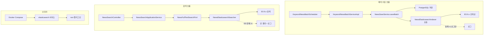

# feat: Elasticsearch 기반 뉴스 전문 검색 도입

## Overview

Elasticsearch 9.x를 도입하여 저장된 뉴스 기사의 제목/본문 전문 검색을 지원한다. nori 플러그인을 활용한 한국어 형태소 분석으로 검색 품질을 확보하고, 날짜·지역 필터링과 페이지네이션을 제공한다. ES는 검색 전용 보조 수단으로, 장애 시 기존 keyword_id 기반 조회에 영향을 주지 않는다.

## Problem Frame

현재 뉴스 시스템은 매시간 ~7,000건/일의 기사를 수집하여 PostgreSQL에 저장하지만, `keyword_id` 기반 조회만 가능하다. 사용자가 자유 텍스트로 뉴스를 검색할 수 없다. (see origin: docs/brainstorms/2026-04-12-elasticsearch-news-search-requirements.md)

## Requirements Trace

- R1. 뉴스 제목/본문 전문 검색, 관련도 순 반환 (본문 null 시 제목만 검색)
- R2. nori 한국어 형태소 분석 적용
- R3. 날짜 범위 필터링 (시작일~종료일)
- R4. 지역(DOMESTIC/INTERNATIONAL) 필터링
- R5. 검색 결과 페이지네이션
- R8. 배치 수집 완료 후 비동기 ES 인덱싱
- R9. ES 장애 시 기존 뉴스 수집/keyword_id 조회 정상 동작 (전문 검색만 일시 불가)

> R6, R7 (챗봇 RAG 연동)은 이번 범위에서 제외. 향후 별도 계획으로 추가 가능.

## Scope Boundaries

- 뉴스 트렌드 집계(일별 기사 수, 키워드 빈도) 미포함
- 다른 도메인(경제지표, 포트폴리오) ES 인덱싱 미포함
- 검색 자동완성/추천 미포함
- 뉴스 감성 분석 미포함
- 챗봇 RAG 연동 미포함

## Context & Research

### Relevant Code and Patterns

- **뉴스 도메인 구조**: hexagonal architecture (domain → application → infrastructure → presentation)
  - 도메인 모델: `news/domain/model/News.java` (ID 기반 참조, 팩토리 메서드)
  - 포트: `news/domain/repository/NewsRepository.java`
  - 어댑터: `news/infrastructure/persistence/NewsRepositoryImpl.java`
  - 매퍼: `news/infrastructure/persistence/mapper/NewsMapper.java`
- **배치 흐름**: `KeywordNewsBatchScheduler` → `KeywordNewsBatchServiceImpl.executeKeywordNewsBatch()` → `NewsSaveService.saveBatch()`
- **설정 패턴**: `@ConfigurationProperties` + `@Component` + `@Getter/@Setter`, YAML prefix 기반
- **Docker Compose**: app + nginx + cloudflared. PostgreSQL은 외부 운영
- **에러 처리**: 도메인별 Exception + `GlobalExceptionHandler`, 서킷브레이커/재시도 패턴 없음

### External References

- Spring Data Elasticsearch 6.0.x → ES 9.x 공식 지원 (Spring Boot 4.0 네이티브)
- `spring-boot-starter-data-elasticsearch` 사용 시 `ElasticsearchClient`, `ElasticsearchOperations` 자동 구성
- nori 플러그인: `decompound_mode: mixed`, `user_dictionary_rules` 인라인 사전 지원
- ES Docker 이미지에 `analysis-nori` 플러그인 사전 설치 필요

## Key Technical Decisions

- **ES 9.x 사용**: Spring Boot 4.0이 Spring Data ES 6.0.x를 통해 ES 9.x를 네이티브 지원. ES 8.x는 버전 핀닝이 필요하여 유지보수 부담
- **Spring Data Elasticsearch 사용**: `spring-boot-starter-data-elasticsearch` + `@Document` 어노테이션 기반. `ElasticsearchOperations`로 인덱싱/검색 수행
- **ES 문서 ID = originalUrl**: `insertIgnoreDuplicate()`가 DB ID를 반환하지 않으므로, ES 문서 ID로 `originalUrl`(DB unique 제약 보장)을 사용. PostgreSQL-ES 간 일관된 식별자 역할
- **동기화 방식 — 직접 호출**: `NewsSaveService.saveChunk()` 내부에서 insert 성공한 News 객체를 수집하여 chunk 단위로 `NewsIndexPort.indexAll()`에 전달. ES 인덱싱 실패 시 로그만 남기고 뉴스 저장은 정상 진행
- **별도 NewsSearchController 생성**: 기존 `NewsController`는 keyword_id 기반 조회 전용. 전문 검색은 다른 관심사이므로 별도 컨트롤러로 분리
- **검색도 포트/어댑터 패턴 적용**: hexagonal architecture 일관성을 위해 `NewsFullTextSearchPort` (domain) + `NewsElasticsearchSearcher` (infrastructure) 구조. application 서비스가 infrastructure 객체(`ElasticsearchOperations`)를 직접 사용하지 않음
- **ES 장애 격리 원칙**: 인덱싱 실패 → 로그만 남기고 예외 미전파. 검색 실패 → 빈 결과 반환 + 로그. 서킷브레이커는 프로젝트에 패턴이 없으므로 도푸입하지 않음 (YAGNI)
- **nori 커스텀 사전**: 초기에는 `user_dictionary_rules` 인라인으로 주요 종목명/경제 용어만 등록. 확장 필요 시 파일 기반 사전으로 전환
- **ES 버전 폴백**: Spring Boot 4.0 BOM이 ES 9.x를 지원하지 않는 경우, elasticsearch-java 버전을 8.x로 핀닝하고 ES 8.x Docker 이미지를 사용하는 것으로 폴백

## Open Questions

### Resolved During Planning

- **ES 클라이언트 라이브러리**: `spring-boot-starter-data-elasticsearch` (Spring Data ES 6.0.x, elasticsearch-java 9.1.x) — Spring Boot 4.0 BOM이 버전 관리
- **검색 컨트롤러 위치**: 별도 `NewsSearchController` 생성 — 기존 `NewsController`의 keyword_id 기반 조회와 관심사 분리
- **ES 인덱싱 실패 처리**: 로그 남기고 무시 (ES는 보조 수단, 뉴스 저장에 영향 없음)
- **nori 커스텀 사전**: 인라인 `user_dictionary_rules`로 시작, 파일 사전은 나중에 필요 시 전환
- **RAG 통합**: 이번 범위에서 제외

### Deferred to Implementation

- nori 커스텀 사전에 포함할 구체적 종목명/용어 목록
- ES 인덱스 refresh_interval, number_of_shards 등 성능 튜닝 값
- 백필 실행 시 실제 데이터량에 따른 배치 크기 조정

## High-Level Technical Design

> *This illustrates the intended approach and is directional guidance for review, not implementation specification. The implementing agent should treat it as context, not code to reproduce.*

## Implementation Units

- [x] **Unit 1: ES 인프라 구성 (Docker + Gradle 의존성)**

**Goal:** ES 9.x를 Docker Compose에 추가하고, Spring Boot 프로젝트에 ES 의존성을 추가한다.

**Requirements:** R1~R5 전제 조건, R8, R9

**Dependencies:** None

**Files:**
- Create: `Dockerfile.elasticsearch`
- Modify: `docker-compose.yml`
- Modify: `build.gradle`
- Modify: `src/main/resources/application.yml`
- Create: `src/main/resources/application-prod.yml` (ES 설정 추가, 기존 파일에 병합)

**Approach:**
- `Dockerfile.elasticsearch`: ES 9.x 베이스 이미지 + `analysis-nori` 플러그인 설치
- `docker-compose.yml`: elasticsearch 서비스 추가 (싱글 노드, heap 2GB, 볼륨 마운트, xpack.security.enabled=false)
- `build.gradle`: `spring-boot-starter-data-elasticsearch` 의존성 추가
- `application.yml`: `spring.elasticsearch.uris`, connection-timeout, socket-timeout 설정
- prod 프로파일에서 ES 호스트를 환경변수로 오버라이드

**Patterns to follow:**
- 기존 Docker Compose 서비스 구성 패턴 (app, nginx, cloudflared)
- 기존 application.yml의 외부 API 설정 패턴 (`${ENV_VAR}` placeholder)

**Test expectation:** none — 인프라 설정만, 동작 검증은 Unit 2에서 수행

**Verification:**
- `docker compose up elasticsearch` 후 `curl localhost:9200` 응답 확인
- `curl localhost:9200/_cat/plugins` 에서 analysis-nori 확인
- Spring Boot 앱 기동 시 ES 연결 로그 출력

---

- [x] **Unit 2: ES 인덱스 매핑 및 문서 모델**

**Goal:** 뉴스 ES 인덱스 매핑을 정의하고, Spring Data Elasticsearch용 문서 클래스를 생성한다.

**Requirements:** R1, R2, R3, R4

**Dependencies:** Unit 1

**Files:**
- Create: `src/main/java/com/thlee/stock/market/stockmarket/news/infrastructure/elasticsearch/document/NewsDocument.java`
- Create: `src/main/java/com/thlee/stock/market/stockmarket/news/infrastructure/elasticsearch/config/NewsElasticsearchConfig.java`

**Approach:**
- `NewsDocument`: `@Document(indexName = "news")` 어노테이션. 필드: id, title(text, nori analyzer, boost 2.0), content(text, nori analyzer), publishedAt(date), region(keyword), keywordId(keyword), originalUrl(keyword, index=false)
- `NewsElasticsearchConfig`: `ElasticsearchConfiguration` 상속. nori 커스텀 analyzer 설정 (decompound_mode: mixed, 기본 stoptags). 인덱스 settings/mappings를 `@Setting`으로 정의하거나 JSON 파일로 관리
- content 필드는 nullable이므로 null 값은 ES에서 자연스럽게 누락 처리 (검색 시 title만 매칭)

**Patterns to follow:**
- 기존 JPA Entity 패턴과 유사하되, `@Document` 사용 (infrastructure/elasticsearch/ 하위)
- 기존 설정 클래스 패턴 (`@Configuration`)

**Test scenarios:**
- Happy path: NewsDocument 생성 시 모든 필드가 올바르게 매핑되는지 검증
- Edge case: content가 null인 NewsDocument 생성 시 예외 없이 정상 생성

**Verification:**
- ES 인덱스 매핑 조회 (`GET /news/_mapping`) 시 nori analyzer 적용 확인
- title 필드에 boost 설정 확인

---

- [x] **Unit 3: ES 인덱싱 서비스 (포트/어댑터)**

**Goal:** 뉴스를 ES에 인덱싱하는 포트와 어댑터를 생성한다.

**Requirements:** R8, R9

**Dependencies:** Unit 2

**Files:**
- Create: `src/main/java/com/thlee/stock/market/stockmarket/news/domain/service/NewsIndexPort.java`
- Create: `src/main/java/com/thlee/stock/market/stockmarket/news/infrastructure/elasticsearch/NewsElasticsearchIndexer.java`
- Create: `src/main/java/com/thlee/stock/market/stockmarket/news/infrastructure/elasticsearch/mapper/NewsDocumentMapper.java`
- Test: `src/test/java/com/thlee/stock/market/stockmarket/news/infrastructure/elasticsearch/NewsElasticsearchIndexerTest.java`

**Approach:**
- `NewsIndexPort` (domain/service): `void indexAll(List<News> newsList)` — 도메인 포트 인터페이스
- `NewsElasticsearchIndexer` (infrastructure/elasticsearch): `NewsIndexPort` 구현. `ElasticsearchOperations`를 사용하여 bulk 인덱싱. try-catch로 ES 장애 격리, 실패 시 로그만 남김
- `NewsDocumentMapper`: `News` → `NewsDocument` 변환 (기존 `NewsMapper` 패턴 참고, static 메서드)

**Patterns to follow:**
- 기존 포트/어댑터 패턴: `NewsSearchPort` (domain) ↔ `NaverNewsAdapter` (infrastructure)
- 기존 매퍼 패턴: `NewsMapper.toEntity()`, `NewsMapper.toDomain()`

**Test scenarios:**
- Happy path: News 리스트를 전달하면 NewsDocument로 변환되어 인덱싱됨 (ElasticsearchOperations mock)
- Edge case: 빈 리스트 전달 시 인덱싱 호출 없이 정상 종료
- Edge case: content가 null인 News 포함 시 정상 인덱싱
- Error path: ElasticsearchOperations가 예외 발생 시 로그만 남기고 예외를 전파하지 않음

**Verification:**
- ES 인덱싱 실패가 호출자에게 예외를 전파하지 않음
- 테스트 통과

---

- [x] **Unit 4: 배치 흐름에 ES 인덱싱 연동**

**Goal:** 기존 뉴스 배치 수집 완료 후 ES 인덱싱을 호출한다.

**Requirements:** R8, R9

**Dependencies:** Unit 3

**Files:**
- Modify: `src/main/java/com/thlee/stock/market/stockmarket/news/application/NewsSaveService.java`
- Test: `src/test/java/com/thlee/stock/market/stockmarket/news/application/NewsSaveServiceTest.java`

**Approach:**
- `NewsSaveService`에 `NewsIndexPort`를 주입
- `saveChunk()` 내부에서 `insertIgnoreDuplicate()`가 true를 반환한 News 객체를 리스트에 수집
- chunk 처리 완료 후, 수집된 News 리스트를 `NewsIndexPort.indexAll()`에 전달
- News 도메인 객체는 DB ID가 없지만, ES 문서 ID로 `originalUrl`을 사용하므로 문제 없음 (Key Decision 참고)
- ES 인덱싱은 `NewsIndexPort` 내부에서 장애 격리되므로, `saveBatch()` 로직에는 try-catch 불필요

**Patterns to follow:**
- 기존 `NewsSaveService` 구조 유지, 의존성 주입만 추가
- `NewsIndexPort`의 장애 격리 패턴 (Unit 3에서 구현)

**Test scenarios:**
- Happy path: saveBatch 호출 시 DB 저장 성공한 뉴스가 NewsIndexPort.indexAll()에 전달됨
- Edge case: 모든 뉴스가 중복(ignored)인 경우 indexAll에 빈 리스트 전달 또는 호출 안 됨
- Error path: NewsIndexPort가 없는 경우(Optional 주입) 기존 동작에 영향 없음

**Verification:**
- 배치 수집 후 ES에 뉴스 문서가 인덱싱됨
- ES 장애 시에도 DB 저장은 정상 완료
- 테스트 통과

---

- [x] **Unit 5: 뉴스 검색 API**

**Goal:** 전문 검색 REST API를 구현한다.

**Requirements:** R1, R2, R3, R4, R5

**Dependencies:** Unit 2

**Files:**
- Create: `src/main/java/com/thlee/stock/market/stockmarket/news/domain/service/NewsFullTextSearchPort.java`
- Create: `src/main/java/com/thlee/stock/market/stockmarket/news/infrastructure/elasticsearch/NewsElasticsearchSearcher.java`
- Create: `src/main/java/com/thlee/stock/market/stockmarket/news/application/NewsSearchApplicationService.java`
- Create: `src/main/java/com/thlee/stock/market/stockmarket/news/presentation/NewsSearchController.java`
- Create: `src/main/java/com/thlee/stock/market/stockmarket/news/presentation/dto/NewsSearchRequest.java`
- Create: `src/main/java/com/thlee/stock/market/stockmarket/news/presentation/dto/NewsSearchResponse.java`
- Test: `src/test/java/com/thlee/stock/market/stockmarket/news/application/NewsSearchApplicationServiceTest.java`

**Approach:**
- `NewsFullTextSearchPort` (domain/service): 검색 포트 인터페이스. `PageResult<News> search(String query, LocalDate startDate, LocalDate endDate, Region region, int page, int size)`
- `NewsElasticsearchSearcher` (infrastructure/elasticsearch): 포트 구현. `ElasticsearchOperations`를 사용하여 multi_match(title^2, content) 쿼리 + bool filter(날짜 범위, 지역) + 페이지네이션 구성. ES 장애 시 빈 결과 반환 + 로그
- `NewsSearchApplicationService` (application): `NewsFullTextSearchPort`를 주입받아 유스케이스 조율. application 레이어에서 infrastructure 객체 직접 참조하지 않음
- `NewsSearchController`: `GET /api/news/search` 엔드포인트. presentation DTO(`NewsSearchRequest`, `NewsSearchResponse`)를 사용
- `NewsSearchRequest` (presentation/dto): query(String, @NotBlank), startDate(LocalDate, optional), endDate(LocalDate, optional), region(Region, optional), page(int), size(int)
- `NewsSearchResponse`: `PageResult<NewsDto>` 기반, 기존 `NewsQueryResponse` 패턴 참고

**Patterns to follow:**
- 기존 `NewsController` + `NewsQueryService` 패턴
- 기존 `PageResult` 응답 패턴
- 기존 `NewsDto` 재사용

**Test scenarios:**
- Happy path: 검색어로 검색 시 관련 뉴스 목록 반환
- Happy path: 날짜 범위 필터 적용 시 해당 기간 뉴스만 반환
- Happy path: 지역 필터 적용 시 해당 지역 뉴스만 반환
- Happy path: 페이지네이션 (page=0, size=20 기본값)
- Edge case: 검색 결과 없을 시 빈 리스트 반환
- Edge case: 검색어가 빈 문자열일 때 적절한 처리 (빈 결과 또는 validation 에러)
- Error path: ES 장애 시 빈 결과 반환 (예외 미전파)

**Verification:**
- `GET /api/news/search?query=삼성전자` 호출 시 관련 뉴스 반환
- 형태소 분석으로 "삼성" 또는 "전자" 포함 기사도 매칭
- 응답 시간 500ms 이내
- 테스트 통과

---

- [x] **Unit 6: 기존 데이터 백필**

**Goal:** PostgreSQL에 이미 저장된 뉴스를 ES에 일괄 인덱싱한다.

**Requirements:** R1 (검색 대상 데이터 확보)

**Dependencies:** Unit 3, Unit 4

**Files:**
- Create: `src/main/java/com/thlee/stock/market/stockmarket/news/application/NewsBackfillService.java`
- Create: `src/main/java/com/thlee/stock/market/stockmarket/news/presentation/NewsBackfillController.java`
- Modify: `src/main/java/com/thlee/stock/market/stockmarket/news/domain/repository/NewsRepository.java` (findAll 페이지네이션 메서드 추가)
- Modify: `src/main/java/com/thlee/stock/market/stockmarket/news/infrastructure/persistence/NewsRepositoryImpl.java` (findAll 구현)

**Approach:**
- `NewsBackfillService`: JPA 페이지네이션으로 전체 뉴스를 1000건씩 조회하여 `NewsIndexPort.indexAll()`로 인덱싱. 진행 상황 로그 출력
- `NewsBackfillController`: `POST /api/news/backfill` — 수동 트리거 엔드포인트 (운영자 전용, 일회성). 향후 제거 가능
- 대량 데이터 처리이므로 별도 스레드에서 실행하거나, 동기 실행 후 완료 메시지 반환
- 기존 `NewsRepository`에 페이지네이션 전체 조회 메서드 추가 필요 (또는 기존 JpaRepository의 `findAll(Pageable)` 활용)

**Patterns to follow:**
- 기존 배치 처리 패턴 (`saveBatch()`의 chunk 분할)
- 기존 스케줄러 패턴 (로그 기반 진행 추적)

**Test expectation:** none — 일회성 마이그레이션 유틸리티. 통합 동작은 실제 데이터로 검증

**Verification:**
- 백필 실행 후 `GET /news/_count` 결과가 PostgreSQL 뉴스 건수와 일치
- 백필 중 기존 서비스 정상 동작

---

- [x] **Unit 7: Security 설정 및 API 문서화**

**Goal:** 새 검색/백필 API 엔드포인트에 대한 Security 설정과 Swagger 문서화를 추가한다.

**Requirements:** R1, R5

**Dependencies:** Unit 5, Unit 6

**Files:**
- Modify: `src/main/java/com/thlee/stock/market/stockmarket/infrastructure/security/config/ProdSecurityConfig.java`
- Modify: `src/main/java/com/thlee/stock/market/stockmarket/infrastructure/security/config/DevSecurityConfig.java`
- Modify: `src/main/java/com/thlee/stock/market/stockmarket/news/presentation/NewsSearchController.java` (Swagger 어노테이션 추가)

**Approach:**
- `/api/news/search`: 인증 없이 접근 가능하도록 설정 (기존 뉴스 조회 API와 동일 수준)
- `/api/news/backfill`: 관리자 권한 필요 또는 운영 환경에서만 접근 가능하도록 설정
- SpringDoc OpenAPI 어노테이션으로 검색 API 문서화

**Patterns to follow:**
- 기존 SecurityConfig의 permit 패턴
- 기존 Controller의 Swagger 어노테이션 패턴

**Test expectation:** none — 설정 변경만. 동작은 API 호출로 검증

**Verification:**
- `/api/news/search` 엔드포인트가 인증 없이 접근 가능
- Swagger UI에 검색 API 표시

## System-Wide Impact

- **Interaction graph:** `NewsSaveService` → `NewsIndexPort` 의존성 추가. 기존 `KeywordNewsBatchScheduler` → `KeywordNewsBatchServiceImpl` → `NewsSaveService` 흐름은 변경 없음
- **Error propagation:** ES 관련 모든 예외는 `NewsElasticsearchIndexer`와 `NewsSearchApplicationService` 내부에서 catch하여 상위로 전파하지 않음. 기존 뉴스 수집/조회 흐름에 영향 없음
- **State lifecycle risks:** PostgreSQL과 ES 간 데이터 불일치 가능 (ES 인덱싱 실패 시). 검색 결과의 완전성은 보장하지 않으나, ES는 보조 수단이므로 수용 가능
- **API surface parity:** 기존 `GET /api/news` (keyword_id 기반)는 변경 없음. 새 `GET /api/news/search`가 추가됨
- **Unchanged invariants:** 기존 뉴스 CRUD, 키워드 구독, 배치 수집 흐름은 모두 변경 없음

## Risks & Dependencies

| Risk | Mitigation |
|------|------------|
| ES 9.x Docker 이미지가 8GB 홈서버에서 메모리 부족 | heap 2GB로 제한, docker stats로 모니터링, 필요 시 1.5GB로 축소 |
| 백필 시 대량 데이터로 ES 부하 | 1000건씩 chunk 처리, 백필 중 batch_size 조정 가능 |
| nori 형태소 분석의 종목명 분리 문제 | user_dictionary_rules로 주요 종목명 등록, 점진적 확장 |
| Spring Data ES 6.0.x + ES 9.x 호환성 미검증 | Spring Boot 4.0.1 BOM 관리 버전 사용. BOM에 ES 지원이 없으면 elasticsearch-java 8.x로 핀닝 + ES 8.x 이미지로 폴백 |
| PostgreSQL-ES 데이터 불일치 | ES는 보조 수단으로 수용. 불일치 심각 시 백필 재실행으로 해결 |

## Sources & References

- **Origin document:** [docs/brainstorms/2026-04-12-elasticsearch-news-search-requirements.md](../brainstorms/2026-04-12-elasticsearch-news-search-requirements.md)
- Related code: `news/application/NewsSaveService.java`, `news/application/KeywordNewsBatchServiceImpl.java`
- External docs: [Spring Data Elasticsearch 6.0.x Reference](https://docs.spring.io/spring-data/elasticsearch/reference/)
- External docs: [Elasticsearch Nori Plugin](https://www.elastic.co/docs/reference/elasticsearch/plugins/analysis-nori)
