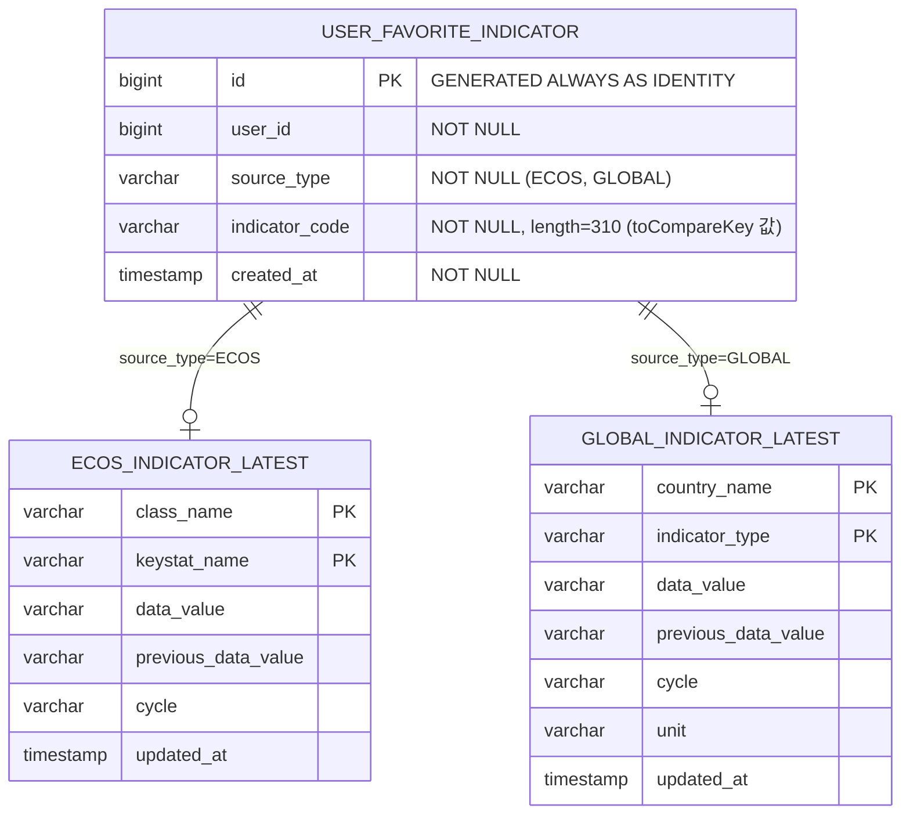

# feat: 관심 지표 대시보드

## Enhancement Summary

**Deepened on:** 2026-04-15
**Research agents used:** Architecture Strategist, Security Sentinel, Performance Oracle, Data Integrity Guardian, Code Simplicity Reviewer, Frontend Explorer, Learnings Researcher

### Key Improvements
1. **DB 수정**: MariaDB가 아닌 실제 사용 DB인 PostgreSQL 기준으로 설계 수정
2. **보안 강화**: userId를 JWT SecurityContext에서 추출 (기존 @RequestParam 패턴 탈피)
3. **API 설계 개선**: PUT toggle → POST/DELETE 분리 (REST 시맨틱 준수)
4. **구조 간소화**: DashboardService/Controller 제거, FavoriteController에서 enriched API 제공
5. **동시성 안전**: DELETE 반환값 기반 toggle + DataIntegrityViolationException 처리
6. **Phase 축소**: 6 Phase 17 Task → 4 Phase 12 Task

### New Considerations Discovered
- indicator_code 최대 길이가 302자 가능 (ECOS className 100 + keystatName 200 + "::" 2)
- 프론트엔드 debounce로 rapid toggle 방지 필요
- matchMedia 사용 (resize 이벤트 대신) - 기존 learnings 문서 참고

---

## Overview

사용자가 국내(ECOS)/글로벌 경제지표 페이지에서 개별 지표를 "관심 지표"로 등록하고, 메인 대시보드에서 국내/글로벌 영역별로 최신 업데이트 요약 + 관심 지표 카드 슬라이드를 확인할 수 있는 기능.

## Problem Statement / Motivation

현재 메인 대시보드는 4개 요약 카드(키워드, ECOS, 글로벌, 포트폴리오)만 있어 정보량이 부족하다. 사용자가 관심 있는 지표를 빠르게 확인하려면 매번 해당 페이지로 이동해야 한다. 관심 지표 시스템을 통해 대시보드에서 핵심 지표를 즉시 파악할 수 있도록 한다.

## Proposed Solution

### 1. 백엔드: 관심 지표 저장/관리

**도메인**: `favorite` (신규 최상위 도메인)

> **Architecture Insight**: `favorite`는 사용자 선호 도메인이므로 `economics` 내부가 아닌 독립 도메인으로 생성한다. 향후 뉴스/포트폴리오 등 다른 도메인의 관심 등록으로 확장 가능하다.

`user_favorite_indicator` 테이블을 신규 생성하고, 사용자별 관심 지표 CRUD API를 제공한다.

**지표 식별 방식**: 기존 `toCompareKey()` 패턴을 활용한다.
- ECOS: `className::keystatName` (예: `시장금리::국고채(3년)`)
- Global: `countryName::indicatorType` (예: `South Korea::GDP_ANNUAL_GROWTH_RATE`)

### 2. 백엔드: 관심 지표 Enriched 조회 API

`FavoriteIndicatorController`에서 관심 지표 목록 + Latest 데이터를 조합하여 반환한다. `FavoriteIndicatorService`가 기존 `EcosIndicatorService`, `GlobalIndicatorService`를 주입받아 데이터를 조합한다.

> **Architecture Insight**: cross-domain 참조는 application 계층에서 수행한다. `FavoriteIndicatorService`는 economics domain의 **application service**를 주입받으며, repository를 직접 접근하지 않는다.

> **Performance Insight**: 배치 조회 사용. 관심 지표를 sourceType별로 그룹핑한 뒤, ECOS/Global Latest 데이터를 각각 한 번의 쿼리로 조회 → in-memory join. N+1 방지.

### 3. 백엔드: 최근 업데이트 지표 조회 API

기존 `EcosIndicatorController`, `GlobalIndicatorController`에 최근 업데이트 지표 엔드포인트를 추가한다. `*Latest` 엔티티의 `updatedAt` 기준 최근 7일 내 업데이트된 지표를 조회한다.

> **중요 수정**: 현재 배치 로직은 매일 모든 지표의 `updatedAt`을 갱신하고 있어, 이 기준으로 "최근 변경 지표"를 구분할 수 없다. **cycle이 실제로 변경된 경우에만 `updatedAt`을 갱신**하도록 배치 로직을 수정한다. 이를 통해 `updatedAt`이 "진짜 데이터가 변한 시점"을 정확히 반영하게 된다.
>
> - `EcosIndicatorSaveService.fetchAndSave()`: `cycleChanged == true`인 경우만 `updatedAt = now()`, 그 외는 기존 `updatedAt` 유지
> - `GlobalIndicatorSaveService`: 동일 로직 적용

> **Performance Insight**: ECOS Latest ~100행, Global Latest ~1000행이므로 updatedAt 인덱스 불필요. LIMIT 절 추가로 결과셋 제한.

### 4. 프론트엔드: 관심 등록 버튼 + 대시보드 개편

ECOS/글로벌 지표 페이지의 각 지표 행에 ★ 토글 버튼을 추가한다. 메인 대시보드를 국내/글로벌 영역으로 개편하고, 관심 지표 카드 슬라이드를 추가한다.

## Technical Considerations

### 보안: userId 추출 방식

> **Security Insight (CRITICAL)**: 기존 `@RequestParam Long userId` 패턴은 IDOR 취약점이 존재한다. 새 기능에서는 JWT SecurityContext에서 userId를 추출하는 패턴을 적용한다.

```java
// FavoriteIndicatorController에서
Long userId = (Long) SecurityContextHolder.getContext()
    .getAuthentication().getPrincipal();
```

기존 엔드포인트의 IDOR 취약점은 별도 이슈로 분리하여 점진적 마이그레이션한다.

### API 설계: POST/DELETE 분리

> **Architecture Insight**: PUT toggle은 REST 시맨틱에 맞지 않는다. 결과가 현재 상태에 의존하므로 멱등성이 보장되지 않는다.

- `POST /api/favorites` — 관심 등록 (이미 존재하면 200 OK, 멱등)
- `DELETE /api/favorites?sourceType={type}&indicatorCode={code}` — 관심 해제
- `GET /api/favorites` — 관심 지표 목록 조회
- `GET /api/favorites/enriched` — 관심 지표 + Latest 데이터 통합 조회

### 지표 식별자 인코딩

`toCompareKey()` 패턴(`::` 구분자)을 그대로 사용한다. 이미 ECOS/Global 도메인 모델에서 검증된 패턴이다.
- `EcosIndicatorLatest.toCompareKey()` → `className::keystatName`
- `GlobalIndicatorLatest.toCompareKey()` → `countryName::indicatorType`

> **Data Integrity Insight**: `indicator_code` 최대 길이가 302자 가능 (className 100자 + `::` 2자 + keystatName 200자). `@Column(length = 310)`으로 설정한다.

### 컬럼명 충돌 방지

글로벌 지표의 `indicatorType`과 관심 지표의 소스 구분자가 충돌하지 않도록 소스 구분 컬럼은 `source_type`으로 명명한다.

### 동시성 처리

> **Data Integrity Insight**: SELECT-then-INSERT/DELETE 패턴은 race condition 위험이 있다.

Toggle 로직:
1. 먼저 DELETE 시도 → affected rows 확인
2. affected rows == 0이면 INSERT 시도
3. INSERT 시 `DataIntegrityViolationException` catch (동시 INSERT 경합 대응)

```java
@Transactional
public boolean toggle(Long userId, FavoriteIndicatorSourceType sourceType, String indicatorCode) {
    int deleted = repository.deleteByUserIdAndSourceTypeAndIndicatorCode(userId, sourceType, indicatorCode);
    if (deleted > 0) {
        return false; // 해제됨
    }
    try {
        repository.save(FavoriteIndicator.create(userId, sourceType, indicatorCode));
        return true; // 등록됨
    } catch (DataIntegrityViolationException e) {
        return true; // 동시 INSERT 경합 — 이미 등록됨
    }
}
```

### 대시보드 데이터 로딩

`HomeComponent.loadHomeSummary()`에서 `Promise.allSettled`로 병렬 호출하는 기존 패턴을 따른다. 2개 API 추가 호출:
- `GET /api/favorites/enriched` — 관심 지표 (ECOS/Global 모두 포함, 프론트에서 분리)
- `GET /api/economics/recent-updates` — 최근 업데이트 지표 (ECOS/Global 모두 포함)

> **Performance Insight**: 4개 별도 API 대신 2개 통합 API로 HTTP 오버헤드 절감.

### 관심 지표 상태 관리

앱 초기화 시 전체 관심 지표 목록을 한 번 로드하여 `Set`으로 캐싱한다. ECOS/글로벌 페이지에서 `indicatorCode`가 Set에 포함되는지로 ★ 상태를 판단한다.

> **Performance Insight**: ~200개 favorites, 각 ~100바이트 = ~20KB. 메모리 부담 없음.

### 프론트엔드: Optimistic UI + Debounce

> **Learnings Insight**: rapid toggle 시 race condition 방지를 위해 300ms debounce 적용.

```javascript
async toggleFavorite(sourceType, indicatorCode) {
    if (this.favorites._togglePending) return; // debounce
    this.favorites._togglePending = true;
    setTimeout(() => { this.favorites._togglePending = false; }, 300);

    const key = sourceType + '::' + indicatorCode;
    const wasFavorited = this.favorites._set.has(key);

    // Optimistic UI
    if (wasFavorited) {
        this.favorites._set.delete(key);
    } else {
        this.favorites._set.add(key);
    }

    try {
        if (wasFavorited) {
            await API.deleteFavorite(sourceType, indicatorCode);
        } else {
            await API.addFavorite(sourceType, indicatorCode);
        }
    } catch (e) {
        // Rollback
        if (wasFavorited) { this.favorites._set.add(key); }
        else { this.favorites._set.delete(key); }
    }
}
```

### 프론트엔드: 수평 스크롤

> **Learnings Insight**: matchMedia 사용 (resize 이벤트 대신), snap-x로 모바일 UX 향상.

```html
<div class="flex gap-4 overflow-x-auto pb-2 snap-x snap-mandatory">
    <template x-for="card in favoriteCards" :key="card.indicatorCode">
        <div class="snap-start flex-shrink-0 w-[280px] sm:w-[320px]">
            <!-- spread-card 렌더링 -->
        </div>
    </template>
</div>
```

좌우 화살표 버튼:
```javascript
scrollFavorites(direction, containerId) {
    const container = document.getElementById(containerId);
    const scrollAmount = 320;
    container.scrollBy({ left: direction * scrollAmount, behavior: 'smooth' });
}
```

### Orphaned Favorites

관심 등록한 지표가 Latest 테이블에서 삭제된 경우, enriched API에서 해당 지표는 Latest 데이터 없이 반환된다. 프론트엔드에서 "데이터 없음" 상태로 표시한다. 별도 정리 배치 불필요 (발생 빈도 극히 낮음).

### 파생 지표(스프레드) 관심 등록 범위

파생 지표(장단기 금리차, 유동성 비율 등)는 DB에 저장되지 않고 프론트엔드 JS에서 실시간 계산되는 값이므로, **관심 등록 대상에서 제외**한다. 기본 지표(기준금리, 국고채 등)만 관심 등록 가능하다. 파생 지표를 확인하려면 해당 카테고리의 기본 지표를 등록한 뒤 ECOS 페이지에서 확인하면 된다.

### 빈 상태 처리

- **관심 지표만 없는 경우**: 관심 지표 슬라이드 영역만 숨기고, 최신 업데이트 요약은 표시
- **최신 업데이트만 없는 경우**: 최신 업데이트 요약만 숨기고, 관심 지표 슬라이드는 표시
- **둘 다 없는 경우**: 해당 영역(국내 또는 글로벌) 자체를 숨김. 기존 4개 요약 카드만 표시. 데이터가 생기면 자동으로 나타남

## ERD



> **Data Integrity Notes**:
> - DB: PostgreSQL (application.yml 기준, MariaDB 아님)
> - FK 없음: 프로젝트 규칙 (ID 기반 참조만 허용) + 외부 API 수집 데이터의 natural key 특성
> - updated_at 불필요: INSERT/DELETE만 수행, UPDATE 없음
> - source_type: VARCHAR(20)로 저장, @Enumerated(EnumType.STRING) 사용

## Acceptance Criteria

### 백엔드

- [ ] `user_favorite_indicator` 테이블 생성 (Entity + ddl-auto:update, PostgreSQL)
- [ ] 관심 지표 등록 API: `POST /api/favorites` (이미 존재하면 200 OK)
- [ ] 관심 지표 해제 API: `DELETE /api/favorites?sourceType={type}&indicatorCode={code}`
- [ ] 관심 지표 목록 조회 API: `GET /api/favorites`
- [ ] 관심 지표 + Latest 데이터 통합 조회 API: `GET /api/favorites/enriched`
- [ ] 최근 업데이트 지표 조회 API: `GET /api/economics/recent-updates` (ECOS + Global 통합)
- [ ] `(user_id, source_type, indicator_code)` unique constraint로 중복 방지
- [ ] userId는 JWT SecurityContext에서 추출 (기존 @RequestParam 패턴 탈피)
- [ ] 배치 쿼리로 Latest 데이터 조회 (N+1 방지)
- [ ] 동시성 안전한 toggle 처리 (DELETE 반환값 + DataIntegrityViolationException catch)

### 프론트엔드

- [ ] ECOS 지표 테이블 행에 ★ 토글 버튼 추가
- [ ] 글로벌 지표 테이블 행에 ★ 토글 버튼 추가
- [ ] 앱 초기화 시 관심 지표 목록 로드 + Set 캐싱
- [ ] 메인 대시보드에 국내 경제지표 영역 추가 (최신 업데이트 요약 + 관심 지표 슬라이드)
- [ ] 메인 대시보드에 글로벌 경제지표 영역 추가 (최신 업데이트 요약 + 관심 지표 슬라이드)
- [ ] 관심 지표 카드는 기존 spread-card 형태 (지표명, 최신값, 전기대비, 단위)
- [ ] 관심 지표가 많을 때 좌우 스크롤 + 화살표 버튼 (snap-x)
- [ ] 관심 지표가 없으면 관심 지표 영역 숨김 (최신 업데이트 요약만 표시)
- [ ] 대시보드 카드에서 ★ 토글로 관심 해제 가능
- [ ] ★ 토글 시 Optimistic UI + 300ms debounce (즉시 반영, 실패 시 롤백)

## 작업 리스트

### Phase 1: 백엔드 - 관심 지표 도메인 + API

- [x] 1-1. `FavoriteIndicatorSourceType` enum 생성 (`ECOS`, `GLOBAL`) — `favorite/domain/model/`
- [x] 1-2. `FavoriteIndicator` 도메인 모델 생성 — `favorite/domain/model/`
- [x] 1-3. `FavoriteIndicatorRepository` 도메인 포트 생성 — `favorite/domain/repository/`
- [x] 1-4. `UserFavoriteIndicatorEntity` JPA 엔티티 + `UserFavoriteIndicatorJpaRepository` + `FavoriteIndicatorMapper` 생성 — `favorite/infrastructure/persistence/`
- [x] 1-5. `FavoriteIndicatorRepositoryImpl` 리포지토리 구현체 생성 — `favorite/infrastructure/persistence/`
- [x] 1-6. `FavoriteIndicatorService` 서비스 생성 (toggle, findByUserId, findEnrichedByUserId) — `favorite/application/`
- [x] 1-7. `FavoriteIndicatorController` + DTOs 생성 (POST, DELETE, GET, GET enriched) — `favorite/presentation/`

### Phase 2: 백엔드 - 최근 업데이트 API + 배치 로직 수정

- [x] 2-1. `EcosIndicatorSaveService.fetchAndSave()` 수정: cycle 변경 시에만 `updatedAt` 갱신 (기존: 매번 갱신)
- [x] 2-2. `GlobalIndicatorSaveService` 동일 로직 수정: cycle 변경 시에만 `updatedAt` 갱신
- [x] 2-3. `EcosIndicatorService`에 최근 업데이트 지표 조회 메서드 추가 (updatedAt DESC, LIMIT)
- [x] 2-4. `GlobalIndicatorService`에 최근 업데이트 지표 조회 메서드 추가
- [x] 2-5. 기존 컨트롤러에 최근 업데이트 엔드포인트 추가 또는 통합 엔드포인트 생성

### Phase 3: 프론트엔드 - ★ 토글 + 상태 관리

- [x] 3-1. `api.js`에 관심 지표 API 메서드 추가 (addFavorite, deleteFavorite, getFavorites, getEnrichedFavorites)
- [x] 3-2. `app.js`에 `FavoriteComponent` 추가 (관심 지표 Set 캐싱 + toggleFavorite 메서드 + debounce)
- [x] 3-3. `index.html` ECOS/글로벌 테이블 행에 ★ 버튼 HTML 추가

### Phase 4: 프론트엔드 - 대시보드 개편

- [x] 4-1. `home.js` HomeComponent에 enriched favorites + recent updates 로드 로직 추가
- [x] 4-2. `index.html` 대시보드 HTML 추가 (국내/글로벌 영역, 요약 섹션, 관심 지표 슬라이드, 화살표 버튼)

## 참고 파일 (기존 패턴)

### 엔티티 참고
- `UserKeywordEntity.java` — 사용자 연관 엔티티 패턴 (userId, uniqueConstraint, @PrePersist)

### 도메인 레이어 참고
- `EcosIndicatorLatest.java` — 도메인 모델 패턴 (@Getter, toCompareKey())
- `EcosIndicatorLatestRepository.java` — 도메인 포트 패턴

### 인프라 레이어 참고
- `EcosIndicatorLatestRepositoryImpl.java` — 리포지토리 구현체 패턴
- `EcosIndicatorLatestMapper.java` — 매퍼 패턴

### 프레젠테이션 참고
- `EcosIndicatorController.java` — 컨트롤러 패턴
- `IndicatorResponse.java` — DTO record 패턴

### 프론트엔드 참고
- `home.js` — HomeComponent 패턴
- `ecos.js` — spread-card 렌더링 패턴, generation counter 패턴
- `api.js` — API 클라이언트 패턴
- `custom.css` — spread-card CSS (status-safe/normal/caution/danger 색상)

### Spread-card HTML 구조 (index.html:461-531)
```html
<div class="spread-card rounded-xl p-5 shadow-sm" :class="'status-' + getSpreadStatus(sp)">
    <div class="mb-2">
        <span class="text-sm font-semibold text-gray-700" x-text="sp.name"></span>
        <p class="text-[11px] text-gray-400 mt-0.5" x-text="sp.sub"></p>
    </div>
    <div class="flex items-end justify-between mb-3">
        <p class="text-2xl font-bold font-mono-num leading-none" :class="getValueColorClass(sp)">
            <span x-text="sp.value"></span>
            <span class="text-sm text-gray-400" x-text="sp.unit || '%p'"></span>
        </p>
        <span class="status-badge" :class="'badge-' + getSpreadStatus(sp)" x-text="sp.ref.label"></span>
    </div>
    <!-- gauge-bar, description 등 -->
</div>
```

## Sources & References

- **Origin brainstorm:** [docs/brainstorms/2026-04-15-favorite-indicator-dashboard-brainstorm.md](docs/brainstorms/2026-04-15-favorite-indicator-dashboard-brainstorm.md)
  - 용어: "관심 지표", 서버 DB 저장, 개별 지표 단위, spread-card 형태
- **Institutional learning:** `docs/solutions/architecture-patterns/global-indicator-history-mirroring.md` — toCompareKey 패턴, ddl-auto:update 전략
- **Institutional learning:** `docs/solutions/architecture-patterns/ecos-timeseries-chart-visualization.md` — Alpine.js generation counter, Chart.js enumerable:false 패턴
- **Institutional learning:** `docs/solutions/architecture-patterns/deposit-history-n-plus-one-batch-pattern.md` — 배치 쿼리 패턴, Bean Validation
- **Institutional learning:** `docs/solutions/ui-bugs/responsive-design-tailwind-alpine.md` — matchMedia, snap-x, 100dvh 패턴