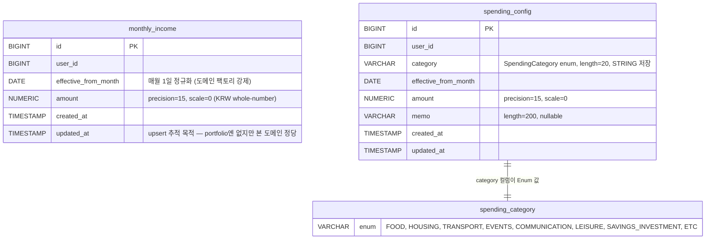

# 월급 사용 비율(Salary Usage Ratio) 신규 탭

## Overview

신규 `salary` 도메인 모듈을 추가하여, 태형님이 월 실수령액과 8개 고정 카테고리(식비/주거/교통/경조사/통신/여가/저축·투자/기타)별 지출을 **변경 지점(Effective Date)만** 입력하면 이전 값을 자동 상속하여 도넛/바/라인 차트로 시각화하는 탭을 구축한다.

> **브레인스토밍 원본**: [2026-04-16-salary-usage-ratio-brainstorm.md](../brainstorms/2026-04-16-salary-usage-ratio-brainstorm.md) — 본 계획의 모든 주요 결정(데이터 모델·카테고리·UX·API)은 브레인스토밍에서 확정되었다.

## Enhancement Summary

**심화 일자**: 2026-04-16
**활용한 리뷰 에이전트**: best-practices-researcher, framework-docs-researcher(Spring/JPA, Chart.js/Alpine.js), performance-oracle, architecture-strategist, code-simplicity-reviewer, data-integrity-guardian, pattern-recognition-specialist

### 핵심 개선 사항 (초안 대비 차이점)

1. **Service 3개 → 2개로 축소**: `SalaryService`(조회+upsert+delete 통합) + `SalaryTrendService`(12개월 롤링). portfolio는 CQRS가 아닌 책임축 기준 분리이므로 일관성 확보. CQRS는 현 규모에서 과투자.
2. **`mapper/` 패키지 신설**: ARCHITECTURE.md §4 명문 규칙. portfolio의 `PortfolioItemMapper.java`와 동일한 패턴으로 Entity↔Domain 변환을 RepositoryImpl에서 분리.
3. **`MonthlyUsageSnapshot` 제거**: DTO(`MonthlySalaryResponse`)와 필드 중복. 도메인 불변식이 없어 값객체 정당성 부족. 대신 `MonthlyIncome.calculateSavingsRatio()`, `SpendingConfig.isSameAmountAs()` 같은 도메인 메서드로 응집도 강화.
4. **BigDecimal scale `2 → 0`**: KRW는 ISO 4217 소수점 0자리 화폐. `precision=15, scale=0`으로 변경. 비율 계산(저축율)은 응답 DTO에서만 `scale=4, RoundingMode.HALF_UP`.
5. **상속 쿼리 `ROW_NUMBER()` → `DISTINCT ON (category)`**: PostgreSQL 전용. 가독성·성능 동시 개선, 인덱스 `(user_id, category, effective_from_month DESC)` 복합으로 조정.
6. **응답 DTO는 `record`가 아닌 `@Getter class + static from()` 팩토리**: portfolio 관례(`DepositHistoryResponse.java`)와 일관.
7. **프론트 차트 인스턴스 관리 방식 교체**: `_donutInstance`/`_barInstance`/`_lineInstance` 3개 필드 + `Object.defineProperty({enumerable:false})` 제거 → `Chart.getChart(canvas)?.destroy()` API 활용. Alpine proxy 충돌 원천 차단.
8. **온보딩 빈 상태는 `<template x-if>`**: `x-show`와 달리 DOM에서 canvas를 제거하므로 초기화 race 근본 차단.
9. **동시성 방어 구체화**: Isolation은 `READ COMMITTED` 유지 + `DataIntegrityViolationException → 409` 핸들러를 `GlobalExceptionHandler`에 추가. `@Transactional(readOnly=true)` Query 서비스에 적용.
10. **Phase 5개 → 3개로 축약**: 백엔드(도메인+영속+API 통합) / 프론트 / 수동 QA.

### 기각된 심화 권고 (근거)

- **`INSERT ... ON CONFLICT DO UPDATE` 네이티브 UPSERT** (by best-practices-researcher): 기각. 비즈니스 룰("상속값과 동일하면 noop, 다르면 새 row insert")이 `ON CONFLICT UPDATE`(기존 row의 amount를 덮어쓰기)의 의미와 다르므로 Java 레벨 3단계 처리가 정답 (by framework-docs-researcher 근거 일치).
- **`generate_series + LATERAL` 12개월 쿼리**: 기각. 데이터 규모(사용자당 수십~수백 레코드)에서 앱 메모리 롤링 대비 이득 미미. 테스트 작성도 쉬움.
- **`SERIALIZABLE` 격리 승격**: 기각. `UNIQUE` 제약이 최후 방어선이므로 `READ COMMITTED`로 충분. 격리를 올려도 unique 위반은 그대로 발생.
- **Soft-delete(`deleted_at`)**: 기각. 계획의 "DELETE = 이전 값 복귀" UX와 부합하지 않으며 상속 쿼리에 필터 추가 부담.

## Problem Statement

1. 태형님은 고정성 지출(주거/통신)을 매월 같은 값으로 반복 입력하지 않고, **바뀌는 달만 기록**하여 이전 값을 상속시키는 UX를 원한다. (see brainstorm: "What We're Building § 데이터 입력 모델")
2. 현재 프로젝트에는 가계부/지출 관리 도메인이 존재하지 않아, 월급 대비 지출 비율·저축율·12개월 추이를 한 화면에서 확인할 수 없다.
3. JSON 컬럼 기반 설계는 정규화 원칙과 PostgreSQL 쿼리 용이성을 해치므로, 관계형 설계(Entity 2개 + 유니크 제약)가 필요하다.

## Proposed Solution

**변경 지점 기반 Effective Date 모델** — 바뀐 달만 레코드를 저장하고, 조회 시 `effectiveFromMonth <= 요청월`인 레코드 중 카테고리별 가장 최근 행을 PostgreSQL `DISTINCT ON`으로 상속한다.

- **신규 도메인**: `salary` (portfolio 도메인과 동일한 DDD 4계층 구조, `mapper/` 서브패키지 포함)
- **Entity 2개**:
  - `MonthlyIncome` (userId, effectiveFromMonth, amount)
  - `SpendingConfig` (userId, category, effectiveFromMonth, amount, memo)
- **Enum**: `SpendingCategory` (8개 고정값, 이름 freeze 규약)
- **조회**: PostgreSQL `DISTINCT ON (category) ... ORDER BY category, effective_from_month DESC`
- **12개월 추이**: 앱 메모리 롤링 포워드(카테고리별 정렬 후 순차 캐시)
- **프론트**: 기존 Alpine.js + Chart.js 패턴 유지. `static/js/components/salary.js` 신설, `static/js/api.js`에 API 래퍼 추가.

## Technical Approach

### Architecture (DDD 4계층)

기존 `portfolio` 도메인 패턴을 복제하되, **서비스 분해와 `mapper/` 패키지**는 아키텍처 리뷰 결과에 따라 조정했다. 의존성 방향은 `presentation → application → domain ← infrastructure` (see: `ARCHITECTURE.md`).

```
src/main/java/com/thlee/stock/market/stockmarket/salary/
├── domain/
│   ├── model/
│   │   ├── MonthlyIncome.java          # 도메인 객체 (@Getter, 팩토리, isSameAmountAs, calculateSavingsRatio)
│   │   ├── SpendingConfig.java         # 도메인 객체 (@Getter, 팩토리, isSameAmountAs)
│   │   └── enums/
│   │       └── SpendingCategory.java   # FOOD, HOUSING, ..., ETC (8개) — 이름 freeze
│   └── repository/
│       ├── MonthlyIncomeRepository.java
│       └── SpendingConfigRepository.java
├── application/
│   ├── SalaryService.java              # 조회 + upsert + delete 통합 (readOnly 메서드와 @Transactional 메서드 혼재)
│   ├── SalaryTrendService.java         # 12개월 롤링 포워드 (readOnly)
│   └── dto/
│       ├── MonthlySalaryResponse.java  # @Getter class + static from(...)
│       ├── SpendingLineResponse.java
│       ├── SalaryTrendResponse.java
│       └── MonthDropdownResponse.java
├── infrastructure/
│   ├── config/
│   │   └── YearMonthConverterConfig.java   # Converter<String, YearMonth> Bean
│   └── persistence/
│       ├── MonthlyIncomeEntity.java
│       ├── SpendingConfigEntity.java
│       ├── MonthlyIncomeJpaRepository.java
│       ├── SpendingConfigJpaRepository.java
│       ├── MonthlyIncomeRepositoryImpl.java
│       ├── SpendingConfigRepositoryImpl.java
│       └── mapper/
│           ├── MonthlyIncomeMapper.java    # Entity ↔ Domain 변환 (ARCHITECTURE.md §4 규칙)
│           └── SpendingConfigMapper.java
└── presentation/
    ├── SalaryController.java
    └── dto/
        ├── UpsertIncomeRequest.java    # @Getter class (record 대신 portfolio 관례 맞춤)
        └── UpsertSpendingRequest.java
```

> 참조: `portfolio/` 전체 (`DepositHistoryEntity.java:10-55`, `DepositHistory.java:1-60`, `DepositHistoryRepositoryImpl.java:12-68`, `PortfolioController.java:22-46`, `portfolio/infrastructure/persistence/mapper/PortfolioItemMapper.java`).

**서비스 분리 근거** (architecture-strategist): portfolio는 `PortfolioService`(CRUD+조회) / `PortfolioEvaluationService`(평가) / `PortfolioAllocationService`(집계) 형태로 **책임 축** 기준 분리이며 CQRS 아님. `SalaryService`(CRUD+조회)와 `SalaryTrendService`(12개월 집계) 2개로 대칭 유지.

### Database Schema (JPA `ddl-auto: update`로 자동 생성)

프로젝트는 **Flyway 미사용, `ddl-auto: update`** 운영 (see: `application-dev.yml:22`). Entity 선언만으로 테이블 자동 생성.

**안전장치** (data-integrity-guardian 권고):
- 운영 반영 전 일시적으로 `spring.jpa.hibernate.ddl-auto=validate`로 전환하여 Hibernate가 발행할 ALTER 문을 로그로 선확인 → 수동 검토 후 `update`로 복귀. Documentation Plan에 절차 기재.



**유니크 제약 & 인덱스**:
- `monthly_income`: `UNIQUE(user_id, effective_from_month)` + `INDEX(user_id, effective_from_month)`
- `spending_config`: `UNIQUE(user_id, category, effective_from_month)` + **복합 인덱스 `(user_id, category, effective_from_month DESC)`** — `DISTINCT ON` 쿼리를 Index Only Scan으로 처리하기 위함.
- `effective_from_month`: DB는 `DATE`로 저장, **도메인 팩토리가 항상 해당 월의 1일(YYYY-MM-01)로 정규화**.
- (옵션) Hibernate `@Check(constraints = "EXTRACT(DAY FROM effective_from_month) = 1")` 추가 시 수동 SQL UPDATE 사고 방어. Entity 작성 단계에서 승인 여부 결정.

### Domain Model 예시

도메인 메서드로 응집도 강화 (architecture-strategist 권고: Anemic Model 방지, "동일성 비교"·"저축율 계산" 같은 규칙을 도메인으로 끌어올림).

```java
// salary/domain/model/MonthlyIncome.java
@Getter
public class MonthlyIncome {
    private static final int SAVINGS_RATIO_SCALE = 4;                 // 응답 DTO 전용
    private static final RoundingMode RATIO_ROUNDING = RoundingMode.HALF_UP;

    private Long id;
    private Long userId;
    private YearMonth effectiveFromMonth;     // 도메인은 YearMonth 전용
    private BigDecimal amount;
    private LocalDateTime createdAt;
    private LocalDateTime updatedAt;

    public MonthlyIncome(Long id, Long userId, YearMonth effectiveFromMonth,
                         BigDecimal amount, LocalDateTime createdAt, LocalDateTime updatedAt) { ... }

    public static MonthlyIncome create(Long userId, YearMonth effectiveFromMonth,
                                       YearMonth referenceMonth, BigDecimal amount) {
        validateAmount(amount);
        requireNotFuture(effectiveFromMonth, referenceMonth);    // 테스트 가능성: referenceMonth 주입
        return new MonthlyIncome(null, userId, effectiveFromMonth, amount,
                                 LocalDateTime.now(), LocalDateTime.now());
    }

    public void updateAmount(BigDecimal amount) {
        validateAmount(amount);
        this.amount = amount;
        this.updatedAt = LocalDateTime.now();
    }

    /** upsert noop 판정용 도메인 규칙 */
    public boolean isSameAmountAs(BigDecimal other) {
        return other != null && this.amount.compareTo(other) == 0;
    }

    /** 저축율 = savingsAmount / income. income==0 이면 null. */
    public BigDecimal calculateSavingsRatio(BigDecimal savingsAmount) {
        if (this.amount.signum() == 0) return null;
        return savingsAmount.divide(this.amount, SAVINGS_RATIO_SCALE, RATIO_ROUNDING);
    }

    private static void validateAmount(BigDecimal amount) {
        if (amount == null || amount.signum() < 0) {
            throw new IllegalArgumentException("금액은 0 이상이어야 합니다.");
        }
    }
}
```

- domain 레이어는 **Spring/JPA 의존 금지** (see: `ARCHITECTURE.md:122-123`)
- `SpendingConfig`도 대칭적으로 `isSameAmountAs(BigDecimal, String memo)` 도메인 메서드 보유
- `YearMonth referenceMonth` 파라미터 주입으로 `LocalDate.now()` 직접 호출 배제(테스트 가능성)

### Entity 매핑 (infrastructure)

```java
// salary/infrastructure/persistence/MonthlyIncomeEntity.java
@Entity
@Table(
    name = "monthly_income",
    uniqueConstraints = {
        @UniqueConstraint(name = "uk_monthly_income_user_month",
                          columnNames = {"user_id", "effective_from_month"})
    },
    indexes = {
        @Index(name = "idx_monthly_income_user_month",
               columnList = "user_id, effective_from_month")
    }
)
@Getter
public class MonthlyIncomeEntity {
    @Id @GeneratedValue(strategy = GenerationType.IDENTITY) private Long id;
    @Column(name = "user_id", nullable = false) private Long userId;
    @Column(name = "effective_from_month", nullable = false) private LocalDate effectiveFromMonth;
    @Column(name = "amount", nullable = false, precision = 15, scale = 0) private BigDecimal amount;
    @Column(name = "created_at", nullable = false, updatable = false) private LocalDateTime createdAt;
    @Column(name = "updated_at", nullable = false) private LocalDateTime updatedAt;
    protected MonthlyIncomeEntity() {}
    public MonthlyIncomeEntity(Long id, Long userId, LocalDate effectiveFromMonth,
                               BigDecimal amount, LocalDateTime createdAt, LocalDateTime updatedAt) { ... }
}
```

`SpendingConfigEntity`의 `category`는 `@Enumerated(EnumType.STRING) @Column(name="category", nullable=false, length=20)`로 매핑. 인덱스는 `columnList = "user_id, category, effective_from_month DESC"`로 `DISTINCT ON` 쿼리 최적화.

**`YearMonth ↔ LocalDate` 변환 단일 지점** (data-integrity-guardian): 변환은 `mapper/` 패키지에서만 수행. Service/Controller/Repository 인터페이스는 전부 `YearMonth`로 통일. `LocalDate.withDayOfMonth(1)`·`YearMonth.from(localDate)` 양방향.

### 상속 조회: `DISTINCT ON` (변경됨)

초안의 `ROW_NUMBER() OVER (PARTITION BY category ORDER BY effective_from_month DESC)`를 PostgreSQL 관용 `DISTINCT ON (category)`로 교체. 가독성·성능 동시 개선.

```java
// salary/infrastructure/persistence/SpendingConfigJpaRepository.java
@Query(value = """
    SELECT DISTINCT ON (s.category)
           s.id, s.user_id, s.category, s.effective_from_month,
           s.amount, s.memo, s.created_at, s.updated_at
    FROM spending_config s
    WHERE s.user_id = :userId
      AND s.effective_from_month <= :targetMonth
    ORDER BY s.category, s.effective_from_month DESC
    """, nativeQuery = true)
List<SpendingConfigEntity> findEffectiveAsOf(@Param("userId") Long userId,
                                             @Param("targetMonth") LocalDate targetMonth);
```

**12개월 추이용 쿼리** — 하한을 명시하여 불필요 스캔 방지 (performance-oracle 권고):

```java
// 시작월 기준 직전 상속 레코드 + [startMonth, endMonth] 범위를 동시 반환
@Query("""
    SELECT s FROM SpendingConfigEntity s
    WHERE s.userId = :userId
      AND s.effectiveFromMonth <= :endMonth
    ORDER BY s.category ASC, s.effectiveFromMonth ASC
    """)
List<SpendingConfigEntity> findAllUpTo(@Param("userId") Long userId,
                                       @Param("endMonth") LocalDate endMonth);
```

`SalaryTrendService`에서 카테고리별 롤링 포워드로 12개월 각각의 유효값을 O(N) 선형 스캔으로 계산.

**`findDistinctMonths`는 JPQL 파생쿼리**(code-simplicity 권고, 네이티브 불필요):

```java
@Query("SELECT DISTINCT m.effectiveFromMonth FROM MonthlyIncomeEntity m " +
       "WHERE m.userId = :userId ORDER BY m.effectiveFromMonth DESC")
List<LocalDate> findDistinctMonths(@Param("userId") Long userId);
// SpendingConfig 측도 대칭 + Service에서 set union
```

### API 설계

| Method | URL | 설명 |
|--------|-----|------|
| `GET` | `/api/salary/monthly/{yearMonth}?userId={id}` | 해당 월의 유효 월급 + 카테고리별 지출(상속 적용) |
| `GET` | `/api/salary/trend?userId={id}&months=12` | 최근 12개월 추이 (월급/총지출/저축율 3개 라인) |
| `GET` | `/api/salary/months?userId={id}` | 변경 레코드가 존재하는 월 목록 (드롭다운 기준) |
| `PUT` | `/api/salary/income/{yearMonth}?userId={id}` | 해당 월 기점 월급 upsert (상속값과 동일 시 `200 noop`) |
| `PUT` | `/api/salary/spending/{yearMonth}/{category}?userId={id}` | 해당 월 기점 카테고리 upsert |
| `DELETE` | `/api/salary/income/{yearMonth}?userId={id}` | 해당 월 월급 변경 레코드 제거 (이전 값 복귀) |
| `DELETE` | `/api/salary/spending/{yearMonth}/{category}?userId={id}` | 해당 월 카테고리 변경 레코드 제거 |

**컨트롤러 컨벤션 (portfolio 복제)**:
- `@RestController @RequestMapping("/api/salary") @RequiredArgsConstructor`
- `userId`는 `@RequestParam Long userId` (세션 아님 — see: `PortfolioController.java:34`). **권한 검증 공백**: portfolio 관례를 승계하되, Security 대조는 추후 보안 작업 스코프. 계획 범위 밖임을 코드 주석에 명시.
- `yearMonth` 경로변수는 **`@DateTimeFormat(pattern="yyyy-MM")`** 또는 **전역 `Converter<String, YearMonth>` Bean** — 본 계획은 **후자(Bean) 채택** (config/ 패키지에 등록, 모든 컨트롤러에서 애노테이션 불필요). Phase 1에 **필수** 작업으로 격상.
- 공통 응답 래퍼 없음, `ResponseEntity<T>` 직접 반환
- `DELETE`는 `ResponseEntity.noContent().build()`
- 도메인 `IllegalArgumentException` → `GlobalExceptionHandler`가 400 매핑 (기존).
- **`DataIntegrityViolationException → 409 Conflict` 핸들러를 `GlobalExceptionHandler`에 추가** (현재 핸들러 없음 — pattern-recognition 확인). Phase 1에 포함.

**응답 DTO는 `@Getter class + static from()` 팩토리** (portfolio 관례, `DepositHistoryResponse.java` 기준 — pattern-recognition):

```java
@Getter
public class MonthlySalaryResponse {
    private final YearMonth yearMonth;
    private final BigDecimal income;
    private final List<SpendingLineResponse> spendings;
    private final BigDecimal totalSpending;
    private final BigDecimal remaining;
    private final BigDecimal savingsRatio;        // scale=4, null if income==0
    private final Map<SpendingCategory, YearMonth> inheritedFromMonth;   // 상속 출처 추적

    private MonthlySalaryResponse(...) { ... }

    public static MonthlySalaryResponse from(MonthlyIncome income,
                                             List<SpendingConfig> spendings, YearMonth target) { ... }
}
```

**Jackson 설정** (`application.yml`, framework-docs-researcher):
```yaml
spring:
  jackson:
    generator:
      write-bigdecimal-as-plain: true          # 정밀도 손실 방지
    serialization:
      write-dates-as-timestamps: false         # YearMonth는 "2026-04" 문자열
```

**`@Transactional` 경계** (framework-docs-researcher, architecture-strategist):
- `SalaryService`의 **조회 메서드**: `@Transactional(readOnly = true)` 메서드 레벨 — Hibernate FlushMode.MANUAL 최적화.
- `SalaryService`의 **upsert/delete 메서드**: 기본 `@Transactional` — "조회(상속값)→동일성 비교→insert" 3단계 한 트랜잭션. Isolation은 **`READ COMMITTED` 유지**(기본).
- `SalaryTrendService`: 클래스 레벨 `@Transactional(readOnly = true)`.

### 중복 레코드 방지 정책 (Java 레벨 3단계, DB UPSERT 사용 안 함)

**`PUT` 흐름**:
1. 해당 월(`targetMonth`)에 이미 변경 레코드가 있는가? (Repository 단건 조회)
   - YES → `updateAmount()` 도메인 메서드로 수정 + 저장. `200 OK` 반환.
2. NO → 상속값 계산(`findEffectiveAsOf`로 해당 월 시점 유효값).
3. `monthlyIncome.isSameAmountAs(requestedAmount)` 또는 `spendingConfig.isSameAmountAs(...)` 판정.
   - 동일 → **레코드 생성 없이** `200 { status: "noop", inheritedFromMonth: "2026-01" }` 반환.
   - 다름 → 새 레코드 insert. `200 OK` (또는 `201 Created`) 반환.

**`ON CONFLICT DO UPDATE` 미사용 근거**: 비즈니스 룰이 "상속값과 동일 ⇒ noop, 다름 ⇒ 새 row insert(기존 row 수정 아님)"이므로 `ON CONFLICT UPDATE`(기존 row의 amount 덮어쓰기)와 의미가 다름. JPQL도 `ON CONFLICT`를 파싱하지 못함(`BadJpqlGrammarException`).

**동시 PUT 레이스 방어**:
- 최후 방어선: `UNIQUE(user_id[, category], effective_from_month)` 제약.
- Service에서 `DataIntegrityViolationException` catch → **1회 재조회 후 noop 판정 재시도 → 여전히 충돌 시 `409 Conflict` 반환**.
- Spring Retry 도입은 YAGNI(단일 재시도로 충분).

### 프론트엔드 구조

#### 탭 통합 (`static/js/app.js`)

4곳을 수정 (pattern-recognition 확인 — `app.js:76`의 파생 `validPages`는 자동 반영):

```js
// 1) validPages에 'salary' 추가 (app.js:7)
const validPages = ['home', 'keywords', 'ecos', 'global', 'portfolio', 'salary'];

// 2) menus 배열에 항목 추가 (app.js:11-17)
{ key: 'salary', label: '월급 사용 비율', icon: 'wallet' }

// 3) 컴포넌트 통합 (app.js:27-36)
...SalaryComponent,

// 4) navigateTo 핸들러 (app.js:137-159)
if (this.currentPage === 'salary' && page !== 'salary') {
    this.destroySalaryCharts();   // 내부에서 Chart.getChart(canvas)?.destroy() 사용
}
case 'salary':
    await this.loadSalaryInitial();
    break;
```

**사이드바 SVG 아이콘** (pattern-recognition 중대 지적):
- `index.html`의 **모바일 드로어(82-96)** 와 **데스크탑 사이드바(129-143)** 2곳 모두에 `<template x-if="menu.icon === 'wallet'">` 인라인 SVG 블록 추가. 한 곳만 추가하면 해당 뷰포트에서 아이콘 미표시.
- `wallet` SVG는 Heroicons 24px outline 셋에서 채용(또는 기존 아이콘 중 `trending-up` 재사용 검토 — code-simplicity 권고).

#### 신규 컴포넌트 (`static/js/components/salary.js`)

```js
const SalaryComponent = {
    salary: {
        currentMonth: null,          // YearMonth 문자열 "2026-04"
        monthlyView: null,
        availableMonths: [],
        trend: null,
        editingIncome: null,
        editingSpending: { FOOD: null, HOUSING: null, ... },
        _abortController: null,
        _loadGeneration: 0,
        // Chart 인스턴스 필드 제거 — Chart.getChart($refs.xxx)로 대체
    },

    // 파생 값은 getter로 제공 (Alpine 공식 권장)
    get salaryRemainingDisplay() { ... },
    get salaryRatioClass() { return this.salary.monthlyView?.savingsRatio < 0 ? 'text-red-600' : 'text-emerald-600'; },

    async loadSalaryInitial() { ... },
    async loadMonthly(yearMonth) {
        this.salary._abortController?.abort();
        this.salary._abortController = new AbortController();
        const gen = ++this.salary._loadGeneration;
        try {
            const data = await API.getSalaryMonthly(yearMonth, { signal: this.salary._abortController.signal });
            if (gen !== this.salary._loadGeneration) return;       // stale 응답 폐기
            this.salary.monthlyView = data;
            this.$nextTick(() => { this.renderDonutChart(); this.renderBarChart(); });
        } catch (e) { if (e.name !== 'AbortError') throw e; }
    },
    async loadTrend() { ... },
    async upsertIncome(yearMonth, amount) { ... },
    async upsertSpending(yearMonth, category, amount, memo) { ... },
    async deleteIncome(yearMonth) { ... },
    async deleteSpending(yearMonth, category) { ... },
    goPrevMonth() { ... },
    goNextMonth() { ... },
    openNewMonthDialog() { ... },
    renderDonutChart() { ... },
    renderBarChart() { ... },
    renderTrendChart() { ... },
    destroySalaryCharts() {
        ['donutCanvas','barCanvas','lineCanvas'].forEach((ref) => {
            const canvas = this.$refs[ref];
            if (canvas) Chart.getChart(canvas)?.destroy();
        });
    }
};
```

**API 래퍼**: `static/js/api.js`에 `API.getSalaryMonthly`, `API.getSalaryTrend`, `API.getSalaryMonths`, `API.upsertIncome`, `API.upsertSpending`, `API.deleteIncome`, `API.deleteSpending` 추가 (pattern-recognition 중대 누락 보완).

#### Chart.js 4 모범 사례 (framework-docs-researcher 기반)

1. **인스턴스 관리**: `Chart.getChart(canvas)?.destroy()` 패턴 일관 적용. `_xxxInstance` 필드 보관 + `Object.defineProperty enumerable:false` 트릭 제거 → Alpine reactive proxy 충돌 원천 회피.

2. **도넛 차트 (월급 분배)**:
   - 카테고리 8개 + "잔여" 세그먼트를 같은 데이터셋에 배치. `backgroundColor`는 카테고리별 Tailwind 500 tier 8색 + 잔여는 중립색(`rgba(156,163,175,0.35)`).
   - **초과 지출(잔여 < 0) 3-step 처리**: (a) 잔여 세그먼트를 데이터에서 제외(Chart.js 도넛은 음수 미지원), (b) 카테고리 색을 빨강 톤 오버라이드, (c) 도넛 중앙/상단에 `₩X 초과` 배너를 Alpine으로 별도 렌더.
   - Tooltip callback에서 `% + 금액` 동시 표기 (`ctx.dataset.data.reduce(...)`로 합계 안전 계산, 내부 API 비의존).

3. **바 차트**:
   - `scales.y.ticks.callback`에서 `Intl.NumberFormat('ko-KR', {notation:'compact'})`로 축은 "1만/1억" 단위, 툴팁은 `style:'currency', currency:'KRW'` 분리.

4. **라인 차트 (12개월 추이)**:
   - **듀얼 Y축**: `y`(좌, 금액) + `y1`(우, %, `grid.drawOnChartArea:false`). 저축율 데이터셋에 `yAxisID:'y1'`, `ticks.callback:(v)=>v+'%'`.
   - **음수 구간 빨강**: `segment.borderColor: (c) => c.p1.parsed.y < 0 ? '#dc2626' : undefined`.

5. **반응형**: 부모 컨테이너 `relative h-80` 고정 + `maintainAspectRatio:false`. Chart.js가 ResizeObserver로 자동 감지, 사이드바 토글 시 문제 발생하면 `Chart.getChart(canvas)?.resize()` 수동 호출.

6. **성능**: `animation: false` 유지. `parsing: false`는 포인트 12개 규모에 이득 미미 → 미적용.

7. **접근성**: `<canvas aria-label="..." role="img">` + 내부 fallback `<p>` 한국어 요약.

#### HTML (`static/index.html`) 구조

```html
<section x-show="currentPage === 'salary'" x-cloak>
    <!-- 월 선택 UI -->
    <div class="flex items-center gap-2">
        <button @click="goPrevMonth()">←</button>
        <select x-model="salary.currentMonth" @change="loadMonthly(salary.currentMonth)">
            <template x-for="m in salary.availableMonths"><option :value="m" x-text="m"></option></template>
        </select>
        <button @click="goNextMonth()">→</button>
        <button @click="openNewMonthDialog()">+ 새 월 기록</button>
    </div>

    <!-- 온보딩 빈 상태 (x-if, canvas DOM 제거) -->
    <template x-if="!salary.monthlyView || salary.monthlyView.income == null">
        <div class="empty-state">
            <p>월 실수령액을 먼저 입력해주세요.</p>
            <button @click="editingIncome = 0">월 실수령액 입력</button>
        </div>
    </template>

    <!-- 정상 상태 (x-if로 canvas mount) -->
    <template x-if="salary.monthlyView && salary.monthlyView.income != null">
        <div class="grid grid-cols-[minmax(0,1fr)_minmax(0,1fr)] gap-4">
            <section class="input-panel"><!-- 월급 + 8개 카테고리 입력 --></section>
            <section class="chart-panel">
                <div class="relative h-80"><canvas x-ref="donutCanvas"></canvas></div>
                <div class="relative h-80 mt-4"><canvas x-ref="barCanvas"></canvas></div>
            </section>
            <section class="col-span-2 relative h-96">
                <canvas x-ref="lineCanvas"></canvas>
            </section>
        </div>
    </template>
</section>
```

**초과 사용/음수 저축율**: Tailwind `text-red-600 font-semibold`로 강조.

## Implementation Phases

> **참고**: CLAUDE.md 규칙에 따라 Entity 2개는 **사전 승인 후** 작성. 테스트 코드는 명시적 요청 시만.

### Phase 1: 백엔드 전체 (도메인 + 영속성 + API)

- [ ] **[승인 대기]** `SpendingCategory` Enum 정의(8개 + 이름 freeze Javadoc) + Entity 2종 스키마 최종안 승인
- [x] `salary/domain/model/enums/SpendingCategory.java`
- [x] `salary/domain/model/MonthlyIncome.java` (팩토리 + `updateAmount` + `isSameAmountAs` + `calculateSavingsRatio`)
- [x] `salary/domain/model/SpendingConfig.java` (팩토리 + `updateAmount` + `isSameAmountAs`)
- [x] `salary/domain/repository/{MonthlyIncome,SpendingConfig}Repository.java`
- [x] `salary/infrastructure/persistence/{MonthlyIncome,SpendingConfig}Entity.java` (유니크/인덱스 포함, precision=15·scale=0)
- [x] `salary/infrastructure/persistence/{MonthlyIncome,SpendingConfig}JpaRepository.java` (+ `DISTINCT ON` 네이티브 쿼리, JPQL 파생쿼리)
- [x] `salary/infrastructure/persistence/mapper/{MonthlyIncome,SpendingConfig}Mapper.java` (Entity ↔ Domain + `YearMonth ↔ LocalDate` 단일 지점)
- [x] `salary/infrastructure/persistence/{MonthlyIncome,SpendingConfig}RepositoryImpl.java` (Mapper 위임)
- [x] `salary/infrastructure/config/YearMonthConverterConfig.java` — `Converter<String, YearMonth>` Bean
- [x] `infrastructure/web/GlobalExceptionHandler.java`에 `DataIntegrityViolationException → 409` 핸들러 추가
- [x] `application.yml`에 Jackson 설정 추가 (`write-bigdecimal-as-plain`, `write-dates-as-timestamps: false`)
- [x] `salary/application/SalaryService.java` (조회+upsert+delete, 조회 메서드에 `@Transactional(readOnly=true)`)
- [x] `salary/application/SalaryTrendService.java` (클래스 레벨 `@Transactional(readOnly=true)`, 메모리 롤링 포워드)
- [x] `salary/application/dto/` 4종 (`@Getter class + static from()`, record 사용 안 함) — `MonthlySalaryResponse`, `SpendingLineResponse`, `SalaryTrendResponse`, `UpsertResultResponse`
- [x] `salary/presentation/dto/{UpsertIncome,UpsertSpending}Request.java` (`@Getter class`, Bean Validation)
- [x] `salary/presentation/SalaryController.java` (7개 엔드포인트, `@Slf4j` 로깅)
- [ ] `ddl-auto: validate` 임시 전환 → ALTER 선확인 → `update` 복귀
- [ ] 앱 기동 후 테이블 자동 생성 & `\d monthly_income`, `\d spending_config` 스키마 확인

### Phase 2: 프론트엔드

- [x] `static/js/api.js`에 salary API 래퍼 7개 추가 (`getSalaryMonthly`, `getSalaryTrend`, `getSalaryAvailableMonths`, `upsertSalaryIncome`, `upsertSalarySpending`, `deleteSalaryIncome`, `deleteSalarySpending`) + `request()`에 optional `signal` 지원 추가
- [x] `static/js/components/salary.js` (상태 + API 호출 + 저장/삭제 + 월 전환 + 파생 getter. 차트 렌더는 Task #10에서 완성)
- [x] `static/js/app.js` 4곳 수정 — `validPages`, `menus`, spread, `navigateTo case` + 탭 이탈 시 `destroySalaryCharts()`
- [x] `static/index.html` 2곳(모바일, 데스크탑)에 `wallet` SVG 아이콘 인라인 등록 + `<script src=".../salary.js">` 로드
- [x] `static/index.html`에 `<section x-show="currentPage === 'salary'">` + `<template x-if>` 온보딩/정상 분기 + 캔버스 3개 (`$refs.salaryDonutCanvas/salaryBarCanvas/salaryLineCanvas`)
- [x] Chart.js 구현: 도넛(초과 3-step — 잔여 세그먼트 제외 + 카테고리 빨강 + 요약 배너 초과 표시), 바(Intl compact notation 축 tick), 라인(듀얼 Y축 + `segment.borderColor` 음수 빨강)
- [x] 월 선택 UI (화살표 + 드롭다운 + "새 월 기록" 모달, `type="month"` 네이티브, `:max="currentYearMonthString()"`로 미래 월 차단)
- [x] 빈 상태 온보딩 (`<template x-if="!salaryHasAnyData">`) + 요약 배너 초과/음수 빨강
- [x] AbortController + generation counter 이중 방어 (`loadSalaryMonthly`)

### Phase 3: 수동 QA

- [ ] 1월 입력 → 2월 조회 시 1월 값 상속 확인
- [ ] 3월 저축 금액 변경 → 4월 조회 시 3월 값 상속
- [ ] 2월에 1월과 동일 값 입력 → `noop` 응답 + 레코드 미생성
- [ ] 3월 변경 레코드 삭제 → 3월 이후 1월 값 복귀
- [ ] 저축율 음수 케이스(저축 > 월급) 경고 표시
- [ ] 12개월 추이: 기록 이전 월은 X축 미포함
- [ ] 초과 지출 시 도넛 3-step 처리 확인 (잔여 제외 + 빨강 + 배너)
- [ ] 탭 전환 시 Chart destroy, DevTools Memory 프로파일 누수 없음
- [ ] 미래 월 입력 차단(도메인 + UI)
- [ ] 동시 PUT 시뮬레이션(2탭 동시) → 409 또는 noop 정상 처리
- [ ] 사이드바 접힘/모바일 드로어 전환 시 차트 크기 재계산 정상

## Acceptance Criteria

### 기능 요구사항

- [ ] 사이드바에 "월급 사용 비율" 메뉴 노출(모바일 + 데스크탑), 클릭 시 `#salary` 해시 전환
- [ ] 최초 진입 시 마지막 변경 레코드 월 자동 조회; 레코드 없으면 온보딩 화면
- [ ] 월급/카테고리 입력 시 도넛·바 차트 즉시 갱신
- [ ] 라인 차트에 월급/총지출/저축율 3개 라인 (기록 월 범위만, 듀얼 Y축)
- [ ] 드롭다운에는 변경 레코드 있는 월만 노출
- [ ] "새 월 기록" 버튼으로 현재 월 이하 임의 월 선택(미래 월 차단)
- [ ] 상속값과 동일 값 저장 시도 시 `noop` 응답 + 레코드 미생성 + 안내
- [ ] DELETE 후 해당 월이 이전 값으로 복귀
- [ ] 초과 지출/음수 저축율 경고 색상 + 배너

### 비기능 요구사항

- [ ] `@RequestParam Long userId` 컨벤션 준수 (보안 검증 공백은 추후 작업 스코프로 주석 명시)
- [ ] 도메인 클래스는 Spring/JPA import 無
- [ ] `@Transactional`은 `SalaryService` upsert/delete 메서드 + `SalaryTrendService` 클래스 레벨(readOnly)에만
- [ ] BigDecimal: 저장 금액 컬럼 `precision=15, scale=0`; 저축율 응답 DTO `scale=4, RoundingMode.HALF_UP`
- [ ] 네이티브 쿼리(`DISTINCT ON`)는 PostgreSQL 전용임을 `@Query` 주석 명시
- [ ] 로깅은 Lombok `@Slf4j`만 사용 (BigxLogger는 실제 코드베이스에 존재하지 않음)
- [ ] `SpendingCategory` enum 상수 이름은 **재명명 금지, 추가만 허용**. Javadoc 명시
- [ ] 응답 DTO는 `record`가 아닌 `@Getter class + static from()` 팩토리 (portfolio 관례)
- [ ] Entity ↔ Domain 변환과 `YearMonth ↔ LocalDate` 변환은 `mapper/` 패키지에서만 수행

### 품질 게이트

- [ ] Entity 2개는 태형님 사전 승인 후 작성
- [ ] Phase 3 수동 체크리스트 전체 통과
- [ ] 기존 portfolio/ecos 탭 동작에 회귀 없음
- [ ] `ddl-auto: update`로 자동 생성된 테이블 스키마가 기대와 일치하는지 로그 확인

## System-Wide Impact

- **Interaction graph**: `SalaryController` → `SalaryService`/`SalaryTrendService` → `{MonthlyIncome,SpendingConfig}Repository(Impl)` → `mapper/` → JPA. 외부 이벤트/배치 연동 없음(독립 도메인).
- **Error propagation**: 도메인 `IllegalArgumentException` → `GlobalExceptionHandler` → HTTP 400. `DataIntegrityViolationException` → **신규 핸들러 → HTTP 409**. 상속값 동일 PUT은 예외가 아닌 **`200 noop`**. `BigDecimal.divide()`는 항상 `scale, RoundingMode` 명시로 `ArithmeticException` 방지.
- **State lifecycle risks**: `PUT`의 "조회 → 비교 → insert" 3단계는 `@Transactional(READ COMMITTED)`로 묶고 `UNIQUE` 제약 + `DataIntegrityViolationException` 캐치 + 1회 재시도로 방어. Soft-delete 미도입이므로 감사/복원 필요 시 추후 히스토리 테이블 분리 권고.
- **API surface parity**: 에이전트/자동화도 동일 REST API 호출 가능(별도 도구 불필요).
- **Frontend 교차 영향**: `navigateTo` 탭 이탈 분기에 `destroySalaryCharts()` 호출 필수. 누락 시 portfolio와 동일한 메모리 누수 위험. `Chart.getChart(canvas)?.destroy()` 패턴이라 canvas가 이미 detach된 경우도 안전.

## Alternative Approaches Considered

브레인스토밍 + 심화 리뷰에서 평가 후 기각된 대안:

| 대안 | 기각 사유 |
|------|----------|
| 매월 전체 값 복제 저장 | 고정성 지출 반복 입력 부담, 저장 공간 낭비 |
| JSON 컬럼에 카테고리별 금액 저장 | 정규화 위반, PostgreSQL 쿼리 난이도 증가 |
| 사용자 정의 카테고리 / 거래 단위 기록 | YAGNI |
| 일회성 override + 원복 레코드 | YAGNI, 향후 별도 설계 가능 |
| MyBatis XML 매퍼 | 프로젝트 미사용, JPA 네이티브 쿼리로 충분 |
| `ROW_NUMBER() OVER` 상속 쿼리 | `DISTINCT ON`이 가독성·성능 우수 (best-practices-researcher) |
| `INSERT ... ON CONFLICT DO UPDATE` 네이티브 UPSERT | "동일값 noop, 다름 insert" 비즈니스 룰과 `UPDATE` 의미가 다름 (framework-docs-researcher) |
| `SERIALIZABLE` 격리 승격 | `UNIQUE` + 예외 캐치로 충분, serialization 에러 리스크 증가 |
| Soft-delete `deleted_at` | 상속 쿼리에 필터 부담, UX 의도(이전 값 복귀)와 부합하지 않음 |
| `MonthlyUsageSnapshot` 도메인 값객체 | `MonthlySalaryResponse` DTO와 필드 중복, 불변식 없음 (code-simplicity + architecture-strategist) |
| Service CQRS 3분할 | portfolio는 책임축 기준 분리. CQRS는 현 규모 과투자 |
| DTO `record` 타입 | portfolio 전체가 `@Getter class + static from()` 패턴 (pattern-recognition) |
| Chart 인스턴스 필드 + `Object.defineProperty` | `Chart.getChart(canvas)` API로 대체 가능, Alpine proxy 이슈 원천 회피 |

## Dependencies & Risks

### Dependencies

- PostgreSQL — `DISTINCT ON` 구문 필수
- Spring Boot 4.0.1 + Hibernate 7 + Jakarta Persistence + Lombok
- Chart.js 4.x + Alpine.js 3.x (CDN, `index.html`)

### Risks & Mitigation

| 리스크 | 심각도 | 완화 방안 |
|--------|:------:|----------|
| `ddl-auto: update` 가 의도치 않은 ALTER 발행 | High | 운영 반영 전 `ddl-auto: validate` 로 ALTER 선확인 → 수동 검토 → `update` 복귀 |
| 동시 PUT으로 `UNIQUE` 제약 위반 | Med | `DataIntegrityViolationException` → 409 핸들러 + 1회 재조회 재시도 |
| `BigDecimal.divide()` ArithmeticException | High | 저축율 계산은 항상 `divide(income, 4, RoundingMode.HALF_UP)` + `income.signum()==0` 가드 |
| Chart.js 도넛 음수 값 미지원으로 초과 지출 시 왜곡 | High | 3-step 처리 정책(잔여=0, 카테고리 빨강, 별도 배너) 코드로 구현 |
| `SpendingCategory` enum 이름 변경으로 기존 행 orphan | Med | Javadoc에 "재명명 금지, 추가만 허용" 명시 |
| Alpine reactive proxy가 Chart 인스턴스 감싸 오류 | Low | `Chart.getChart(canvas)?.destroy()` API 사용, 인스턴스 Alpine scope 저장 자체를 제거 |
| `YearMonth` 경로변수 바인딩 실패 | Med | `Converter<String, YearMonth>` Bean 등록을 Phase 1 필수로 격상 |
| `userId`가 쿼리 파라미터라 타 사용자 조회 가능 | Med | portfolio 기존 컨벤션 승계. 추후 Security 대조 작업 범위로 주석 명시 |
| `find*UpTo` 쿼리가 누적 레코드 수천 건에서 느려짐 | Low | 현재 규모(수백 건)는 충분. 필요 시 startMonth 하한 + LIMIT 추가 |

## Out of Scope (YAGNI)

브레인스토밍 "Out of Scope" 섹션 그대로 승계 + 심화 과정에서 확인:

- 카테고리 커스터마이징 / 거래 단위 기록 / 예산 알림 / CSV 내보내기
- 카테고리별 상세 추이 차트 (총합만)
- 다중 수입원 / 일회성 override / 미래 월 선행 입력
- 추이 차트 빈 월 자동 0 채우기
- Soft-delete, 감사 로그, 복원 UI
- `SecurityContext` 기반 `userId` 대조 (별도 보안 작업 범위)
- 월간 알림 이메일 (향후 별도 기획)
- Caffeine 캐싱 (쓰기 즉시 무효화 복잡도 대비 이득 미미)

## Documentation Plan

- 본 계획서(`docs/plans/2026-04-16-001-feat-salary-usage-ratio-tab-plan.md`) — 태형님 승인 후 구현 착수
- Entity 2개 확정 시점에 필요하면 세부 설계를 `.claude/designs/salary/salary-usage-ratio/salary-usage-ratio.md`로 분리 작성 (CLAUDE.md 규칙)
- 구현 완료 후 재사용 가능한 교훈(예: PostgreSQL `DISTINCT ON` 상속 조회 패턴, Chart.js 음수 도넛 처리, `Chart.getChart(canvas)` 기반 Alpine proxy 우회)은 `docs/solutions/architecture-patterns/salary-effective-date-pattern.md`로 정리
- **운영 절차**: `ddl-auto: validate` 임시 전환 → ALTER 로그 확인 → `update` 복귀 절차를 README 또는 운영 매뉴얼에 추가

## Sources & References

### Origin

- **브레인스토밍**: [docs/brainstorms/2026-04-16-salary-usage-ratio-brainstorm.md](../brainstorms/2026-04-16-salary-usage-ratio-brainstorm.md) — 본 계획은 이 브레인스토밍의 결정을 그대로 승계. 심화 변경 사항은 위 "Enhancement Summary" 참조.

### Internal References

- 도메인 레퍼런스: `src/main/java/com/thlee/stock/market/stockmarket/portfolio/` 전체
- Entity 패턴: `portfolio/infrastructure/persistence/DepositHistoryEntity.java:10-55`
- 도메인 팩토리 패턴: `portfolio/domain/model/DepositHistory.java:37-45`
- Repository 어댑터: `portfolio/infrastructure/persistence/DepositHistoryRepositoryImpl.java:12-68`
- Mapper 패턴(ARCHITECTURE.md §4 규칙): `portfolio/infrastructure/persistence/mapper/PortfolioItemMapper.java`
- 컨트롤러 패턴: `portfolio/presentation/PortfolioController.java:22-46`
- 응답 DTO 패턴(`@Getter class + from()`): `portfolio/application/dto/DepositHistoryResponse.java`
- 예외 매핑: `infrastructure/web/GlobalExceptionHandler.java` (← `DataIntegrityViolationException` 핸들러 추가 대상)
- SPA 라우팅: `static/js/app.js:1-161`
- 도넛 차트 참고: `static/js/components/portfolio.js:338-410`
- 라인 차트 참고: `static/js/components/ecos.js:130-199`
- 아키텍처 규칙: `ARCHITECTURE.md` §4(패키지·mapper), §5(트랜잭션·DTO 흐름)
- 문서 규칙: `MD_WRITE_GUIDE.md`

### Related Learnings

- [ECOS 시계열 차트 시각화 패턴](../solutions/architecture-patterns/ecos-timeseries-chart-visualization.md) — `animation:false`, generation counter, 상속 쿼리 아이디어 원천. 본 계획은 여기서 `ROW_NUMBER()` 대신 `DISTINCT ON`로 진화, `Object.defineProperty enumerable:false` 대신 `Chart.getChart()`로 진화.

### External References (deepen 단계에서 검증)

- [PostgreSQL DISTINCT ON](https://www.postgresql.org/docs/current/sql-select.html#SQL-DISTINCT) — 상속 쿼리 가독성·성능
- [Chart.js v4 Doughnut](https://www.chartjs.org/docs/latest/charts/doughnut.html), [Line Segment Styling](https://www.chartjs.org/docs/latest/samples/line/segments.html), [Multi-Axis Line](https://www.chartjs.org/docs/latest/samples/line/multi-axis.html), [Chart class API `getChart`](https://www.chartjs.org/docs/latest/api/classes/Chart.html)
- [Alpine.js Reactivity](https://alpinejs.dev/advanced/reactivity) — `Alpine.raw()` 대안 및 x-if 가이드
- [Spring Framework Type Conversion](https://docs.spring.io/spring-framework/reference/web/webmvc/mvc-controller/ann-methods/typeconversion.html) — `Converter<String, YearMonth>` Bean 등록
- [Vlad Mihalcea — YearMonth JPA Hibernate](https://vladmihalcea.com/java-yearmonth-jpa-hibernate/) — `LocalDate.withDayOfMonth(1)` 매핑 권고
- [Vlad Mihalcea — read-only Spring transaction](https://vladmihalcea.com/spring-read-only-transaction-hibernate-optimization/) — FlushMode.MANUAL 최적화
- [spring-data-jpa#3689 — HQL rejects ON CONFLICT](https://github.com/spring-projects/spring-data-jpa/issues/3689) — JPQL의 ON CONFLICT 미지원 근거
- [Spring DataIntegrityViolationException](https://www.baeldung.com/spring-dataintegrityviolationexception) — 409 매핑 관례
- [RFC 9110 HTTP Semantics](https://www.rfc-editor.org/rfc/rfc9110) — 304는 조건부 GET/HEAD 전용. noop PUT은 `200 OK` 유지 근거
- [MDN AbortController](https://developer.mozilla.org/en-US/docs/Web/API/AbortController) — in-flight fetch 취소

### Related Plans

- [포트폴리오 도넛 차트 계획](./2026-03-15-001-feat-portfolio-donut-chart-section-subtotals-plan.md) — Chart.js 관리 패턴 (본 계획은 `Chart.getChart()`로 진화)
- [ECOS 히스토리 차트 계획](./2026-04-02-001-feat-ecos-indicator-history-chart-plan.md) — 시계열 렌더링