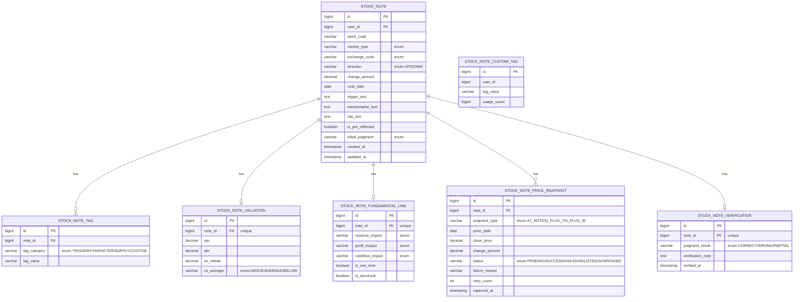

# 주식 기록 기능 (stocknote) 도메인 추가

## Enhancement Summary

**Deepened on**: 2026-04-23 (ultrathink)
**Research agents (4)**: Chart.js mixed chart / Spring @Async+@Scheduled / PostgreSQL 태그 쿼리 / Caffeine 캐싱
**Review agents (4)**: architecture-strategist / performance-oracle / code-simplicity-reviewer / security-sentinel
**Adoption status (2026-04-23 태형님 승인)**: A ✅ / B ✅ / C ✅ / D ✅ (자동) / E ✅ (자동) / F ✅ — **6개 심화 권고 전부 채택**

### 핵심 개선 사항 (초안 대비 차이점)

**스코프 축소 (YAGNI)**
1. **Entity 7 → 5**: `StockNoteValuation` + `StockNoteFundamentalLink` 를 `StockNote` 본체로 흡수 (둘 다 1:1, 각 4~5컬럼). JOIN 2개, Repository/Port 2쌍, cascade 순서 6→4단계 감소. *[simplicity #1]*
2. **Enum 11 → 10**: `TagCategory` 제거. `TriggerType/RiseCharacter/SupplyActor/Custom` 이 이미 태그 출처를 구분하므로 중복. *[simplicity #2]*
3. **SnapshotStatus 축소**: `DELISTED`/`SUSPENDED` 제거, `FAILED + retry_count >= 3` 로 동일 의미 표현. MVP 에서 운영 구분 불필요. *[simplicity #3]*
4. **API 12 → 11**: `/pending-verifications/count` 제거 — dashboard 응답의 `pendingVerificationCount` 재활용. *[simplicity #4]*

**아키텍처 보강**
5. **포트 경계 준수**: `StockNoteSnapshotService` 가 `StockPricePort`(stock 도메인 port) 를 **직접 호출 금지**. 반드시 `stock.application.StockPriceService` 경유 (application↔application). 일봉 API 는 `StockPriceService.getDailyHistory()` 로 확장. *[architecture H-1]*
6. **비동기 구조 확정**: `ApplicationEventPublisher.publish(StockNoteCreatedEvent)` → `@TransactionalEventListener(phase = AFTER_COMMIT)` + `@Async("stocknoteSnapshotExecutor")` 가 부착된 별도 빈 `StockNoteSnapshotAsyncDispatcher` (application 계층) 가 캡처 수행. Self-invocation 회피 + PENDING 커밋 보장 동시 달성. 이벤트 과잉 우려(architecture M-3)는 **커밋 보장을 위한 기술적 필요**로 유지. *[async 리서치 + architecture H-2]*
7. **DTO 네이밍**: application/dto 는 유스케이스 Result 로 개명 (`StockNoteDetailResult`), presentation/dto 에 `StockNoteDetailResponse` 를 별도 배치해 ARCHITECTURE.md Section 5 흐름 대칭. *[architecture M-1]*

**성능/경합**
8. **인덱스 강화**: `stock_note_tag` 에 **`user_id` denormalize 컬럼 추가** + 복합 covering index `(user_id, tag_category, tag_value, note_id)` 역순. 패턴 매칭 쿼리가 사용자 스코프로 선 필터되고 index-only scan 유도. *[performance H + PG 리서치]*
9. **Aggregate N+1 회피**: 리스트 API (`findAllList`) 는 note IDs 추출 후 `findAllTagsByNoteIds(List<Long>)`, `findAllSnapshotsByNoteIds(...)` 등 **IN 절 배치 fetch** 로 1+5 쿼리 고정. *[performance H]*
10. **경합 방어는 conditional UPDATE**: `UPDATE stock_note_price_snapshot SET status='SUCCESS', close_price=? WHERE id=? AND status='PENDING'`. row count = 0 이면 "경합으로 이미 전이/삭제" 로 판정 → Optimistic lock(@Version) 도입 **불필요**. *[async 리서치]*
11. **ThreadPoolTaskExecutor 전용 빈**: `stocknoteSnapshotExecutor` (core=4, max=8, queue=200, **CallerRunsPolicy**, `MdcTaskDecorator`). `@Async` 기본 `SimpleAsyncTaskExecutor` 는 풀링 없이 매 요청 신규 스레드 생성 → 트래픽 스파이크 시 스레드 폭증. *[performance M + async 리서치]*
12. **재시도 2-레벨**: ① `@Async` 메서드 내부에 `@Retryable(maxAttempts=2, backoff=@Backoff(delay=500, multiplier=2))` — transient 네트워크 실패 흡수 ② 영속화된 `retryCount < 3` 은 10분 `@Scheduled` 배치가 복구. 5분 단위 KIS 장애 + 3시간 장애 모두 커버. *[async 리서치]*
13. **Caffeine TTL 5m → 30m**: 월 수십 건 규모에서 5분은 과도하게 짧음. `@CacheEvict` 로 이미 CUD 무효화 적용되므로 30분 이상이 합리적. `@Cacheable(sync=true, unless="#result==null", key="#userId")`. *[performance M + caffeine 리서치]*

**보안**
14. **IDOR 방어 표준**: 모든 Repository 에 **`findByIdAndUserId(id, userId)`** 패턴 통일, 미일치 시 `StockNoteNotFoundException` → **404** (403 이면 존재 여부 노출). `GET/PUT/DELETE /{id}` 전수 적용. *[security H-A01]*
15. **Native SQL IN 튜플 바인딩 안전화**: `(tag_category, tag_value) IN (:tagPairs)` 대신 **동적 placeholder** `IN ((?,?),(?,?)...)` + 개별 `setString` 바인딩 (PostgreSQL JDBC 튜플 바인딩 드라이버 편차 회피). *[security H-A03]*
16. **입력 검증 스펙 명시**: `triggerText/interpretationText/riskText/verificationNote` **`@Size(max=4000)`**, Tag **`@Size(max=32)` + `@Pattern("^[\\p{IsHangul}\\p{Alnum}._\\- ]+$")` + lowercased trim**, 사용자당 최대 custom tag 500 개 상한. 프론트는 `x-html` 금지 **`x-text` 강제**. *[security H-A03 XSS]*
17. **localStorage draft userId scope**: key 를 **`stocknote_draft_${userId}`** 로 변경. 공용 PC 전환 시 이전 사용자 draft 누출 방지. 로그아웃 시 제거. *[security M-A04]*
18. **@CacheEvict AFTER_COMMIT 보장**: `@CacheEvict(beforeInvocation=false)` 기본값 유지(커밋 후 evict). 안전하게는 `@TransactionalEventListener(AFTER_COMMIT)` 내부에서 evict 호출. *[security M + caffeine 리서치]*

**프론트엔드 구체화**
19. **Alpine.js reactive proxy 회피 현대 패턴**: 기존 `Object.defineProperty(enumerable:false)` 대신 **모듈 스코프 `const chartRegistry = new Map()`** 에 Chart.js 인스턴스 보관. Alpine 이 아예 보지 않으므로 proxy 변환 자체가 발생하지 않음. *[chart.js 리서치]*
20. **Line dataset 클릭 비활성**: `pointRadius:0` + **`pointHitRadius:0`** — scatter 만 클릭되게 UX 명확화. 핸들러는 `chart.data.datasets[di].data[i]` 에서 `noteId` 복원 (meta 객체 대신 raw 데이터). *[chart.js 리서치]*
21. **대량 렌더 대비**: `animation:false` 외에 **`parsing:false + normalized:true + spanGaps:true + plugins.decimation`** 추가. 기간 1Y/3Y 확장 시에도 성능 보장. 서버는 `{x: ms(number), y: close}` 정규화 전송. *[chart.js 리서치]*
22. **`ChartDataResponse.notes` 에 `priceAtNote` 필드 추가 필요** — `StockNotePriceSnapshot(AT_NOTE, SUCCESS).closePrice` 를 조인해 내려야 scatter y 가 결정됨. **원 plan 누락 항목**. *[chart.js 리서치]*
23. **드로워 5-step → 3-step (선택)**: 아코디언 3섹션(기본/분석/판단)으로 축소 가능. step 라우팅·progress bar 코드 제거. draft localStorage 는 유지. *[simplicity #5, 선택사항]*

**Observability**
24. **`MdcTaskDecorator` public 승격 + 재사용**: 기존 `LogAsyncConfig` 의 내부 클래스를 공용으로 승격해 `stocknoteSnapshotExecutor` 에도 적용. Micrometer 메트릭 `snapshot.capture.success/failure/retry.exhausted` 등록. *[async 리서치]*

### 기각된 심화 권고 (근거)

- **배열/JSONB 역정규화 (GIN index)**: 완전 정규화 원칙 위배 + 기록 수 규모가 임계점 미달 → HAVING COUNT + covering index 로 충분. 사용자당 10,000 건 돌파 시 재검토. *[PG 리서치]*
- **QueryDSL 신규 도입**: 레포 관행과 불일치. 단일 도메인 위해 컨벤션 분기 금지. *[기존 plan 결정 유지]*
- **Virtual Threads 도입**: Spring Boot 4 기본 지원이지만 HikariCP pinning 유발 가능 → DB write 중심 작업은 플랫폼 스레드 유지. *[async 리서치]*
- **`refreshAfterWrite` (stale-while-revalidate)**: Spring `@Cacheable` 과 궁합 안 맞음(CacheLoader 필요). YAGNI. *[caffeine 리서치]*
- **캐시 워밍 / 부분 무효화 / 캐시 key 난독화**: YAGNI. 현 규모에 오버엔지니어링. *[caffeine 리서치]*
- **이벤트 발행 제거**: architecture M-3 과 async 리서치 권고가 상충 — **async 리서치 채택** (AFTER_COMMIT 커밋 보장이 기술적으로 필요). 단일 구독자이지만 커밋 보장 가치 우위.
- **Pessimistic/Optimistic Lock (@Version)**: conditional UPDATE 로 충분. *[async 리서치]*

### New Considerations Discovered

- **KIS JDBC 튜플 바인딩 드라이버 편차**: Native SQL `IN :tagPairs` 바인딩이 PostgreSQL JDBC 버전별로 동작 상이. 설계 단계에서 실측 필요. (→ 안전하게 동적 placeholder + 개별 바인딩)
- **검증 입력 진입점**: SpecFlow 에서 누락 지적 — Plan 본문에 "기록 상세 패널 하단 `검증 입력` 버튼 (D+30 경과 여부와 무관하게 상시 활성, 단 UI에서 D+30 미경과 시 경고 문구)" 로 보강 권고.
- **ChartDataResponse 에 `priceAtNote` 누락**: 원 plan 의 API 설계 블록 수정 필요. (구체 위치: "GET /api/stock-notes/by-stock/{stockCode}/chart" 응답 스키마)

### 심화 적용 범위 요약

| 영역 | 기존 plan | 심화 후 |
|---|---|---|
| Entity 수 | 7 | **5** |
| Enum 수 | 11 | **10** |
| API endpoint | 12 | **11** |
| Cache TTL | 5분 | **30분** |
| @Async 구조 | 임시 (별도 클래스) | **Event + AFTER_COMMIT + 전용 Executor + Dispatcher** |
| 재시도 | 단일 배치 | **2-레벨 (@Retryable + 배치)** |
| Tag 인덱스 | 단순 복합 | **user_id denormalize + covering** |
| Chart 인스턴스 관리 | Alpine reactive property | **모듈 스코프 Map** |
| Security validation | @Valid 언급 | **필드별 @Size/@Pattern 스펙 명시** |

---

## Overview

특정 주식의 **등락 시점별 판단 로그**를 구조화해 저장/조회/분석하는 신규 도메인 `stocknote` 를 헥사고날 4-레이어로 추가한다. 단순 메모장이 아닌 **"구조화된 투자 판단 로그 + 태그 조합 기반 패턴 분석 대시보드"** 를 목표로 하며, 자동 가격 스냅샷(AT_NOTE/D+7/D+30) + 수동 사후 판정으로 투자 판단 적중률과 자주 맞/틀리는 태그 조합을 복기할 수 있게 한다.

**Origin**: `docs/brainstorms/2026-04-23-stock-note-brainstorm.md` (2026-04-23 브레인스토밍 완료, 8개 Resolved Questions)

---

## Problem Statement

### 현황
- 사용자는 특정 종목의 상승/하락 시점에 맥락을 메모하고 싶어하지만, 현재 플랫폼에는 **자유 텍스트 메모**만 `PortfolioItem.memo` / `StockPurchaseHistory.memo` / `DepositHistory.memo` 필드로 분산되어 있다.
- 이러한 비구조화 메모는 **"왜 올랐는가 → 얼마나 지속 가능한가 → 시장이 무엇을 선반영했는가"** 같은 인사이트를 추출하기 어렵다.
- 동일 투자 판단 패턴(예: "기대형 상승 + 외국인 순매수")이 반복될 때, 과거 판단의 적중/오판을 **체계적으로 복기할 도구가 없다**.

### 기대 효과
1. 상승/하락 시점의 **직접 트리거 / 상승 성격 / 실적 연결성 / 선반영 여부 / 수급 주체 / 반대 논리 / 당시 밸류에이션 / 내 판단** 10개 축으로 구조화 기록
2. D+7/D+30 **자동 가격 스냅샷**으로 객관 등락률 확보, 사용자 수동 판정으로 **판단 적중률** 측정
3. **태그 조합 기반 유사 패턴 매칭**으로 "과거 동일 조합 N회 중 1주 후 상승 X회 / 1개월 후 하락 Y회" 제공 — 의사결정 도구화

---

## Proposed Solution

### 한 줄 요약
신규 `stocknote` 도메인을 헥사고날 4-레이어로 추가하되, `ARCHITECTURE.md` 규칙(Entity 연관관계 금지, application 트랜잭션, ID 참조)을 전수 준수하고, **완전 정규화 스키마 + JPQL/Native 쿼리** 로 분석 성능을 확보한다. 프론트는 신규 `내 투자 노트` 메뉴 + 3탭(대시보드/종목 차트+핀/기록 리스트) + 5-step 드로워 작성 폼. 가격 스냅샷은 기록 시점 현재가 + 스케줄러 배치(국내 16:00 KST, 해외 07:00 KST 다음날)로 획득.

### 핵심 차별점
- **태그 중심 패턴 매칭**: 태그 조합을 키로 과거 유사 판단의 적중률/평균 등락률을 집계
- **본문 잠금**: 검증 생성 시 기록 본문 변경을 차단하여 사후 편향 방지 (수정 필요 시 검증 삭제 → 재작성)
- **스냅샷 상태 머신**: `PENDING → SUCCESS / FAILED / DELISTED / SUSPENDED` 로 상장폐지/거래정지 등 비정상 종목 대응

---

## Technical Approach

### Architecture (DDD 4계층)

```
src/main/java/com/thlee/stock/market/stockmarket/stocknote/
├── domain/
│   ├── model/
│   │   ├── StockNote.java                  # 노트 본체 (Record)
│   │   ├── StockNoteTag.java               # 태그
│   │   ├── StockNoteValuation.java         # 당시 밸류에이션
│   │   ├── StockNoteFundamentalLink.java   # 실적/현금흐름 영향도
│   │   ├── StockNotePriceSnapshot.java     # 가격 스냅샷 (AT_NOTE/D+7/D+30)
│   │   ├── StockNoteVerification.java      # 사후 검증
│   │   ├── StockNoteCustomTag.java         # 사용자별 자유 태그 마스터
│   │   └── enums/
│   │       ├── NoteDirection.java          # UP/DOWN
│   │       ├── RiseCharacter.java          # FUNDAMENTAL/EXPECTATION/SUPPLY_DEMAND/THEME/REVALUATION
│   │       ├── TriggerType.java            # DISCLOSURE/EARNINGS/NEWS/POLICY/INDUSTRY/SUPPLY/THEME/ETC
│   │       ├── SupplyActor.java            # FOREIGN/INSTITUTION/RETAIL/SHORT_COVERING/ETF_FLOW
│   │       ├── ImpactLevel.java            # HIGH/MEDIUM/LOW
│   │       ├── UserJudgment.java           # MORE_UPSIDE/NEUTRAL/OVERHEATED/CATALYST_EXHAUSTED
│   │       ├── JudgmentResult.java         # CORRECT/WRONG/PARTIAL
│   │       ├── SnapshotType.java           # AT_NOTE/D_PLUS_7/D_PLUS_30
│   │       ├── SnapshotStatus.java         # PENDING/SUCCESS/FAILED/DELISTED/SUSPENDED
│   │       ├── TagCategory.java            # TRIGGER/CHARACTER/SUPPLY/CUSTOM
│   │       └── VsAverageLevel.java         # ABOVE/AVERAGE/BELOW
│   └── repository/                         # 포트 인터페이스
│       ├── StockNoteRepository.java
│       ├── StockNoteTagRepository.java
│       ├── StockNoteValuationRepository.java
│       ├── StockNoteFundamentalLinkRepository.java
│       ├── StockNotePriceSnapshotRepository.java
│       ├── StockNoteVerificationRepository.java
│       └── StockNoteCustomTagRepository.java
├── application/
│   ├── StockNoteWriteService.java          # 기록 생성/수정/삭제
│   ├── StockNoteReadService.java           # 리스트/상세/필터
│   ├── StockNoteVerificationService.java   # 검증 upsert/삭제
│   ├── StockNoteSnapshotService.java       # AT_NOTE 즉시 + D+7/D+30 배치
│   ├── StockNotePatternMatchService.java   # 태그 조합 매칭
│   ├── StockNoteDashboardService.java      # KPI 집계 (캐시됨)
│   ├── StockNoteChartService.java          # 종목 차트 + 기록점 데이터
│   ├── StockNoteCustomTagService.java      # 자유 태그 자동완성/upsert
│   └── dto/
│       ├── StockNoteDetailResponse.java
│       ├── StockNoteListItemResponse.java
│       ├── DashboardResponse.java
│       ├── SimilarPatternResponse.java
│       └── ChartDataResponse.java
├── infrastructure/
│   ├── persistence/
│   │   ├── StockNoteEntity.java
│   │   ├── StockNoteTagEntity.java
│   │   ├── StockNoteValuationEntity.java
│   │   ├── StockNoteFundamentalLinkEntity.java
│   │   ├── StockNotePriceSnapshotEntity.java
│   │   ├── StockNoteVerificationEntity.java
│   │   ├── StockNoteCustomTagEntity.java
│   │   ├── *JpaRepository.java (7개)
│   │   ├── *RepositoryImpl.java (7개)  # 어댑터
│   │   └── mapper/
│   │       └── StockNoteMapper.java        # Entity ↔ Domain
│   ├── scheduler/
│   │   ├── StockNoteSnapshotScheduler.java # 국내/해외/재시도 3개 @Scheduled
│   │   └── BusinessDayCalculator.java      # 간이 한국 영업일 (주말+고정 공휴일)
│   └── cache/
│       └── StockNoteCacheConfig.java       # Caffeine 대시보드 캐시 (TTL 5분)
└── presentation/
    ├── StockNoteController.java            # /api/stock-notes
    ├── StockNoteVerificationController.java
    ├── StockNoteAnalyticsController.java   # 대시보드/패턴/차트
    ├── StockNoteCustomTagController.java   # 자유 태그 API
    └── dto/
        ├── CreateStockNoteRequest.java
        ├── UpdateStockNoteRequest.java
        └── UpsertVerificationRequest.java
```

모든 Entity는 **ID 기반 참조**(JPA 연관관계 없음). `stockCode`, `marketType`, `exchangeCode` 는 `stock` 도메인 enum 을 재사용 (`ARCHITECTURE.md:137` 규칙 준수).

### Database Schema (ERD)



**인덱스**:
- `stock_note(user_id, note_date DESC)` — 리스트 정렬
- `stock_note(user_id, stock_code, note_date DESC)` — 종목별 차트
- `stock_note_tag(note_id)`, `stock_note_tag(tag_category, tag_value)` — 패턴 매칭
- `stock_note_price_snapshot(note_id, snapshot_type)` — unique
- `stock_note_price_snapshot(status, snapshot_type)` — PENDING 재시도 스캔
- `stock_note_verification(note_id)` — unique
- `stock_note_custom_tag(user_id, tag_value)` — unique

### Entity 설계 예시

```java
// stocknote/infrastructure/persistence/StockNoteEntity.java
@Entity
@Table(name = "stock_note",
    indexes = {
        @Index(name = "idx_sn_user_date", columnList = "user_id, note_date DESC"),
        @Index(name = "idx_sn_user_stock_date", columnList = "user_id, stock_code, note_date DESC")
    })
@Getter
@NoArgsConstructor(access = AccessLevel.PROTECTED)
public class StockNoteEntity {
    @Id
    @GeneratedValue(strategy = IDENTITY)
    private Long id;

    @Column(name = "user_id", nullable = false)
    private Long userId;

    @Column(name = "stock_code", nullable = false, length = 20)
    private String stockCode;

    @Enumerated(STRING) @Column(nullable = false)
    private MarketType marketType;

    @Enumerated(STRING) @Column(nullable = false)
    private ExchangeCode exchangeCode;

    @Enumerated(STRING) @Column(nullable = false)
    private NoteDirection direction;

    @Column(name = "change_percent", precision = 6, scale = 2)
    private BigDecimal changePercent;

    @Column(name = "note_date", nullable = false)
    private LocalDate noteDate;

    @Column(name = "trigger_text", columnDefinition = "TEXT")
    private String triggerText;
    // ... interpretationText, riskText (TEXT)

    @Column(name = "is_pre_reflected", nullable = false)
    private boolean preReflected;

    @Enumerated(STRING) @Column(name = "initial_judgment", nullable = false)
    private UserJudgment initialJudgment;

    @CreationTimestamp
    private Instant createdAt;

    @UpdateTimestamp
    private Instant updatedAt;
    // 생성자/정적 팩토리 메서드는 설계 승인 후 작성
}
```

### API 설계

#### 기록 CRUD
```
POST   /api/stock-notes
# Request: { stockCode, marketType, exchangeCode, direction, changePercent, noteDate,
#            triggerText, interpretationText, riskText, preReflected, initialJudgment,
#            tags: [{category, value}], valuation: {per, pbr, evEbitda, vsAverage},
#            fundamental: {revenueImpact, profitImpact, cashflowImpact, isOneTime, isStructural} }
# Response: 201 Created, Location: /api/stock-notes/{id}
# 트랜잭션: 노트 + 태그 + 밸류 + 펀더멘털 + AT_NOTE(PENDING) 스냅샷 동시 생성
# 후속: 비동기로 AT_NOTE 현재가 조회 → UPDATE (응답과 분리)

GET    /api/stock-notes?stockCode=&from=&to=&direction=&character=&judgmentResult=&page=&size=
GET    /api/stock-notes/{id}                         # 상세 aggregate
PUT    /api/stock-notes/{id}                         # 409 if verification exists
DELETE /api/stock-notes/{id}                         # cascade (tags/valuation/fundamental/snapshots/verification)
```

#### 사후 검증
```
PUT    /api/stock-notes/{id}/verification
# Request: { judgmentResult, verificationNote }
# upsert. 성공 시 본문 잠금 발효

DELETE /api/stock-notes/{id}/verification           # 본문 잠금 해제
```

#### 패턴 매칭 & 분석
```
GET    /api/stock-notes/{id}/similar-patterns?directionFilter=SAME|ANY
# Response: {
#   basisTags: [{category, value}, ...],
#   matches: [
#     { noteId, noteDate, stockCode, direction, judgmentResult,
#       d7ChangePercent, d30ChangePercent, initialJudgment }
#   ],
#   aggregate: {
#     total, correctCount, wrongCount, partialCount,
#     avgD7Percent, avgD30Percent, upAfter1W, downAfter1W, upAfter1M, downAfter1M
#   }
# }

GET    /api/stock-notes/dashboard
# Response: {
#   thisMonthCount, verifiedCount, pendingVerificationCount,
#   hitRate: { correct, wrong, partial, total },
#   characterDistribution: { 'FUNDAMENTAL': count, 'EXPECTATION': count, ... },   # Map<String, Long>
#   topTagCombinations: [{ tagValues: [...], count }, ...]
# }
# 캐시: Caffeine, TTL 30분 (심화 E), 기록/검증 생성 시 evict
# NOTE(2026-04-26): character/combo 별 hitRate 는 별건 plan 후속. 현재 구현은 count 만 집계.

GET    /api/stock-notes/by-stock/{stockCode}/chart?period=90
# Response: {
#   prices: [{ date, close }],       # 일봉 (KIS inquire-daily-itemchartprice)
#   notes: [{ id, noteDate, direction, changePercent, initialJudgment, summary }]
# }
```

#### 자유 태그 자동완성
```
GET    /api/stock-notes/custom-tags?prefix=<q>&limit=10
# 사용자별 usage_count DESC 정렬 상위 N개
```

#### 부가
```
GET    /api/stock-notes/pending-verifications/count  # 사이드바 배지용
POST   /api/stock-notes/{id}/snapshots/{type}/retry  # 수동 재시도 (사용자 트리거)
```

### 가격 스냅샷 전략

#### 결정된 전략 (AT_NOTE = 기록 시점 현재가 + D+N = 스케줄러 배치)
**레포 리서치 발견**: `StockPriceService` 는 현재가 전용이고, 과거 일봉 조회 API 가 없음. 따라서:

1. **AT_NOTE (기록 시점)**
   - 기록 생성 API 에서 **PENDING 스냅샷**을 즉시 insert
   - `@Async` 으로 `StockPricePort.getPrice()` 호출 → 성공 시 UPDATE 로 `SUCCESS + closePrice + capturedAt` 기록
   - 실패 시 `retryCount++`, 10분 간격 `@Scheduled` 배치가 PENDING 최대 3회 재시도
   - 3회 초과 → `FAILED` 로 확정. 사용자가 수동 재시도 버튼으로만 복구 가능

2. **D+7 / D+30 (스케줄러)**
   - 국내: `@Scheduled(cron = "0 0 16 * * MON-FRI", zone = "Asia/Seoul")` — KRX 장 마감 15:30 직후 여유 30분
   - 해외: `@Scheduled(cron = "0 0 7 * * TUE-SAT", zone = "Asia/Seoul")` — NYSE/NASDAQ 장 마감 후 다음날 한국시간 07:00 KST
   - 로직: `noteDate + BusinessDayCalculator.add(7 or 30)` 이 오늘인 기록 조회 → 현재가 수집 → 스냅샷 생성 (UPSERT)
   - `hibernate.jdbc.batch_size=1000` 활용
   - 종목별 실패 격리: try-catch per note (global-indicator-history-mirroring 패턴)

3. **상장폐지/거래정지 처리**
   - `StockPricePort` 호출 결과가 null/에러 → `FAILED` (재시도) → 3회 초과 시 `DELISTED` 로 상태 확정 (운영 판단)
   - 패턴 매칭/대시보드 집계 시 `DELISTED/SUSPENDED` 는 제외

4. **백데이트 기록 제약**
   - 현재가 API 는 "오늘" 만 유효하므로 `noteDate > today` 금지, `noteDate < today` 는 허용하되 AT_NOTE 스냅샷은 `FAILED_BACKDATED` 로 표시 (recover 불가)
   - UI 에서 백데이트 기록 시 경고 문구 표시

#### BusinessDayCalculator (간이)
- 주말(토/일) + 한국 고정 공휴일(1/1, 3/1, 5/5, 6/6, 8/15, 10/3, 10/9, 12/25) 스킵
- 음력 기반 공휴일(설/추석/부처님오신날)은 커버 X → 스냅샷 조회 실패 시 `FAILED` 경로로 자연 처리
- `LocalDate addBusinessDays(LocalDate base, int n)` 시그니처

### 패턴 매칭 쿼리 (JPQL → Native SQL)

```sql
-- 현재 노트 N 의 태그 셋 T = {(TRIGGER,EARNINGS), (CHARACTER,FUNDAMENTAL), (SUPPLY,FOREIGN)}
-- 이 3개 태그 모두를 가진 과거 노트를 사용자 스코프로 찾는다.
-- directionFilter = SAME 인 경우 direction 일치도 요구.

SELECT
  n.id, n.note_date, n.stock_code, n.direction, n.initial_judgment,
  v.judgment_result,
  ps7.change_percent AS d7_change,
  ps30.change_percent AS d30_change
FROM stock_note n
INNER JOIN (
    SELECT note_id
    FROM stock_note_tag
    WHERE (tag_category, tag_value) IN (:tagPairs)
    GROUP BY note_id
    HAVING COUNT(DISTINCT tag_category || '::' || tag_value) = :tagCount
) matched ON n.id = matched.note_id
LEFT JOIN stock_note_verification v ON v.note_id = n.id
LEFT JOIN stock_note_price_snapshot ps7  ON ps7.note_id = n.id AND ps7.snapshot_type = 'D_PLUS_7'  AND ps7.status = 'SUCCESS'
LEFT JOIN stock_note_price_snapshot ps30 ON ps30.note_id = n.id AND ps30.snapshot_type = 'D_PLUS_30' AND ps30.status = 'SUCCESS'
WHERE n.user_id = :userId
  AND n.id <> :currentNoteId
  AND (:directionFilter = 'ANY' OR n.direction = :direction)
ORDER BY n.note_date DESC
LIMIT 20
```

**도구 선택 근거**: 레포 리서치 결과 **QueryDSL 은 build.gradle 에만 선언**되어 있고 실제 사용 0건. 기존 관행은 `@Query`(JPQL) + `nativeQuery = true` 로 복잡 쿼리를 처리한다 (`SpendingConfigJpaRepository.findEffectiveAsOf` 참고). 위 쿼리는 `GROUP BY ... HAVING COUNT = :tagCount` 때문에 `nativeQuery = true` 로 작성한다.

### 인증 주입 패턴

**결정**: `favorite` 모듈의 `SecurityContextHolder` 방식 채택 — `salary`/`portfolio` 의 `@RequestParam Long userId` 보다 보안이 엄격하며, stocknote 는 **개인 판단 로그라 타 사용자 노출 절대 불가**.

```java
// stocknote/presentation/StockNoteController.java
private Long currentUserId() {
    return (Long) SecurityContextHolder.getContext().getAuthentication().getPrincipal();
}
```

모든 컨트롤러 메서드는 `currentUserId()` 로 스코프 제한하며, 서비스 레이어에도 `userId` 를 항상 파라미터로 전달.

### 캐싱 전략 (Caffeine)

- **대시보드 KPI**: `StockNoteDashboardService.getDashboard(userId)` 에 `@Cacheable(cacheNames = "stocknoteDashboard", key = "#userId")`, TTL 5분
- **자유 태그 자동완성**: `GET /api/stock-notes/custom-tags` 는 캐시 안 함 (입력마다 변경)
- **무효화**: `@CacheEvict(cacheNames = "stocknoteDashboard", key = "#userId")` 를 `StockNoteWriteService.create/update/delete` 및 `StockNoteVerificationService.upsert/delete` 에 적용

### 프론트엔드 구조

#### 메뉴 등록 (app.js)
```javascript
// src/main/resources/static/js/app.js
// (1) menus 배열 (L11-20 부근)에 push
{ id: 'stocknote', icon: '📒', label: '내 투자 노트' }

// (2) component spread (L37 근처)
...StocknoteComponent,

// (3) navigateTo(page) switch-case (L113-179)
case 'stocknote':
    this.activePage = 'stocknote';
    this.loadStocknote();  // 대시보드 탭이 default
    break;

// (4) 기존 페이지 이탈 cleanup (L126-144 패턴)
if (prevPage === 'stocknote') this.destroyStocknoteCharts();
```

#### 컴포넌트 파일
- `src/main/resources/static/js/components/stocknote.js` (단일 파일)

```javascript
const StocknoteComponent = {
  stocknote: {
    activeTab: 'dashboard',           // 'dashboard' | 'stock' | 'list'
    selectedStockCode: null,
    chartInstances: new Map(),         // Object.defineProperty(enumerable:false) 적용
    drawer: { open: false, step: 1, form: {} },
    verificationPanel: { open: false, noteId: null },
    dashboard: null,
    stockChartData: null,
    notes: [],
    filters: { stockCode: '', from: '', to: '', direction: 'ALL', character: 'ALL', judgmentResult: 'ALL' },
    pagination: { page: 0, size: 20, totalPages: 0 },
    pendingVerificationCount: 0,
    customTagSuggestions: []
  },

  // 초기화
  async loadStocknote() { /* 대시보드 + 배지 카운트 병렬 */ },

  // 탭
  switchTab(tab) { /* Chart.js cleanup 후 탭 전환 */ },

  // 기록 작성 드로워
  openDrawer() { this.stocknote.drawer.open = true; },
  submitNote() { /* API.createStockNote + draft localStorage clear */ },

  // 검증
  openVerificationPanel(noteId) { /* 우측 슬라이드 */ },
  submitVerification() { /* API.upsertVerification + 대시보드 reload */ },

  // 차트 (line + scatter mixed)
  renderStockChart(stockCode) {
    const ctx = document.getElementById('stocknote-stock-chart').getContext('2d');
    const old = this.stocknote.chartInstances.get(stockCode);
    if (old) old.destroy();
    const chart = new Chart(ctx, {
      type: 'line',
      data: {
        labels: this.stocknote.stockChartData.prices.map(p => p.date),
        datasets: [
          { type: 'line', label: '종가', data: [...], borderColor: '#3b82f6' },
          { type: 'scatter', label: '상승 기록', data: upNotes,   backgroundColor: '#10b981', pointStyle: 'triangle', radius: 8 },
          { type: 'scatter', label: '하락 기록', data: downNotes, backgroundColor: '#ef4444', pointStyle: 'triangle', radius: 8, rotation: 180 }
        ]
      },
      options: {
        animation: false,  // Alpine.js proxy 성능 보호 (ecos-timeseries-chart-visualization 학습)
        onClick: (evt, elements) => {
          if (elements.length > 0) {
            const noteId = elements[0].element.$context.raw.noteId;
            this.openVerificationPanel(noteId);
          }
        }
      }
    });
    // Alpine Proxy 에서 Chart 인스턴스 추적 회피 (solution 학습)
    Object.defineProperty(this.stocknote.chartInstances, stockCode, {
      value: chart, enumerable: false, configurable: true
    });
  },

  destroyStocknoteCharts() { /* all instances destroy + clear */ },

  // 유사 패턴
  async fetchSimilarPatterns(noteId, directionFilter = 'SAME') { /* ... */ },

  // 자유 태그 자동완성
  async suggestCustomTag(prefix) { /* debounced API 호출 */ },

  // 드래프트 (localStorage)
  persistDraft() { localStorage.setItem('stocknote_draft', JSON.stringify(this.stocknote.drawer.form)); },
  restoreDraft() { /* ... */ }
};
```

#### HTML 추가
- `src/main/resources/static/partials/stocknote.html` (신규): 3탭 레이아웃 + 드로워 + 검증 패널
- `static/index.html` 의 main area 에 `<div x-show="activePage === 'stocknote'" x-data="stocknote">...</div>` 삽입

#### 드로워 5-step 폼 (HTML 구조)
```
Step 1/5: 기본정보
  - 종목 검색 (portfolio 의 searchStock 패턴 재사용)
  - 날짜 picker (기본 오늘, 미래 금지 validation)
  - 방향 radio (UP/DOWN)
  - 당일 등락률 input (number)
  - 선반영 여부 checkbox

Step 2/5: 트리거 & 해석
  - TriggerType 멀티 체크박스
  - 직접 트리거 textarea
  - 시장 해석 textarea
  - 자유 태그 입력 (자동완성 + 칩 추가)

Step 3/5: 성격 & 실적 연결
  - RiseCharacter 멀티 체크박스
  - 매출/영업이익/현금흐름 영향도 select (HIGH/MEDIUM/LOW)
  - 일회성 / 구조적 체크박스

Step 4/5: 수급 & 밸류에이션
  - SupplyActor 멀티 체크박스
  - PER/PBR/EV·EBITDA 수치 input
  - 과거 평균 대비 radio (ABOVE/AVERAGE/BELOW)

Step 5/5: 내 판단 & 반대 논리
  - UserJudgment radio
  - 반대 논리 textarea
  - 제출 버튼
```

**Validation**: 각 step 이동 시 필수값 체크, 최종 제출 전 `confirm()`.
**임시 저장**: step 이동/필드 변경마다 `persistDraft()` (localStorage, 서버 저장 아님 — YAGNI).

### 배지 카운트
- 사이드바 `내 투자 노트` 메뉴 옆 빨간 점 + 숫자 (`pendingVerificationCount`)
- 폴링 없음: **페이지 로드 시 + 기록/검증 변경 시에만** 갱신
- SpecFlow 권고 준수

---

## Implementation Phases

### Phase 1: 도메인 모델 + 인프라 스켈레톤
- [x] Entity 5개(심화 축소), Enum 10개 생성 (사전 승인 완료)
- [x] 테이블 마이그레이션 (Hibernate auto-ddl)
- [x] Repository 포트 5쌍 + JpaRepository + RepositoryImpl 어댑터
- [x] `StockNoteMapper` (Entity ↔ Domain 변환)
- [x] `BusinessDayCalculator` 간이 구현 + 단위 테스트 가능 구조

### Phase 2: 응용 계층 + REST API (기록 CRUD)
- [x] `StockNoteWriteService.create` — 본체/태그/밸류/펀더멘털/AT_NOTE(PENDING) 원자 생성
- [x] `StockNoteWriteService.update` — 검증 존재 시 `StockNoteLockedException` → 409
- [x] `StockNoteWriteService.delete` — 하위 엔티티 cascade (Repository 레벨)
- [x] `StockNoteReadService.findById/findList` — aggregate 조립
- [x] `StockNoteController` + `CreateStockNoteRequest/UpdateStockNoteRequest` DTO
- [x] 인증 주입 (`SecurityContextHolder`), 모든 엔드포인트에 userId 스코프
- [x] `@Valid` Bean Validation (예: noteDate 미래 금지, changePercent 범위)

### Phase 3: 가격 스냅샷 + 스케줄러
- [x] `StockNoteSnapshotService.captureAtNoteAsync(noteId)` — `@Async`, PENDING → SUCCESS/FAILED
- [x] `StockNoteSnapshotService.retryPending()` — 10분 배치, retryCount 3 초과 시 FAILED 확정
- [x] `StockNoteSnapshotScheduler.captureDomesticSnapshots()` — 국내 16:00 KST
- [x] `StockNoteSnapshotScheduler.captureOverseasSnapshots()` — 해외 07:00 KST (다음날)
- [x] 종목 실패 격리 (try-catch per note, LoggingContext MDC)
- [x] 상장폐지/거래정지 처리 (retry 3회 후 DELISTED 확정)
- [x] 수동 재시도 엔드포인트

### Phase 4: 사후 검증 + 본문 잠금
- [x] `StockNoteVerificationService.upsert` — 본문 잠금 발효, 대시보드 캐시 evict
- [x] `StockNoteVerificationService.delete` — 잠금 해제
- [x] `PUT/DELETE /api/stock-notes/{id}/verification`
- [x] 이미 검증 존재 상태에서 본문 PUT 시 `409 Conflict` 반환 + 에러 바디 `{error: 'LOCKED_BY_VERIFICATION'}`

### Phase 5: 분석 API (패턴 매칭 + 대시보드 + 차트)
- [x] `StockNotePatternMatchService.findSimilar(noteId, directionFilter)` — native 쿼리
- [x] `StockNoteDashboardService.getDashboard(userId)` — Caffeine 캐시 (TTL 30분, 심화 반영)
- [x] `StockNoteChartService.getChartData(userId, stockCode, period)` — 일봉 + 기록점
   - 일봉 조회: `StockPricePort.getDailyHistory(...)` 포트 + KIS 어댑터 구현 완료 (TR `FHKST03010100`, 단일 호출 ~100 영업일). 해외는 base default(빈 리스트) 유지 — 후속 별도 작업.
- [x] ~~`/api/stock-notes/pending-verifications/count`~~ — 심화에서 제거 (대시보드 응답의 `pendingVerificationCount` 재활용)

### Phase 6: 프론트엔드 — 기본 골격
- [x] `static/js/components/stocknote.js` + `static/index.html` 인라인 템플릿 (별도 partial 분리 안 함)
- [x] `app.js` 메뉴/컴포넌트 등록 (4개 수정 포인트)
- [x] 대시보드 탭 (KPI 카드 + 성격 분포 + 태그 조합)
- [x] 기록 리스트 탭 (테이블 + 필터 + 페이징)

### Phase 7: 프론트엔드 — 기록 작성 드로워
- [x] 5-step 드로워 구현
- [x] 각 step validation
- [x] localStorage draft 자동 저장/복구
- [x] 자유 태그 자동완성 (debounce)

### Phase 8: 프론트엔드 — 종목 차트 + 검증 패널
- [x] 종목 상세 탭: 종목 코드 입력 / Chart.js mixed chart (line + scatter)
- [x] 기록점 클릭 → 검증 패널 오픈
- [x] 검증 패널 내 유사 패턴 미니 카드

### Phase 9: 폴리싱
- [x] 사이드바 배지 카운트
- [x] 스냅샷 실패 상태 UI 표시 + 수동 재시도 버튼
- [x] 빈 상태 / 로딩 / 에러 메시지- [x] 반응형 (모바일 드로워 fullscreen) — `w-full sm:w-[580px]` + `top-0 bottom-0` fullscreen, 액션바 sticky bottom + iOS safe-area

### Phase 10: ce-review 후속 작업 (2026-04-25 코드 리뷰 결과)

> 11-reviewer ce-review 결과 도출된 P0~P3 발견사항. 한 번에 하나씩 진행, 작업 시작 전 분석/설계 문서 필요 여부 판단.

#### P0 — Critical
- [x] [stocknote] D+7/D+30 PENDING 행 미생성으로 자동 캡처 영구 미동작 — 옵션A 채택. `WriteService.create` 가 AT_NOTE + D+7 + D+30 PENDING 3건 saveAll. 분석/설계: `.claude/analyzes/stocknote/d-plus-n-pending-missing/` + `.claude/designs/stocknote/d-plus-n-pending-fix/`.
- [x] [stocknote] currentUserId() 안전 가드 추가 (4 컨트롤러 NPE/CCE 방어) — `StockNoteSecurityContext` 신설(presentation), 4 컨트롤러 일괄 적용, ExceptionHandler 에 `InsufficientAuthenticationException → 401 UNAUTHORIZED` 매핑.

#### P1 — High
- [x] [stocknote] captureForMarket 트랜잭션 분리 및 외부 HTTP 격리 — `StockNoteSnapshotCaptureExecutor` 신설. SnapshotService 의 captureForMarket/retryPending @Transactional 제거 + per-note try-catch + executor 호출. AsyncDispatcher 도 executor 직접 호출. 분석/설계: `.claude/{analyzes,designs}/stocknote/{capture-transaction-isolation,snapshot-capture-executor}/`.
- [x] [stock] KIS RestClient connect/read timeout 설정 — `KisRestClientConfig` 신설(`@Bean("kisRestClient")` + SimpleClientHttpRequestFactory). `KisProperties` 에 connectTimeoutMs/readTimeoutMs (기본 3000/10000). KisApiClient/KisTokenManager 에 `@Qualifier("kisRestClient")`. 분석/설계: `.claude/{analyzes,designs}/stock/kis-restclient-timeout/`.
- [x] [stocknote] BusinessDayCalculator 음력/임시 공휴일 보강 (옵션 A) — `LUNAR_AND_SUBSTITUTE_HOLIDAYS` Set 추가 (2026~2027 등록). 매년 12월 갱신 PR 정책. 옵션 B (KRX 캘린더 외부 연동) / 옵션 C (KIS 빈 응답 감지) 별건. 분석/설계: `.claude/{analyzes,designs}/stocknote/business-day-lunar-holidays/`.
- [x] [stocknote] AT_NOTE FAILED 시 D+N changePercent null 영구화 방지 — 옵션 C(A+B). 옵션 A: captureTarget atNoteClose=null guard → PENDING 유지. 옵션 B: captureAtNote SUCCESS 직후 backfillDPlusNChangePercent 호출 + 도메인 backfillChangePercent 메서드 추가. 분석/설계: `.claude/{analyzes,designs}/stocknote/d-plus-n-change-percent-null/`.
- [x] [stock/kis] 일봉 100영업일 한계 분할 호출 페이지네이션 — `KisStockPriceAdapter.getDailyHistory` 슬라이딩 윈도우 청크 루프(CHUNK_CALENDAR_DAYS=140, MAX_ITERATIONS=10) + LinkedHashMap dedup + ASC 정렬. 부분 실패 시 graceful degrade. 분석/설계: `.claude/{analyzes,designs}/stock/kis-daily-chart-pagination/`.
- [x] [stocknote] DashboardService EntityManager 직접 사용 → Repository 포트로 분리 — `StockNoteDashboardRepository` 포트(domain) + `StockNoteDashboardRepositoryImpl` 어댑터(infrastructure) 신설. JPQL/Native SQL 5건 어댑터로 이전. Service 슬림화. 분석/설계: `.claude/{analyzes,designs}/stocknote/dashboard-repository-port/`.
- [x] ~~[chatbot] stocknote 도메인 챗봇 컨텍스트 + tool-calling 통합~~ — **deferred (2026-04-26)**: 태형님 결정으로 본 PR 범위 외. 향후 챗봇 stocknote 연동 시 별도 plan 으로 진행.
- [x] [stocknote] StockNoteListFilter character/judgmentResult 실제 적용 — 옵션 B. `StockNoteRepositoryImpl.buildWhereClause` 에 EXISTS subquery 2건 추가 (StockNoteTagEntity / StockNoteVerificationEntity). "Phase 5 확장" 주석 제거. 분석/설계: `.claude/{analyzes,designs}/stocknote/list-filter-dead-fields/`.
- [x] [stocknote] DetailResponse.note.locked 실제 verification 존재 반영 — `StockNoteDetailResponse.from` 에서 `locked = r.verification() != null` 계산 후 `NoteDto.from(StockNote, boolean locked)` 시그니처로 전달. 하드코딩 false 제거.
- [x] [stocknote] @Valid bean validation 핸들러 추가 + 에러 응답 shape 통일 — `StockNoteExceptionHandler` 응답 shape `{error, message, timestamp}` 통일 + `MethodArgumentNotValidException` (`fieldErrors` 포함) / `HttpMessageNotReadableException` / `MethodArgumentTypeMismatchException` 핸들러 3건 추가. 분석/설계: `.claude/{analyzes,designs}/stocknote/exception-handler-unification/`.
- [x] [stocknote] DashboardResponse contract drift 정합 — 옵션 A. plan L400-401 을 현재 구현 형식으로 갱신 (characterDistribution: `Map<String, Long>`, topTagCombinations.tagValues, hitRate 별건 후속 명시). 코드/프론트 무변경. 분석/설계: `.claude/{analyzes,designs}/stocknote/dashboard-contract-drift/`.
- [x] [stocknote] pagination offset/limit → page/size 통일 — 7개 파일 일괄 (Controller / Filter / Result / Response / RepositoryImpl 의 `firstResult = page * size` 변환 / ReadService / frontend filters). News/AdminLog 모듈 + plan L366 정합. 분석/설계: `.claude/{analyzes,designs}/stocknote/pagination-page-size/`.
- [x] [stocknote] StockNote 25 필드 Value Object 분리 (Valuation/FundamentalImpact) — 옵션 A. 도메인 record `Valuation` / `FundamentalImpact` 신설, StockNote 8필드 → 2 VO. create/updateBody 인자 21→13. 위임 getter 9개로 응답/Mapper 평면 호출 호환. WriteService cmd→VO 조립, Mapper toDomain VO 변환. DB 스키마/응답 contract 무영향. 분석/설계: `.claude/{analyzes,designs}/stocknote/stocknote-value-objects/`.
- [x] [stocknote] application/presentation DTO 중복 정리 — 옵션 A. 1:1 복제 케이스 정리: `SimilarPatternResponse` / `DashboardResponse` 삭제, AnalyticsController 가 Result 직접 반환. Chart/Detail/List Response 는 가공 가치 인정해 보존. 분석/설계: `.claude/{analyzes,designs}/stocknote/dto-duplication-cleanup/`.
- [x] [stocknote/frontend] index.html 인라인 블록 영역 분리 또는 anchor 마커 도입 — 옵션 A. 5개 영역(dashboard-tab / stock-chart-tab / list-tab / drawer / detail-panel) start/end anchor 주석 마커 추가 + STOCK NOTE end 마커. partial 분리는 Alpine SSR 제약으로 별건 권장.

#### P2 — Moderate
- [x] [stocknote] CreateStockNoteRequest.tags @Size 길이 검증 + 중복 제거 — Create/Update Request 에 `@Size(max=50)` 추가. WriteService.replaceTags 에 (source+normalized) LinkedHashSet dedup. unique 제약은 별건.
- [x] [stocknote] custom tag MAX_PER_USER TOCTOU 보강 — `DataIntegrityViolationException` catch + `incrementUsage` 재시도. unique 제약(`uk_stock_note_custom_tag_user_value`) 이 최종 가드, 동시 insert 시 retry 로 복구.
- [x] [stocknote] 검증 본문 잠금 우회 race 방어 — `StockNoteVerification.update` 가 `verifiedAt` 갱신 안 함 (최초 검증 시점 영구 보존). DELETE → 재생성 시에만 새 verifiedAt 발급 → 잠금 해제 후 본문 변경+재인증 우회 시 시점 차이로 추적 가능.
- [x] [stocknote] manualRetry self-invocation 트랜잭션 분리 — Task #3 의 `StockNoteSnapshotCaptureExecutor` 빈 분리로 self-invocation 자체 해소. manualRetry outer @Transactional + executor REQUIRED 합류 → reset 결과 보임 (race-safe).
- [x] [stocknote] StocknoteAsyncConfig CallerRunsPolicy → AbortPolicy + retry 인계 — `AbortPolicy` 적용. AT_NOTE PENDING 행은 영속화되어 있어 retryPending 10분 배치가 자연 인계.
- [x] [stocknote/frontend] 해외 종목 차트 미지원 안내 추가 — index.html 의 stock-chart-tab 빈 상태 분기에 "해당 종목 기록 없음" / "해외 종목 일봉 미지원 (국내만)" 메시지 분기 추가.
- [x] [stocknote] retryPending 가 D+7/D+30 PENDING 도 처리하도록 일관화 — `retryPending` 의 분기에 D+N 처리 추가. note 정보 + AT_NOTE close 조립 후 `captureExecutor.captureTarget` 호출. per-note try-catch 격리.
- [x] [stocknote] 동일 트랜잭션 custom tag 중복 입력 dedup — Task #18 와 함께 처리. WriteService.replaceTags 에 (source+normalized) LinkedHashSet dedup.
- [x] [stocknote] PatternMatchService N+1 findById 배치화 — `StockNoteRepository.findAllByIds` 추가 + Service 가 `noteMap.get(id)` 매핑. 단건 호출 20회 → 1회 IN-batch.
- [x] [stocknote] captureTarget redundant noteRepository.findById 제거 — `PendingCaptureTarget` 에 `exchangeCode` 필드 추가 + native 쿼리 컬럼 추가. `captureTarget` 가 target 의 stockCode/marketType/exchangeCode 직접 사용. `fetchCurrentPrice` 시그니처 변경. manualRetry/retryPending 의 PendingCaptureTarget 생성도 exchangeCode 포함.
- [x] [stock/kis] 일봉 long TTL 캐시 도입 — `StockPriceCacheConfig` 에 `dailyHistoryCacheManager` 빈 추가 (TTL 12h, maxSize 200). `KisStockPriceAdapter.getDailyHistory` 에 `@Cacheable(stockCode:from:to, sync=true, unless empty)` 적용.
- [x] [stocknote] ListResponse.Item verified/locked 의미 분리 또는 단일화 — `locked` 필드 제거, `verified` 만 유지. 프론트가 `note.verified` 만 사용 검증.
- [x] [stocknote] dead public API 제거 — `BusinessDayCalculator.nextBusinessDay`, `StockNote.isDomestic` 두 메서드 삭제 (호출처 0건 검증).
- [x] [stocknote] StockNoteLockedException 을 domain/exception 으로 이전 — `domain/exception/` 패키지 신설 + 이동. import 3 파일(WriteService, UpdateStockNoteCommand javadoc, ExceptionHandler) 갱신.
- [x] [stocknote] retrySnapshot 응답 코드 일관화 — 200 + body → 204 No Content. 다른 write 엔드포인트와 contract 일관.
- [x] [stock/kis] KisTokenManager synchronized + 외부 호출 분리 — `volatile cachedToken/tokenExpiresAt` + double-checked locking. 캐시 히트는 lock 없이 반환 → 동시 호출 직렬화 회피. timeout 은 Task #4 (KisRestClientConfig) 에서 처리됨.
- [x] [stocknote] StockNoteSnapshotAsyncDispatcher 위치/네이밍 재검토 — `application/listener/StockNoteCreatedSnapshotListener` 로 이동 + 행위 중심 이름.
- [x] [stocknote/api] TagPayload 'source' vs plan 'category' 정합화 — DTO/도메인/프론트 모두 `source` 사용 (`StockNoteTag.tagSource`, `t.tag_source`). 본 문서의 `category` 표기는 plan 작성 시 별칭이었으며 구현 형식(`source`) 으로 정합화.
- [x] [stocknote/api] SimilarPattern aggregate 누락 필드 추가 — `Aggregate` record 에 upAfter1W/downAfter1W/upAfter1M/downAfter1M 4 필드 추가, PatternMatchService.aggregate 에서 signum 기반 카운트.
- [x] [stocknote] dashboard Caffeine cacheManager mismatch 검증 — DashboardService 의 `@Cacheable` + WriteService/VerificationService 의 `@CacheEvict` 모두 `cacheManager="stocknoteCacheManager"` 명시 일관 확인.

#### P3 — Low
- [x] [stocknote] ExceptionHandler IllegalArgumentException msg null Map.of NPE 가드 — Task #12 에서 자동 해결 (`e.getMessage() == null ? "잘못된 요청입니다." : e.getMessage()`).
- [ ] [stocknote] CustomTag autocomplete prefix 비정규 문자 silent fail — try-catch + 빈 리스트.
- [x] [stocknote/frontend] resolveNoteIndex 0 fallback 제거 (점 미표시) — `return -1` 후 호출부에서 `idx < 0` 분기로 점 생략.
- [ ] [stocknote] IllegalArgumentException 메시지 노출 정제 — enum 클래스 경로 정찰 차단.
- [ ] [user/kakao] KakaoTokenClient 응답 바디 read 실패 폴백 강화 — 운영 진단 메시지 손실 방지.
- [x] [stocknote] retryPendingSnapshots cron zone='Asia/Seoul' 명시 — 다른 cron 과 일관.
- [ ] [stocknote] POST /api/stock-notes 응답 typed record 도입 — Map.of → CreateStockNoteResponse(Long id) record.
- [x] [stocknote] enum query/path param 미스 → 400 매핑 — Task #12 에서 자동 해결 (`MethodArgumentTypeMismatchException` 핸들러 + `HttpMessageNotReadableException` 핸들러 추가).
- [x] [stocknote] PatternMatchService unreachable null check + '추후 확장' 주석 제거 — `baseNote` 변수 자체 제거(권한 검증만 유지) + dead 분기/주석 삭제.
- [ ] [stocknote/frontend] localStorage anon key 로그아웃 시 정리 + userId scope 강화 — 다른 사용자 draft 누설 방지. plan #17 정합.
- [ ] [user/kakao] OAuth 콜백 인가 코드 재사용 사용자 친화 처리 — invalid_grant 500 노출 방지.

---

## Acceptance Criteria

### 기능 요건

**기록 작성**
- [x] 관심/보유 종목 검색으로 종목 선택 가능
- [x] 5-step 드로워 폼 전부 입력 후 제출 시 `StockNote` + 태그/밸류/펀더멘털/AT_NOTE PENDING 스냅샷이 하나의 트랜잭션으로 생성
- [x] 제출 직후 비동기로 AT_NOTE 스냅샷이 SUCCESS 또는 FAILED 로 전이
- [x] `noteDate` 가 오늘보다 미래이면 400
- [x] 동일 종목 동일 날짜 복수 기록 허용

**기록 수정/삭제**
- [x] 검증 존재 시 PUT 시도하면 409 Conflict
- [x] DELETE 시 하위 엔티티(태그/밸류/펀더멘털/스냅샷/검증) 모두 cascade 삭제

**사후 검증**
- [x] PUT /verification 으로 검증 upsert, 본문 잠금 발효
- [x] DELETE /verification 으로 검증 삭제, 본문 잠금 해제
- [x] D+30 도달 전 검증 입력도 허용 (사용자 자율)

**가격 스냅샷**
- [x] AT_NOTE: 기록 생성 시 PENDING 즉시 insert, 비동기 SUCCESS 전이, 실패 시 최대 3회 재시도 후 FAILED 확정
- [x] D+7/D+30: 기록일 + N 영업일(BusinessDayCalculator) 에 해당하는 기록을 스케줄러가 배치로 스냅샷
- [x] 국내 16:00 KST, 해외 07:00 KST 분리 실행
- [x] 상장폐지/거래정지 종목은 FAILED → DELISTED 로 전이하며 재시도 종료

**분석**
- [x] 대시보드 API 가 이번 달 기록 수 / 적중률 / 상승성격 분포 / 태그 조합 TOP5 반환
- [x] 유사 패턴 API 가 태그 조합 일치 과거 기록과 D+7/D+30 집계 반환
- [x] 종목 차트 API 가 일봉 + 기록점 반환 — 기록점 OK, 국내 일봉 KIS 연동 완료, 해외는 빈 리스트(후속)

**프론트엔드**
- [x] 사이드바 `내 투자 노트` 메뉴 추가, 클릭 시 대시보드 탭 로드
- [x] 3탭(대시보드/종목 차트/기록 리스트) 전환 시 Chart.js 인스턴스 destroy
- [x] 종목 차트의 기록점 클릭 시 우측 슬라이드 검증 패널 오픈
- [x] 드로워 폼의 각 step 이동 시 localStorage 에 draft 저장, 재진입 시 복구
- [x] 검증 대기 기록 수 배지 표시 (페이지 로드 시 갱신)

### 비기능 요건
- [ ] 기록 1000 건 규모에서 유사 패턴 쿼리 p95 < 300ms (인덱스 전제)
- [ ] 대시보드 API p95 < 200ms (캐시 적중 시 < 20ms)
- [ ] AT_NOTE 비동기 처리가 기록 생성 응답 latency 에 영향 없음 (응답 < 200ms)
- [ ] 스케줄러 1회 실행 시 100 노트 처리 < 60초 (KIS 벌크 호출 활용)
- [ ] 검증 입력 UI 반응 시간 < 100ms

### 품질 게이트
- [x] `ARCHITECTURE.md` 규칙 전수 준수 (ID 참조, application 트랜잭션, 레이어 분리)
- [x] Entity/Enum 사전 승인 완료 (CLAUDE.md Section 4 규칙)
- [x] 테스트 가능성 유지 (포트-어댑터 분리, 의존성 주입)
- [x] 모든 endpoint 에 `SecurityContextHolder` 기반 userId 스코프 검증

---

## System-Wide Impact

### Interaction Graph
```
POST /api/stock-notes
  └─ StockNoteController.create
      └─ StockNoteWriteService.create  (@Transactional)
          ├─ StockNoteRepository.save (본체)
          ├─ StockNoteTagRepository.saveAll (태그 N개)
          ├─ StockNoteValuationRepository.save
          ├─ StockNoteFundamentalLinkRepository.save
          ├─ StockNotePriceSnapshotRepository.save (AT_NOTE PENDING)
          ├─ StockNoteCustomTagService.upsertUsage (usage_count++)
          └─ [event dispatch] → StockNoteCreatedEvent
              └─ StockNoteSnapshotService.captureAtNoteAsync (@Async, 별도 트랜잭션)
                  └─ StockPricePort.getPrice → UPDATE 스냅샷

@Scheduled captureDomesticSnapshots
  └─ StockNoteSnapshotService.captureForMarket(DOMESTIC, today)
      ├─ StockNotePriceSnapshotRepository.findPendingDueToday(DOMESTIC, today)
      ├─ per-note try/catch:
      │   ├─ StockPricePort.getPrice
      │   └─ StockNotePriceSnapshotRepository.update
      └─ LoggingContext MDC 로 배치 전체 추적

PUT /api/stock-notes/{id}/verification
  └─ StockNoteVerificationService.upsert  (@Transactional)
      ├─ verificationRepository.save
      ├─ 본문 잠금 상태 전이 (repository 무변경, 단지 존재 여부로 판정)
      └─ CacheEvict(stocknoteDashboard, userId)
```

### Error Propagation
- **KIS API 실패**: `StockPricePort` 에서 `StockPriceException` throw → `StockNoteSnapshotService` 가 catch 후 스냅샷 `FAILED + retryCount++` 로 저장. 기록 생성 트랜잭션은 영향 없음.
- **잠금 위반**: `StockNoteLockedException` → `@ExceptionHandler` 가 `409 Conflict + { error: 'LOCKED_BY_VERIFICATION' }` 반환
- **존재하지 않는 기록**: `StockNoteNotFoundException` → `404`
- **권한 위반** (타 사용자 기록 접근): `AccessDeniedException` → `403`
- **Validation 실패**: `MethodArgumentNotValidException` → `400 + 필드별 에러 리스트`

### State Lifecycle Risks

**StockNote 본체**
- 생성 → (선택) 검증 존재 상태 → 삭제
- 검증 존재 상태에서 수정 차단됨 → 사용자가 검증 먼저 삭제 후 수정 → 재검증

**StockNotePriceSnapshot**
- 상태 전이: `PENDING → SUCCESS | FAILED`, `FAILED → FAILED (retry) → DELISTED (after 3 retries)`
- **고아 레코드 위험**: 기록 DELETE 시 스냅샷 cascade 삭제 필수. `StockNoteWriteService.delete` 내부에서 명시적 순서 삭제:
  1. verification → 2. snapshots → 3. tags → 4. valuation → 5. fundamental → 6. note
- **경합**: AT_NOTE PENDING 상태의 기록이 사용자에 의해 DELETE 될 때 `@Async` 스냅샷 업데이트가 뒤늦게 실행되면 UPDATE 대상 행 없음 → 무해하지만 로그 경고

**StockNoteCustomTag**
- usage_count 동시 증가 경합 → `UPDATE ... SET usage_count = usage_count + 1 WHERE user_id = ? AND tag_value = ?` 원자적 쿼리
- 빈도 0 상태 custom tag 삭제 정책: **없음 (YAGNI)** — 삭제하면 과거 기록 태그 표시가 깨짐

**Caffeine 캐시**
- 기록/검증 생성·수정·삭제 시 `@CacheEvict` 필수
- TTL 5분이므로 최대 5분 stale 허용

### API Surface Parity
- 기존 `StockController` (`/api/stocks`) 와 경로 prefix 충돌 없음 (`/api/stock-notes`)
- 유사 기능(메모) 을 가진 기존 엔티티 (`PortfolioItem.memo`, `StockPurchaseHistory.memo`) 와는 **독립**. 통합하지 않음 (스코프 분리)
- `favorite` 도메인과 유사 UX 패턴(사이드바 배지, 자동 새로고침 없음) 채택

### Integration Test Scenarios

1. **AT_NOTE 비동기 실패 → 재시도 → 성공**: 기록 생성 직후 KIS 장애 → 10분 뒤 배치 재시도 → 성공 전이 확인
2. **검증 존재 상태에서 본문 PUT → 409 → 검증 DELETE → 본문 PUT 성공**: 잠금 해제 플로우 E2E
3. **상장폐지 종목 D+30 스냅샷**: retry 3회 실패 → DELISTED 전이 → 대시보드 집계에서 제외
4. **동일 사용자 동일 종목 동일 날짜 복수 기록**: 모두 독립 기록으로 유지, 리스트에 모두 표시, 패턴 매칭에도 모두 포함
5. **드로워 중도 이탈 → 재진입 → draft 복원**: localStorage 기반

---

## Alternative Approaches Considered

### A. 일봉 히스토리 API 신규 연동 (기각)
- KIS `inquire-daily-itemchartprice` + Finnhub candle API 를 `StockPricePort` 확장으로 추가
- 장점: 과거 소급, 백데이트 기록 지원
- 기각 사유: 신규 TR + 신규 어댑터 + 해외 일봉 소스 의사결정까지 겹쳐 **Phase 5 선행 조건으로만 축소** (종목 차트 탭에만 필요, AT_NOTE/스냅샷에는 불필요)

### B. QueryDSL 신규 도입 (기각)
- CLAUDE.md 에 "JPA + QueryDSL" 로 명시됨
- 기각 사유: 레포 내 실제 사용 0건. 프로젝트 관행은 `@Query` + JPQL/native. 단일 신규 도메인을 위해 컨벤션 분기를 만들지 않음.

### C. JSON 필드로 기록 바디 저장 (기각)
- `stock_note.body JSONB` 에 10개 항목을 유연히 저장
- 기각 사유: 태그 조합 매칭 성능 저하, QueryDSL 친화적 통계 불가. 브레인스토밍에서 이미 "완전 정규화" 로 확정.

### D. 검증 완료 후 수정 허용 + audit 이력 (기각)
- `stock_note_revision` 테이블로 이력 유지
- 기각 사유: 사후 편향 방지가 목적. 이력 테이블은 MVP 범위 밖 YAGNI.

### E. 일배치 집계 테이블 (기각)
- `stock_note_dashboard_daily` 사전 집계
- 기각 사유: 기록 수 규모(월 수십 ~ 연 수백) 대비 오버엔지니어링. Caffeine 온디맨드로 충분.

---

## Dependencies & Risks

### Dependencies
- **기존 `StockPriceService` / `StockPricePort`**: AT_NOTE/D+7/D+30 스냅샷 획득에 필수
- **`stock` 도메인 enum (`MarketType`, `ExchangeCode`)**: Entity 필드로 재사용
- **Spring Security 설정**: `SecurityContextHolder` 기반 userId 추출이 동작해야 함 (기존 favorite 에서 이미 동작 확인됨)
- **Caffeine**: 이미 프로젝트에 구성됨
- **`@Async` 활성화**: 현재 프로젝트 활성 여부 확인 필요. 미활성 시 `@EnableAsync` 추가.
- **Chart.js `type: 'scatter'` mixed dataset**: 현 프로젝트에 선례 없음, 신규 도입

### Risks & Mitigation

| 리스크 | 영향 | 대응 |
|--------|------|------|
| KIS API 레이트리밋 초과 | D+7/D+30 배치 실패 | 종목 벌크 API(`FHKST11300006`) 사용 + 실패 종목 다음 배치 재시도 |
| 일봉 조회 API 부재 → 종목 차트 탭 구현 지연 | Phase 5 블로킹 | 일봉 포트 확장을 Phase 5 선행 태스크로 명시, 미구현 시 해당 탭 "준비 중" 배지로 degrade |
| 자유 태그 오타/중복 축적 | 패턴 매칭 품질 저하 | 자동완성 우선 표시 + MVP 이후 "태그 관리" 페이지 추가 고려 (YAGNI 범위 밖) |
| 백데이트 기록의 AT_NOTE 소급 불가 | 과거 기록 데이터 품질 | UI 에서 미래 금지 + 경고 문구("오늘 작성 권장"), 스냅샷 상태 `FAILED_BACKDATED` 명시 |
| `@Async` 트랜잭션 분리 미숙 적용 | AT_NOTE 업데이트 누락 | `@Async` 메서드 별도 클래스로 분리 (self-invocation 회피), `@Transactional(propagation = REQUIRES_NEW)` |
| Chart.js Alpine.js Proxy 성능 저하 | 차트 렌더 지연 | `Object.defineProperty(enumerable:false)` + `animation:false` (ecos-timeseries-chart-visualization 학습 준수) |
| 공휴일 계산 누락 (음력) | 스냅샷 FAILED 노이즈 | FAILED 상태가 정상 처리 경로 내에 있어 문제 없음. 장기적으로는 KIS 영업일 API 연동 고려 |

---

## Out of Scope (YAGNI)

브레인스토밍에서 확정 제외한 것 + SpecFlow 에서 제기된 후순위 항목을 명시.

- **섹터별 비교 분석**: 현 `stock` 도메인에 섹터 정보 없음. 향후 섹터 마스터 구축 시 확장.
- **이메일/푸시 알림**: 사이트 내 배지로 대체.
- **공휴일 음력 캘린더**: 간이 처리. 스냅샷 FAILED 경로로 자연 처리.
- **과거 소급 일봉 조회**: Phase 5 의 종목 차트 탭에만 필요, AT_NOTE 백데이트 소급은 불가.
- **태그 CRUD 관리 페이지 (오타 병합)**: MVP 범위 밖. 자동완성으로 완화.
- **기록 벌크 내보내기 (CSV/Excel)**: MVP 범위 밖.
- **기록 공유 / 공개**: 개인 판단 로그 특성상 영원히 private.
- **검증 수정 이력 audit**: 검증 삭제 → 재생성으로 대체.
- **D+30 장기 미검증 기록 자동 만료**: 사용자 자율에 맡김, 상태 전이 없음.
- **실시간 폴링/WebSocket 배지 갱신**: 페이지 로드/수동 새로고침으로 충분.
- **서버측 draft 저장**: localStorage 로 충분.

---

## Documentation Plan

- [x] `ARCHITECTURE.md` 내 도메인 목록에 `stocknote` 추가 (구조 트리 한 블록)
- [x] `README.md` 기능 리스트에 "주식 기록 기능" 추가 — `STOCK-MARKET-PROJECT.md` 핵심 기능 8번으로 추가 (README.md 부재)
- [x] `docs/solutions/architecture-patterns/` 에 Chart.js mixed chart (line + scatter) 패턴 학습 문서 1건 작성 — `stocknote-chartjs-mixed-line-scatter.md`
- [x] API 문서 — `springdoc-openapi-starter-webmvc-ui:3.0.1` 이미 적용 (build.gradle:71). Swagger UI 자동 노출, 별도 작업 불필요

---

## Sources & References

### Origin
- **Brainstorm 문서**: [docs/brainstorms/2026-04-23-stock-note-brainstorm.md](../brainstorms/2026-04-23-stock-note-brainstorm.md)
- **이슈**: [#31 주식 기록 기능](https://github.com/osnet-th/stock-market/issues/31)
- **브레인스토밍에서 carried forward 주요 결정**:
  1. 완전 정규화 스키마 (JSON 배제)
  2. AT_NOTE + D+7 + D+30 스냅샷 + 수동 검증
  3. 태그 조합 기반 유사 패턴 매칭
  4. 검증 존재 여부로 본문 잠금 판정 (별도 플래그 없음)
  5. `StockNoteCustomTag` 마스터 테이블로 자유 태그 자동완성
  6. 동일 화면 + 액션 구분 UI (3탭 + 드로워)
  7. 섹터 분석 제외 (스코프 축소)

### Internal References
- 도메인 4-레이어 레퍼런스: `src/main/java/com/thlee/stock/market/stockmarket/salary/**`
- 주가 조회 포트: `src/main/java/com/thlee/stock/market/stockmarket/stock/application/StockPriceService.java:22`
- 주가 포트 인터페이스: `src/main/java/com/thlee/stock/market/stockmarket/stock/domain/service/StockPricePort.java`
- KIS 클라이언트: `src/main/java/com/thlee/stock/market/stockmarket/stock/infrastructure/stock/kis/KisStockPriceClient.java:22-27`
- 스케줄러 패턴: `src/main/java/com/thlee/stock/market/stockmarket/economics/infrastructure/scheduler/EcosIndicatorBatchScheduler.java:20-32`
- SecurityContextHolder userId 추출: `src/main/java/com/thlee/stock/market/stockmarket/favorite/presentation/FavoriteIndicatorController.java:89-91`
- 네이티브 쿼리 레퍼런스: `src/main/java/com/thlee/stock/market/stockmarket/salary/infrastructure/persistence/SpendingConfigJpaRepository.java:21-31`
- Alpine.js/Chart.js 통합: `src/main/resources/static/js/components/portfolio.js`, `salary.js:9` (Chart.js lifecycle 주석)
- 메뉴 등록 지점: `src/main/resources/static/js/app.js:11-20` (menus), `:37` (component spread), `:113-179` (navigateTo)

### Related Learnings (docs/solutions)
- **[ecos-timeseries-chart-visualization.md]** — Alpine.js Proxy + Chart.js 충돌 회피 (`Object.defineProperty(enumerable:false)`, `animation:false`). stocknote 차트에 직접 적용.
- **[parallel-external-fetch-resilience-2026-04-23.md]** — 대시보드 Caffeine 캐싱 전략 (짧은 TTL, 네거티브 캐시 패턴).
- **[global-indicator-history-mirroring.md]** — 스케줄러 단일 트랜잭션 + 종목별 try-catch 격리 패턴. D+7/D+30 배치에 직접 적용.
- **[elasticsearch-spring-data-raw-client-mixing-2026-04-21.md]** — 타입 안전 쿼리 선택 기준 (태그 조합 쿼리는 native SQL 로 결정한 근거).

### External References
- Chart.js mixed dataset: https://www.chartjs.org/docs/latest/charts/mixed.html
- KIS `inquire-price` (현재가): https://apiportal.koreainvestment.com/apiservice/oauth2#L_5d55f42e-53eb-4e28-9c23-6321cc7bd7f7
- KIS `inquire-daily-itemchartprice` (일봉, Phase 5 선행): https://apiportal.koreainvestment.com/apiservice/domestic-stock-quotations#L_3a1b7b4c-9c4f-4f9f-9b2f-5c9a6b3d4e1f
- Spring `@Async` + self-invocation: https://docs.spring.io/spring-framework/reference/integration/scheduling.html#scheduling-annotation-support-async

### Related Plans
- 도메인 추가 유사 규모: `docs/plans/2026-04-16-001-feat-salary-usage-ratio-tab-plan.md`
- 실시간 지표 대시보드: `docs/plans/2026-04-21-001-fix-global-favorite-realtime-indicator-plan.md`

---

## Next Steps (태형님 확인 후 진행)

1. **Entity/Enum 사전 승인** — CLAUDE.md Section 4 규칙상 필수. 위 7개 Entity + 11개 Enum 승인 요청.
2. **Phase 5 선행: 일봉 포트 확장** 여부 결정 (종목 차트 탭 탈락 범위 허용 여부)
3. **설계 문서 미러링**: `.claude/designs/stocknote/stock-note/stock-note.md` 경로에 이 plan 을 미러링할지 확인 (프로젝트 CLAUDE.md 규칙)
4. `/ce:work` 로 Phase 1 착수 전, 본 plan 최종 승인