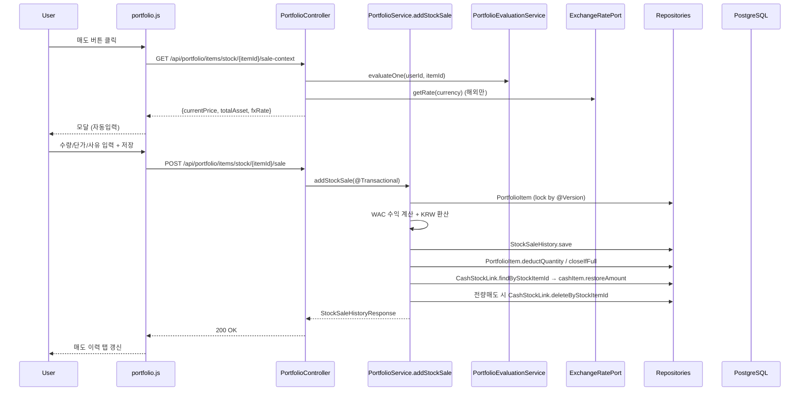
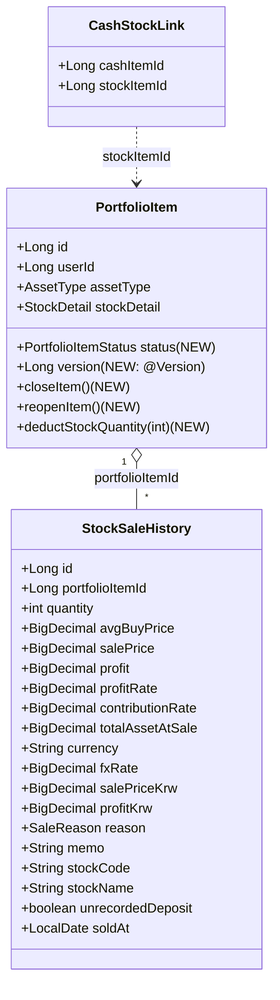
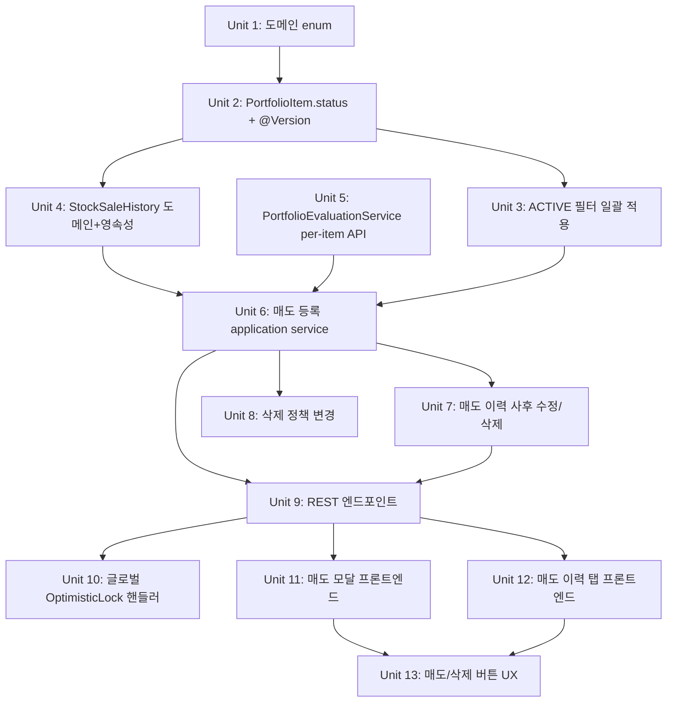

# 포트폴리오 주식 매도 기능

## Overview

포트폴리오 도메인에 **주식 매도(sale)** 기능을 도입한다. 기존에는 삭제(잘못 입력 정정)만 존재해 매도 시점의 실제 가격·수익을 기록할 수 없었는데, 이번 작업에서는 매도와 삭제를 분리하고 매도 이력을 별도 도메인으로 누적하여 실현 수익률을 회고할 수 있게 한다. 이 시스템은 실시간 시장가 추적이 아닌 사용자가 직접 입력한 투자 기록을 진실 공급원(SoT)으로 한다는 원칙을 따른다.

## Problem Frame

(원본 요구사항: docs/brainstorms/2026-04-26-portfolio-stock-sale-requirements.md)

현재 `PortfolioController.deleteItem`은 사용자가 입력한 `restoreAmount`로 연결 CASH를 복원할 뿐, 매도 이력·실현 수익을 남기지 않는다. 부분/전량 매도, 매도 단가 직접 입력, 월별 매도 타임라인 조회가 불가능하다. 이번 작업의 목표는 삭제 흐름을 그대로 유지하면서 별도 매도 흐름과 매도 이력 모델을 도입하는 것이다.

## Requirements Trace

origin 문서의 R1~R30, R9-1, R11-1, R14-1, R18-1, R18-2 모두 본 plan에서 처리한다. 자세한 매핑은 각 Implementation Unit의 `Requirements:` 필드를 참조.

핵심 성공 기준:
- 부분/전량 매도가 가능하며 사용자가 입력한 판매단가가 SoT다.
- 매도 1건마다 종목 수익률(R9)과 자산 기여율(R9-1) 두 수익률이 함께 저장·표시된다.
- 매도 이력은 사용자 단위로 월별 타임라인에서 회고할 수 있다.
- 전량 매도된 항목(`CLOSED`)은 보유 목록에서 숨겨지지만 매도 이력 탭에서는 계속 조회된다.
- 잘못 입력한 매도는 이력 사후 수정으로 정정 가능하다.

## Scope Boundaries

- 본 plan 포함: 주식(`AssetType.STOCK`) 항목의 매도 등록·이력·사후 수정·삭제 흐름 정정 + 해외 주식 통화/환율 처리.
- 후속 분리 (이 plan 제외):
  - 자산 분류별 목표 비중 설정 (#29의 1~2번)
  - 주식 외 자산(채권/부동산/펀드/현금/코인 등) 매도/매각 통합 모델
  - FIFO/세금 계산
  - 외부 증권사 매도 데이터 연동
  - 주식 분할/병합 등 코퍼레이트 액션 자동 보정
  - 매도 회고 트리거(이메일/푸시 알림)

## Context & Research

### Relevant Code and Patterns

- **StockPurchaseHistory 패턴(미러 대상)** — `src/main/java/com/thlee/stock/market/stockmarket/portfolio/{domain/model/StockPurchaseHistory.java, domain/repository/StockPurchaseHistoryRepository.java, infrastructure/persistence/StockPurchaseHistoryEntity.java, infrastructure/persistence/StockPurchaseHistoryJpaRepository.java, infrastructure/persistence/StockPurchaseHistoryRepositoryImpl.java, application/dto/StockPurchaseHistoryResponse.java, presentation/dto/StockPurchaseHistoryUpdateRequest.java}` — 도메인 모델·엔티티·포트·어댑터·DTO 모두 1:1 미러.
- **PortfolioItem JOINED 상속** — `portfolio/infrastructure/persistence/PortfolioItemEntity.java` (부모) + 9개 sub-entity. 새 컬럼(`status`, `version`)은 부모 테이블(`portfolio_item`)에 추가.
- **PortfolioItem 15-arg reconstruction constructor** (`PortfolioItem.java:34-64`) + 모든 factory(`createWithStock` 등) → status 필드 도입 시 일괄 갱신.
- **PortfolioItemMapper** — `portfolio/infrastructure/persistence/mapper/PortfolioItemMapper.java`의 `toDomain`(L77)·`toEntity`(L102-184, 9개 case).
- **CashStockLink 차감/복원** — `PortfolioService.deductCashBalance`(L797-809)·`handleStockDeletion`(L918-933) 패턴. 매도 입금에서 동일 패턴으로 `cashItem.restoreAmount(salePriceKrw)` 호출.
- **PortfolioEvaluationService** — `evaluatePortfolios(List<Long>)` 단일 메서드. `ItemEvaluation` DTO에 `itemId` 미존재 → per-item API 신설 필요.
- **ExchangeRatePort/KoreaEximExchangeRateAdapter** — `stock/domain/service/ExchangeRatePort.java`. 환율 자동 fallback에 활용.
- **PortfolioController endpoints** — `@RequestMapping("/api/portfolio")`, `@RequestParam Long userId` 일관 사용. `items/stock/{itemId}/purchase` 패턴을 매도에 미러.
- **Frontend 컴포넌트** — `src/main/resources/static/js/components/portfolio.js`(1369 lines). `dashboard()` Alpine root. `index.html` L1158 이하 `currentPage === 'portfolio'` 영역에 매도 모달·매도 이력 탭 추가.
- **API 클라이언트** — `static/js/api.js`의 `addStockPurchase`/`getPurchaseHistories`/`updatePurchaseHistory`/`deletePurchaseHistory` 미러.
- **`@Version` 사용 부재** — codebase 전체에서 0 matches. 이번 plan이 첫 도입.

### Institutional Learnings

- **`docs/solutions/architecture-patterns/deposit-history-n-plus-one-batch-pattern.md`** — 이력 조회는 반드시 `findByPortfolioItemIdIn(List<Long>)` 배치 + `Collectors.groupingBy`. `LocalDate.now()`을 도메인 메서드 안에 두지 말고 application에서 주입. Bean Validation을 매도 Request DTO에 적용.
- **`docs/solutions/architecture-patterns/external-http-per-item-transaction-isolation-2026-04-26.md`** — 외부 HTTP를 `@Transactional` 안에서 루프 호출 금지. 본 plan은 매도 1건 단위 트랜잭션이라 직접 위반은 없지만, 매도 시점에 KIS 가격 조회를 단일 트랜잭션 안에서 수행하지 않도록(미리 조회한 캐시값 사용) 주의.
- **`docs/solutions/architecture-patterns/stocknote-chartjs-mixed-line-scatter.md`** — 매도 이력 탭이 차트를 포함할 경우 적용(현 plan은 표/카드 뷰이므로 직접 적용 X).

### External References

외부 리서치 미실시 — 로컬 StockPurchaseHistory 패턴이 강력하고, `@Version`·낙관적 락은 JPA 표준 기능, ExchangeRatePort도 이미 구현 완료. 외부 자료 추가 가치 낮음.

## Key Technical Decisions

| 결정 | 근거 |
|------|------|
| StockSaleHistory를 `portfolio` 도메인 하위에 위치 | 매도는 PortfolioItem 변경의 부수효과(매수 이력과 같은 위상). origin Key Decisions의 "stock/portfolio 도메인 경계 결정" 사항 — repo research에서 확인된 일관된 패턴 적용 |
| `PortfolioItem.status: ACTIVE/CLOSED` 부모 테이블 컬럼 | JOINED 상속, 단일 status 컬럼 + sub-entity 마이그레이션 영향 없음 |
| `@Version Long version` 부모 테이블 컬럼 | 동시 매도 충돌 감지(R18-2). Hibernate `OptimisticLockException` → 글로벌 핸들러에서 HTTP 409 변환 |
| `findByUserIdAndStatus(userId, ACTIVE)` 기본 + `findByUserIdAllStatuses` 별도 메서드 | origin R18-1: 기본 ACTIVE, 매도 이력 화면만 명시적 CLOSED 포함 |
| 가중평균단가(WAC)는 매도 시 평균단가 그대로 유지 | 부분 매도 후 잔여 수량의 평균단가는 변하지 않음. 사후 수정으로 매수 이력이 바뀌면 `recalculateFromPurchaseHistories` 호출하여 재계산(기존 패턴 재사용) |
| 환율은 매도일 자동 조회(`ExchangeRatePort`) + 사용자 수정 가능 | KoreaEximExchangeRateAdapter 캐시 활용. 사용자 입력 SoT 원칙 따라 사용자가 직접 입력하면 그 값 우선 |
| 서버 재계산 SoT, 클라이언트는 미리보기만 | origin R11. 부동소수/반올림 표류 방지. `BigDecimal scale=2 HALF_UP` 통일 |
| 페이징 정책: 매도 이력 탭은 월 단위 무한 스크롤 | 단일 사용자, 누적량 제한적. `Pageable size=24개월/page` 또는 단순 전체 조회 후 클라이언트 그룹핑 — 초기 구현은 후자(단순), 필요 시 페이징 도입 |
| `unrecordedDeposit` 플래그는 boolean 컬럼 | CASH 항목 0개 사용자 매도 허용 (origin R20). 매도 이력 화면에서 시각적 경고 |
| 매도 이력 사후 수정은 모달 진입점을 매도 이력 행 상세 모달에서 제공 | 단순한 IA, 잘못된 정정을 위한 명시적 흐름 |

## Open Questions

### Resolved During Planning

- **매도 이력 엔티티 위치(R12, R14)**: `portfolio` 도메인 하위. stock 도메인은 종목 정보(가치평가/재무) 전담. 매도는 PortfolioItem의 부수효과. → `portfolio.domain.model.StockSaleHistory`.
- **ACTIVE 필터 적용 범위(R15~R18, R18-1)**: 4개 진입점 일괄 적용:
  - `PortfolioService.getItems` (보유 목록)
  - `PortfolioAllocationService.getAllocation` (자산 배분)
  - `PortfolioEvaluationService.evaluatePortfolios` (평가)
  - `KeywordServiceImpl.collectNewsForKeyword` (뉴스 매칭)
  - 단건 조회(`findById`)는 그대로 유지(매도 이력 사후 수정 등 CLOSED 항목 접근 필요).
- **페이징 정책(R26~R28)**: 초기 구현은 사용자 단위 전체 조회 후 클라이언트 월별 그룹핑. 누적량 증가 시 후속 페이징 도입.
- **환율 입력 UX(R11-1)**: 모달 진입 시 매도일 기준 `ExchangeRatePort.getRate(currency)` 자동 입력 → 사용자 수정 가능 → 입력 실패/없음 시 빈 칸 + 안내.
- **매도 이력 사후 수정 진입점**: 매도 이력 탭의 각 행 클릭 → 상세 모달 → 수정 버튼.

### Deferred to Implementation

- 매도 이력 응답 DTO에 KRW 환산값 표시 형식(통화 따라 다른 자릿수 처리)은 구현 시 표준화.
- 글로벌 `ExceptionHandler`에 `ObjectOptimisticLockingFailureException` 매핑이 이미 존재하는지(현재 컨트롤러 단위 핸들러는 stocknote에만 있음) 확인 후 추가 위치 결정.
- 매도 모달 진입 시 `PortfolioEvaluationService.evaluateForUser(userId)` 캐시 결과를 어떤 방식(요청 시 즉시 vs 백그라운드)으로 가져올지의 응답 시간은 실제 테스트 후 조정.
- 매도 사후 수정 시 매수 이력은 변경되지 않으므로 평균단가는 그대로 유지 — 단, 수량을 늘려서 보유 수량이 음수가 되는 케이스 검증 로직(엣지) 구현 시 명확화.

## High-Level Technical Design

> *This illustrates the intended approach and is directional guidance for review, not implementation specification. The implementing agent should treat it as context, not code to reproduce.*

### 매도 등록 시퀀스(직관 다이어그램)

### 도메인 객체 관계

## Implementation Units

### Phase 1: 도메인 & 영속성 기반

- [x] **Unit 1: 도메인 enum 추가**

  **Goal:** PortfolioItem 상태와 매도 사유 enum 도입.

  **Requirements:** R15, R29

  **Dependencies:** None

  **Files:**
  - Create: `src/main/java/com/thlee/stock/market/stockmarket/portfolio/domain/model/enums/PortfolioItemStatus.java`
  - Create: `src/main/java/com/thlee/stock/market/stockmarket/portfolio/domain/model/enums/SaleReason.java`

  **Approach:**
  - `PortfolioItemStatus`: `ACTIVE("보유 중")`, `CLOSED("전량 매도 완료")`. `description` getter 패턴(`AssetType` enum과 동일).
  - `SaleReason`: `TARGET_PRICE_REACHED("목표가 도달")`, `STOP_LOSS("손절")`, `CASH_NEEDED("현금 확보")`, `REBALANCING("리밸런싱")`, `OTHER("기타")`. `ALLOCATION_OVER`은 후속.

  **Patterns to follow:**
  - `AssetType.java` (description 필드 + 생성자 패턴).

  **Test scenarios:**
  - Test expectation: none — 단순 enum 정의(behavioral logic 없음).

  **Verification:**
  - 새 enum이 도메인 패키지에 존재하고, AssetType과 동일한 형태(description getter)로 사용 가능.

- [x] **Unit 2: PortfolioItem 상태 필드 + 낙관적 락 도입**

  **Goal:** PortfolioItem 도메인/엔티티에 `status`와 `@Version` 도입, 모든 reconstruction 경로 갱신.

  **Requirements:** R15, R16, R17, R18, R18-2

  **Dependencies:** Unit 1

  **Files:**
  - Modify: `src/main/java/com/thlee/stock/market/stockmarket/portfolio/domain/model/PortfolioItem.java`
  - Modify: `src/main/java/com/thlee/stock/market/stockmarket/portfolio/infrastructure/persistence/PortfolioItemEntity.java`
  - Modify: 9개 sub-entity (`StockItemEntity.java`, `BondItemEntity.java`, `RealEstateItemEntity.java`, `FundItemEntity.java`, `CashItemEntity.java`, `CryptoItemEntity.java`, `GoldItemEntity.java`, `CommodityItemEntity.java`, `OtherItemEntity.java`)
  - Modify: `src/main/java/com/thlee/stock/market/stockmarket/portfolio/infrastructure/persistence/mapper/PortfolioItemMapper.java`
  - Test: `src/test/java/com/thlee/stock/market/stockmarket/portfolio/domain/model/PortfolioItemStatusTest.java` (신규)

  **Approach:**
  - 도메인:
    - `PortfolioItem`에 `private PortfolioItemStatus status` 필드 + `closeItem()` / `reopenItem()` / `deductStockQuantity(int)` 메서드 추가.
    - 모든 factory(`create`, `createWithStock`, `createWithBond`, …)에서 `status = ACTIVE` 초기화.
    - 15-arg → 17-arg reconstruction constructor (status, version 추가).
    - **(2026-04-27 보정)** `version`도 도메인에 패스스루 필드로 보유.
      - `private Long version` (Lombok `@Getter`만 노출, mutate 메서드/setter 없음 — 도메인은 *읽기 전용 패스스루*).
      - 새 항목 factory(`createWithStock` 등)는 `version = 0L` 초기화.
      - reconstruction 시 entity → domain → entity 왕복에서 version 손실 시 `Detached entity ... uninitialized version` 발생하므로, mapper가 도메인을 통해 version을 전달해야 함.
    - `closeItem()`은 `status == ACTIVE` 검증 후 CLOSED 전환, 재오픈은 사후 수정에서 사용(quantity > 0 복원 시).
    - `deductStockQuantity(int)`는 stockDetail 전용 — 새 quantity와 investedAmount 재계산. 새 quantity가 0이면 자동 closeItem 호출.
  - 엔티티:
    - `PortfolioItemEntity`에 `@Column(nullable=false) PortfolioItemStatus status`, `@Version Long version` 추가. 기존 9-arg constructor → 11-arg.
    - 9개 sub-entity의 `super(...)` 호출 갱신.
    - **(2026-04-27 보정)** `status`/`version` 컬럼은 NOT NULL이므로 기존 데이터가 존재하는 환경에서 ddl-auto:update가 실패하지 않도록 `columnDefinition`에 DEFAULT(`'ACTIVE'`, `0`) 명시.
  - 매퍼:
    - `toEntity` 9개 case branch에 status, version 전달. `toDomain`에 status, version 매핑 추가.
  - 마이그레이션: 기존 행은 `status='ACTIVE'`, `version=0`으로 backfill. SQL은 application 부팅 시 `ddl-auto: update`가 처리하나, **CLAUDE.md Entity 사전 승인 규칙상** 컬럼 추가 PR은 별도 승인 필요 — 본 plan 승인이 곧 컬럼 변경 승인을 포함한다고 본다.

  **Execution note:** 도메인 메서드(`closeItem`/`reopenItem`/`deductStockQuantity`)는 검증 분기가 많아 test-first 권장.

  **Patterns to follow:**
  - `PortfolioItem.deductAmount` / `restoreAmount` (검증 + state mutation 패턴).
  - 기존 reconstruction constructor 시그니처와 위치(`PortfolioItem.java:34`).

  **Test scenarios:**
  - Happy path: ACTIVE 항목 `deductStockQuantity(부분수량)` → quantity 차감, status 유지, investedAmount = avgBuyPrice × 잔여수량.
  - Happy path: ACTIVE 항목 `deductStockQuantity(전량)` → quantity 0, status CLOSED, investedAmount 0.
  - Edge case: `deductStockQuantity(0)` 또는 음수 → IllegalArgumentException.
  - Edge case: `deductStockQuantity(보유수량+1)` → IllegalArgumentException("보유 수량 초과").
  - Edge case: `deductStockQuantity` on non-STOCK → IllegalArgumentException.
  - Edge case: CLOSED 항목 `deductStockQuantity` → IllegalArgumentException.
  - Happy path: `closeItem()` from ACTIVE → status CLOSED.
  - Edge case: `closeItem()` from CLOSED → IllegalArgumentException.
  - Happy path: `reopenItem()` from CLOSED → status ACTIVE.
  - Edge case: `reopenItem()` from ACTIVE → IllegalArgumentException.

  **Verification:**
  - 모든 PortfolioItem factory가 status=ACTIVE로 항목 생성. 기존 reconstruction 경로(repository 조회) 정상 동작. 9개 sub-entity persist/load 정상.

- [x] **Unit 3: ACTIVE 필터 일괄 적용**

  **Goal:** 모든 기존 PortfolioItem 조회 경로에 ACTIVE 필터 적용, CLOSED 포함은 명시적 메서드로만 제공.

  **Requirements:** R18-1

  **Dependencies:** Unit 2

  **Files:**
  - Modify: `portfolio/domain/repository/PortfolioItemRepository.java` (메서드 시그니처 변경/추가)
  - Modify: `portfolio/infrastructure/persistence/PortfolioItemRepositoryImpl.java`
  - Modify: `portfolio/infrastructure/persistence/PortfolioItemJpaRepository.java`
  - Modify: `portfolio/application/PortfolioService.java` (`getItems`, `existsByUserIdAndItemNameAndAssetType` 호출부)
  - Modify: `portfolio/application/PortfolioAllocationService.java`
  - Modify: `portfolio/application/PortfolioEvaluationService.java`
  - Modify: `news/...` 의 `KeywordServiceImpl.java` (현 위치는 추후 확인, 현재 `findByUserIdAndItemNameAndNewsEnabled` 호출자)
  - Test: `src/test/java/.../portfolio/application/PortfolioServiceActiveFilterTest.java` (신규)

  **Approach:**
  - Repository 포트에:
    - 기본 조회를 ACTIVE-only로 의미 변경: `findByUserId(Long)`, `findByUserIdIn(List<Long>)`은 내부적으로 ACTIVE 필터.
    - 명시적 CLOSED 포함 조회: `findByUserIdIncludingClosed(Long)`, `findByIdIncludingClosed(Long)` 신설.
    - 단건 `findById(Long)`은 status 무관(매도 이력 사후 수정 등에서 CLOSED 접근 필요).
    - `existsByUserIdAndItemNameAndAssetType`은 ACTIVE만 체크(R18: 재매수는 새 항목).
  - JpaRepository에 `findByUserIdAndStatus(Long, PortfolioItemStatus)`, `findByUserIdInAndStatus`, `existsByUserIdAndItemNameAndAssetTypeAndStatus` 신규 메서드.
  - 호출자 영향:
    - `PortfolioService.getItems` → 변경 없음(기본 ACTIVE).
    - `PortfolioAllocationService.getAllocation` → 변경 없음.
    - `PortfolioEvaluationService.evaluatePortfolios` → 변경 없음.
    - `KeywordServiceImpl.collectNewsForKeyword` → 변경 없음.
    - 매도 이력 탭(Unit 9, 12)에서만 `findByUserIdIncludingClosed` 사용.

  **Patterns to follow:**
  - 기존 Repository 인터페이스 명명 규칙(`findByXxx`).

  **Test scenarios:**
  - Happy path: ACTIVE/CLOSED 혼합 사용자에서 `findByUserId`는 ACTIVE만 반환.
  - Happy path: `findByUserIdIncludingClosed`는 모두 반환.
  - Happy path: `existsByUserIdAndItemNameAndAssetType` — 동일 종목 CLOSED 존재 + 새 ACTIVE 등록 시 false 반환(중복 아님).
  - Edge case: `findById(closedItemId)` → 정상 반환(단건은 status 무관).
  - Integration: ACTIVE 필터 적용 후 `getAllocation` 결과에서 CLOSED 항목 invested_amount가 합산에서 제외됨.

  **Verification:**
  - 기존 보유 목록/Allocation/Evaluation/News-keyword 화면에서 CLOSED 항목이 노출되지 않는다. 매도 이력 탭에서만 CLOSED가 보인다.

- [x] **Unit 4: StockSaleHistory 도메인 모델·엔티티·영속성**

  **Goal:** 매도 이력 도메인을 StockPurchaseHistory 패턴으로 미러링 도입.

  **Requirements:** R12, R13, R14

  **Dependencies:** Unit 1, Unit 2

  **Files:**
  - Create: `portfolio/domain/model/StockSaleHistory.java`
  - Create: `portfolio/domain/repository/StockSaleHistoryRepository.java`
  - Create: `portfolio/infrastructure/persistence/StockSaleHistoryEntity.java`
  - Create: `portfolio/infrastructure/persistence/StockSaleHistoryJpaRepository.java`
  - Create: `portfolio/infrastructure/persistence/StockSaleHistoryRepositoryImpl.java`
  - Test: `src/test/java/com/thlee/stock/market/stockmarket/portfolio/domain/model/StockSaleHistoryTest.java` (신규)

  **Approach:**
  - **Domain model `StockSaleHistory`**: `@Getter` POJO. 필드: `id, portfolioItemId, quantity, avgBuyPrice, salePrice, profit, profitRate, contributionRate, totalAssetAtSale, currency, fxRate, salePriceKrw, profitKrw, reason (SaleReason), memo, stockCode, stockName, unrecordedDeposit, soldAt (LocalDate), createdAt, updatedAt`.
  - 정적 factory `create(...)`: 검증(quantity > 0, salePrice > 0, soldAt 미래 금지). reason은 nullable 허용 X(`OTHER` 디폴트는 application).
  - 도메인 메서드 `update(quantity, salePrice, reason, memo)`: 사후 수정용. profit/profitRate/contributionRate/salePriceKrw/profitKrw는 application에서 재계산하여 새 인스턴스 또는 setter형 update.
  - 보조 메서드 `recomputeProfit(BigDecimal totalAssetAtSale, BigDecimal fxRate)`: WAC 기반 profit/profitRate/contributionRate 재계산 + KRW 환산.
  - **Repository port**: `save`, `findById`, `findByPortfolioItemId(Long)`, `findByPortfolioItemIdIn(List<Long>)`, `findByUserId(Long)`(JOIN), `delete`, `deleteByPortfolioItemId`. 페이징은 후속.
  - **Entity**: standalone `@Entity`, `IDENTITY` PK, `@Index(columnList="portfolio_item_id")`, `@Index(columnList="sold_at")`. 컬럼 18개. `currency VARCHAR(3)`, `reason VARCHAR(40)` enum string mapping.
  - **JpaRepository**: `findByPortfolioItemIdOrderBySoldAtAsc`, `findByPortfolioItemIdInOrderBySoldAtAsc`, `findByPortfolioItemIdInOrderBySoldAtDesc`, `deleteByPortfolioItemId`, 사용자 단위 JOIN을 위한 native or QueryDSL.
  - **Repository impl**: inline `toEntity`/`toDomain`. PortfolioItemId 단위 + 사용자 단위 lookup. 사용자 단위 조회는 `JpaRepository`에 `@Query`로 PortfolioItem 조인하거나, application에서 itemIds를 먼저 가져와 batch.

  **Patterns to follow:**
  - StockPurchaseHistory 6개 파일(domain model/repo, entity/jpa/impl).

  **Test scenarios:**
  - Happy path: `StockSaleHistory.create` 정상 생성 (모든 필수 필드).
  - Edge case: quantity 0/음수 → IllegalArgumentException.
  - Edge case: salePrice 0/음수 → IllegalArgumentException.
  - Edge case: 미래 soldAt → IllegalArgumentException.
  - Happy path: `recomputeProfit` 정상 (KRW + 외화 분기).
  - Edge case: avgBuyPrice 0 → division by zero 회피(profitRate 계산 시 throw).

  **Verification:**
  - 매도 이력 1건 저장/조회/삭제가 영속성 레이어에서 정상 동작. 18개 컬럼 매핑 일치. 인덱스 생성 확인.

### Phase 2: Application 계층

- [x] **Unit 5: PortfolioEvaluationService per-item API + ItemEvaluation 확장**

  **Goal:** 매도 모달이 단일 종목 평가가격을 직접 조회할 수 있게 함. ItemEvaluation에 itemId 추가.

  **Requirements:** R3, R10, R9-1

  **Dependencies:** Unit 2

  **Files:**
  - Modify: `portfolio/application/PortfolioEvaluationService.java`
  - Modify: `portfolio/application/dto/PortfolioEvaluation.java` (ItemEvaluation에 `Long itemId` 필드 추가)
  - Test: `src/test/java/.../portfolio/application/PortfolioEvaluationServicePerItemTest.java`

  **Approach:**
  - `ItemEvaluation`에 `Long portfolioItemId` 필드 추가 (response payload 확장 — 기존 호출자는 무시).
  - 새 메서드:
    - `Optional<ItemEvaluation> evaluateOne(Long userId, Long portfolioItemId)`: 단건 평가. 내부적으로 stock detail의 stockCode/market 사용해 `StockPriceService.getPrice` 호출 → `currentPrice`/`evaluatedAmount`/`changeRate` 산출.
    - `BigDecimal computeTotalAsset(Long userId)`: 매도 시점 전체 자산 평가금액(현금 포함). 기존 `evaluatePortfolios([userId]).get(userId).getTotalEvaluated()` 재사용 가능.
  - 캐시: `StockPriceService` 내부 Caffeine 캐시 그대로 활용. 추가 캐시 레이어 도입 X.
  - 캐시 미스/실패 시 `currentPrice = null` 반환(원본 동작 유지). UI(Unit 11)에서 `null` → 빈 입력 + 안내 처리.

  **Patterns to follow:**
  - 기존 `evaluatePortfolios` 흐름(L46~).
  - `StockPriceService.getPrice` 시그니처(stock 도메인).

  **Test scenarios:**
  - Happy path: STOCK 항목 단건 평가 → currentPrice·evaluatedAmount 정확.
  - Edge case: 비-STOCK 항목 → IllegalArgumentException.
  - Edge case: 다른 사용자 소유 itemId → IllegalArgumentException(권한).
  - Edge case: KIS 호출 실패 → currentPrice=null 포함 결과 반환.
  - Happy path: `computeTotalAsset` 모든 자산 합계 정확(현금 포함, CLOSED 제외).

  **Verification:**
  - 매도 모달 API 호출 시 단일 종목 평가가격을 200ms 내 응답(캐시 hit). itemId 필드가 응답에 포함.

- [x] **Unit 6: 매도 등록 application service**

  **Goal:** 매도 1건을 단일 트랜잭션으로 처리(이력 기록 + 보유 수량 차감 + CASH 입금 + 상태 전환).

  **Requirements:** R5, R6, R7, R8, R9, R9-1, R10, R11, R11-1, R12, R13, R15~R18, R18-2, R19, R20, R29, R30

  **Dependencies:** Unit 2, Unit 4, Unit 5

  **Files:**
  - Modify: `portfolio/application/PortfolioService.java` (`addStockSale` 메서드 신규)
  - Test: `src/test/java/.../portfolio/application/PortfolioServiceAddStockSaleTest.java`

  **Approach:**
  - 새 메서드 시그니처(개념): `StockSaleHistoryResponse addStockSale(Long userId, Long stockItemId, AddStockSaleParam param)` where param는 quantity, salePrice, soldAt, reason, memo, fxRate(nullable, 해외만), depositCashItemId(nullable, 링크 미연결 시 사용자 선택).
  - 메서드는 `@Transactional`. 흐름:
    1. `findById(stockItemId)` (status 무관) — STOCK 검증, status==ACTIVE 검증, userId 매칭.
    2. 수량/단가 검증(R5: 보유 수량 ≤ 매도 수량, R6: soldAt ≤ today).
    3. 환율 처리(외화 종목): `param.fxRate` 우선 → 없으면 `ExchangeRatePort.getRate(currency)`. 결과가 null이면 `salePriceKrw=null` + `unrecordedDeposit=true` 강제? — 아니, 환율 부재는 `salePriceKrw=null` + 입금 건너뜀(주의 안내), `unrecordedDeposit=true`.
    4. WAC 기반 profit 계산: `profit = (salePrice - avgBuyPrice) * quantity` (종목 통화). `profitRate = profit / (avgBuyPrice * quantity) * 100`. KRW 환산: `salePriceKrw = salePrice * fxRate * quantity`(KRW면 fxRate=1), `profitKrw = profit * fxRate`.
    5. `totalAssetAtSale = PortfolioEvaluationService.computeTotalAsset(userId)` 스냅샷.
    6. `contributionRate = profitKrw(또는 KRW 그대로 profit) / totalAssetAtSale * 100`. 단위 통일: KRW 기준.
    7. CashStockLink 처리:
       - `findByStockItemId(stockItemId)`가 있으면 해당 cashItemId로 `cashItem.restoreAmount(salePriceKrw)`.
       - 없고 `param.depositCashItemId`가 주어졌으면 그 cashItem으로 입금.
       - 없고 사용자 CASH 항목이 0개이면 `unrecordedDeposit=true`로 이력 저장(입금 건너뜀).
    8. `portfolioItem.deductStockQuantity(quantity)` 호출 → 자동 closeItem(전량 매도 시).
    9. 전량 매도(CLOSED) 시 `cashStockLinkRepository.deleteByStockItemId`.
    10. `StockSaleHistoryEntity` 저장 — 모든 스냅샷 필드 포함.
    11. `portfolioItemRepository.save(stockItem)` → @Version 충돌 시 `ObjectOptimisticLockingFailureException` 그대로 propagate.
    12. 응답 DTO 생성 후 반환.
  - 외화 KRW 환산이 안 될 때(fxRate null) 명시적으로 입금 건너뛰고 사용자에게 토스트 안내(presentation에서).
  - LocalDate.now()는 application 메서드 인자 또는 `Clock` bean 통해 주입(institutional learnings 권고).

  **Execution note:** 매도 흐름은 트랜잭션 boundary 핵심 — 각 분기(외화/링크/0개 CASH/전량매도)별 test-first 권장.

  **Patterns to follow:**
  - 기존 `PortfolioService.addStockPurchase` (L372~) 트랜잭션 흐름.
  - `handleStockDeletion`(L918~) CashStockLink 삭제 패턴.
  - `deductCashBalance`(L797~) CASH 입금 패턴.

  **Test scenarios:**
  - Happy path: 부분 매도 → 수량 차감, status ACTIVE, CASH 자동 입금, 매도 이력 1건.
  - Happy path: 전량 매도 → status CLOSED, CashStockLink 해제, 매도 이력 1건.
  - Happy path: 해외 주식 매도 → fxRate 자동 적용, salePriceKrw/profitKrw 정확.
  - Happy path: 사용자 입력 fxRate 우선 적용.
  - Edge case: 보유 수량 초과 매도 → IllegalArgumentException.
  - Edge case: 미래 soldAt → IllegalArgumentException.
  - Edge case: CLOSED 항목 매도 시도 → IllegalArgumentException.
  - Edge case: CashStockLink 미연결 + depositCashItemId 미지정 + CASH 0개 → 매도 성공, unrecordedDeposit=true, CASH 입금 없음.
  - Edge case: CashStockLink 미연결 + depositCashItemId 지정 → 해당 CASH에 입금.
  - Edge case: 외화 환율 자동 조회 실패 → salePriceKrw=null, unrecordedDeposit=true, 매도 이력은 저장.
  - Edge case: contributionRate 계산 시 totalAssetAtSale = 0 → 0 또는 null 반환(division-by-zero 회피).
  - Integration: 매도 후 같은 사용자의 `getAllocation`/`evaluatePortfolios`에서 CLOSED 항목 제외됨.
  - Integration: 매도 시 동시 다중 호출(@Version 충돌) → 한쪽만 성공, 다른 쪽 OptimisticLockingFailure.

  **Verification:**
  - 매도 1건 등록 후: StockSaleHistory 1건, PortfolioItem.quantity 감소 또는 status CLOSED, CASH PortfolioItem.investedAmount 증가 또는 unrecordedDeposit=true. 트랜잭션 부분 실패 시 모두 롤백.

- [x] **Unit 7: 매도 이력 사후 수정/삭제**

  **Goal:** 잘못 등록한 매도를 수정하거나 삭제. 수정 시 보유 수량/CASH 입금/상태를 일관 재계산.

  **Requirements:** R14-1

  **Dependencies:** Unit 6

  **Files:**
  - Modify: `portfolio/application/PortfolioService.java` (`updateSaleHistory`, `deleteSaleHistory` 메서드 신규)
  - Test: `src/test/java/.../portfolio/application/PortfolioServiceUpdateSaleHistoryTest.java`

  **Approach:**
  - `updateSaleHistory(Long userId, Long stockItemId, Long historyId, UpdateSaleParam param)` `@Transactional`.
    - 기존 매도 이력 1건의 quantity/salePrice/reason/memo를 받아 재계산.
    - 흐름: 기존 이력 로드 → 차이값(`deltaQuantity = newQuantity - oldQuantity`) 계산 → PortfolioItem 보유 수량을 deltaQuantity만큼 추가 차감(또는 복원) → CASH 입금액 차이 보정 → 매도 이력 필드 업데이트 → 이력 재계산(profitRate, contributionRate은 기존 totalAssetAtSale 스냅샷 그대로 두고 profit만 재계산. **단, 정책 결정**: 이력 수정 시 totalAssetAtSale은 freezed snapshot이므로 contributionRate만 다시 산출).
    - PortfolioItem이 CLOSED였는데 수정 후 잔여 quantity > 0 → `reopenItem()` 호출하여 ACTIVE 복원.
    - PortfolioItem이 ACTIVE였는데 수정 후 잔여 quantity == 0 → `closeItem()` 호출.
    - CashStockLink가 해제(전량 매도 시)되었던 상태에서 ACTIVE로 복귀하는 케이스: 링크 자동 복구 X(사용자 책임). 이는 deferred decision, 단순화를 위해 본 plan은 자동 복구 안 함, 사용자에게 안내.
  - `deleteSaleHistory(Long userId, Long stockItemId, Long historyId)` `@Transactional`.
    - 매도 이력 1건 삭제 + 보유 수량 복원 + CASH 차감(입금했던 금액 만큼) + status 복원(CLOSED → ACTIVE).
    - unrecordedDeposit=true였던 이력 삭제 시 CASH 차감 건너뜀.

  **Execution note:** 수정 흐름의 분기(부분/전량, 환율 변경, ACTIVE↔CLOSED 전환)별 test-first.

  **Patterns to follow:**
  - 기존 `updatePurchaseHistory` (L513~).

  **Test scenarios:**
  - Happy path: 매도 이력 수량 감소(2 → 1) → PortfolioItem quantity +1 복원, CASH 차감(salePriceKrw × 1).
  - Happy path: 매도 이력 단가 수정 → profit/profitRate 재계산, CASH 입금액 차이 조정.
  - Happy path: 사유/메모만 수정 → 다른 필드 무변화.
  - Happy path: 수정으로 잔여 수량 0 → closeItem.
  - Happy path: CLOSED 항목의 매도 이력 수정으로 quantity 감소 → reopenItem.
  - Happy path: 매도 이력 삭제 → quantity 복원, CASH 차감, status 복원.
  - Edge case: unrecordedDeposit=true 이력 삭제 → CASH 차감 건너뜀.
  - Edge case: 다른 사용자 이력 접근 → IllegalArgumentException.
  - Edge case: 매도 이력 수정으로 보유 수량이 음수가 되는 경우 → IllegalArgumentException.
  - Integration: 매도 → 수정 → 삭제 순으로 진행 후 PortfolioItem 상태가 매도 전과 동일해야 함.

  **Verification:**
  - 매도 이력의 수량/단가 수정이 PortfolioItem 보유 수량·CASH 잔액·status를 일관되게 재계산. 모든 변경은 단일 트랜잭션.

- [x] **Unit 8: 삭제 정책 변경(매도 이력 있는 항목 삭제 차단)**

  **Goal:** R23 적용 — 매도 이력이 1건이라도 있으면 PortfolioItem 삭제 불가. CLOSED 항목도 삭제 불가.

  **Requirements:** R22, R23

  **Dependencies:** Unit 4, Unit 6

  **Files:**
  - Modify: `portfolio/application/PortfolioService.java` (`deleteItem` / `handleStockDeletion` 분기에 매도 이력 검사 추가)
  - Test: `src/test/java/.../portfolio/application/PortfolioServiceDeleteItemSaleGuardTest.java`

  **Approach:**
  - `deleteItem` 진입 시 STOCK 항목이면 `stockSaleHistoryRepository.findByPortfolioItemId(itemId).isEmpty()` 체크. 매도 이력 존재 시 IllegalArgumentException("매도 이력이 있는 항목은 삭제할 수 없습니다").
  - status=CLOSED 항목은 자동으로 매도 이력 ≥ 1이므로 동일 분기에서 차단.
  - R22(차감 금액 그대로 복원)는 기존 `restoreAmount` 입력 동작 유지.
  - 사용자가 매도 이력을 모두 삭제(Unit 7)한 후에야 PortfolioItem 삭제 가능.

  **Patterns to follow:**
  - `handleStockDeletion`(L918~) 검증 패턴.

  **Test scenarios:**
  - Happy path: 매도 이력 0건 + ACTIVE 항목 → 삭제 성공(기존 흐름).
  - Edge case: 매도 이력 ≥ 1건 → IllegalArgumentException.
  - Edge case: CLOSED 항목 → IllegalArgumentException(이력 존재 ≥ 1이므로).
  - Happy path: 매도 이력 모두 삭제(Unit 7) 후 항목 삭제 → 성공.

  **Verification:**
  - DELETE /api/portfolio/items/{itemId} 호출 시 매도 이력 존재 항목은 400 Bad Request로 차단.

### Phase 3: Presentation 계층

- [x] **Unit 9: REST 엔드포인트 추가**

  **Goal:** 매도 등록·조회·수정·삭제 + 매도 모달 컨텍스트 + 사용자 단위 매도 이력 엔드포인트 추가.

  **Requirements:** R1, R2, R12, R14, R25, R26

  **Dependencies:** Unit 6, Unit 7

  **Files:**
  - Modify: `portfolio/presentation/PortfolioController.java`
  - Create: `portfolio/presentation/dto/StockSaleRequest.java`
  - Create: `portfolio/presentation/dto/StockSaleHistoryUpdateRequest.java`
  - Create: `portfolio/application/dto/StockSaleHistoryResponse.java`
  - Create: `portfolio/application/dto/StockSaleContextResponse.java` (모달 진입 시 currentPrice/totalAsset/fxRate 묶음)
  - Test: `src/test/java/.../portfolio/presentation/PortfolioControllerSaleTest.java`(MockMvc 슬라이스 또는 단위 — 본 repo의 컨트롤러 테스트 부재로 단위 테스트만)

  **Approach:**
  - 엔드포인트 5개 + 1:
    - `GET /api/portfolio/items/stock/{itemId}/sale-context?userId=...` → StockSaleContextResponse(currentPriceKrw, currentPriceOriginal, currency, fxRate(자동조회), totalAsset)
    - `POST /api/portfolio/items/stock/{itemId}/sale?userId=...` body StockSaleRequest → StockSaleHistoryResponse
    - `GET /api/portfolio/items/stock/{itemId}/sales?userId=...` → List<StockSaleHistoryResponse>
    - `PUT /api/portfolio/items/stock/{itemId}/sales/{historyId}?userId=...` body StockSaleHistoryUpdateRequest → StockSaleHistoryResponse
    - `DELETE /api/portfolio/items/stock/{itemId}/sales/{historyId}?userId=...` → 204
    - `GET /api/portfolio/sales?userId=...` → List<StockSaleHistoryResponse> (사용자 단위 전체, 매도일 내림차순)
  - StockSaleRequest 필드 + Bean Validation: `@NotNull Integer quantity`, `@DecimalMin("0.01") BigDecimal salePrice`, `@NotNull LocalDate soldAt`(`@PastOrPresent`), `@NotNull SaleReason reason`, `@Size(max=200) String memo`, optional `BigDecimal fxRate`, optional `Long depositCashItemId`.
  - StockSaleHistoryUpdateRequest는 quantity/salePrice/reason/memo만(`@PastOrPresent` 제거 — 기존 soldAt 유지).
  - `@Valid` 컨트롤러 메서드에 적용(institutional learnings 권고).

  **Patterns to follow:**
  - PortfolioController의 purchase 4 endpoints (L231~).
  - DepositRequest의 `@Valid` 사용 패턴.
  - `*Response.from(domain)` 정적 factory.

  **Test scenarios:**
  - Happy path: POST /sale 200 → response body에 historyId/profit/profitRate/contributionRate.
  - Edge case: invalid body (quantity 0) → 400.
  - Happy path: GET /sale-context 200 + 캐시된 currentPrice.
  - Happy path: PUT /sales/{historyId} 200 → 재계산된 응답.
  - Happy path: DELETE /sales/{historyId} 204.
  - Happy path: GET /api/portfolio/sales 200 → 매도일 내림차순.

  **Verification:**
  - 6개 엔드포인트 모두 200/204 정상 응답. Validation 위반은 400.

- [x] **Unit 10: 글로벌 ExceptionHandler에 OptimisticLockingFailure 매핑**

  **Goal:** `ObjectOptimisticLockingFailureException`을 HTTP 409 Conflict로 매핑.

  **Requirements:** R18-2

  **Dependencies:** Unit 6

  **Files:**
  - Modify or Create: 전역 `@RestControllerAdvice` 클래스 (현재 위치는 코드 확인 필요. portfolio 도메인 전용 핸들러가 없으면 신규 생성)
  - Test: `src/test/java/.../portfolio/presentation/OptimisticLockExceptionHandlerTest.java`

  **Approach:**
  - `@ExceptionHandler(ObjectOptimisticLockingFailureException.class)` → `ResponseEntity<ErrorResponse>` 409.
  - 응답 메시지: "다른 작업과 충돌했습니다. 새로고침 후 다시 시도해 주세요."
  - portfolio 영역 우선, stocknote 핸들러 패턴 참고.

  **Test scenarios:**
  - Happy path: 핸들러가 ObjectOptimisticLockingFailureException catch → 409.
  - Edge case: 다른 RuntimeException은 그대로 propagate.

  **Verification:**
  - 동시 매도 충돌 시 클라이언트가 409 + 메시지 수신.

### Phase 4: Frontend

- [x] **Unit 11: 매도 모달 + API 클라이언트**

  **Goal:** Alpine.js 매도 등록 모달 + 즉시 재계산 + 자동 입력 + 환율 입력 + 사후 수정 모달 공유.

  **Requirements:** R1, R2, R3, R4, R5, R6, R8, R10, R11-1, R20, R29

  **Dependencies:** Unit 9

  **Files:**
  - Modify: `src/main/resources/static/index.html` (매도 모달 마크업, 매도 이력 행 상세/수정 모달)
  - Modify: `src/main/resources/static/js/components/portfolio.js`
  - Modify: `src/main/resources/static/js/api.js`

  **Approach:**
  - **api.js**: `addStockSale(itemId, userId, payload)`, `getSaleContext(itemId, userId)`, `getSaleHistories(itemId, userId)`, `getAllUserSaleHistories(userId)`, `updateSaleHistory(itemId, historyId, userId, payload)`, `deleteSaleHistory(itemId, historyId, userId)`.
  - **portfolio.js** state 추가:
    - `showSaleModal: false`
    - `saleForm: { itemId, quantity, salePrice, salePriceKrw, soldAt, reason, memo, fxRate, currency, depositCashItemId }`
    - `saleContext: { currentPriceKrw, currentPriceOriginal, currency, fxRate, totalAsset }`
    - `salePreview: { profit, profitRate, contributionRate, profitKrw }` (즉시 재계산)
    - `saleHistoriesByItem: { [itemId]: [...] }`
    - `userSales: []` (탭용)
  - 메서드:
    - `openSaleModal(item)`: GET /sale-context로 saleContext 채움 → 폼 기본값(quantity=item.quantity, salePrice=currentPrice 또는 빈, soldAt=오늘, reason='OTHER', fxRate=context.fxRate). currentPrice 없으면 빈 입력 + 안내.
    - `recalculateSalePreview()`: salePrice/quantity/fxRate 변경 시 클라이언트에서 미리보기 계산(서버와 동일 공식). watch.
    - `submitSale()`: POST /sale → 응답 받으면 모달 닫고 매도 이력 탭 갱신.
    - `openSaleDetailModal(history)`: 상세 모달 (수정/삭제 버튼).
    - `submitSaleEdit(historyId)`: PUT /sales/{historyId}.
    - `confirmDeleteSale(historyId)`: DELETE /sales/{historyId} + 보유 수량/CASH/status 변경 안내.
  - 외화 종목 분기: currency !== 'KRW'이면 fxRate 입력 필드 노출 + KRW 환산값 라벨.
  - CASH 0개 사용자 분기: depositCashItemId 셀렉트가 비어 있으면 명시적 확인 체크박스(`unrecordedDeposit` 안내) 강제.
  - 안내 문구는 origin R4 그대로(3줄).
  - Tailwind 색상: 매도 액션은 `bg-rose-*` 또는 `bg-orange-*` (구매=emerald, 삭제=red 와 구분).
  - 즉시 재계산은 Alpine `x-effect` 또는 watch로 구현.
  - 접근성: 모달 Esc 닫기, 포커스 트랩, 첫 입력 자동 포커스. 매도 이력 +/- 색상은 부호로도 구분(`+`, `-`).

  **Patterns to follow:**
  - 기존 매수 모달(`index.html` L2173-2324).
  - portfolio.js의 `submitPurchase`/`loadPurchaseHistories` 흐름.
  - api.js의 `addStockPurchase` 시그니처.

  **Test scenarios:**
  - Test expectation: none — 프론트엔드 변경, 본 repo는 프론트엔드 자동 테스트 부재. 수동 검증으로 대체:
    - 매도 모달 진입 시 currentPrice 자동 입력
    - 단가 수정 시 profit/profitRate/contributionRate 즉시 갱신
    - 외화 종목 fxRate 자동 입력 + 사용자 수정 가능
    - 보유 수량 초과 입력 시 인라인 검증 메시지
    - CASH 0개 사용자 unrecordedDeposit 확인 단계
    - 매도 성공 후 보유 목록 갱신
    - Esc 닫기, 포커스 트랩 동작

  **Verification:**
  - 매도 모달이 열리고 모든 자동 입력이 동작. 즉시 재계산이 100ms 내 반영. 외화 종목 KRW 환산값이 실시간 표시. 매도 후 보유 목록과 매도 이력 탭 모두 갱신.

- [x] **Unit 12: 매도 이력 탭 + 월별 그룹 + 사후 수정 진입점**

  **Goal:** 포트폴리오 페이지 내 '매도 이력' 탭. 월별 타임라인. 두 수익률(R9/R9-1) 동시 표시. 빈 상태/필터 결과 빈 상태/로딩.

  **Requirements:** R14-1, R25, R26, R28

  **Dependencies:** Unit 9, Unit 11

  **Files:**
  - Modify: `src/main/resources/static/index.html` (매도 이력 탭 마크업, 빈 상태 카피, 월별 그룹)
  - Modify: `src/main/resources/static/js/components/portfolio.js` (`activeTab`, `loadAllUserSales`, `groupSalesByMonth`)

  **Approach:**
  - portfolio 페이지에 탭 컨트롤 추가: `activeTab: 'items' | 'sales'`.
    - 탭 헤더 2개 (`보유 자산`, `매도 이력`). Tailwind tab 스타일.
  - `매도 이력` 탭 진입 시 `loadAllUserSales()` → `userSales`.
  - 월별 그룹: `groupSalesByMonth(userSales)` → `[{month: '2026-04', items: [...], totalCount, totalSaleAmount, totalProfit}, ...]`.
  - 한 행 표시: 매도일, 종목(`stockName`/`stockCode`), 수량, 판매금액(`salePriceKrw` 또는 종목 통화 + KRW), 종목 수익률(`profitRate`±%), 자산 기여율(`contributionRate`±%), 사유 배지, `unrecordedDeposit` 경고 배지.
  - 월별 헤더 stats: 매도 건수, 총 판매금액(KRW 합), 총 수익금(KRW 합).
  - 빈 상태 카피: "아직 매도 이력이 없어요. 보유 주식 카드의 '매도' 버튼을 눌러보세요."
  - 행 클릭 → Unit 11의 `openSaleDetailModal(history)`.
  - 사후 수정 진입: 상세 모달의 '수정' 버튼.
  - 자산 분류 필터(R27)는 본 plan 제외(scope-guardian 결정).
  - 정렬 기본: 매도일 내림차순.

  **Patterns to follow:**
  - portfolio.js의 기존 카드 렌더 패턴.
  - Format helper(`Format.number`).
  - 매수 이력 표시 패턴(있을 경우).

  **Test scenarios:**
  - Test expectation: none — 프론트엔드. 수동 검증:
    - 탭 전환 시 `매도 이력`으로 진입 → 데이터 로드
    - 월별 그룹/합계 표시
    - 빈 상태 카피 표시
    - 행 클릭 시 상세 모달 열림
    - 두 수익률 부호+숫자+색상 모두 표시

  **Verification:**
  - 매도 이력 탭이 활성화되고 사용자 매도 이력 데이터가 월별 타임라인으로 표시. 사후 수정 모달 진입 가능.

- [x] **Unit 13: 매도/삭제 버튼 시각 분리 + disabled UX**

  **Goal:** 보유 주식 카드에 매도 버튼 추가. 삭제 버튼은 매도 이력 존재 시 disabled + 툴팁 안내. CLOSED 항목은 보유 목록에서 자연 숨김(Unit 3 결과).

  **Requirements:** R1, R18, R23, R24

  **Dependencies:** Unit 11, Unit 12

  **Files:**
  - Modify: `src/main/resources/static/index.html` (보유 주식 카드 액션 영역)
  - Modify: `src/main/resources/static/js/components/portfolio.js` (각 카드의 `hasSaleHistories` 계산)

  **Approach:**
  - 보유 주식 카드에 액션 버튼 4개: `매수`(emerald), `매도`(rose), `편집`(blue), `삭제`(red).
  - 매도 버튼은 `assetType === 'STOCK' && status === 'ACTIVE'` 조건에서만 표시.
  - 삭제 버튼은 `hasSaleHistories(item.id)` true이면 `disabled` + tooltip(`title=`): "매도 이력이 있어 삭제할 수 없습니다. 매도 이력 탭에서 정리하세요." Tailwind opacity-50 + cursor-not-allowed.
  - hasSaleHistories는 보유 목록 로드 후 `GET /api/portfolio/sales` 응답에서 매도 이력이 있는 itemId 집합을 만들어 빠르게 lookup.
  - CLOSED 항목은 ACTIVE 필터(Unit 3)로 보유 목록에 자연 숨김.
  - 모바일: 카드 하단 액션 버튼 가로 스크롤 또는 ⋯ 드롭다운(필요시).

  **Patterns to follow:**
  - `index.html:1305-1320` 기존 액션 버튼 슬롯.
  - Tailwind disabled 스타일.

  **Test scenarios:**
  - Test expectation: none — 프론트엔드. 수동 검증:
    - 매도 이력 0건 항목: 삭제 버튼 활성, 매도 이력 1건 이상 항목: 삭제 disabled
    - CLOSED 항목 보유 목록에 표시되지 않음
    - 모바일에서 액션 버튼 접근성 확보

  **Verification:**
  - 보유 카드에서 매도/삭제 시각 구분 명확. 삭제 disabled 시 툴팁이 명확하게 안내.

## System-Wide Impact

- **Interaction graph**:
  - PortfolioService.deleteItem ↔ Unit 8(매도 이력 검사) — 신규 가드.
  - PortfolioService.{addStockPurchase, deductCashBalance, handleStockDeletion, ...} ↔ Unit 6 트랜잭션 패턴 공유.
  - PortfolioEvaluationService 호출자(스케줄러, /api/portfolio/me-evaluation 등) ↔ Unit 5 ItemEvaluation 필드 추가.
  - KeywordServiceImpl(뉴스 매칭) ↔ Unit 3 ACTIVE 필터.
  - Frontend dashboard() Alpine root ↔ Unit 11/12/13 신규 상태/메서드.
- **Error propagation**:
  - 도메인 IllegalArgumentException → 기존 글로벌 핸들러 → 400 Bad Request.
  - ObjectOptimisticLockingFailureException → Unit 10 신규 핸들러 → 409 Conflict.
  - 외부 API 실패(KIS/환율) → null 반환 + 클라이언트 안내(예외 X).
- **State lifecycle risks**:
  - PortfolioItem.status 마이그레이션 시 기존 행 backfill 필요(application 부팅 시 `ddl-auto: update`로 NOT NULL 컬럼 추가는 default 값 필수).
  - StockSaleHistory 사후 수정 시 PortfolioItem 보유 수량/CASH 잔액/status가 모두 일관되게 변경되어야 — 단일 트랜잭션 강제.
  - CashStockLink 해제(전량 매도) 후 사후 수정으로 ACTIVE 복원 시 링크 자동 복구 X — 사용자 책임 명시.
- **API surface parity**:
  - 기존 `*PurchaseHistory*` 엔드포인트와 동일 패턴(`*SaleHistory*`)으로 추가 — 일관성.
  - `ItemEvaluation` DTO에 `portfolioItemId` 추가 → 기존 클라이언트는 무시 가능(backward-compatible).
- **Integration coverage**:
  - 매도 등록 → 보유 목록 갱신, Allocation 갱신, Evaluation 갱신, CASH 잔액 갱신을 모두 cross-layer 시나리오로 검증.
  - 매도 사후 수정 → 동일.
- **Unchanged invariants**:
  - StockPurchaseHistory 패턴/엔티티는 그대로(매도와 매수는 독립 엔티티).
  - 다른 자산 타입(BOND/REAL_ESTATE/...)의 add/update/delete 흐름은 영향 없음(status 컬럼만 추가, ACTIVE 기본값).
  - KIS RestClient/StockPriceService 시그니처 변경 없음.
  - JWT/auth 흐름 변경 없음.

## Risks & Dependencies

| Risk | Mitigation |
|------|------------|
| PortfolioItem.status 도입이 9개 sub-entity·매퍼·15-arg 생성자에 광범위 변경 → 누락 시 기존 흐름 망가짐 | Unit 2 test-first + 부팅 시 기존 항목 ACTIVE backfill SQL 검증 |
| ACTIVE 필터 누락된 진입점이 있을 경우 CLOSED 항목이 보유 목록/Allocation에 새어 들어옴 | Unit 3에서 4개 진입점 일괄 적용 + 통합 시나리오 테스트(매도 후 getAllocation에서 제외 확인) |
| 환율 자동 조회 실패 시 사용자 혼란 | salePriceKrw=null + unrecordedDeposit=true + 모달/이력 화면 시각 안내 |
| 동시 매도(다중 탭)로 보유 수량 음수 발생 | @Version 낙관적 락 + Unit 10 핸들러 |
| 매도 사후 수정의 ACTIVE↔CLOSED 전환 누락 | Unit 7 test-first + 통합 시나리오 매도→수정→삭제 round-trip |
| CashStockLink 자동 복구 안 함이 사용자에게 혼란 | 사후 수정 모달에서 "전량매도 → 부분매도로 변경 시 CASH 연결을 다시 설정해야 합니다" 안내 명시 |
| Entity 컬럼 추가가 CLAUDE.md 사전 승인 정책에 걸림 | 본 plan 승인 = 컬럼 변경 승인. 별도 design 문서는 plan 그대로 활용 |
| 매도 이력 사용자 단위 조회 페이징 부재로 향후 성능 저하 | 초기는 단순 전체 조회. 누적량 모니터링 후 후속 페이징 도입(Open Questions에 명시) |

## Documentation / Operational Notes

- 본 변경은 PostgreSQL DDL을 추가한다(`portfolio_item.status`, `portfolio_item.version`, 신규 `stock_sale_history` 테이블). `spring.jpa.hibernate.ddl-auto: update` 환경에서는 부팅 시 자동 반영. 운영 배포 시에는 마이그레이션 SQL을 별도 검토.
- 신규 시스템 동작은 `docs/solutions/`에 후속 사후 학습 문서로 정리 후보(트랜잭션 + 낙관적 락 + 외화 환산 패턴).
- 매도 이력 사용자 누적량을 매월 운영 모니터링하여 페이징 도입 시점 판단.

## Sources & References

- **Origin document**: [docs/brainstorms/2026-04-26-portfolio-stock-sale-requirements.md](../brainstorms/2026-04-26-portfolio-stock-sale-requirements.md)
- **Mirrored pattern**: `src/main/java/com/thlee/stock/market/stockmarket/portfolio/domain/model/StockPurchaseHistory.java` (StockSaleHistory의 미러 원본)
- **Architecture rules**: `ARCHITECTURE.md`(레이어/엔티티 규칙), `CLAUDE.md`(엔티티 사전 승인, Lombok, YAGNI)
- **Institutional learnings**:
  - `docs/solutions/architecture-patterns/deposit-history-n-plus-one-batch-pattern.md` (배치 조회, Bean Validation, LocalDate 주입)
  - `docs/solutions/architecture-patterns/external-http-per-item-transaction-isolation-2026-04-26.md` (트랜잭션 안에서 외부 호출 금지)
- **Related issues**: #29(포트폴리오 기능 확대), #32(주식 매도 기능)
- **Related plans**: `docs/plans/2026-03-17-001-feat-cash-stock-link-auto-deduction-plan.md`(CashStockLink 패턴 원형)