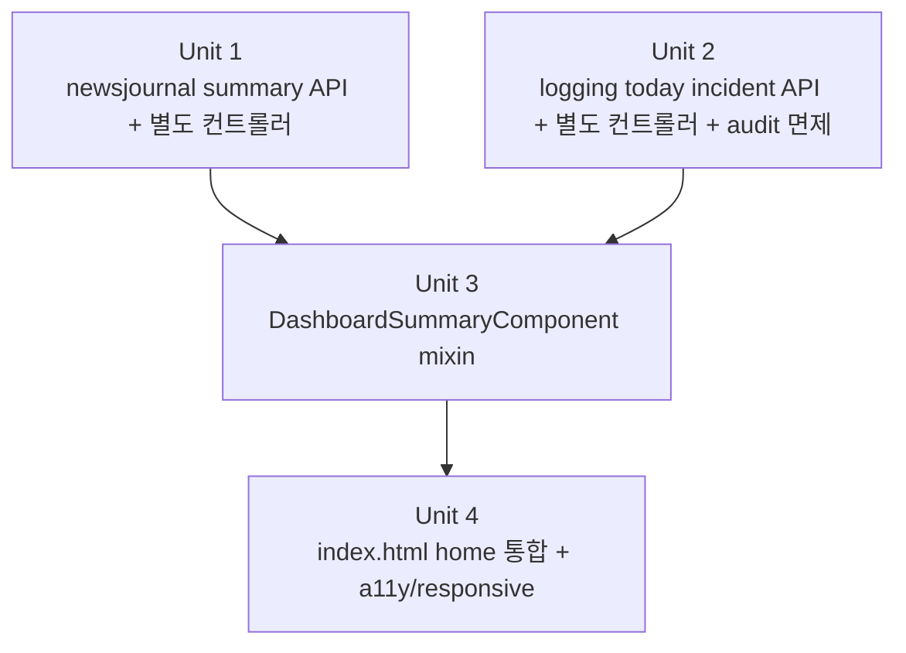

# feat: 메인 대시보드 요약 섹션 추가

## Overview

`index.html` 메인 페이지의 `home` 섹션에 4개 기능(뉴스 기록 / 투자 노트 / 월급 사용 비율 / 운영자 로그)의 요약 카드 섹션을 추가한다. 운영자 카드는 관리자 계정에 한해 노출되며, 카드 클릭 시 해당 기능 페이지로 이동한다. 데이터는 페이지 진입 시 1회만 조회한다(자동 갱신 없음). 본 plan 은 brownfield 작업으로, 기존 `HomeComponent.loadHomeSummary()` 와 **공존**한다 — 기존 home 카드(키워드/ECOS/포트폴리오/즐겨찾기/최근 업데이트)는 그대로 유지하며, 본 작업은 그 위에 4개 요약 카드를 prepend 한다.

## Problem Frame

기능이 늘어나면서 사용자가 각 페이지를 일일이 이동해야 최근 활동/현황을 파악할 수 있다. 메인 진입 시점에 4개 영역의 요약을 한눈에 보여주는 카드 섹션을 도입해 진입 비용을 낮춘다 (origin: `docs/brainstorms/2026-04-29-dashboard-requirements.md`).

## Requirements Trace

**Display & Layout**
- R1. 대시보드는 `index.html`의 `home` 페이지 상단 섹션으로 편입된다.
- R2. 페이지 진입 시 1회 조회만 수행한다 (자동/수동 갱신 버튼 없음).
- R8. 카드 영역 전체 클릭으로 해당 기능 페이지 이동.

**Card Data**
- R3. 뉴스 기록 카드: 최근 등록 3건(제목+등록일) + 카테고리별 총 건수.
- R4. 투자 노트 카드: 최근 작성 3건(종목명+작성일+요약 한 줄).
- R5. 월급 사용 비율 카드: 이번 달 카테고리별 비율을 파이/도넛 차트로 표시.
- R6. 운영자 로그 카드: 오늘 발생 장애 건수(단일 숫자). 응답 페이로드는 ES degrade 구분을 위한 가용성 플래그를 포함하나, 카드 표시는 단일 숫자가 유지된다(가용성 false 시 placeholder).

**Access & Empty State**
- R7. 운영자 카드는 관리자 계정에만 노출(빈 자리 없음).
- R9. 데이터 없음 상태에서도 레이아웃 유지 + "데이터 없음" 안내.

## Scope Boundaries

- 자동 갱신/실시간 푸시 제외(R2).
- 대시보드 전용 라우트(`/dashboard.html`) 신설 제외 — 메인 통합.
- 운영자 카드 외 지표(누적/주간 추이 등) 제외(R6).
- 사용자 위젯 커스터마이즈/순서 변경/숨김 제외.
- 신규 도메인 모델/엔티티 생성 없음 — 기존 모듈 application 계층 조회만 활용.
- **기존 `HomeComponent.homeSummary` 의 6개 영역(키워드/ECOS/Global/포트폴리오/즐겨찾기/최근 업데이트)은 변경하지 않음** — 본 plan 은 그 외에 4개 카드 섹션을 별도 mixin 으로 추가.

## Context & Research

### Relevant Code and Patterns

**프론트엔드**
- `src/main/resources/static/index.html` — 단일 `x-data="dashboard()"` 진입(L13). `auth.isAdmin` 으로 admin 메뉴 분기(L74). `currentPage === 'home'` 라우팅.
- `src/main/resources/static/js/app.js` — 모든 컴포넌트는 `dashboard()` 반환 객체에 spread mixin (`...HomeComponent`, `...StocknoteComponent`, `...SalaryComponent` 등) 으로 합쳐진다. **nested `x-data` 패턴은 코드베이스에 없음.**
- `src/main/resources/static/js/components/home.js` — `HomeComponent = { homeSummary: {...}, async loadHomeSummary() {...} }` 객체 mixin. `Promise.allSettled` 로 6개 영역 병렬 페치 중. `app.js` 의 `init` 및 `navigateTo('home')` 시점에 호출됨.
- `src/main/resources/static/js/components/auth.js` — `auth.isAdmin` 은 `loadMyProfile()` 성공 시점에만 세팅. `loadMyProfile` 실패 시 default `false` 유지(silent failure).
- `src/main/resources/static/js/api.js` — `request` 헬퍼가 `response.status === 401` 시 `window.location.href = '/login.html'` 자동 redirect. `Promise.allSettled` 로 묶어도 401 은 페이지 자체를 redirect 시킴(토큰 만료 시 home 진입에서 redirect 발생 가능).
- Chart.js CDN 이미 로드됨(`index.html` L8) → 도넛 차트 추가 비용 0.

**백엔드 (재사용/확장)**
- `salary.application.SalaryService#getMonthly(userId, yearMonth)` — `MonthlySalaryResponse` 에 카테고리별 amount + totalSpending + `incomeInheritedFromMonth` 포함. 비율은 프론트 계산.
- `salary.presentation.SalaryController` — `GET /api/salary/monthly/{yearMonth}?userId=...` (path: yearMonth, query: userId). 컨트롤러 docstring 에 따르면 SecurityContext 대조는 추후 보안 작업 범위(현재 신뢰 기반).
- `newsjournal.presentation.NewsJournalController` — 클래스 매핑 `/api/news-journal/events`. 카테고리는 `NewsEventCategoryController` 가 별도. 카테고리별 카운트 엔드포인트 부재(신설 필요).
- `newsjournal.domain.model.NewsEvent` — 도메인 팩토리 `requireNonNull(categoryId)` 강제. `occurredDate` (사건 발생일) + `createdAt` (등록일시) 별도 필드.
- `newsjournal.infrastructure.persistence.NewsEventEntity#category_id` — JPA 어노테이션은 nullable 허용(backfill 단계 경유). 도메인 신규 생성은 NOT NULL 이지만 잔존 NULL 행 가능성 존재 → group-by 결과의 NULL 키 처리 정책 필요.
- `newsjournal.infrastructure.persistence.NewsEventJpaRepository` — 기존 정렬은 `occurredDate DESC, id DESC` (`idx_news_event_user_date` 인덱스 정합). 신규 "최근 등록" 정렬은 `createdAt DESC` 이므로 별도 메서드 필요.
- `logging.presentation.AdminLogController` — 클래스 매핑 `/api/admin/logs`. `@GetMapping("/{domain}")` path-variable 패턴 사용 — **신규 dashboard 엔드포인트를 같은 클래스/매핑 하위에 두면 sibling 경로(`/incidents` 등)가 `/{domain}` 에 가로채여 400 + audit 누수 발생**. 따라서 별도 컨트롤러 + 별도 매핑(`/api/admin/dashboard`)으로 분리.
- `logging.application.LogSearchService` — ES 어댑터 경유, ES 장애 시 catch-Exception → 빈 응답으로 graceful degrade. 캐시(Caffeine 60s) 는 `aggregateByDate`/`diskUsage` 에만 적용됨.
- `logging.infrastructure.elasticsearch.LogElasticsearchSearcher` — `search`, `aggregateByDate`, `diskUsage` 만 존재. **단순 count 메서드 부재 → 신규 추가 필요(또는 `search(size=0)` 의 totalCount 활용).**
- `logging.infrastructure.filter.AdminGuardInterceptor` — 클래스 docstring 에 SOC2 CC6.1 / ISO 27001 A.12.4.3 명시. `afterCompletion` 에서 모든 인가 통과 요청에 `ADMIN_LOG_ACCESS` audit 발행.
- `logging.infrastructure.config.AdminWebMvcConfig` — `addPathPatterns("/api/admin/logs/**")` 만 등록됨. 신규 `/api/admin/dashboard/**` 패턴 추가 필요.
- `logging.infrastructure.config.AdminProperties` — `record(@Validated)` 로 `userIds` 단일 필드. whitelist path 확장 시 record 확장 vs 인터셉터 상수 결정 필요.
- `user.application.dto.UserProfileResponse#admin` — 관리자 화이트리스트 여부, 프론트 `auth.isAdmin` 으로 노출 중.
- `stocknote.presentation.dto.StockNoteListResponse.Item` — **이미 `triggerTextSummary` 필드 존재(`summarize(triggerText, 120)` 적용). Unit 1.5 의 사전 점검 결과는 (a) 분기 — 본 plan 에서 Unit 1.5 폐기.** 정렬 키는 `noteDate DESC` (사건일).

### Institutional Learnings

- `docs/solutions/` 검색 결과 대시보드 통합 사례 별도 없음.
- 기존 home dashboard 페치(`HomeComponent.loadHomeSummary`) 는 `Promise.allSettled` 패턴을 사용한다 — 본 plan 의 dashboardSummary 도 동일 패턴 사용.

### External References

- 외부 best-practices 조사 불필요(로컬 패턴 충분).

## Key Technical Decisions

- **분산 fetch 유지(통합 endpoint 신설하지 않음) — 단, 비용 인지**: 4개 모듈 read API 를 프론트에서 병렬 호출. 도메인 경계 유지 + 백엔드 신규 표면 최소화. 비용: 라운드트립 4번 + 인증 4번. 통합 facade 옵션은 _Risks_ 표의 tradeoff 행에 기록.
- **Alpine 컴포넌트는 mixin 패턴으로 통일** — nested `x-data` 도입하지 않음. 신규 컴포넌트는 `DashboardSummaryComponent = { dashboardSummary: {...}, async loadDashboardSummary() {...} }` 객체로 작성하고 `app.js` 의 `dashboard()` 반환 객체에 `...DashboardSummaryComponent` 로 spread 한다.
- **기존 `HomeComponent` 와 공존**: 두 mixin 은 각자의 상태(`homeSummary` vs `dashboardSummary`)와 페치 메서드(`loadHomeSummary` vs `loadDashboardSummary`)를 보유. 두 mixin 의 top-level key 가 서로 침범하지 않도록 신규 mixin 의 모든 키는 `dashboardSummary` 객체 또는 `loadDashboardSummary` 메서드 1개로만 노출(추가 top-level 키 도입 금지).
- **"장애" 정의 확정**: `LogDomain.ERROR` 인덱스의 Asia/Seoul 기준 오늘 00:00 ~ 24:00 카운트. AUDIT/BUSINESS 도메인은 제외.
- **Unit 1 응답 구조 확정**: `{ recentEvents: [{id, title, occurredDate, createdAt}], categoryCounts: [{categoryId, name, count}] }`. 정렬 = `createdAt DESC` ("등록일"). 카드 표시 라벨은 `createdAt` 사용.
- **Unit 1: NULL category_id 행 처리**: group-by 결과에서 NULL 키 버킷이 발생하면 응답에서 skip(레거시 backfill 잔재로 간주). recentEvents 합과 categoryCounts 합이 일치하지 않을 수 있으며, 이는 의도된 동작(legacy 호환). NULL 행이 0이 되면 정책 재검토.
- **Unit 2 응답에 `available` 플래그 포함**: `{ count: long, asOf: Instant, available: boolean }`. ES 장애로 인한 graceful degrade 시 `available=false` + `count=0` 반환 → 프론트 카드는 "데이터 불러올 수 없음" placeholder.
- **신규 admin 엔드포인트는 별도 컨트롤러 + 별도 매핑(`/api/admin/dashboard`) 에 둔다**: 기존 `AdminLogController` 의 `@GetMapping("/{domain}")` 가 sibling 경로를 가로채는 위험을 회피. `AdminWebMvcConfig` 에 `/api/admin/dashboard/**` 가드 path 추가.
- **ADMIN_LOG_ACCESS audit 면제는 `@SkipAdminAudit` 어노테이션 방식**: 컨트롤러 메서드(또는 클래스) 에 어노테이션을 부착하면 인터셉터가 `HandlerMethod` reflection 으로 검사해 audit 발행을 스킵한다. 면제 조건 = `어노테이션 부착 AND response status < 400` — 5xx/4xx 응답은 어노테이션이 있어도 audit 발행 유지(SOC2/ISO 27001 시그널 보존). `preHandle` 가드(인증/관리자 화이트리스트)는 모든 path 동일 적용. 면제 의도가 컨트롤러 메서드와 같은 위치에 박혀 있어 endpoint 삭제 시 면제도 자동 사라짐(orphan whitelist 회피).
- **stocknote summary 필드는 기존 `StockNoteListResponse.Item.triggerTextSummary` 사용**: 신규 endpoint/DTO 변경 없음. 정렬은 기존 list API 의 `noteDate DESC` 그대로(R4 의 "작성일" 은 `noteDate`).
- **"이번 달" 산정은 서버 책임**: 클라이언트가 `YearMonth.now()` 를 계산하지 않고, 서버에서 KST 기반 현재 yearMonth 를 결정. 이를 위해 `salary.presentation.SalaryController` 가 신규 `GET /api/salary/monthly/current?userId=...` 변형(또는 기존 path 에 server-resolved 값 fallback) 을 제공할지는 _Open Questions_ 의 Deferred 항목 참조 — 본 plan 에서는 클라이언트가 `Intl.DateTimeFormat('ko-KR', { timeZone: 'Asia/Seoul' })` 로 KST yearMonth 를 산출하는 절충안 채택. 향후 cross-timezone 사용자 발견 시 서버 결정 endpoint 신설.
- **관리자 분기는 프론트(UX 전용) + 백엔드(권한 경계)**: 프론트 `auth.isAdmin` 은 카드 표시/숨김 + 불필요한 401 호출 회피용 UX 게이팅으로만 사용(권한 경계 아님). 권한은 서버 `AdminGuardInterceptor` 가 단독으로 강제 — 향후 어떤 민감 로직도 `auth.isAdmin` 으로 게이팅하지 않는다.
- **`auth.isAdmin` silent failure 처리**: `loadMyProfile()` 실패 시 `auth.isAdmin` 이 `false` 로 유지되어 admin 이 3-card view 만 보는 silent failure 가 가능. Unit 4 에서 `loadMyProfile` 실패가 console.warn 으로 기록되도록 명시(추가 redirect/배너는 본 scope 외).
- **카드 클릭 시멘틱은 `<a>` 래핑으로 확정**: 접근성/모바일 탭 영역 모두 우수. inline 인터랙티브 요소(예: 카테고리 칩)는 카드 내에서 nested `<a>` 를 만들지 않도록 비-인터랙티브 표시(span)로 둔다.
- **EmptyCard 공통 컴포넌트화는 하지 않음**: 카드가 4개에 불과하므로 inline placeholder 로 작성.
- **차트 라이브러리는 Chart.js 그대로 사용**: 이미 CDN 로드되어 있어 추가 의존 없음.

## Open Questions

### Resolved During Planning

- **관리자 식별 필드**: `UserProfileResponse.admin` 사용.
- **월급 카테고리별 비율 산출 위치**: 프론트에서 `MonthlySalaryResponse.spendings[].amount / totalSpending` 으로 계산.
- **장애 건수 데이터 소스**: `LogSearchService` + `LogDomain.ERROR` 인덱스(KST 오늘) 카운트.
- **Unit 1 응답 형태**: 단일 endpoint, `{ recentEvents, categoryCounts }` 묶음 반환.
- **Unit 2 ES degrade 표현**: `available` 플래그로 0/장애 구분.
- **ADMIN_LOG_ACCESS audit 누적**: `/api/admin/dashboard/**` 별도 매핑 + `@SkipAdminAudit` 어노테이션 기반 면제(status<400 한정).
- **audit 면제 메커니즘**: 어노테이션 방식(`@SkipAdminAudit`) 채택 — `AdminProperties` 확장/path 패턴 매칭 방식 폐기. 면제 의도가 컨트롤러 메서드 정의와 같은 위치에 위치하므로 endpoint 삭제 시 면제도 자동 사라짐.
- **신규 admin endpoint route 충돌 방지**: `AdminLogController` 와 다른 컨트롤러 클래스(`AdminDashboardController`) + `/api/admin/dashboard` 매핑.
- **Alpine 컴포넌트 패턴**: mixin (nested x-data 폐기).
- **카드 클릭 시멘틱**: `<a>` 래핑 확정.
- **EmptyCard 공통화**: 하지 않음 (inline 고정).
- **navigateTo 라우팅 키**: `'news-journal' | 'stocknote' | 'salary' | 'admin-logs'` (`app.js` `menus` 배열의 실제 키).
- **stocknote 요약 필드**: 기존 `StockNoteListResponse.Item.triggerTextSummary` 사용 — Unit 1.5 폐기. 정렬은 `noteDate DESC`.
- **NULL category_id 행**: group-by 결과에서 skip.

### Deferred to Implementation

- [Affects R5][Technical] **월급 차트 색상/범례 정책**: 카테고리 8종 모두 표시 vs amount > 0 만. amount=0 카테고리 처리(legend 표시/미표시) — Unit 3 구현 시 시각 검토.
- [Affects R3][Technical] **카테고리 카운트 group-by 쿼리 작성 위치**: `NewsEventCategoryRepositoryImpl` 에 추가 vs 별도 read repository — 기존 RepositoryImpl 컨벤션에 맞춰 결정.
- [Affects R5][Needs research] **cross-timezone "이번 달" 처리**: 본 plan 은 KST 환산 클라이언트 계산을 채택. 향후 비-KST 사용자 트래픽 발견 시 서버 결정 endpoint 신설.
- [Affects R8][Technical] **`navigateTo('admin-logs')` 핸들러 존재 여부**: Unit 4 진입 즉시 `app.js` switch case 점검. 부재 시 본 plan 범위 내 최소 진입 처리(`this.currentPage = 'admin-logs'`) 추가 또는 별도 이슈로 분리 — 결정은 점검 결과 기록 후.

## High-Level Technical Design

> 이 그림은 의도된 접근의 형태를 보여주는 검토용 가이드이며 구현 사양이 아닙니다. 구현 에이전트는 이를 컨텍스트로만 취급해야 합니다.

```
index.html  (단일 x-data="dashboard()")
└── home (currentPage === 'home')
    ┌─────────────────────────────────────────────────────────┐
    │  [신규] DashboardSummaryComponent mixin                  │
    │  ┌───────────┐ ┌───────────┐ ┌───────────┐ ┌──────────┐│
    │  │뉴스 기록  │ │투자 노트  │ │월급 비율  │ │운영자    ││
    │  │최근3+카테 │ │최근3건    │ │도넛 차트  │ │장애 N건  ││
    │  │고리 카운트│ │           │ │           │ │(admin만) ││
    │  └─────┬─────┘ └─────┬─────┘ └─────┬─────┘ └────┬─────┘│
    └────────┼─────────────┼─────────────┼────────────┼──────┘
             ▼ <a click>   ▼ <a click>   ▼ <a click>  ▼ <a click>
         navigateTo('news-journal' | 'stocknote' | 'salary' | 'admin-logs')

    ── 그 아래 ──────────────────────────────────────────────
    [기존] HomeComponent.homeSummary 카드들 (변경 없음)
    키워드 / ECOS / 포트폴리오 / 즐겨찾기 / 최근 업데이트

데이터 페치 (home 진입/재진입 시 Promise.allSettled, 두 mixin 동시 호출):
 ── DashboardSummary ───────────────────────────────────────
   ├─ GET /api/news-journal/dashboard/summary       ← 신규 컨트롤러
   ├─ GET /api/stock-notes?...&size=3               ← 기존 재사용
   │       (Item.triggerTextSummary 사용)
   ├─ GET /api/salary/monthly/{yearMonth}?userId    ← 기존 재사용
   │       (yearMonth = KST 기준 클라이언트 산출)
   └─ GET /api/admin/dashboard/incidents/today      ← 신규 별도 컨트롤러(admin only)
           (auth.isAdmin === true 일 때만 발사,
            AdminGuardInterceptor audit 면제 화이트리스트 — status<400 한정)
 ── HomeComponent (변경 없음) ──────────────────────────────
   └─ 기존 6개 페치 그대로
```

## Implementation Units



- [x] **Unit 1: newsjournal 대시보드 요약 엔드포인트 추가**

**Goal:** 뉴스 기록 카드용 "최근 등록 3건 + 카테고리별 총 건수" 단일 응답 제공. 기존 `/events`/`/categories` 컨트롤러 매핑과 충돌하지 않도록 별도 컨트롤러로 분리.

**Requirements:** R3

**Dependencies:** 없음

**Files:**
- Create: `src/main/java/com/thlee/stock/market/stockmarket/newsjournal/presentation/NewsJournalDashboardController.java` (클래스 매핑 `/api/news-journal/dashboard`)
- Create: `src/main/java/com/thlee/stock/market/stockmarket/newsjournal/presentation/dto/NewsJournalSummaryResponse.java`
- Create: `src/main/java/com/thlee/stock/market/stockmarket/newsjournal/application/dto/NewsJournalSummaryResult.java`
- Modify: `src/main/java/com/thlee/stock/market/stockmarket/newsjournal/application/NewsEventReadService.java` — `findSummary(userId, recentLimit)` 추가
- Modify: `src/main/java/com/thlee/stock/market/stockmarket/newsjournal/domain/repository/NewsEventCategoryRepository.java` (또는 신규 read repository) — `List<CategoryCountProjection> countByUserIdGroupByCategoryId(Long userId)` 시그니처 추가
- Modify: `src/main/java/com/thlee/stock/market/stockmarket/newsjournal/infrastructure/persistence/NewsEventCategoryRepositoryImpl.java` (+ 필요 시 `NewsEventJpaRepository`) — group-by JPQL/QueryDSL 구현
- Modify: `src/main/java/com/thlee/stock/market/stockmarket/newsjournal/infrastructure/persistence/NewsEventJpaRepository.java` — `findTop3ByUserIdOrderByCreatedAtDesc(Long userId)` (또는 동등) 추가. 기존 `idx_news_event_user_date` 인덱스는 occurredDate 정렬용 — createdAt 정렬 부하가 커지면 인덱스 추가 검토(현 단계 deferred).
- Test: `src/test/java/com/thlee/stock/market/stockmarket/newsjournal/application/NewsEventReadServiceSummaryTest.java`

**Approach:**
- 별도 컨트롤러 `NewsJournalDashboardController` 신설(클래스 매핑 `/api/news-journal/dashboard`) → 메서드 `@GetMapping("/summary")` 가 `GET /api/news-journal/dashboard/summary` 로 매핑됨. 기존 `/events`/`/categories` 컨트롤러 매핑은 변경 없음.
- userId 는 `NewsJournalSecurityContext.currentUserId()` 로 추출 — request 파라미터로 받지 않음(IDOR 방지).
- application `findSummary(userId, recentLimit=3)` 는 두 쿼리 모두 `userId = :userId` 술어 강제. 카테고리 카운트는 단일 group-by 쿼리(N+1 회피).
- 응답 구조: `{ recentEvents: [{id, title, occurredDate, createdAt}], categoryCounts: [{categoryId, name, count}] }`. 정렬 = `createdAt DESC` ("등록일"). 카드는 `createdAt` 을 표시.
- group-by 결과에서 NULL category_id 키 버킷은 skip(legacy backfill 잔재 호환). `recentEvents` 합과 `categoryCounts` 합이 일치하지 않을 수 있으며 의도된 동작.
- Spring Security 설정에 신규 path 가 인증 필요 경로로 포함되는지 확인(기존 `/api/news-journal/**` 패턴이 적용됨을 검증).

**Patterns to follow:**
- 기존 `NewsEventReadService` + `NewsEventListResponse` mapper / DTO 분리 컨벤션.
- 기존 RepositoryImpl 의 QueryDSL projection 패턴.

**Test scenarios:**
- Happy path: 사용자가 5건 등록(카테고리 A 3건 + B 2건) → recentEvents 길이 3 (createdAt 내림차순), categoryCounts 합 5.
- Edge case: 사용자가 0건 → recentEvents 빈 리스트, categoryCounts 빈 리스트.
- Edge case: 동일 카테고리 5건 + 다른 카테고리 2건 → categoryCounts 카테고리 2개, 합 7.
- Edge case: NULL category_id 행 1건 + 카테고리 A 2건 → categoryCounts 에는 카테고리 A 만(합 2), recentEvents 는 3건 모두 포함될 수 있음(skip 정책 검증).
- Error path / IDOR: 두 사용자가 각각 등록 → 요청자 사용자의 list/categoryCounts 만 반환. 다른 사용자 데이터는 카운트에도 미포함.
- Error path: 미인증 요청 → 401 (Spring Security 단계에서 차단).

**Verification:**
- 신규 엔드포인트가 200 + 위 시나리오 응답 만족.
- 기존 `/events`/`/categories` 엔드포인트 동작/응답 변경 없음(컨트롤러 매핑 분리 효과 확인).

---

- [x] **Unit 2: logging "오늘 장애 건수" 조회 엔드포인트 + 별도 컨트롤러 + audit 면제**

**Goal:** 운영자 카드용 "오늘 ERROR 건수(KST 기준)" 단일 숫자 + 가용성 플래그 응답 제공. 기존 `AdminLogController` 의 `/{domain}` path-variable 패턴과 충돌하지 않도록 별도 컨트롤러/별도 매핑 사용. home 진입마다 호출되므로 audit 발행은 status<400 일 때만 면제.

**Requirements:** R6, R7

**Dependencies:** 없음

**Files:**
- Create: `src/main/java/com/thlee/stock/market/stockmarket/logging/presentation/AdminDashboardController.java` (클래스 매핑 `/api/admin/dashboard`, `incidentsToday()` 에 `@SkipAdminAudit` 부착)
- Create: `src/main/java/com/thlee/stock/market/stockmarket/logging/presentation/dto/IncidentCountResponse.java` (record `{ long count, Instant asOf, boolean available }`)
- Create: `src/main/java/com/thlee/stock/market/stockmarket/logging/application/dto/IncidentCountResult.java` (record `{ long count, Instant asOf, boolean available }`)
- Create: `src/main/java/com/thlee/stock/market/stockmarket/logging/application/annotation/SkipAdminAudit.java` (audit 면제 표식 어노테이션, `@Target(METHOD/TYPE)`, `@Retention(RUNTIME)`)
- Modify: `src/main/java/com/thlee/stock/market/stockmarket/logging/application/LogSearchService.java` — `IncidentCountResult countErrorsForToday()` 추가. ES 호출 try/catch 로 `available=false` 분기.
- Modify: `src/main/java/com/thlee/stock/market/stockmarket/logging/infrastructure/elasticsearch/LogElasticsearchSearcher.java` — `long countDocs(LogDomain, Instant from, Instant to)` 추가(`search(size=0)` + totalHits).
- Modify: `src/main/java/com/thlee/stock/market/stockmarket/logging/infrastructure/config/AdminWebMvcConfig.java` — `addPathPatterns("/api/admin/dashboard/**")` 추가. 기존 `/api/admin/logs/**` 패턴 유지.
- Modify: `src/main/java/com/thlee/stock/market/stockmarket/logging/infrastructure/filter/AdminGuardInterceptor.java` — `afterCompletion` 에 `handler instanceof HandlerMethod && hm.hasMethodAnnotation(SkipAdminAudit.class) || hm.getBeanType().isAnnotationPresent(SkipAdminAudit.class)` AND `response.getStatus() < 400` 시 skip 추가. `preHandle` 가드는 변경 없음. `AdminProperties` 의 audit 관련 필드 의존 없음.
- Test: `src/test/java/com/thlee/stock/market/stockmarket/logging/application/LogSearchServiceIncidentCountTest.java`

**Approach:**
- "장애" 정의 = `LogDomain.ERROR` 인덱스의 KST 오늘 카운트(AUDIT/BUSINESS 제외).
- KST 자정 경계는 기존 `AdminLogController` 의 `SEOUL = ZoneId.of("Asia/Seoul")` 컨벤션 따름.
- ES degrade 시 `available=false` + `count=0` 반환(503 으로 끌어올리지 않음 — 다른 카드 렌더 보장).
- 별도 컨트롤러 `AdminDashboardController` (`/api/admin/dashboard` 매핑) → `@GetMapping("/incidents/today")` 메서드. 기존 `AdminLogController` 의 `/{domain}` path-variable 패턴과 sibling 충돌 없음.
- `AdminWebMvcConfig` 에 `/api/admin/dashboard/**` 가드 path 추가 → `AdminGuardInterceptor` 가 신규 컨트롤러도 자동 가드.
- audit 면제 메커니즘:
  - 면제 대상 컨트롤러 메서드(또는 클래스) 에 `@SkipAdminAudit` 어노테이션 부착(예: `AdminDashboardController#incidentsToday`).
  - `afterCompletion` 에서 `handler instanceof HandlerMethod` 이고 `hasMethodAnnotation(SkipAdminAudit.class)` (또는 `getBeanType().isAnnotationPresent(...)`) AND `response.getStatus() < 400` 이면 `domainEventLogger.logBusiness` 호출 스킵.
  - status >= 400 (4xx/5xx) 은 어노테이션이 있어도 audit 발행 — SOC2/ISO 시그널 손실 방지.
- 인터셉터 audit 면제는 도메인 이벤트(`ADMIN_LOG_ACCESS`) 에만 한정. HTTP access log 등 다른 로깅 경로는 영향 없음.
- endpoint 삭제 시 어노테이션도 함께 사라지므로 orphan whitelist 위험 0.

**Patterns to follow:**
- `AdminLogController` 의 `SEOUL` 타임존 처리.
- `LogSearchService` 기존 try/catch graceful degrade 패턴.
- `AdminWebMvcConfig` 의 `addPathPatterns` 등록 컨벤션.

**Test scenarios:**
- Happy path: ERROR 인덱스에 오늘 5건 + 어제 10건 → response.count=5, available=true.
- Edge case: ERROR 0건 → count=0, available=true (R6 단일 숫자 카드 렌더 보장).
- Edge case: KST 자정 경계 데이터(전날 23:59 / 오늘 00:00)가 정확히 분류.
- Error path / ES 장애: ES 어댑터가 예외 throw → service 가 `available=false` + `count=0` 반환.
- Audit 회귀 (200): admin 이 `/api/admin/dashboard/incidents/today` 를 2회 연속 호출 → ADMIN_LOG_ACCESS 이벤트 발행 0.
- Audit 회귀 (5xx): `LogSearchService` mock 이 RuntimeException throw → 응답 500 + ADMIN_LOG_ACCESS 이벤트 발행 1 (status<400 가드 검증).
- Audit 회귀 (기존 path): admin 이 `/api/admin/logs/AUDIT` 호출 → ADMIN_LOG_ACCESS 발행 1 (기존 동작 유지).
- 권한 회귀: 비관리자 호출 → 인터셉터 `preHandle` 에서 403, audit 미발행은 status<400 가드와 무관(403 은 면제 대상이 아니어도 발행 정책에 따름 — `preHandle` false 시 `afterCompletion` 미호출되므로 자연 미발행).
- Route 충돌 회귀: `/api/admin/logs/incidents` (without `/today`, sibling) 가 `AdminLogController#search` 의 `/{domain}` 패턴에 매치되어 400 반환 + ADMIN_LOG_ACCESS 발행 1 (면제 대상 아님 — 별도 컨트롤러로 분리한 효과 검증).

**Verification:**
- 관리자 호출 200 + count + available 반환.
- 기존 `/aggregations`, `/disk-usage`, `/download` 동작 변경 없음.
- ADMIN_LOG_ACCESS 이벤트 발행량이 기존 대비 home 진입 N회당 0건 증가(면제 path + 200 한정), 5xx 시에는 발행 유지.

---

- [x] **Unit 3: 프론트 `DashboardSummaryComponent` mixin 추가**

**Goal:** 4개 카드의 데이터 페치/상태/렌더링을 담는 mixin 객체를 신규 모듈로 추가하고, `app.js` 의 `dashboard()` 에 spread 한다. 접근성/반응형 명세 포함.

**Requirements:** R3, R4, R5, R6, R7, R8, R9

**Dependencies:** Unit 1, Unit 2

**Files:**
- Create: `src/main/resources/static/js/components/dashboardSummary.js` — `DashboardSummaryComponent = { dashboardSummary: { ... }, async loadDashboardSummary() { ... } }` 객체 export.
- Modify: `src/main/resources/static/js/app.js` — `...DashboardSummaryComponent` spread 추가, `init` / `navigateTo('home')` 케이스에서 `loadDashboardSummary()` 호출 추가(기존 `loadHomeSummary` 와 함께 `Promise.allSettled` 로 묶거나 순차 호출).
- Modify: `src/main/resources/static/css/custom.css` (필요 시) — 반응형 그리드 스타일.
- Modify: `src/main/resources/static/js/api.js` — 신규 endpoint wrapper(`getNewsJournalDashboardSummary()`, `getTodayIncidentCount()`).

**Approach:**
- mixin 객체 패턴(nested `x-data` 사용 안 함). 부모 스코프(`auth.isAdmin`, `navigateTo`, fetch 래퍼)는 그대로 접근 가능.
- top-level 키는 `dashboardSummary` 객체 + `loadDashboardSummary` 메서드만 노출 — `HomeComponent` 와의 spread 충돌 회피.
- 상태: `dashboardSummary = { news: null, note: null, salary: null, incident: null, loading: { news, note, salary, incident }, error: { news, note, salary, incident } }`.
- `loadDashboardSummary()` 는 `Promise.allSettled` 로 4개 fetch 병렬 — admin 이 아닌 경우 incident 호출은 promise 자체를 발사하지 않음.
- **타이밍**: `auth.isAdmin` 은 `loadMyProfile()` 성공 시점에만 세팅. `loadDashboardSummary()` 호출은 `loadMyProfile()` 완료 후 시점에 묶음. `loadMyProfile` 이 실패하면 `auth.isAdmin === false` 가 유지되어 admin 이 3-card 만 보는 silent failure 가 가능 — Unit 4 의 `init` 에서 `loadMyProfile` 실패 시 `console.warn('admin 분기 미초기화')` 출력으로 진단 가능성 확보.
- **`Promise.allSettled` 와 401 redirect 충돌**: `api.js#request` 가 401 시 `window.location.href = '/login.html'` 자동 redirect. 4개 fetch 중 401 발생 시 다른 카드 렌더 전에 페이지 자체가 redirect 됨. 이는 기존 동작이며 본 plan 에서 별도 처리하지 않음 — 토큰 만료 시 의도된 동작으로 간주.
- **"이번 달" 산정**: `Intl.DateTimeFormat('ko-KR', { timeZone: 'Asia/Seoul', year: 'numeric', month: '2-digit' })` 로 KST yearMonth 산출. cross-timezone 사용자 (예: 해외 거주) 트래픽이 발견되면 서버 결정 endpoint 신설(deferred).
- 월급 카드:
  - 도넛 차트 데이터셋: `MonthlySalaryResponse.spendings` 중 `amount > 0` 만 필터.
  - **`totalSpending === 0` 가드**: 차트 미렌더 + "이번 달 지출 정보 없음" placeholder. NaN/Infinity 방지.
  - `incomeInheritedFromMonth != null` 인 경우(상속 월급) "이전 월에서 상속됨" 보조 라벨 표기.
- 뉴스 카드: 최근 3건 리스트(`createdAt` 표시) + 카테고리별 카운트 칩(span, 비-인터랙티브) 라인.
- 노트 카드: 최근 3건 리스트(종목명 + `noteDate` + `triggerTextSummary`).
- 운영자 카드:
  - `available=false` → "데이터 불러올 수 없음" placeholder.
  - `available=true && count===0` → "0" 표시 + "오늘 장애 없음" 보조 라벨.
  - `count > 0` → 큰 숫자(text-4xl) + "오늘 장애" 라벨.
- **카드 클릭**: 카드 자체를 `<a href="#">` 으로 래핑 → `@click.prevent="navigateTo('...')"`. nested 인터랙티브 요소 두지 않음.
- **Error 로깅**: fetch 실패 시 `console.error` 로 카테고리(예: `'dashboardSummary:incident:network'`)만 기록 — 응답 body 전체는 로깅하지 않음.
- 모든 fetch 는 `home` 진입/재진입 시 1회 — refresh 메서드 노출 안 함(R2). 빠른 재진입 시 in-flight 디바운스는 본 scope 외(향후 캐시/abort 도입 시 R2 재해석).

**Responsive (Tailwind):**
- `<sm`: 1 컬럼 세로 스택. 카드 순서 = 뉴스 → 노트 → 월급 → 운영자(존재 시).
- `sm` (≥640px): 2 컬럼.
- `md` (≥768px): 2 컬럼 유지.
- `lg` (≥1024px): 4 컬럼(운영자 미노출 시 3 컬럼으로 축소; CSS Grid `auto-fit minmax`).
- 월급 카드(차트)는 `lg` 이상에서 `col-span-2` 옵션 검토 — Unit 진행 중 시각 비교 후 결정(deferred).

**Accessibility:**
- 카드 `<a>` 에 `aria-label="<카드명> — <요약 한 줄>"` 명시.
- 도넛 차트는 `<canvas>` 옆에 `<table class="sr-only">` 또는 `aria-describedby` 로 "카테고리, 비율" 텍스트 대안 제공.
- 카드 로딩 영역에 `aria-busy="true"`.
- focus visible 스타일은 Tailwind `focus-visible:ring-2` 적용.
- 색상 대비는 카테고리 칩 배경/텍스트 WCAG AA(4.5:1) 충족.
- `prefers-reduced-motion` 사용자에 대해 Chart.js 애니메이션 비활성화(`animation: false` 옵션).

**Patterns to follow:**
- `js/components/home.js` 의 mixin 객체 패턴.
- `app.js` 의 fetch 래퍼/JWT 헤더 처리 컨벤션.

**Test scenarios:**
- Test expectation: none — 프론트 mixin 단위 테스트 인프라 없음(CLAUDE.md "명시적 요청 시에만 테스트 작성"). 검증은 Unit 4 통합 후 수동 시나리오로 대체.

**Verification:**
- mixin 이 `app.js` 의 `dashboard()` 객체에 spread 되어 `auth.isAdmin`/`navigateTo` 에 정상 접근.
- admin/일반 두 케이스에서 incident 호출 발사 여부가 일치.
- 두 mixin 의 top-level 키 충돌 없음(개발 콘솔에 `Object.keys(dashboard())` 로 검증).

---

- [x] **Unit 4: `index.html` home 페이지 통합 + 기존 콘텐츠 위치 정책**

**Goal:** `currentPage === 'home'` 화면 최상단(기존 home 카드 그룹 위) 에 dashboardSummary 섹션을 prepend. admin 분기 + 카드 클릭 라우팅 연결. 기존 `homeSummary` 카드들은 그대로 유지.

**Requirements:** R1, R2, R7, R8, R9

**Dependencies:** Unit 3

**Files:**
- Modify: `src/main/resources/static/index.html` — `home` 컨디셔널 블록 최상단에 `<section>` 추가, `<script src="/js/components/dashboardSummary.js">` 로드 라인 추가.
- Modify: `src/main/resources/static/js/app.js` — `init` / `navigateTo('home')` 분기에서 `loadDashboardSummary()` 호출 추가. `case 'admin-logs'` 핸들러 존재/완전성 점검(없으면 본 plan 범위에서 최소 페이지 진입 처리(`this.currentPage = 'admin-logs'`) 만 추가, 그 외 데이터 로드 훅은 별도 이슈로 분리하고 plan 에 결정 기록).
- Modify: `src/main/resources/static/js/components/auth.js` (선택) — `loadMyProfile` 실패 시 `console.warn('dashboard:auth:profile-load-failed')` 추가하여 admin silent failure 진단 가능성 확보.

**Approach:**
- 기존 `homeSummary` 카드 그룹의 콘텐츠는 그대로 유지하고 그 **위**에 dashboardSummary 섹션을 prepend.
- 모바일 first viewport 에서는 신규 4개 카드가 우선 노출되고 기존 카드는 스크롤로 접근 — 의도적 트레이드오프(R1).
- 운영자 카드 wrapper 에 `x-show="auth.isAdmin"`.
- 카드 → 페이지 이동: `navigateTo('news-journal' | 'stocknote' | 'salary' | 'admin-logs')`.
- script 태그 추가는 기존 다른 컴포넌트 스크립트와 같은 위치/순서에 둠.

**Patterns to follow:**
- `index.html` 내 기존 `template x-if` / `x-show` / `auth.isAdmin` 분기.
- 다른 컴포넌트(home.js, stocknote.js 등) 의 script 로드/스코프 mount 방식.

**Test scenarios:**
- Test expectation: none — 정적 HTML 통합으로 비즈니스 로직 변경 없음. 검증은 수동 브라우저 확인.

**Verification:**
- 일반 계정 로그인 → home 진입 시 카드 3개(뉴스/노트/월급) 노출, 운영자 카드 DOM 미노출.
- 관리자 계정 로그인 → 카드 4개 모두 노출.
- 각 카드 클릭으로 `navigateTo` 가 정확한 메뉴 키로 호출되어 페이지 전환 발생.
- 데이터 없음 케이스(이번 달 월급 미입력 / totalSpending=0)에서 카드 레이아웃 유지 + 안내 문구 표시.
- 기존 `homeSummary` 카드들이 신규 섹션 아래에 그대로 표시되며 데이터 페치/렌더 회귀 없음.
- 관리자 계정으로 home 을 2회 연속 진입해도 ADMIN_LOG_ACCESS audit 발행 0건(200 응답 한정), 5xx 발생 시에는 발행됨(Unit 2 의 audit 회귀 시나리오와 정합).
- 모바일 / 태블릿 / 데스크탑 (sm/md/lg) 각 breakpoint 에서 그리드 컬럼 수가 명세대로 적용.

## System-Wide Impact

- **Interaction graph:** 신규 엔드포인트는 `NewsEventReadService` (+ Repository/JPA) 와 `LogSearchService` (+ ES adapter) 의 application 표면을 확장한다. write 경로 영향 없음. `AdminGuardInterceptor` 의 audit 발행 분기에 면제 path + status 가드 추가가 cross-cutting 변경으로, 본 plan 범위 외 admin endpoints 의 audit 동작은 변경되지 않음(회귀 시나리오로 검증).
- **Error propagation:** `Promise.allSettled` 로 부분 실패 시 다른 카드는 정상 렌더(단, 401 은 `api.js` 자동 redirect 에 의해 페이지 자체가 redirect — 토큰 만료 시 의도된 동작). 카드별 error 상태 분리. console 로그는 카테고리 문자열만(응답 body 미노출).
- **State lifecycle risks:** 페이지 진입/재진입 시 두 mixin(`loadHomeSummary` + `loadDashboardSummary`) 모두 발사. SPA 내 잦은 home 재진입 시 fetch 부하 누적 가능 — 본 plan 에서는 R2 명시(자동 갱신 없음) 로 캐시/디바운스 도입 안 함. 향후 캐시 요구 시 R2 재해석.
- **API surface parity:** 다른 인터페이스(모바일/외부 클라이언트) 영향 없음.
- **Integration coverage:** Unit 1, 2 의 단위 테스트는 application 계층까지 커버. Unit 2 의 audit 면제 + status 가드 회귀는 인터셉터 단위 테스트 또는 가벼운 통합 테스트로 추가(Unit 2 시나리오 참조).
- **Unchanged invariants:** 기존 `NewsJournalController(/events)`, `NewsEventCategoryController`, `AdminLogController` 의 4개 엔드포인트, `SalaryController#monthly` 응답, `StockNoteListResponse.Item.triggerTextSummary` 필드, `HomeComponent.loadHomeSummary` 동작은 모두 변경하지 않는다.

## Risks & Dependencies

| Risk | Mitigation |
|------|------------|
| 4개 병렬 fetch + 기존 6개 fetch 동시 발사로 home 진입 LCP 저하 | 카드 단위 비동기 + `Promise.allSettled`. 카드별 placeholder 로 first paint 차단 회피. |
| 일반 사용자에게 incident 호출 발생 → 401/403 노이즈 | `x-show="auth.isAdmin"` + `loadDashboardSummary` 안에서 `if (this.auth.isAdmin)` 분기 가드. 권한 경계는 서버. |
| ES 장애 시 운영자 카드 0 의 의미 모호 | `available` 플래그로 분기, false 시 "데이터 불러올 수 없음" placeholder. |
| 신규 admin 엔드포인트의 ADMIN_LOG_ACCESS audit 누적 | 별도 컨트롤러(`/api/admin/dashboard/**`) + `@SkipAdminAudit` 어노테이션 면제(status<400 한정). 5xx 는 발행 유지(SOC2 시그널 보존). |
| 어노테이션 부착 endpoint 가 5xx 응답에서 audit 누락 → 운영 시그널 손실 | `afterCompletion` 분기에 `response.status < 400` 가드 추가 + Unit 2 의 5xx audit 회귀 시나리오로 강제. 어노테이션 미부착 endpoint 는 정상 발행 유지(어노테이션 누락 자체가 audit 발행을 막지 않음). |
| `AdminLogController#{domain}` path-variable 패턴이 sibling 경로(`/incidents`) 가로채기 | 신규 admin 엔드포인트를 별도 컨트롤러(`AdminDashboardController` / `/api/admin/dashboard`) 로 분리. `AdminWebMvcConfig` 가드 path 도 함께 확장. |
| 신규 newsjournal endpoint IDOR 누출(특히 카테고리 카운트 별도 쿼리) | application 메서드의 두 쿼리 모두 `userId = :userId` 강제. 두 사용자 시나리오로 검증. |
| NULL category_id 행으로 카운트 합 불일치 | 응답 정책 명시(NULL 키 skip). 향후 backfill 완료 시 정책 재검토. |
| `auth.isAdmin` silent failure (`loadMyProfile` 실패 시 admin 이 3-card view) | `console.warn` 진단 출력 추가. 추가 redirect/배너는 별도 이슈. |
| `api.js` 401 자동 redirect 가 `Promise.allSettled` 와 충돌 | 토큰 만료 시 의도된 동작으로 간주. 별도 처리하지 않음. |
| 기존 home 콘텐츠 가시성 저하(prepend 로 인한 fold-below 이동) | 의도된 트레이드오프(R1). 모바일 viewport 영향은 Unit 4 수동 검증으로 확인. |
| 두 mixin top-level 키 충돌 | mixin 키는 `dashboardSummary` 객체 + `loadDashboardSummary` 메서드 1개로 한정. Unit 3 verification 에서 키 중복 검사. |
| **(미채택 대안) 단일 통합 endpoint 와의 비용 비교**: 분산 4 fetch = 라운드트립 4 + 인증 4. 통합 facade = 라운드트립 1 + 인증 1. 분산 채택 이유: 도메인 경계 + 신규 표면 최소화. | 본 plan 범위에서는 분산 유지. LCP 측정 결과에 따라 통합 facade 로 전환 가능하도록 프론트 fetch 경계는 카드별 메서드로 분리. |

## Documentation / Operational Notes

- 운영 측: 신규 엔드포인트 2개 + 별도 컨트롤러 2개 + `@SkipAdminAudit` 어노테이션 1개 + `AdminWebMvcConfig` 가드 path 추가 + `AdminGuardInterceptor` audit 면제 분기. 마이그레이션/스키마 변경 없음. **신규 환경변수 추가 없음**(어노테이션 방식). 무중단 배포.
- 모니터링: 신규 엔드포인트는 access 로그/Elasticsearch 로깅 인터셉터로 자동 수집. `@SkipAdminAudit` 부착 후 admin audit 이벤트 양이 미세 감소(home 진입 횟수만큼)하는 것이 정상 — 운영자 페이지의 활성 admin 활동 audit 은 영향받지 않음. 5xx 발생 시 audit 발행 유지로 장애 시그널 보존.
- 향후 카드 추가 시: 5번째 카드 요청을 받으면 fixed-shape `dashboardSummary` 를 카드 descriptor 리스트 패턴으로 리팩터링한 후 추가하는 것을 권장(YAGNI 보존, mega-component 회피). 신규 admin endpoint 에 `@SkipAdminAudit` 부착이 필요한지 정책 검토 권장 — 무절제한 부착은 audit 신호 손실로 이어진다.

## Sources & References

- **Origin document:** [docs/brainstorms/2026-04-29-dashboard-requirements.md](../brainstorms/2026-04-29-dashboard-requirements.md)
- 관련 코드:
  - `salary.application.SalaryService#getMonthly`, `salary.presentation.SalaryController` (`/api/salary/monthly/{yearMonth}`)
  - `newsjournal.presentation.NewsJournalController` (`/api/news-journal/events`), `NewsEventCategoryController`
  - `newsjournal.domain.model.NewsEvent` (createdAt vs occurredDate), `NewsEventEntity` (category_id JPA nullable)
  - `newsjournal.infrastructure.persistence.NewsEventJpaRepository` (기존 occurredDate DESC 정렬, idx_news_event_user_date)
  - `logging.presentation.AdminLogController` (`/{domain}` path-variable 패턴), `logging.application.LogSearchService` (graceful degrade)
  - `logging.infrastructure.elasticsearch.LogElasticsearchSearcher` (count 메서드 부재)
  - `logging.infrastructure.filter.AdminGuardInterceptor` (afterCompletion → ADMIN_LOG_ACCESS, SOC2 CC6.1 / ISO 27001 A.12.4.3, `@SkipAdminAudit` 어노테이션 검사)
  - `logging.application.annotation.SkipAdminAudit` (audit 면제 표식 어노테이션)
  - `logging.infrastructure.config.AdminWebMvcConfig` (`addPathPatterns`)
  - `logging.infrastructure.config.AdminProperties` (record `userIds`)
  - `stocknote.presentation.dto.StockNoteListResponse.Item` (`triggerTextSummary` 이미 존재)
  - `user.application.dto.UserProfileResponse` (admin 필드)
  - `src/main/resources/static/index.html` (단일 `x-data="dashboard()"` + `auth.isAdmin` 분기)
  - `src/main/resources/static/js/components/home.js` (`HomeComponent` mixin + `Promise.allSettled`)
  - `src/main/resources/static/js/components/auth.js` (`loadMyProfile` silent failure 모드)
  - `src/main/resources/static/js/api.js` (401 자동 redirect)
  - `src/main/resources/static/js/app.js` (`menus` 배열, `navigateTo` switch case)
- 관련 이슈: #34