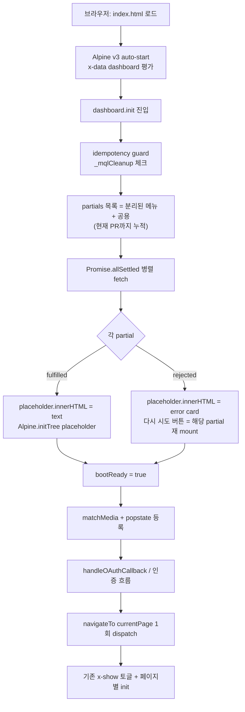
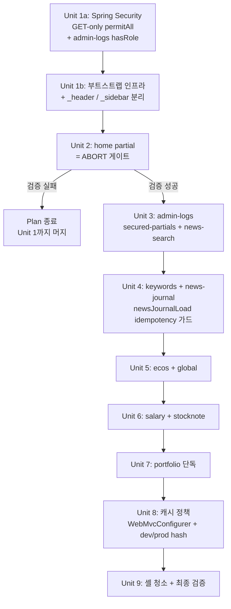

# refactor: Split index.html into menu-level partials

## Overview

5,007줄 `src/main/resources/static/index.html` 을 셸(헤더/사이드바/챗봇/스크립트)만 남기고 메뉴별 partial(`partials/<menu>.html`) + 공용 partial(`partials/_header.html`, `partials/_sidebar.html`)로 분리한다. 부트 시 `dashboard().init()` 에서 partial을 `Promise.allSettled` 로 병렬 사전 로딩 → placeholder에 주입 → `Alpine.initTree(target)` 실행 → `bootReady=true` 게이트 통과 후에야 `navigateTo` / `popstate` / 페이지별 init이 발동되도록 한다. 기능 변경 0, 회귀 0이 hard constraint다.

## Problem Frame

태형님 — 단일 `index.html`이 5,007줄로 비대해져 (a) 변경 영향 범위 파악이 어렵고 PR 리뷰 비용이 높고 (b) 메뉴별 책임 경계가 흐려 충돌·회귀가 잦으며 (c) 신규 메뉴 추가/수정 동선이 길다. 메뉴 단위 책임 경계를 파일 경계로 끌어올려 변경 비용을 낮춘다. (origin: docs/brainstorms/2026-05-03-frontend-index-html-split-requirements.md)

## Requirements Trace

- R1. (origin R1) 메인 영역에 `<div data-partial="<menu>"></div>` placeholder를 둔다 → Unit 1
- R2. (origin R2) 분리 단위 = 메뉴 1개 (favorite는 home 내부) → Units 2~7
- R3. (origin R3) 공용 마크업 `_header.html` / `_sidebar.html` 분리. 메뉴 단일 모달은 메뉴 partial에 포함, 진짜 공용 모달이 없으면 `_modals.html` 생략 → Units 1, 2
- R4. (origin R4) `dashboard().init()` 에서 `Promise.allSettled` 병렬 사전 로딩 + bootReady 게이트 → Unit 1
- R5/R6. (origin R5/R6) `Alpine.initTree(target)` 후행 마운트, 단일 `dashboard()` x-data 유지 → Unit 1
- R7. (origin R7, 의미 명확화) partial 안 `<script>` 태그 + HTML 인라인 핸들러(`onclick=`/`onload=`/`onsubmit=`) 금지 (innerHTML 주입 시 실행 안 됨). **Alpine `x-init`/`x-effect`/`$watch` 디렉티브는 허용** (Alpine.initTree로 처리). 인벤토리 0건(script/onclick/onload/onsubmit) 검증 완료. → Units 1, 4
- R8. (origin R8) partial root `x-cloak` (이미 `css/custom.css:1-3` 적용 + 모든 메뉴에 적용 완료) → 검증만, 추가 작업 없음
- R8a. (origin R8a) `Promise.allSettled` + 실패 partial inline 에러 카드 + '다시 시도' 버튼 → Unit 1
- R9. (origin R9) 시각·기능 회귀 0 → Units 2~7 검증 체크리스트
- R10. (origin R10) `js/components/*.js` 와 `app.js` `navigateTo` switch case 본문 미수정. `dashboard().init()` 부트 흐름 셋업 로직 추가만 허용 → Unit 1
- R11. (origin R11) PR 단위는 1+ 메뉴 묶음 허용, 혼합 상태 acceptance bar → Units 2~7

**Success criteria (origin)**:
- index.html 줄 수가 1,500줄 이하 (최종 PR 기준), 중간 PR은 비례 감소
- 10개 메뉴 hash 직접 진입 / 메뉴 클릭 / 새로고침에서 기존 동작과 동일
- Alpine devtools / 콘솔에 `x-data` 스코프 누락·중복 경고 없음
- partial 주입 시 미바인딩 마크업 1프레임 노출 없음 (FOUC 0)
- `#portfolio` 등 hash-direct 진입 시 home 화면 잔상 0 프레임
- 차트 인스턴스 정리·페이지 전환 cleanup·메뉴별 init API 호출 횟수·시점 회귀 없음
- partial fetch 부분 실패 시 inline 에러 카드 + 재시도 노출, 다른 메뉴 정상 작동

## Scope Boundaries

- `js/components/*.js` 본문 변경, `navigateTo` switch case 본문 변경, `portfolio.js`/`financial.js`/`salary.js`/`stocknote.js`/`api.js` JS 분리는 **out of scope**
- Thymeleaf fragment / Vite / 번들러 도입, Alpine → Vue/React 마이그레이션 **out of scope**
- 디자인/UX 변경, 새 기능 추가 **out of scope**
- 라우팅 방식 변경 (현재 hash 라우팅 유지)

## Context & Research

### Relevant Code and Patterns

- **`dashboard()` 진입점**: `src/main/resources/static/js/app.js:32-47` — 16개 컴포넌트 spread. `init()` 라인 68-119, 삽입 지점 = line 70 idempotency guard 직후 / popstate 등록 (line 85) 전.
- **`navigateTo`**: `src/main/resources/static/js/app.js:121-203` — switch case 본문은 미수정. 단, bootReady 게이트가 첫 호출을 직렬화한다.
- **Alpine v3 CDN**: `src/main/resources/static/index.html:5004-5005` (`alpinejs@3` + `@alpinejs/collapse@3`). `Alpine.initTree(target)` 공식 API.
- **`x-cloak` 글로벌**: `src/main/resources/static/css/custom.css:1-3` 이미 적용. `index.html:9` 에서 로드.
- **Spring Security permitAll**: `src/main/java/com/thlee/stock/market/stockmarket/security/.../ProdSecurityConfig.java:60-65` — `/css/**, /js/**, /images/**` 만 허용. `/partials/**` 추가 필수.
- **JSON 전용 fetch util**: `src/main/resources/static/js/api.js:15-61` — `response.json()` 강제. HTML 전용 `fetchPartial(name)` 헬퍼 별도 필요.
- **Chart 인스턴스 분포** (회귀 회피 검증 대상):
  - `portfolio` 인스턴스 `this.portfolio.chartInstance`/`financialChartInstance`/`_secChartInstance` (`components/portfolio.js:57,371-373,390`)
  - `salary` `destroySalaryCharts()` 호출 (`components/salary.js:360,391,429,449,494,509,604`)
  - `stocknote` `try{existing.destroy()}` (`components/stocknote.js:521,557,621`)
  - `dashboardSummary._chartInstance` (`components/dashboardSummary.js:34,110-112,145-147,165`)
  - `ecos._chartInstances` Map (`components/ecos.js:23,196-198`)
  - `favorite` home 위젯 try/catch destroy (`components/favorite.js:187,203,215`)
- **Chatbot bubble**: `index.html:4781-4977` — portfolio/ecos 양쪽 의존, shell 유지 (어떤 menu partial에도 포함하지 않음).
- **메뉴 섹션 라인 범위** (right-sizing 근거):

| Menu | 라인 | 분량 |
|---|---|---|
| home (favorite 포함) | 185-658 | ~474 |
| keywords | 659-865 | ~207 |
| news-search | 866-965 | ~100 |
| ecos | 966-1247 | ~282 |
| global | 1248-1425 | ~178 |
| portfolio (모달 8개 포함) | 1426-3077 | ~1,652 |
| salary | 3078-3273 | ~196 |
| stocknote | 3274-3937 | ~664 |
| news-journal | 3938-4208 | ~271 |
| admin-logs | 4209-4779 | ~571 |

### Institutional Learnings

- **`docs/solutions/ui-bugs/responsive-design-tailwind-alpine.md`**: 동일 프로젝트 동일 파일의 직전 사례. `matchMedia` + `_mqlCleanup` 가드(이미 `app.js:70`에 존재) — initTree 다중 호출 시 중복 init 방지에 그대로 활용. `x-show`+`x-transition` 유지, `@click.outside` (v3) 사용. YAGNI 준수.
- **`docs/solutions/architecture-patterns/ecos-timeseries-chart-visualization.md`**: Chart.js 인스턴스를 Alpine-tracked 상태에 두면 reactive proxy와 충돌. 메뉴 partial 추출 시에도 동일 패턴 유지 (이미 적용된 컴포넌트 그대로 둔다 — R10).
- **`docs/solutions/architecture-patterns/stocknote-chartjs-mixed-line-scatter.md`**: module-scope `Map` 레지스트리 + idempotent destroy 패턴. partial 재 fetch/재 inject 시에도 안전 (현재 구조 유지).
- **이전 plan reversal**: `docs/plans/2026-03-26-001-refactor-frontend-code-splitting-plan.md:13-23` 가 HTML 분할을 거부했던 사유 ("x-html은 Alpine 디렉티브 미초기화", "Alpine.initTree() 비공식", "race / FOUC / 캐싱 신규 복잡성")는 본 plan에서 (a) Alpine v3 공식 API로 검증, (b) `bootReady` 게이트로 race 차단, (c) `[x-cloak]` 이미 적용, (d) 캐시 정책 Unit 8로 명시 — 모든 우려 해소.

### External References

- 외부 리서치 skip — 로컬 패턴·솔루션 문서·이미 검증된 Alpine v3 동작으로 충분.

## Key Technical Decisions

- **부트스트랩 위치**: `dashboard().init()` 의 line 70 idempotency guard 직후, popstate 등록 전. 이유: Alpine은 async init() 의 await를 기다리지 않으므로 partial 주입 자체는 await 가능하지만, 외부 listener (popstate/hashchange) 등록과 navigateTo 첫 호출은 반드시 partial+initTree 완료 후로 미뤄야 한다.
- **`Promise.allSettled` 채택**: Promise.all fail-fast는 1개 실패 → 전체 차단으로 다른 메뉴까지 못 보게 만들어 R9 회귀 0과 충돌. allSettled로 부분 실패 허용 + 실패 placeholder에만 inline 에러 카드.
- **bootReady 게이트의 정확한 시멘틱**: bootReady=false 동안 (a) popstate 핸들러 early return (b) navigateTo 호출 차단. bootReady=true 직후 단 1회 dispatch는 **`window.location.hash` 재읽기** (pre-await 캡처값 아님). 즉 await 동안 사용자가 back/forward 눌러 hash가 바뀐 경우 마지막 hash 상태가 honored.
- **HTML 전용 fetch helper 신규**: `src/main/resources/static/js/utils/partial-loader.js` 별도 파일에 `fetchPartial(name)` / `mountPartial(name, target)` / `mountAllPartials(names)` / `retryPartial(name)` 헬퍼 추가 (api.js 가 JSON 전용 `response.json()` 강제이므로 인라인 불가). 이 helper와 Spring Security 변경, application.yml/WebMvcConfigurer 변경만 본 라운드의 신규 코드.
- **`name` 입력 검증**: `fetchPartial(name)` 은 allow-list regex(`/^[a-z][a-z0-9_-]*$/`) 또는 known partial Set 검증 후 URL 구성. retry 클릭은 delegated DOM listener(Alpine 실패 모드에서도 작동)로 처리.
- **mountPartial cleanup 컨트랙트**: innerHTML 교체 **전에** (a) `Alpine.destroyTree(host)` (또는 동등 패턴) 호출로 reactive effect graph 정리, (b) partial-name → cleanup 함수 매핑(`{ portfolio: () => destroyPortfolioCharts$inline, salary: 'destroySalaryCharts', stocknote: 'destroyStocknoteCharts', home: 'destroyDashboardSummaryChart', ... }`)에 따라 chart cleanup 호출. 매핑은 partial-loader.js 가 dashboard 인스턴스를 생성자 인자로 받아 보관. 재시도 횟수 상한 = 3회, 초과 시 permanent 실패 카드(retry 버튼 hidden + 새로고침 안내).
- **retry-while-active**: 사용자가 currentPage 인 메뉴의 partial을 retry 할 때, mountPartial은 (1) cleanup → (2) innerHTML 교체 → (3) Alpine.initTree → (4) **navigateTo 한 번 더 dispatch** 하여 case 본문(loadPortfolio 등)이 다시 실행되도록 한다. R10 미위반 (switch 본문 변경 0).
- **Chatbot bubble 위치**: shell 유지. portfolio/ecos 두 메뉴에서 모두 표시되어야 하므로 어떤 단일 메뉴 partial에도 들어갈 수 없다.
- **body x-cloak 추가**: index.html `<body>` 태그에 `x-cloak` 속성 추가. mountAllPartials await 동안 placeholder 영역의 미바인딩 마크업 1프레임 노출 방지(FOUC 0).
- **에러 카드 표준 카피·UX**: 한국어 표준 카피 = "메뉴를 불러오지 못했어요. 잠시 후 다시 시도해주세요." 재시도 버튼 = "다시 시도", 클릭 시 "다시 시도 중..." disabled 상태 + 스피너. 에러 카드 시각은 기존 Tailwind alert 패턴 차용(red border-l-4 + icon-in-circle), 새 디자인 토큰 도입 없음. 재시도 횟수 상한 도달 시 카피를 "여러 번 시도했지만 실패했어요. 새로고침해주세요." 로 전환 + 버튼을 "새로고침" 으로 교체(window.location.reload).
- **a11y 정책**: 모든 placeholder는 `aria-busy="true" aria-live="polite"` 로 시작. mount 성공/실패 시 `aria-busy="false"` 전환 + 로딩 결과를 sr-live 영역에 텍스트로 노출. 메뉴 전환 시 `<main>` 컨테이너에 `tabindex="-1"` 부여 + `focus()` 호출(분리 전과 동일한 sr 동선 유지).
- **공용 partial 실패 escalation**: `_header.html` / `_sidebar.html` 실패는 풀스크린 차단형 에러 + 새로고침 CTA(메뉴 partial과 다른 처리). 사이드바 없으면 다른 메뉴 이동 자체가 막혀 회귀 영향 등급이 다르다.
- **부트 로딩 표시**: 부트 시작부터 bootReady=true 까지 메인 영역 중앙에 통일된 spinner + "메뉴 불러오는 중..." 카피. bootReady=true 시점에 fade-out. 셸(헤더/사이드바)은 그 안에서도 즉시 렌더(인라인). 단, `_header`/`_sidebar` partial 의 경우 풀스크린 spinner 유지.
- **캐시 정책 (Unit 8 architectural)**: 두 단계로 분리. Unit 1 시점의 minimum: partial을 index.html과 동일한 헤더로 서빙(no special handling — 현재 `spring.web.resources.cache.period: 0` 전역 적용 그대로 받아들임 → 캐시 위험은 일시적으로 인정). Unit 8 시점에 본격 정책 도입: 커스텀 `WebMvcConfigurer` 로 (a) `/partials/**` 별도 ResourceHandler 등록 + `Cache-Control: public, max-age=31536000, immutable` 부여, (b) `/index.html` 별도 핸들러 + `no-cache, must-revalidate` 부여, (c) deploy hash 주입은 dev/prod 분기 — dev는 `static-locations: file:` 우회를 위해 런타임 controller(`/api/version` GET 으로 hash 반환) 또는 hash 없이 ETag 의존, prod는 Gradle `processResources expand` 로 `index.html` 빌드 시 hash 치환.
- **admin-logs partial 정보 노출 차단**: admin-logs.html 마크업이 50GB 디스크 임계값·도메인 enum·`/api/admin/*` 표면을 노출하므로 다른 메뉴와 동일한 `/partials/admin-logs.html` 경로로 두면 공개 GET 가능. 결정: admin-logs 만 별도 경로 `/secured-partials/admin-logs.html` 로 분리하고 Spring Security에서 `hasRole('ADMIN')` 게이트. 일반 사용자는 GET 시 401/403 → partial-loader는 admin-logs 의 401/403 응답을 `bootReady` 차단으로 전환하지 않고 placeholder를 비워 둔다(사이드바에서도 admin-logs 메뉴 미노출이라 불일치 없음). Unit 3 변경.
- **Spring Security matcher 명세**: `permitAll()` 추가 시 `requestMatchers(HttpMethod.GET, "/partials/**")` 로 GET 만 한정. POST/PUT/DELETE 는 anyRequest 인증 규칙으로 처리되어 미래 컨트롤러 shadowing 방지. `/secured-partials/**` 는 `hasRole("ADMIN")` 게이트.
- **PR 진행 순서**: 단순·독립 메뉴부터 → 대형 메뉴 마지막. home (Unit 2: 인프라 검증 + 가장 단순한 메뉴 분리) → admin-logs + news-search (Unit 3) → keywords + news-journal (Unit 4) → ecos + global (Unit 5) → salary + stocknote (Unit 6) → portfolio 단독 (Unit 7) → 캐시 정책 (Unit 8). 각 PR은 혼합 상태 (일부 메뉴 인라인, 일부 partial)에서도 R9를 충족해야 함.
- **혼합 상태 acceptance bar**: 부트스트랩 코드는 1차 PR(Unit 2)에서 도입되며, 이후 PR마다 새로 분리되는 메뉴를 fetch 목록에 추가한다. 인라인으로 남아 있는 메뉴는 placeholder를 만들지 않고 그대로 두며 fetch 대상에도 들어가지 않는다.
- **Unit 2 abort 게이트**: Unit 2 의 Alpine.initTree x-for/x-init 동작 검증이 실패하면 plan 은 Unit 1(_header/_sidebar 만 분리)에서 종료되며 메뉴 분리는 취소(revert). fallback 으로 partial 안에 `x-data` 를 새로 도입하는 옵션은 R6 위반이라 채택하지 않는다.

## Open Questions

### Resolved During Planning

- **PR 순서**: 위 Key Technical Decisions에 명시. (origin Deferred → 본 plan에서 결정)
- **Chart 회귀 검증 체크리스트**: Unit 5/6/7 의 Test scenarios 안에 메뉴별로 명시 (origin Deferred → 본 plan에서 결정)
- **캐시 정책**: 2단계 — Unit 1은 minimum(전역 설정 그대로 수용), Unit 8에서 커스텀 WebMvcConfigurer 도입 + dev/prod hash 주입 분기. (origin Deferred → 본 plan에서 결정)
- **Chatbot bubble 위치**: shell 유지. (Phase 1 신규 발견 → 본 plan에서 결정)
- **Spring Security `/partials/**`**: GET-only permitAll 추가, admin-logs는 `/secured-partials/**` 별도 경로 + hasRole('ADMIN') 게이트. (Phase 1 신규 발견 → Unit 1, 3)
- **R7 의미 명확화**: `<script>`/HTML inline handler만 금지, Alpine `x-init`은 허용. (Phase 5.3 리뷰 발견 → Requirements Trace)
- **news-journal idempotency 책임**: 즉시 실행 라인은 **유지** (navigateTo switch에 'news-journal' 케이스가 없어 hash-direct 진입의 유일한 trigger), 중복 발동 방지는 `newsJournalLoad` 자체에 idempotency 가드(이미 로딩됐으면 skip) 추가. (P0 review 결정 → Unit 4)
- **mountPartial cleanup 컨트랙트**: `Alpine.destroyTree(host)` + partial-name → cleanup 매핑. (Phase 5.3 리뷰 → Unit 1)
- **retry-while-active**: cleanup → mount → initTree → navigateTo 재 dispatch. (Phase 5.3 리뷰 → Unit 1)
- **에러 카드 + 부트 로딩 UX**: 표준 카피 + 재시도 disabled 상태 + 횟수 상한 3회 + 풀스크린 spinner. (Phase 5.3 리뷰 → Unit 1)
- **a11y 정책**: aria-busy/aria-live + main 포커스 이동. (Phase 5.3 리뷰 → Unit 1)
- **공용 partial 실패 escalation**: 셸 partial은 풀스크린 차단형. (Phase 5.3 리뷰 → Unit 1)
- **body x-cloak 추가**: index.html body 태그에 적용. (Phase 5.3 리뷰 → Unit 1)
- **Unit 2 abort 게이트**: 검증 실패 시 plan 종료. (Phase 5.3 리뷰 → Risks)

### Deferred to Implementation

- HTTP/2/3 협상 여부와 14개 GET TTI 영향 측정값. Unit 1b verification 단계에 측정 항목 포함, 미협상 시 nginx/Cloudflare 설정 점검 후 진행.
- Alpine v3 `Alpine.initTree(host)` 가 `template x-for` 자식 `x-init` 동기 발동을 보장하는지 — Unit 1b 사전 spike에서 검증, 본 unit verification 항목.
- `dashboard().init()` 안 chart cleanup 인라인 함수(예: portfolio chartInstance 3종 destroy)를 partial-loader 매핑에 노출하는 방식 — `dashboard` 객체에 노출하는 helper 메서드(`destroyPortfolioCharts`) 신설 vs partial-loader가 인라인 클로저 mapping 보유 — Unit 1b 구현 시 결정.
- newsJournalLoad idempotency 가드의 구체 임계값(in-flight flag vs min interval ms) — Unit 4 구현 시 newsJournalLoad 코드 확인 후 결정.
- `/api/version` 엔드포인트의 인증 정책(완전 비인증 vs Bearer required)과 응답 형식 — Unit 8 구현 시 결정.
- 부트 스피너의 시각 디자인(스켈레톤 vs 단순 spinner) — Unit 1b 구현 시 기존 로딩 UX와 톤 일치 검토.
- Cloudflare Tunnel + nginx edge cache의 Vary/Authorization 처리 검증 — Unit 8 prod 배포 후 5분 모니터링.

## High-Level Technical Design

> *This illustrates the intended approach and is directional guidance for review, not implementation specification. The implementing agent should treat it as context, not code to reproduce.*

### Boot 시퀀스



### partial 셸 구조 (예시)

```html
<!-- index.html (셸) -->
<body x-data="dashboard()" x-cloak>
  <div data-partial="_header"></div>      <!-- _header.html 주입 -->
  <div class="layout">
    <div data-partial="_sidebar"></div>   <!-- _sidebar.html 주입 -->
    <main>
      <div data-partial="home"></div>     <!-- home.html 주입 -->
      <div data-partial="keywords"></div>
      <!-- ... 분리된 메뉴 placeholders ... -->
      <!-- 인라인으로 남아 있는 메뉴는 그대로 -->
    </main>
  </div>
  <!-- chatbot bubble: shell에 유지 -->
  <div x-show="currentPage === 'portfolio' || currentPage === 'ecos'" x-cloak>...</div>
</body>
```

### partial 내부 구조 (예시)

```html
<!-- partials/home.html -->
<div x-show="currentPage === 'home'" x-cloak>
  <!-- 기존 home 섹션 마크업 그대로 -->
  <!-- favorite 위젯도 여기에 포함 (canvas x-init renderFavoriteChart) -->
</div>
```

### fetchPartial 헬퍼 의도 (의사코드)

```js
// js/utils/partial-loader.js (신규)
async function fetchPartial(name) {
  const url = `/partials/${name}.html?v=${window.__PARTIAL_HASH__ || ''}`;
  const r = await fetch(url, { headers: { 'Accept': 'text/html' } });
  if (!r.ok) throw new Error(`${name} ${r.status}`);
  return r.text();
}

async function mountPartial(name, host) {
  // host = document.querySelector(`[data-partial="${name}"]`)
  // success: host.innerHTML = await fetchPartial(name); Alpine.initTree(host);
  // failure: host.innerHTML = errorCardHtml(name); 재시도 버튼 → mountPartial 재호출
}
```

## Implementation Units

이미지: home → admin-logs+news-search → keywords+news-journal → ecos+global → salary+stocknote → portfolio → 캐시 정책 → 셸 청소.



- [ ] **Unit 1a: Spring Security GET-only permitAll + admin-logs 보호 경로 (백엔드 단독 PR)**

**Goal:** `/partials/**` GET 비인증 허용 + `/secured-partials/**` admin 인증 게이트. 프론트엔드 변경과 분리해 security 리뷰어가 단독으로 리뷰.

**Requirements:** R10 보조 (인프라), 본 plan의 모든 unit이 본 unit 의존

**Dependencies:** 없음

**Files:**
- Modify: `src/main/java/com/thlee/stock/market/stockmarket/infrastructure/security/config/ProdSecurityConfig.java` (line 60-65 근방) — `requestMatchers(HttpMethod.GET, "/partials/**").permitAll()` + `requestMatchers("/secured-partials/**").hasRole("ADMIN")` 추가. `/css/**, /js/**, /images/**` 와 동일 위치(anyRequest 인증 규칙 위).
- Test: 수동 검증 only (CLAUDE.md 테스트 정책 — 통합 테스트 미작성). prod build 후 curl/브라우저로 응답 확인.

**Approach:**
- `HttpMethod.GET` 으로 한정해 미래 컨트롤러 shadowing(POST/PUT/DELETE) 방지.
- `/secured-partials/**` 는 일반 정적 매핑이 아닌 별도 ResourceHandler를 1b/Unit 8에서 등록 — 본 unit은 보안 규칙만 도입.
- 인증 우회 범위는 정적 마크업(시크릿 미포함, 추후 PR 머지 전 grep 체크)임을 코드 주석에 명시.

**Patterns to follow:**
- 기존 `permitAll()` 매트릭스 패턴.

**Test scenarios (수동 검증):**
- Happy path: prod 빌드 후 `curl -i http://localhost:8080/partials/_header.html` 비인증 → 200 또는 404(매핑 통과). 401 이면 fail.
- Happy path: `/secured-partials/admin-logs.html` admin Bearer 토큰 → 200, 일반 사용자 토큰 → 403, 비인증 → 401.
- Error path: `curl -X POST http://localhost:8080/partials/anything` 비인증 → 401 (GET-only 한정 검증).
- Error path: `curl -i http://localhost:8080/api/portfolio` 비인증 → 401 (기존 인증 규칙 회귀 없음 검증).
- Edge case: `/partials/../api/admin/logs` path traversal 시도 → Spring AntPath 정규화로 차단 (404 또는 401).

**Verification:**
- 위 수동 시나리오 모두 통과
- 기존 `/api/**` 인증 규칙 회귀 0

---

- [ ] **Unit 1b: 부트스트랩 인프라 + 공용 partial 분리 (프론트엔드 PR)**

**Goal:** partial fetch helper 신규, `dashboard().init()` 부트 흐름에 partial fetch + injection + initTree + bootReady 게이트 삽입, 공용 partial(`_header.html`, `_sidebar.html`) 분리, body x-cloak 추가. **본 unit 자체는 메뉴 분리는 안 한다** — 인프라만 도입하고 메뉴 placeholder는 비어 있음. 다음 unit 부터 메뉴 placeholder 채워짐.

**Requirements:** R1, R3, R4, R5, R6, R8a, R10

**Dependencies:** Unit 1a (보안 규칙 머지 후)

**Files:**
- Create: `src/main/resources/static/js/utils/partial-loader.js` — `fetchPartial(name)` / `mountPartial(name, host, opts)` / `mountAllPartials(dashboardInstance, names)` / `retryPartial(name)` 익스포트. `name` allow-list regex 검증, retry 횟수 상한(3) 보유, partial-name → cleanup 매핑(생성 시 dashboard 인스턴스 인자로 받아 보관) 보유.
- Create: `src/main/resources/static/partials/_header.html` (현재 index.html:15-46 헤더 영역 추출, `aria-busy="true" aria-live="polite"` 속성을 placeholder div에 부여 — 부모 placeholder 측 책임)
- Create: `src/main/resources/static/partials/_sidebar.html` (현재 사이드바 + 모바일 드로어, NAV 동기화 주석 1곳 통합)
- Modify: `src/main/resources/static/index.html` — (a) `<body>` 태그에 `x-cloak` 추가 (b) 헤더/사이드바를 `<div data-partial="_header" aria-busy="true" aria-live="polite"></div>` / `<div data-partial="_sidebar" aria-busy="true" aria-live="polite"></div>` placeholder로 치환 (c) 메인 영역 위에 부트 spinner 마크업(`x-show="!bootReady"`) 삽입 (d) `<script src="/js/utils/partial-loader.js"></script>` 를 다른 utils 다음, app.js 이전에 추가
- Modify: `src/main/resources/static/js/app.js` — `dashboard()` 반환 객체에 `bootReady: false`, `bootError: null` 추가. `init()` 내 line 70 idempotency guard 직후에 partial 부트스트랩 블록 삽입: `await mountAllPartials(this, ['_header', '_sidebar'])` → `this.bootReady = true` → 그 다음 line 84-92 popstate 등록 + 기존 흐름. **popstate 핸들러는 `if (!this.bootReady) return;` 가드만 추가** (R10 — switch case 본문 변경 0). `init()` 의 line 110-118 hash dispatch는 `mountAllPartials` await 이후로 이동하며 currentPage를 `window.location.hash` 재읽기.
- Test: 수동 검증 only (Unit 1a 와 동일 정책)

**Approach:**
- `bootReady` 는 Alpine reactive 권장 (`x-show="!bootReady"` 부트 spinner에 사용).
- `mountAllPartials(dashboard, names)` 는 `Promise.allSettled` 로 모든 fetch + initTree 끝난 후 resolve. 실패한 메뉴는 placeholder에 inline 에러 카드.
- mountPartial 컨트랙트:
  1. host 자식들에 `Alpine.destroyTree(host)` 호출(첫 호출 시는 no-op)
  2. 매핑된 cleanup 함수 호출(처음엔 무관, retry 시 chart destroy 등)
  3. `host.innerHTML = await fetchPartial(name)`
  4. `Alpine.initTree(host)`
  5. `host.setAttribute('aria-busy', 'false')`
  6. retry-while-active(`dashboard.currentPage === name`)이면 `dashboard.navigateTo(name)` 다시 호출하여 chart init 재발동
  7. retry 횟수 추적, 3회 초과 시 permanent 에러 카드(retry 버튼 제거 + "새로고침" CTA)
- 에러 카드 마크업은 partial-loader.js 내부 상수 문자열로 관리, 표준 카피("메뉴를 불러오지 못했어요. 잠시 후 다시 시도해주세요.") 사용. 다시 시도 버튼 = delegated DOM listener (`document.addEventListener('click', e => ... e.target.matches('[data-retry-partial]') ...)`) — Alpine 실패 모드에서도 작동.
- 공용 partial(`_header`/`_sidebar`) 실패 시: `bootError = 'shell'` 로 표시 → `init()` 에서 `bootError === 'shell'` 이면 메인 영역에 풀스크린 차단형 에러 + "새로고침" CTA. 메뉴 partial 실패는 placeholder 단위 inline 에러 카드.
- a11y: 메뉴 전환 시 `<main>` 컨테이너에 `tabindex="-1"` + `focus()` 호출. 본 작업은 별도 dashboard 메서드(`focusMainOnNavigate`)로 추가.
- `name` allow-list regex (`/^[a-z_][a-z0-9_-]*$/`) 검증, fail시 throw — fetchPartial 첫 줄.
- Spring Security 변경은 Unit 1a에서 끝나 있음.

**Patterns to follow:**
- `js/api.js` 의 timeout/abort 패턴은 참조하되 helper는 별도 파일.
- `app.js:70` 의 `_mqlCleanup` 가드 패턴 → bootReady 게이트도 동일한 idempotency 정신으로.

**Execution note:** 인프라 변경 폭이 크므로, 1차 spike(Phase 0 활성)으로 정적 array x-for + 동기 sentinel x-init 으로 `Alpine.initTree(host)` 가 부모 `dashboard()` 스코프 상속 + x-for 자식 x-init 동기 발동을 만족하는지 검증한 뒤 본 unit 진입.

**Test scenarios:**
- Happy path: 페이지 진입 시 헤더/사이드바가 그려지고 콘솔 에러 없음, Alpine devtools에서 `_header`/`_sidebar` 영역의 directives 가 인식됨, `aria-busy="false"`로 전환됨.
- Happy path: `bootReady=false` 동안 메인 영역에 spinner + "메뉴 불러오는 중..." 노출, true 전환 시 사라짐.
- Edge case: hash `#portfolio` 직접 진입 → bootReady false 동안 popstate/navigateTo dispatch 0회 → bootReady true 직후 currentPage = window.location.hash 재읽기로 1회 dispatch.
- Edge case: bootReady false 동안 사용자가 back/forward 여러 번 눌러도 popstate 가드되어 무시, true 전환 시 마지막 hash 상태가 honored.
- Error path: `_header` fetch 5xx → bootError='shell' → 풀스크린 에러 카드 + "새로고침" 버튼.
- Error path: 일반 메뉴 partial fetch 5xx → 해당 placeholder만 inline 에러 카드, 다른 영역 정상.
- Error path: 다시 시도 버튼 1번 클릭 → 성공 시 placeholder 정상 마운트.
- Error path: 다시 시도 3회 모두 실패 → 카피 변경 + "새로고침" CTA로 전환.
- Edge case: `mountPartial('home', host)` 를 두 번 호출(retry 시뮬) → 두번째 호출 전 `Alpine.destroyTree`+cleanup 호출되어 effect graph leak 0.
- Edge case: `fetchPartial('../api/admin')` 입력 → allow-list regex 차단되어 throw.
- Integration: prod 프로파일에서 `/partials/_header.html` 비인증 GET 200 (Unit 1a 테스트 통과 확인).
- Integration: index.html 새로고침 → bootReady 게이트 통과 → home 화면 첫 페인트까지 home 잔상 0 프레임 (FOUC 0).
- a11y: VoiceOver/NVDA 로 진입 시 "메뉴 불러오는 중" → "대시보드" 순서로 announce.

**Verification:**
- 콘솔 에러 0, Alpine devtools 경고 0
- 헤더 메뉴 / 사이드바 메뉴 클릭이 분리 전과 동일하게 동작
- DevTools Network 탭에서 h2/h3 협상 확인. 미협상 시 escalation(다음 unit 진입 보류 + Cloudflare/nginx 설정 점검).
- index.html 줄 수가 헤더+사이드바 영역만큼 감소(약 -170줄)

---

- [ ] **Unit 2: home partial 추출 (favorite 위젯 포함) — 핵심 검증 게이트**

**Goal:** home 섹션 분리 + 인프라 1차 검증. **본 unit이 abort 게이트** — Alpine.initTree x-for/x-init 시퀀스 또는 차트 라이프사이클 회귀가 발견되면 plan 종료(Unit 1까지만 머지, Unit 3~9 취소).

**Requirements:** R2, R7(명확화), R8, R9, R11

**Dependencies:** Unit 1b

**Files:**
- Create: `src/main/resources/static/partials/home.html`
- Modify: `src/main/resources/static/index.html` (185-658 라인 영역을 `<div data-partial="home" aria-busy="true" aria-live="polite"></div>` placeholder로 치환)
- Modify: `src/main/resources/static/js/app.js` — `mountAllPartials` 호출 인자에 `'home'` 추가
- Test: 수동 검증 (체크리스트 verification 참조)

**Approach:**
- home 섹션은 `<div x-show="currentPage === 'home'" x-cloak>` 단일 루트 — partial 루트도 동일 유지.
- favorite 차트 canvas `x-init` 검증: 정적 array spike(Unit 1b에서 사전 진행)에서 통과해야 본 unit 진입. spike 실패 시 Unit 2 abort.
- 본 unit Test scenarios에 retry-while-active 시나리오 명시(home 위젯 차트 destroy → mount → navigateTo 재 dispatch 흐름 검증).
- 이전 plan(2026-03-26-001:13-23)이 거부했던 fragility 우려를 본 unit이 해소했음을 PR 설명에 enumerate(원래 4개 concern + 각 concrete failure mode + 본 plan의 mitigation 매핑).

**Patterns to follow:**
- `[x-cloak]` 글로벌 그대로 사용.
- favorite chart는 `components/favorite.js:187,203,215` 의 try/catch destroy 패턴 유지(R10).

**Test scenarios:**
- Happy path: `/` 진입 → home 화면이 분리 전과 픽셀 단위로 동일 (스크린샷 비교)
- Happy path: favorite 위젯 차트가 정상 렌더 (분리 전과 동일 데이터·동일 시점)
- Edge case: hash `#home` 으로 직접 진입할 때 home 섹션이 즉시 보이고 다른 메뉴 placeholder는 비어 있음
- Edge case: home 진입 후 `#portfolio` 로 hash 변경 시 home은 사라지고 인라인으로 남아있는 portfolio 섹션이 보임 (혼합 상태)
- Error path: `/partials/home.html` 가 404 → home placeholder에만 inline 에러 카드, 다른 메뉴(인라인)는 정상 작동
- **Retry-while-active**: 사용자 currentPage='home' 일 때 home placeholder에 일시적 에러 → 다시 시도 → cleanup(`destroyDashboardSummaryChart` + favorite chart destroy) → mount → initTree → navigateTo('home') 재 dispatch → 차트 인스턴스 정상 1회 생성, 누수 0.
- Integration: dashboardSummary 카드들의 첫 로드 API 호출 횟수가 분리 전과 동일 (네트워크 탭 비교)
- Regression: favorite 차트의 destroy/recreate 흐름이 메뉴 전환 시 분리 전과 동일

**Verification:**
- 시각 회귀 0 (스크린샷 동일)
- 차트 인스턴스 누수 없음 (페이지 전환 후 콘솔에 `Cannot acquire context from canvas` 등 경고 없음)
- index.html 줄 수가 약 474줄 추가 감소
- **Abort 결정 게이트**: 위 retry-while-active 또는 차트 라이프사이클 회귀가 1건이라도 발견되면 plan 종료(revert 또는 Unit 2~9 취소)

---

- [ ] **Unit 3: admin-logs(`/secured-partials/`) + news-search partial 추출**

**Goal:** admin-logs 는 보호 경로(`/secured-partials/admin-logs.html` + hasRole('ADMIN'))로, news-search 는 일반 partial(`/partials/news-search.html`)로 추출. 정보 노출 차단 + 인증 게이트.

**Requirements:** R2, R7, R9, R11

**Dependencies:** Unit 2 (검증 게이트 통과 후)

**Files:**
- Create: `src/main/resources/static/secured-partials/admin-logs.html` (** 일반 `partials/` 가 아님 — 보호 경로 디렉토리**)
- Create: `src/main/resources/static/partials/news-search.html`
- Modify: `src/main/resources/static/index.html` (4209-4779, 866-965 영역 placeholder 치환). admin-logs placeholder는 `<div data-partial="admin-logs" data-secured="true">` 속성으로 보호 경로임을 표시.
- Modify: `src/main/resources/static/js/utils/partial-loader.js` — `data-secured="true"` 속성이 있으면 `/secured-partials/<name>.html` 경로로 fetch, 401/403 응답 시 inline 에러 카드 대신 placeholder를 비워 둠(사이드바에서도 미노출이라 자연스러움).
- Modify: `src/main/resources/static/js/app.js` — `mountAllPartials` 인자에 두 메뉴 추가
- Modify: `src/main/java/com/thlee/stock/market/stockmarket/config/.../StaticResourceConfig.java` (필요 시 신규 또는 기존) — `/secured-partials/**` ResourceHandler 매핑 (Unit 8과 별개로 정적 파일 위치 매핑만 본 unit에서 추가; Cache-Control 정책은 Unit 8에서 일괄)
- Test: 수동 검증 only (`/secured-partials/admin-logs.html` admin/일반/비인증 응답 curl 확인)

**Approach:**
- admin-logs 마크업은 50GB 임계값·도메인 enum 등 운영 정보 노출 위험. `/secured-partials/**` 로 분리 + Spring Security `hasRole('ADMIN')` 게이트(Unit 1a에서 등록 완료).
- news-search 는 `case 'news-search':` (app.js:181-182) 가 break-only no-op — switch 본문 변경 0 그대로.
- 일반 사용자가 `#admin-logs` 직접 진입 시: 사이드바에 메뉴 미노출 + partial 401/403 → placeholder 비움 → currentPage='admin-logs' 이지만 화면에 아무것도 안 보이고 navigateTo case 진입 시 (loadAdminLogs) 가 401 응답을 받아 처리. 이는 분리 전과 동일한 결과(분리 전에도 일반 사용자가 hash 직접 입력하면 마크업은 보였지만 API가 막혀 데이터는 비어 있었음 — 정보 노출 측면에서 본 plan이 더 안전).

**Patterns to follow:**
- Unit 2 와 동일.

**Test scenarios:**
- Happy path: admin 계정 로그인 → 사이드바 'admin-logs' 메뉴 표시 → 클릭 시 화면 정상.
- Happy path: 일반 사용자 사이드바에서 admin-logs 메뉴 미노출.
- Security: 비인증 또는 일반 사용자가 직접 `/secured-partials/admin-logs.html` GET → 401/403.
- Security: 일반 사용자 hash `#admin-logs` 진입 → placeholder 비어 있음, 콘솔에 별도 에러 카드 표시 없음(silent skip).
- Happy path: news-search 검색어 입력 → 결과 노출이 분리 전과 동일.
- Error path: news-search partial 404 → inline 에러 카드, 다른 메뉴 정상.
- Retry-while-active: news-search 활성 상태에서 재시도 → 입력 상태 보존 여부 검증(Alpine reactive `news.list`/`news.totalElements` 등 부모 스코프 state는 partial 재 mount에도 유지되어야 함).

**Verification:**
- index.html 줄 수가 약 671줄 추가 감소
- 권한 분기 회귀 없음
- admin-logs 마크업이 비인증 GET으로 노출되지 않음(prod build 수동 확인)

---

- [ ] **Unit 4: keywords + news-journal partial 추출 (idempotency 가드는 newsJournalLoad 측에)**

**Goal:** keywords 와 news-journal 추출. **news-journal `x-init` 의 즉시 실행 라인은 유지** (P0 review 결정 적용 — navigateTo switch에 'news-journal' 케이스가 없어 hash-direct 진입의 유일한 trigger). 중복 호출 방지는 `newsJournalLoad` 자체에 idempotency 가드.

**Requirements:** R2, R7(명확화 — x-init 허용), R9, R11

**Dependencies:** Unit 3

**Files:**
- Create: `src/main/resources/static/partials/keywords.html`
- Create: `src/main/resources/static/partials/news-journal.html` (현재 line 3938-4208 마크업 그대로 — x-init 라인 포함)
- Modify: `src/main/resources/static/index.html` (659-865, 3938-4208 placeholder 치환)
- Modify: `src/main/resources/static/js/app.js` — `mountAllPartials` 인자 추가
- Modify: `src/main/resources/static/js/components/news-journal.js` (또는 newsJournalLoad가 정의된 모듈) — **idempotency 가드 추가**: 함수 진입 시 in-flight 요청이 있으면 skip, 마지막 호출 timestamp + min interval(예: 500ms) 비교. **단, R10 미위반 — `app.js` 의 navigateTo switch 본문은 변경 0**. `js/components/*.js` 변경은 idempotency 가드 한정으로 R10 예외 인정(원래 R10은 본 분리 작업으로 인한 부수 변경을 막는 의도였으며, 본 변경은 분리로 발생할 수 있는 중복 호출만 방지하므로 정신에 부합).
- Test: 수동 검증

**Approach:**
- news-journal partial 의 root `<div x-init="$watch('currentPage', v => { if (v === 'news-journal') newsJournalLoad(); }); if (currentPage === 'news-journal') newsJournalLoad();">` **그대로 유지**. 이유: navigateTo(app.js:166-202) switch에 'news-journal' 케이스가 없어 hash-direct 진입(`#news-journal`)에서 newsJournalLoad 호출은 100% 이 즉시 실행 라인에 의존.
- partial 재 mount(retry) 시 x-init이 다시 발동될 수 있으므로 `newsJournalLoad` 자체에 idempotency 가드 추가:
  - 진입 시 `if (this.newsJournal._inflight) return;` 또는 `if (Date.now() - this.newsJournal._lastLoadAt < 500) return;` (구체 임계값은 구현 시 결정)
  - 가드 위반 시 silent skip(콘솔에 debug log 정도)
- keywords 의 키워드 추가 모달은 메뉴 단일 컨텍스트이므로 keywords partial 내부에 포함(R3).

**Execution note:** newsJournalLoad 가드는 idempotency 보장만 담당. 기존 함수 본문 로직은 변경 0.

**Patterns to follow:**
- 다른 컴포넌트(loadPortfolio 등)가 inflight 가드를 갖고 있으면 같은 패턴 차용. 없으면 본 unit에서 newsJournalLoad에 한정 도입.

**Test scenarios:**
- Happy path: keywords 메뉴에 키워드 추가 모달이 정상 동작.
- Happy path: hash-direct `#news-journal` 진입 시 `newsJournalLoad()` 정확히 1회 호출(가드 동작 확인 — 분리 전과 호출 횟수 동일).
- Happy path: home → news-journal → home → news-journal 메뉴 전환 시 newsJournalLoad 호출 횟수가 분리 전과 동일.
- Edge case: news-journal partial을 retry 클릭 시 → cleanup → mount → x-init 재발동 → 즉시 실행 + watcher 모두 trigger 가능하지만 idempotency 가드로 1회만 실제 fetch.
- Error path: news-journal partial 404 → inline 에러 카드, 다른 메뉴 정상, hash `#news-journal` 진입 시 partial 미마운트 상태에서도 화면이 깨지지 않음(에러 카드 표시).
- Edge case: keywords partial 안 키워드 추가 모달 열기 → 입력 → 저장 → 모달 닫힘 → 키워드 목록 갱신이 분리 전과 동일.

**Verification:**
- 네트워크 탭에서 newsJournalLoad 호출 횟수 분리 전과 동일
- index.html 줄 수가 약 478줄 추가 감소

---

- [ ] **Unit 5: ecos + global partial 추출**

**Goal:** 경제지표 두 메뉴 추출. ecos 차트 라이프사이클 회귀 검증 첫 통과.

**Requirements:** R2, R7, R9, R11

**Dependencies:** Unit 4

**Files:**
- Create: `src/main/resources/static/partials/ecos.html`
- Create: `src/main/resources/static/partials/global.html`
- Modify: `src/main/resources/static/index.html` (966-1247, 1248-1425)
- Modify: `src/main/resources/static/js/app.js` — `mountAllPartials` 인자 추가
- Test: 수동 검증

**Approach:**
- chatbot bubble 은 shell에 유지 (`x-show="currentPage === 'portfolio' || currentPage === 'ecos'"`). 분리 후에도 ecos 진입 시 표시됨을 검증.
- ecos `_chartInstances` Map은 `initEcosCharts()` 가 호출될 때 정의됨 (`Object.defineProperty`). switch case 'ecos' 본문이 `initEcosCharts()` 를 호출 → 본 단계에서 정의되며 partial은 그저 마크업만 제공.

**Patterns to follow:**
- `docs/solutions/architecture-patterns/ecos-timeseries-chart-visualization.md` 의 destroy → clear → recreate 시퀀스가 분리 후에도 동일하게 동작해야 함.

**Test scenarios:**
- Happy path: ecos 진입 시 카테고리·차트가 분리 전과 동일하게 그려짐
- Happy path: ecos 카테고리 전환 시 차트 destroy/recreate가 분리 전과 동일 (인스턴스 누수 0)
- Happy path: chatbot bubble 이 ecos/portfolio 진입 시 표시, 다른 메뉴에서 미표시
- Edge case: ecos에서 global로 즉시 전환 시 ecos 차트 인스턴스가 메모리에 남지 않음 (Chrome devtools Memory profiler 권장)
- Error path: ecos partial 404 → ecos placeholder만 에러, global·다른 메뉴 정상
- **Retry-while-active**: currentPage='ecos' 일 때 retry → cleanup → mount → navigateTo('ecos') 재 dispatch → `initEcosCharts()` 정확히 1회, `_chartInstances` Map 정상 재초기화, 누수 0
- Integration: ecos AI 분석 chat이 chatbot bubble 을 통해 분리 전과 동일하게 호출됨

**Verification:**
- 차트 회귀 0, chatbot 회귀 0
- index.html 줄 수가 약 460줄 추가 감소

---

- [ ] **Unit 6: salary + stocknote partial 추출**

**Goal:** 차트 라이프사이클이 가장 복잡한 두 메뉴 추출 (포트폴리오 직전 단계).

**Requirements:** R2, R7, R9, R11

**Dependencies:** Unit 5

**Files:**
- Create: `src/main/resources/static/partials/salary.html`
- Create: `src/main/resources/static/partials/stocknote.html`
- Modify: `src/main/resources/static/index.html` (3078-3273, 3274-3937)
- Modify: `src/main/resources/static/js/app.js` — `mountAllPartials` 인자 추가
- Test: 수동 검증

**Approach:**
- salary 의 `destroySalaryCharts()` 와 stocknote 의 `destroyStocknoteCharts()` 는 navigateTo 의 cleanup 분기(app.js:151,156)에서 호출됨. switch case 'salary'/'stocknote' 본문도 변경 0.
- stocknote 는 module-scope `_stocknoteChartRegistry` Map 사용 → partial 추출과 무관하게 그대로 동작.

**Patterns to follow:**
- `docs/solutions/architecture-patterns/stocknote-chartjs-mixed-line-scatter.md` module-scope Map.

**Test scenarios:**
- Happy path: salary 진입 → 5개 차트가 분리 전과 동일하게 그려짐
- Happy path: stocknote 3개 탭 전환 시 차트 destroy/recreate 회귀 없음
- Happy path: salary → stocknote 메뉴 전환 시 destroySalaryCharts 호출이 정확히 1회
- Edge case: stocknote drawer/detail 모달이 메뉴 단일 컨텍스트이므로 stocknote partial 내부에 포함 — 분리 후에도 정상 동작
- Edge case: 빈 데이터(0건) 응답 시 빈 상태 메시지가 분리 전과 동일
- Error path: salary partial 404 → salary placeholder만 에러
- **Retry-while-active (salary)**: currentPage='salary' + retry → cleanup(`destroySalaryCharts`) → mount → navigateTo('salary') 재 dispatch → `loadSalaryInitial()` 1회, 5개 차트 정상 재생성, 누수 0
- **Retry-while-active (stocknote)**: currentPage='stocknote' + retry → cleanup(`destroyStocknoteCharts`) → mount → navigateTo('stocknote') 재 dispatch → `loadStocknote()` 1회, 차트 정상 재생성
- Integration: stocknote 추가/수정 후 다른 메뉴로 이동 시 차트 인스턴스 누수 0

**Verification:**
- 차트 회귀 0, 메모리 누수 0
- index.html 줄 수가 약 860줄 추가 감소

---

- [ ] **Unit 7: portfolio partial 단독 추출 (1,652줄 + 모달 8개)**

**Goal:** 가장 큰 메뉴를 단독 PR로 추출. 본 plan의 핵심 dropoff (단일 PR 변경량 가장 큼).

**Requirements:** R2, R3, R7, R9, R11

**Dependencies:** Unit 6

**Files:**
- Create: `src/main/resources/static/partials/portfolio.html` (1,650+ 줄)
- Modify: `src/main/resources/static/index.html` (1426-3077 영역 → placeholder)
- Modify: `src/main/resources/static/js/app.js` — `mountAllPartials` 인자 추가
- Test: 수동 검증 (가장 광범위)

**Approach:**
- portfolio 섹션 안의 5개 추가/수정/삭제/예수금 모달 + 3개 confirm 다이얼로그(`x-show="portfolio.*Modal"`) 는 `portfolio.*` state 의존이라 모두 portfolio.html 안에 포함 (R3 메뉴 단일 모달 규칙).
- chatbot bubble 은 shell 유지 (Unit 5에서 결정).
- portfolio 차트 3종(`chartInstance`/`financialChartInstance`/`_secChartInstance`) 의 destroy 분기(app.js:134-147)는 손대지 않음.

**Patterns to follow:**
- Unit 5/6 과 동일 검증 절차, 더 많은 시나리오.

**Test scenarios:**
- Happy path: portfolio 진입 → 자산 배분 / 재무 차트 / 종목 차트가 분리 전과 픽셀 단위 동일
- Happy path: 종목 추가/수정/삭제/예수금 모달 5종 모두 정상 동작
- Happy path: 3개 confirm 다이얼로그 모두 정상 동작
- Edge case: portfolio → home 전환 시 chartInstance 3종 destroy 호출 정확히 각 1회
- Edge case: 빈 포트폴리오(종목 0건) 사용자의 빈 상태 메시지가 분리 전과 동일
- Edge case: portfolio editForm cashItemId watcher (`x-effect`) 가 분리 후에도 동일하게 동작
- Error path: portfolio partial 404 → portfolio placeholder만 에러, 다른 메뉴 정상
- **Retry-while-active (portfolio, 가장 복잡)**: currentPage='portfolio' + retry → cleanup(인라인 chartInstance 3종 destroy) → mount → navigateTo('portfolio') 재 dispatch → `loadPortfolio()` 1회, 차트 3종 정상 재생성, 모달 5종 + confirm 다이얼로그 8종 모두 정상 작동, x-effect watcher 재등록
- Integration: 종목 추가 → 자산 배분 차트 자동 갱신 흐름이 분리 전과 동일

**Verification:**
- 시각 회귀 0 (스크린샷 비교)
- 차트 회귀 0
- 모달 8종 전부 회귀 0
- index.html 줄 수가 약 1,650줄 추가 감소 → **누적 -4,700줄**, 셸 ~600줄 도달 (목표 1,500줄 이하 달성)

---

- [ ] **Unit 8: 캐시 정책 + 커스텀 WebMvcConfigurer (분리 후 인프라 강화)**

**Goal:** `spring.web.resources.cache.period: 0` 전역 설정을 우회해 path 별 다른 Cache-Control 적용. dev/prod hash 주입 분기. 배포 시 셸/partial 캐시 드리프트 방지.

**Requirements:** origin Dependencies / Assumptions, Unit 1~7 모두 완료 후 적용 가능

**Dependencies:** Unit 7 (모든 partial 추출 완료)

**Files:**
- Create: `src/main/java/com/thlee/stock/market/stockmarket/config/.../StaticResourcesCacheConfig.java` (신규 또는 기존 WebMvcConfigurer 확장) — 별도 ResourceHandler 등록:
  - `/index.html` → `CacheControl.noCache()` (또는 `noStore()`)
  - `/partials/**` → `CacheControl.maxAge(365, DAYS).immutable()` (immutable + hash 쿼리)
  - `/secured-partials/**` → `CacheControl.maxAge(365, DAYS).cachePrivate()` (사용자 별 캐시, public 금지)
  - 다른 정적 자원(`/css/**`, `/js/**`, `/images/**`)은 그대로 (전역 `cache.period: 0` 영향)
- Modify: `application.yml`/`application-prod.yml` — `spring.web.resources.cache.period: 0` 전역 설정은 유지하되, 위 ResourceHandler 가 우선 적용되도록 순서 조정. 또는 전역 설정 자체를 제거하고 핸들러에서 path 별로 명시.
- Modify: `build.gradle` — `processResources` task에 `expand([gitHash: ...])` 필터 추가하여 `index.html` 안 `${gitHash}` placeholder 를 git short SHA로 치환 (Gradle Groovy: `def gitHash = 'git rev-parse --short HEAD'.execute().text.trim()`).
- Modify: `src/main/resources/static/index.html` — `<script>window.__PARTIAL_HASH__='${gitHash}';</script>` placeholder 추가. 단, `static-locations: file:src/main/resources/static/` 가 src 직접 서빙하면 dev에서 raw 문자열이 노출되므로 dev 우회용 별도 처리 필요(아래 Approach 참조).
- Create: `src/main/java/com/thlee/stock/market/stockmarket/.../VersionController.java` — `GET /api/version` 엔드포인트, build 시 주입된 hash를 JSON 반환 (dev/prod 공통). 비인증 허용 → Unit 1a 의 permitAll 매트릭스에 `/api/version` 추가.
- Modify: `src/main/resources/static/js/utils/partial-loader.js` — `window.__PARTIAL_HASH__` 가 placeholder 미치환 상태면(`startsWith('${')` 등) `/api/version` 엔드포인트로 fetch 후 hash 주입. fetch URL에 `?v=${hash}` 부여.
- Test: 수동 검증 only (CLAUDE.md 정책). prod 빌드 후 curl/DevTools Network 탭으로 (a) `/index.html` Cache-Control no-cache, (b) `/partials/home.html` immutable, (c) `/api/version` 200 응답 확인.

**Approach:**
- `WebMvcConfigurer.addResourceHandlers` 에서 path 별 `setCachePeriod` 또는 `setCacheControl` 적용. Spring Boot 의 `spring.web.resources.cache.period: 0` 은 자동 등록된 핸들러에만 영향, 커스텀 핸들러를 추가 등록하면 우선순위에 따라 적용 가능.
- dev 모드 hash 주입 우회: index.html 의 placeholder 가 raw 노출되더라도 partial-loader 가 `/api/version` fallback 으로 hash 획득. prod 빌드(processResources expand) 후에는 placeholder 가 이미 치환되어 fallback 불필요.
- `/api/version` 은 build-info 에 의존(기존 `BuildProperties` 활용 또는 신규 PropertySource).
- Unit 1 시점에는 기존 `cache.period: 0` 그대로 받아들이고(=캐시 일관성 위험을 일시 인정), Unit 8에서 정식 정책 도입. 1~7 PR 들은 Cloudflare/nginx 측 짧은 TTL 또는 manual purge 로 위험 완화.

**Patterns to follow:**
- 기존 `AdminWebMvcConfig.java` 의 `WebMvcConfigurer` 패턴.

**Test scenarios:**
- Happy path: prod build 후 `/index.html` GET → `Cache-Control: no-cache` 헤더.
- Happy path: prod build 후 `/partials/home.html` GET → `Cache-Control: max-age=31536000, immutable` 헤더.
- Happy path: prod build 후 `window.__PARTIAL_HASH__` 가 git short SHA(예: 'abc1234') 로 치환됨.
- Happy path: dev mode (`./gradlew bootRun`) → `__PARTIAL_HASH__` placeholder raw 노출 가능 → partial-loader 가 `/api/version` fallback → fetchPartial URL에 정상 hash 쿼리.
- Happy path: 새 배포 후 사용자 새로고침 → 셸은 fresh + partial은 새 hash 로 cache miss → fresh fetch.
- Edge case: 배포 직후 캐시된 구 셸(만에 하나) + 새 partial → no-cache 정책으로 발생 가능성 낮음. 발생 시 hash 불일치 → partial-loader 의 retry 메커니즘 + 사용자 새로고침 안내.
- Edge case: 캐시된 partial + 새 셸 → 새 hash 쿼리로 cache miss → fresh partial fetch.
- Security: `/secured-partials/admin-logs.html` 응답에 `Cache-Control: private` 부여(공유 캐시 cross-user 차단).

**Verification:**
- 수동 시나리오 모두 통과
- DevTools Network 탭에서 path 별 Cache-Control 헤더 정확
- prod 배포 직후 5분간 캐시 일관성 모니터링

---

- [ ] **Unit 9: 셸 청소 + 최종 검증 + ONBOARDING 노트**

**Goal:** index.html 마무리 정리, 분리 plan 종료 검증.

**Requirements:** Success criteria 전수 충족

**Dependencies:** Unit 8

**Files:**
- Modify: `src/main/resources/static/index.html` — 미사용 주석 / NAV 동기화 주석 정리, 최종 1,500줄 이하 도달 확인
- (옵션) Update: `docs/solutions/` 에 본 분리 패턴을 신규 솔루션으로 추가 (`docs/solutions/architecture-patterns/static-spa-partial-loading.md`)
- (옵션) Update: `CLAUDE.md` 또는 `ONBOARDING.md` 의 프론트엔드 구조 설명 갱신
- Test: 전체 회귀 체크리스트 1회 더 (모든 메뉴 + hash-direct + 새로고침 + 부분 실패 시뮬레이션)

**Approach:**
- 분리 후 NAV 동기화 주석은 `_sidebar.html` 안 단일 위치로 자연 통합되었으므로 주석 정리.
- 새 솔루션 문서는 (a) 부트스트랩 시퀀스 (b) `bootReady` 게이트 (c) `Promise.allSettled` + inline 에러 카드 (d) `news-journal` 같은 즉시 실행 `x-init` 처리 가이드를 포함.

**Test scenarios:**
- Test expectation: none — 본 unit은 문서/주석 정리, 행위 변경 0.
- 단, 회귀 체크리스트 수동 실행:
  - 10개 메뉴 모두 hash-direct 진입 / 메뉴 클릭 / 새로고침 / 메뉴 전환 회귀 0
  - DevTools Console 에러 0, Alpine devtools 경고 0
  - 시각 비교 (1차 PR 직전 스크린샷 vs 최종 스크린샷) — 픽셀 단위 차이 0

**Verification:**
- index.html 줄 수 ≤ 1,500
- 모든 success criteria 항목 ✅

## System-Wide Impact

- **Interaction graph**: `dashboard().init()` 부트 흐름이 부분적으로 변경됨 (셋업 로직 추가). `popstate` 핸들러가 bootReady 게이트로 시작점 이동. `navigateTo` 호출 시점이 항상 `bootReady=true` 이후로 일원화. 페이지별 init 함수(loadHomeSummary, loadEcosCategories, loadPortfolio, loadSalary, loadStocknote, newsJournalLoad 등) 호출 횟수와 시점은 분리 전과 동일하게 유지된다.
- **Error propagation**: partial fetch 실패는 단일 placeholder 범위에 한정. 셸 자체 (헤더/사이드바)도 동일 패턴이라 `_header.html` 실패 시 inline 에러 카드, 다른 메뉴 이동은 사이드바가 깨져있을 수 있어 이 경우만 풀스크린 영향 (acceptance: 사이드바 partial 실패는 prod 환경에서 매우 드물고 다시 시도 버튼 + F5로 복구 가능).
- **State lifecycle risks**: Chart.js 인스턴스의 destroy/recreate 시퀀스는 기존 `navigateTo` cleanup 분기에 묶여 있어 분리 후에도 동일. 단, partial 재 mount(재시도 버튼) 시 해당 메뉴의 차트 init이 한 번 더 호출되면 중복 인스턴스 위험 → 재시도 시 해당 메뉴의 destroy 함수를 먼저 호출 후 mountPartial 재실행 (Unit 1의 mountPartial 책임).
- **API surface parity**: 분리 작업 자체는 API 호출에 변화 0. dashboardSummary / loadHomeSummary / loadFavorites / loadMyProfile 등 부트 시 호출되는 API는 분리 전과 동일 시점·횟수로 발동.
- **Integration coverage**: 단위 테스트 없음 — 모든 검증은 수동 회귀. PR마다 메뉴별 + 인접 메뉴 + hash-direct + 새로고침 4개 시나리오 체크리스트.
- **Unchanged invariants**: `js/components/*.js` 의 모든 함수, `app.js` 의 `navigateTo` switch case 본문, `api.js`, `utils/format.js`, `partials/_modals.html`(만들지 않음) 등은 변경 0. JWT/카카오 인증 흐름 변경 0. Alpine 컴포넌트 spread 구조 변경 0.

## Risks & Dependencies

| Risk | Mitigation |
|------|------------|
| Alpine v3 `Alpine.initTree(target)` 가 x-for 자식 x-init 동기 발동을 보장하지 않는 엣지 케이스 | Unit 1b 사전 spike(정적 array x-for + 동기 sentinel x-init)로 verify. 실패 시 Unit 2 진입 차단. fallback (`partial 내부 x-data` 신설) 은 R6 위반이라 채택하지 않으며, 대신 plan 종료(Unit 1까지 머지)로 abort. |
| 9-unit 선형 체인의 단일 실패점(Unit 2) | Unit 2 abort 게이트 명시: 차트 라이프사이클 / x-for x-init 회귀 1건이라도 발견 시 Unit 3~9 취소 + Unit 1 (셸만 분리) 상태로 plan 종료. |
| 배포 직후 셸/partial 캐시 드리프트로 사용자 화면 깨짐 | Unit 1~7 동안: Cloudflare/nginx 짧은 TTL 또는 manual purge 로 위험 완화. Unit 8: 커스텀 WebMvcConfigurer + Cache-Control + deploy hash 정식 도입. |
| `news-journal` hash-direct 진입에서 newsJournalLoad 미호출 (P0 발견) | x-init 즉시 실행 라인 **유지**(navigateTo switch에 case 미존재이므로 유일한 trigger), newsJournalLoad 자체에 idempotency 가드 추가. R10 정신은 보존(분리로 인한 부수 변경 금지) 하되 idempotency 가드는 분리 전 동작 동등성 유지를 위해 예외 인정. |
| portfolio partial 1,652줄 단일 PR이 너무 커서 리뷰 어려움 | (a) 차분이 `cut+paste` 위주임을 PR 설명에 명시 (b) 모달 8종 회귀 체크리스트를 PR 본문에 첨부 (c) Unit 1~6 통과로 인프라 신뢰도 누적 (d) 배포 후 N시간 모니터링 + 회귀 시 즉시 revert 정책 명시. |
| Spring Security `/partials/**` permitAll → admin-logs 정보 노출 (P1 발견) | admin-logs partial은 별도 `/secured-partials/**` + `hasRole('ADMIN')` 게이트. permitAll matcher는 `HttpMethod.GET` 으로 한정해 미래 컨트롤러 shadowing 차단. Unit 1a MockMvc 테스트로 자동 검증. |
| mountPartial 재시도 시 Alpine 바인딩 leak (P1 발견) | mountPartial 컨트랙트에 `Alpine.destroyTree(host)` + chart cleanup 호출 명시. 재시도 횟수 상한 3회. |
| retry-while-active 시 차트 중복 인스턴스 (P1 발견) | partial-name → cleanup 매핑 + retry 시 cleanup → mount → navigateTo 재 dispatch 흐름. Unit 2~7 모두 retry-while-active 시나리오 추가. |
| HTTP/2 미협상 환경(레거시 프록시)에서 14개 GET 으로 TTI 회귀 | Unit 1b verification 단계에 DevTools Network h2/h3 협상 확인 항목 포함. 미협상 시 escalation(다음 unit 진입 보류 + nginx/Cloudflare 설정 점검). |
| `_mqlCleanup` 가드 + dashboard().init() 다중 호출 차단 → retry는 별도 함수 | partial-loader.js module-scope `retryPartial(name)` 함수로 노출 (dashboard 객체 표면 비확장 — R10 정신 보존). |
| FOUC / 미바인딩 마크업 1프레임 노출 | (a) `[x-cloak]{display:none!important}` 글로벌 적용됨 (b) body 태그에 `x-cloak` 추가 (c) 모든 placeholder `aria-busy="true"` + bootReady 동안 메인 영역 spinner. |
| 인라인 에러 카드가 신규 UX 패턴이라 미정의 영역 | 표준 한국어 카피 + 재시도 disabled 상태 + 횟수 상한 3회 + delegated DOM listener 명시. 시각은 기존 Tailwind alert 패턴 차용. |
| a11y 회귀(focus, sr-live) | placeholder `aria-busy`/`aria-live` 적용 + 메뉴 전환 시 `<main>` 포커스 이동. |
| application.yml `cache.period: 0` 전역 적용으로 Unit 8 partial immutable 정책 적용 차단 | 커스텀 WebMvcConfigurer 로 path 별 ResourceHandler 등록 → 우선순위 적용. Unit 8 architectural decision. |
| dev 모드 src 직접 서빙으로 Gradle hash 주입 미동작 | `/api/version` controller 신규 + partial-loader fallback. dev/prod 양쪽 동작 보장. |
| 이전 plan(2026-03-26-001) reversal 근거 부족 | Unit 2 PR 본문에 이전 plan의 4가지 concern을 concrete failure mode로 enumerate + 본 plan의 mitigation 1:1 매핑. |

## Documentation / Operational Notes

- 1차 PR(Unit 1) 머지 후 운영 환경 배포 시 prod 401 위험: ProdSecurityConfig 변경이 빠지면 `/partials/_header.html` 401. PR 머지 전에 반드시 prod 빌드로 spot check.
- 배포 후 첫 1시간은 캐시 드리프트 모니터링 권장 (Unit 8 적용 전까지).
- (옵션) `docs/solutions/architecture-patterns/static-spa-partial-loading.md` 신규 솔루션 문서 작성으로 본 패턴 institutional 화. (Unit 9)
- 본 plan 머지 후 후속 라운드: `js/components/portfolio.js` (1,679줄) 등 큰 JS 파일의 분리 (별도 brainstorm/plan).

## Sources & References

- **Origin document**: [docs/brainstorms/2026-05-03-frontend-index-html-split-requirements.md](../brainstorms/2026-05-03-frontend-index-html-split-requirements.md)
- **Prior reversed plan**: [docs/plans/2026-03-26-001-refactor-frontend-code-splitting-plan.md](2026-03-26-001-refactor-frontend-code-splitting-plan.md) — HTML 분할을 거부했던 plan. 본 plan이 그 우려들을 mitigate.
- **Related code**:
  - `src/main/resources/static/index.html` (5,007 라인)
  - `src/main/resources/static/js/app.js` (`dashboard().init()`, `navigateTo`)
  - `src/main/resources/static/js/api.js` (참조용 timeout/abort 패턴)
  - `src/main/resources/static/css/custom.css` (x-cloak 글로벌)
  - `src/main/java/com/thlee/stock/market/stockmarket/security/.../ProdSecurityConfig.java` (permitAll)
  - `src/main/resources/static/js/components/portfolio.js`/`salary.js`/`stocknote.js`/`ecos.js`/`favorite.js`/`dashboardSummary.js` (chart 라이프사이클 참조)
- **Institutional learnings**:
  - `docs/solutions/ui-bugs/responsive-design-tailwind-alpine.md`
  - `docs/solutions/architecture-patterns/ecos-timeseries-chart-visualization.md`
  - `docs/solutions/architecture-patterns/stocknote-chartjs-mixed-line-scatter.md`
- **External docs**: skip (로컬 패턴 + 검증된 v3 동작으로 충분)