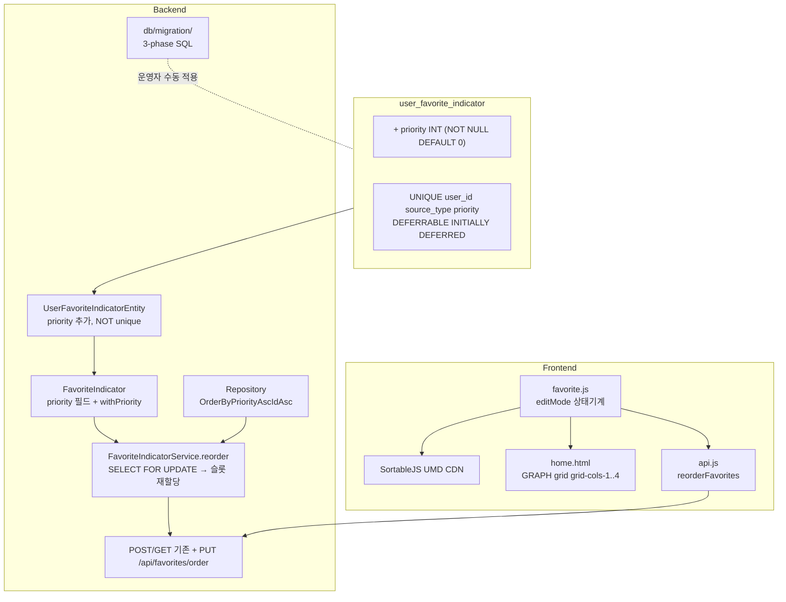
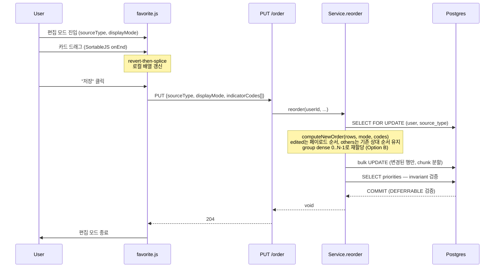
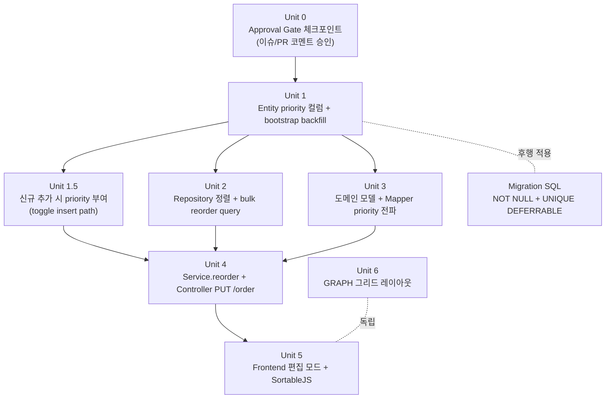

# feat: 관심지표 우선순위 및 GRAPH 그리드 레이아웃

## Overview

관심지표(`user_favorite_indicator`)에 사용자 지정 우선순위를 도입하고, GRAPH 표시 모드 컨테이너의 가로 스크롤 레이아웃을 1~4열 반응형 그리드로 전환한다. 우선순위 편집은 SortableJS UMD 기반 드래그 앤 드롭으로 컨테이너 단위로 진입하며, 일괄 저장 시점에 서버가 슬롯 보존 알고리즘으로 일관성을 보장한다.

본 plan은 origin 요구사항 문서의 R1~R10을 그대로 수용하며 plan은 `HOW`만 다룬다.

## Problem Frame

현재 관심지표는 정렬 컬럼이 없어 화면 표시 순서가 일관되지 않고, GRAPH 모드는 가로 스크롤+snap 구조라 5개 이상 항목을 한눈에 비교하기 어렵다. (origin: Problem Frame 참조)

## Requirements Trace

origin의 R1~R10을 본 plan이 충족한다.
- R1~R3: 우선순위 모델 — Unit 1, Unit 1.5, Unit 3
- R2 (신규 추가는 그룹 맨 뒤): 신규 추가 시 priority 부여 — Unit 1.5
- R4: 편집 모드 진입/종료 UI — Unit 5
- R5: 컨테이너 단위 DnD — Unit 5
- R6: 저장/취소 의미 — Unit 4 (서버), Unit 5 (클라이언트)
- R7(a)~(d): 슬롯 보존 동시성 알고리즘 — Unit 4
- R8: 추가/해제 즉시 반영 + 표시 모드 전환 시 dirty confirm — Unit 5
- R9~R10: GRAPH 그리드 + 줄바꿈 + 스크롤 — Unit 6

## Scope Boundaries

origin의 비목표를 그대로 계승. 추가로 본 plan에서 명시:
- 비목표: 키보드 접근성(↑/↓ 키 이동, aria-live announce)은 별도 이슈로 분리. 본 plan은 SortableJS의 마우스/터치 동작만 제공.
- 비목표: 토스트/다이얼로그 라이브러리 도입 — 기존 `alert()`/`confirm()` 패턴(`favorite.js`, `portfolio.js` 사례)을 그대로 사용.

## Context & Research

### Relevant Code and Patterns

- **Backend hexagonal 패턴**: `favorite/{presentation,application,domain.{model,repository},infrastructure.{persistence,mapper}}` 구조 그대로 따름.
- **컨트롤러**: `favorite/presentation/FavoriteIndicatorController.java` — `@RestController @RequestMapping("/api/favorites")`, `getCurrentUserId()` private helper, `ResponseEntity<...>` 반환. 기존 `PUT /api/favorites/display-mode`가 batch가 아닌 single-item PUT의 선례.
- **DTO**: `favorite/presentation/dto/FavoriteDisplayModeRequest.java` — Java `record` + `jakarta.validation.constraints` (`@NotNull`).
- **서비스**: `favorite/application/FavoriteIndicatorService.java` — `@Transactional` write / `@Transactional(readOnly=true)` read 분리. `DataIntegrityViolationException` 캐치 패턴.
- **JPA 리포지토리**: `UserFavoriteIndicatorJpaRepository.java` — derived query + `@Modifying @Query` JPQL. 현재 `findByUserId`는 정렬 없음 → `OrderBy` 추가 필요.
- **3-phase 마이그레이션 패턴**: `db/migration/news_event_impact_rename.sql`, `news_event_category_not_null.sql`이 기준. (1) Java entity가 nullable 컬럼 추가 + bootstrap backfill, (2) NULL=0 검증, (3) SQL ALTER NOT NULL, (4) Java entity nullable=false 격상. Flyway/Liquibase 자동 실행기 없음 — 운영자가 `psql`로 수동 적용.
- **프론트 컴포넌트**: `static/js/components/favorite.js` — Alpine `x-data` 컴포넌트. 옵티미스틱 업데이트 + 실패 시 rollback + `alert()` 패턴이 라인 50–77, 131, 174에 있음 → 그대로 미러링.
- **Alpine x-for 키**: `static/partials/home.html`의 `<template x-for="card in ..." :key="card.indicatorCode">` — 본 plan에서 그대로 유지(Sortable 호환에 필수).
- **Tailwind 그리드 패턴**: `home.html:8`, `home.html:160` — `grid grid-cols-1 sm:grid-cols-2 lg:grid-cols-4 gap-4`. Tailwind 유틸리티 전용, custom.css 혼용 금지(see learnings).
- **API 헬퍼**: `static/js/api.js`에 `reorderFavorites(...)` 추가. 기존 `displayMode` 변경 헬퍼(라인 153–173)가 미러 대상.

### Institutional Learnings

- `docs/solutions/architecture-patterns/jpa-version-passthrough-ddl-auto-not-null-backfill-2026-04-28.md` — NOT NULL 컬럼 추가 시 ddl-auto silent skip 함정. `columnDefinition`으로 default 강제. 본 plan의 3-phase 마이그레이션 적용으로 회피.
- `docs/solutions/ui-bugs/responsive-design-tailwind-alpine.md` — Tailwind 유틸리티 전용, `x-show + x-transition`(x-if 회피). 본 plan은 Tailwind grid utility로 진행.
- `docs/solutions/architecture-patterns/global-indicator-history-mirroring.md` — `@Transactional` self-invocation 미적용 함정. 본 plan은 동일 클래스 내 호출이 없어 영향 없음.
- `docs/solutions/architecture-patterns/deposit-history-n-plus-one-batch-pattern.md` — bulk save: `WHERE IN (...)` + `groupingBy`. Request DTO Bean Validation. 본 plan의 `FavoriteOrderRequest`에 적용.

### External References

- Postgres `DEFERRABLE INITIALLY DEFERRED` 동작: `SET CONSTRAINTS` 문서, Christian Emmer "Deferrable Constraints in PostgreSQL". 핵심: Hibernate `@UniqueConstraint`는 DEFERRABLE 생성 불가 → SQL로만 관리, Entity에 `unique=true` 절대 두지 말 것.
- Alpine 3 + SortableJS UMD 통합: `:key`는 stable string(`indicatorCode`)이어야 reconciliation 충돌 없음. `onEnd`에서 `e.item.remove()` 후 `arr.splice(...)` 패턴(revert-then-splice)이 깜박임 회피의 canonical pattern.
- 모바일 터치: `delay: 200, delayOnTouchOnly: true, touchStartThreshold: 5` 설정으로 일반 스크롤과 드래그 시작 분리.

## Key Technical Decisions

- **컬럼 타입**: `priority INT` — `(user_id, source_type)` 단위 dense 0..N-1 시퀀스. 잠정 채택을 확정. (origin Key Decisions, see origin: docs/brainstorms/2026-05-06-watchlist-priority-and-graph-layout-requirements.md)
- **UNIQUE 제약**: `UNIQUE(user_id, source_type, priority) DEFERRABLE INITIALLY DEFERRED` — 운영자 수동 SQL로 추가. Entity에 `@UniqueConstraint`/`unique=true` 일체 두지 않음 (Hibernate가 NOT DEFERRABLE 중복 생성 함정 회피).
- **3-phase 마이그레이션**: 본 repo의 기존 패턴 그대로. 마이그레이션 SQL 파일명을 통일한다 — 단일 파일 `db/migration/user_favorite_indicator_priority_not_null_unique_deferrable.sql`(NOT NULL + UNIQUE DEFERRABLE INITIALLY DEFERRED 통합). 단계: (1) Entity가 `priority INT NULL` + bootstrap backfill 호출, (2) 배포 후 backfill runner가 NULL 행을 dense 0..N-1로 채움(Unit 1), (3) 운영자가 위 단일 SQL 적용, (4) 다음 배포에서 Entity의 priority를 nullable=false로 격상.
- **일괄 저장 엔드포인트**: 신규 `PUT /api/favorites/order`. 페이로드: `record FavoriteOrderRequest(@NotNull FavoriteIndicatorSourceType sourceType, @NotNull FavoriteDisplayMode displayMode, @NotEmpty List<@NotBlank String> indicatorCodes)`. 기존 컬렉션 PUT 확장이 아닌 신규 endpoint이며 컨테이너 스코프(`sourceType` × `displayMode`)를 페이로드에 명시.
- **R7(b) 해석 — 그룹 전체 dense 재할당 (Option B)**: deepening 결과 채택. R7(b) "본 호출로 변경하지 않는다"는 *상대 순서* 보존으로 해석하며 priority *정수* 자체는 그룹 전체를 0..N-1로 재할당하는 단순 안전 변형을 사용한다. 사유: ① group-wide dense 0..N-1 invariant는 그룹 단위 속성이며 sub-slice 보존은 normalize 단계 추가로 결국 동일 형태로 수렴, ② 엣지 케이스(R7(c) 슬롯 부족, NULL priority 잔존, 페이로드 cross-displayMode 항목)가 단일 파이프라인으로 처리됨, ③ 사용자 가시 동작은 *상대 순서* 보존만 보장하면 R7(b) 의도 충족. 코드 주석에 본 결정 근거를 한국어로 명시.
- **알고리즘 위치**: `FavoriteIndicatorService.reorder(...)` 내부. 트랜잭션 안에서 `repository.findForReorderUpdate(...)`(`PESSIMISTIC_WRITE`)로 그룹 전체 잠금 → 순수 함수 `computeNewOrder(rows, mode, codes)` → `denseAssign(0..N-1)` → `applyIfChanged`로 변경된 행만 bulk update. CASE WHEN chunking은 repository 계층 책임(서비스는 알고리즘 순수성 유지). `@Modifying(clearAutomatically=true, flushAutomatically=true)` 필수.
- **Post-write invariant assertion (load-bearing 검증)**: `reorder` 트랜잭션 commit 직전, 같은 그룹을 재조회해 `priorities == 0..N-1 contiguous` 및 `|priorities| == |rows|`를 검증. 위반 시 `IllegalStateException` 던져 트랜잭션 롤백. 테스트가 없는 이번 배포에서 알고리즘 정확성을 보장하는 핵심 안전망. 비용은 `SELECT` 1회.
- **NULL priority tie-break**: R3 정렬은 `priority ASC NULLS LAST, id ASC`. NOT NULL 격상(3-phase 완료) 전 backfill 실패 행이 남으면 ASC 끝에 위치. Unit 2의 repository 쿼리에 명시.
- **중복 코드 dedup 정책**: `FavoriteOrderRequest.indicatorCodes`에 같은 코드가 두 번 이상 들어오면 첫 occurrence 채택, 이후는 silent skip. 400 거부 대신 last-writer-wins 정책과 일관된 방어적 수용. `FavoriteOrderRequest` Javadoc에 명시.
- **DnD 라이브러리**: SortableJS 1.15.x UMD via CDN. Alpine `@alpinejs/sort` 플러그인은 추상화로 인해 revert-then-splice 제어가 어려워 미채택. 별도 의존성 추가는 `index.html` script 한 줄.
- **그리드 클래스**: `grid grid-cols-1 sm:grid-cols-2 lg:grid-cols-3 xl:grid-cols-4 gap-4`. 기존 `flex gap-4 overflow-x-auto pb-2 snap-x snap-mandatory` 클래스 4곳(ECOS GRAPH, ECOS INDICATOR, GLOBAL GRAPH, GLOBAL INDICATOR) 중 GRAPH 컨테이너 2곳만 교체. INDICATOR는 origin 비목표로 변경 없음.
- **고정 폭 카드 처리**: 그리드 도입에 따라 GRAPH 카드의 `w-[400px] sm:w-[440px]` 고정 폭은 제거 — 그리드 셀이 폭을 결정. 카드 높이는 기존 유지.
- **Approval Gate 인지**: Entity 추가 + 신규 API + 비즈니스 로직 변경(GET 응답 정렬) 3건 모두 트리거 — 본 plan을 사용자에게 명시적으로 승인받은 뒤 Unit 1부터 시작.

## Open Questions

### Resolved During Planning

- **Q: dense 0..N-1 invariant와 R7(b) gap 보존이 양립 가능한가?** A: 양립한다. invariant는 `(user_id, source_type)` 그룹 *전체* 집합 단위이며 displayMode별 contiguity는 비요구. 슬롯 재할당 알고리즘으로 자연 충족.
- **Q: `@UniqueConstraint`로 DEFERRABLE 가능?** A: 불가능. SQL로만 관리.
- **Q: ddl-auto가 SQL 마이그레이션 자동 실행?** A: 안 함(Flyway/Liquibase 없음). 운영자 수동 적용.
- **Q: Tailwind 브레이크포인트?** A: 기본 사용 — `sm:640`, `lg:1024`, `xl:1280`. 별도 커스텀 없음.
- **Q: snap-x 처리?** A: GRAPH 컨테이너에서는 그리드 도입과 함께 제거. INDICATOR는 그대로.
- **Q: 일괄 저장 페이로드 형태?** A: `(sourceType, displayMode, indicatorCodes[])` — 컨테이너 스코프 명시 + 정렬된 코드 목록.
- **Q: bulk update vs 개별 update?** A: `@Modifying @Query` JPQL `UPDATE ... CASE id WHEN ... END WHERE id IN (...)` 단일 statement 우선, fallback으로 개별 update. DEFERRABLE 제약 덕에 swap-update 안전.

### Deferred to Implementation

- 편집 모드 트리거 버튼의 정확한 위치/아이콘/문구, 드래그 핸들 표시 방식(카드 전체 vs 전용 핸들), 저장/취소 버튼 배치(sticky vs inline) — 디자인 반복으로 결정.
- `confirm()` 다이얼로그 문구 — 구현 시 한국어 어조 결정.
- failed 상태의 GLOBAL GRAPH 항목이 INDICATOR 컨테이너에 fallback 렌더링되는 기존 동작과 편집 페이로드 처리 — Unit 4의 R7(a) "서버에서 다른 컨테이너에 속함" 케이스로 무시 처리(implementation 시 동작 확인).
- 컨테이너 그룹 항목 0~1개일 때 편집 모드 진입 가능 여부 — Unit 5에서 트리거 버튼 disabled 조건으로 처리.
- bulk update JPQL에서 CASE 식이 길어질 때(예: 항목 100+) 가독성/성능 검토 — 현실적으로 한 사용자가 동일 source_type에 30+ 관심지표 가질 가능성 낮으므로 실측 후 결정.

## High-Level Technical Design

> *이 단면은 의도된 접근의 형태를 보여주기 위한 directional 가이드이며 구현 사양은 아니다. 구현자는 각 Unit의 Files/Approach를 기준으로 작성한다.*

데이터 모델·API·UX 흐름의 관계:



저장 흐름 (R7 슬롯 보존):



## Implementation Units

본 plan은 8개 unit으로 구성. Unit 0는 Approval Gate 체크포인트, Unit 1·1.5·2·3·4는 백엔드, Unit 5·6은 프론트엔드. Unit 1이 모든 후속 코드 작업의 선행 조건이며 Unit 6은 Unit 5와 독립적으로 진행 가능.



---

- [x] **Unit 0: Approval Gate 체크포인트**

**Goal:** 코드 작업 시작 전, Entity 추가 + 신규 API + 비즈니스 로직 변경(GET 정렬) 3건의 Approval Gate를 명시적으로 통과한다.

**Requirements:** 모든 R (작업 시작 전 게이트)

**Dependencies:** plan 작성 완료

**Files:** (코드 변경 없음)

**Approach:**
- 본 plan 파일과 origin requirements 문서 링크를 이슈 #42 또는 새 PR description에 게재한다.
- 사용자(@TaeHyung 또는 위임자)가 다음 3건을 명시적으로 승인:
  1. `user_favorite_indicator`에 `priority INT` 컬럼 추가 (Entity 변경)
  2. `PUT /api/favorites/order` 신규 엔드포인트 (public API 추가)
  3. `GET /api/favorites`(+`/enriched`) 응답 정렬 기준이 priority ASC + id ASC로 변경 (비즈니스 로직 동작 변경)
- 승인 받기 전 Unit 1 시작 금지. CLAUDE.md Approval Gates 섹션 준수.

**Verification:**
- 이슈 #42 또는 PR에 사용자 승인 코멘트 존재.
- 본 unit 체크박스 완료 후 Unit 1 진입.

---

- [x] **Unit 1: Entity priority 컬럼 추가 + bootstrap backfill**

**Goal:** `user_favorite_indicator`에 `priority` INT 컬럼을 nullable로 추가하고, 애플리케이션 부팅 시 NULL 값을 `created_at` ASC, `id` ASC 기준 dense 0..N-1로 채우는 bootstrap backfill을 한 번 실행한다.

**Requirements:** R1, R3

**Dependencies:** Unit 0

**Files:**
- Modify: `src/main/java/com/thlee/stock/market/stockmarket/favorite/infrastructure/persistence/UserFavoriteIndicatorEntity.java`
- Create: `src/main/java/com/thlee/stock/market/stockmarket/favorite/infrastructure/config/FavoritePriorityBackfillRunner.java`
- Modify: `src/main/java/com/thlee/stock/market/stockmarket/favorite/infrastructure/persistence/UserFavoriteIndicatorJpaRepository.java` (NULL 행 조회 쿼리)

**Approach:**
- Entity에 `@Column(name="priority", nullable=true) private Integer priority;` 추가. **`unique=true`/`@UniqueConstraint` 절대 두지 않음** (Hibernate가 NOT DEFERRABLE 중복 생성). `columnDefinition` 미지정 — backfill을 코드에서 명시적으로 수행.
- `FavoritePriorityBackfillRunner`: `@Component @RequiredArgsConstructor implements ApplicationRunner` (`@PostConstruct` 사용 안 함 — 트랜잭션 인프라 준비 시점이 늦고 본 repo의 기존 `EcosIndicatorMetadataInitializer`/`GlobalIndicatorMetadataInitializer` 패턴이 ApplicationRunner임).
  - `@Transactional`로 `(user_id, source_type)` 그룹별 NULL priority 행을 `created_at ASC, id ASC`로 조회 → 0부터 순번 부여 → bulk update.
  - 모든 행이 NOT NULL이면 즉시 종료 (idempotent — 첫 부팅 후 후속 부팅에서 no-op).
- 도메인 모델에는 아직 priority 노출 안 함 (Unit 3에서).

**Patterns to follow:**
- `UserFavoriteIndicatorEntity.java`의 기존 `displayMode` 패턴 (Lombok `@Getter`, 생성자, `@PrePersist`).
- `economics/.../config/EcosIndicatorMetadataInitializer.java` 및 `GlobalIndicatorMetadataInitializer.java` (ApplicationRunner + idempotency 가드 패턴).
- `docs/solutions/architecture-patterns/jpa-version-passthrough-ddl-auto-not-null-backfill-2026-04-28.md` 가이드.

**Test scenarios:**
- 테스트 작성 안 함 — CLAUDE.md "테스트는 명시적 요청 시에만 작성". 단 backfill runner는 NULL 행이 없을 때 no-op 동작을 코드로 보장.

**Verification:**
- 애플리케이션 부팅 후 `SELECT COUNT(*) FROM user_favorite_indicator WHERE priority IS NULL;` = 0.
- `SELECT user_id, source_type, priority, created_at FROM user_favorite_indicator ORDER BY user_id, source_type, priority;`이 dense 0..N-1 시퀀스를 보임.
- `GET /api/favorites` 응답이 변하지 않음(Unit 2 적용 전).

---

- [x] **Unit 1.5: 신규 추가 시 priority 부여 (toggle insert path)**

**Goal:** `POST /api/favorites`(현 `toggle` 메서드의 INSERT 분기)에서 신규 행이 priority NULL로 저장되어 R3 정렬을 깨뜨리지 않도록, 동일 트랜잭션·단일 SQL로 `MAX(priority)+1`을 부여한다.

**Requirements:** R2

**Dependencies:** Unit 1

**Files:**
- Modify: `src/main/java/com/thlee/stock/market/stockmarket/favorite/application/FavoriteIndicatorService.java` (toggle insert 분기)
- Modify: `src/main/java/com/thlee/stock/market/stockmarket/favorite/domain/model/FavoriteIndicator.java` (`create(...)` 시그니처 확장)
- Modify: `src/main/java/com/thlee/stock/market/stockmarket/favorite/domain/repository/FavoriteIndicatorRepository.java` (port에 `insertWithNextPriority` 추가)
- Modify: `src/main/java/com/thlee/stock/market/stockmarket/favorite/infrastructure/persistence/FavoriteIndicatorRepositoryImpl.java`
- Modify: `src/main/java/com/thlee/stock/market/stockmarket/favorite/infrastructure/persistence/UserFavoriteIndicatorJpaRepository.java` (native `INSERT ... SELECT COALESCE(MAX(priority),-1)+1` 쿼리 추가)

**Approach:**
- 본 repo의 `READ_COMMITTED` 기본 isolation에서는 `SELECT MAX` 후 별도 INSERT가 race를 막지 못한다 → 단일 native SQL `INSERT ... SELECT COALESCE(MAX(priority),-1)+1 FROM user_favorite_indicator WHERE user_id=? AND source_type=?`로 atomicity 확보.
- Native 쿼리 형태(re-SELECT 패턴 채택): `@Modifying @Query(value = "INSERT INTO user_favorite_indicator (user_id, source_type, indicator_code, display_mode, priority, created_at) SELECT :userId, :sourceType, :code, 'INDICATOR', COALESCE(MAX(priority),-1)+1, NOW() FROM user_favorite_indicator WHERE user_id = :userId AND source_type = :sourceType", nativeQuery = true)`. INSERT 후 별도 SELECT로 산출된 priority/id를 도메인에 매핑(Spring `@Modifying`는 row count만 반환하므로 RETURNING 절은 사용하지 않음). 본 repo `NewsJpaRepository.java:21-32`의 `nativeQuery=true` 패턴을 미러.
- `FavoriteIndicator.create(userId, sourceType, indicatorCode)` 시그니처는 그대로 유지(도메인 순수성). priority는 SQL이 산출하므로 INSERT 후 후속 SELECT로 도메인에 반영.
- 동시 두 트랜잭션이 같은 priority를 도출하면 DEFERRABLE UNIQUE가 commit 시 SQLSTATE `23505` (`unique_violation`)로 거부 → 기존 `DataIntegrityViolationException` catch(`FavoriteIndicatorService.toggle()` 내)를 확장. 단순 type 매칭 대신 root cause를 `PSQLException.getSQLState()`로 검사해 `23505`만 retry 대상으로 제한 (다른 무결성 위반은 즉시 500).
- Retry 정책: 최대 3회, 짧은 randomized backoff(예: 50ms±25ms)로 thundering retry 회피. 초과 시 `log.error` + 500 응답.
- Unit 4 reorder가 같은 (user_id, source_type) 그룹에 PESSIMISTIC_WRITE를 잡고 있으면 본 INSERT는 lock 대기 후 진행 — race window가 자연스럽게 줄어듬. 이 의존을 코드 주석으로 명시.

**Patterns to follow:**
- `NewsJpaRepository.java:21-32` (native INSERT, `@Modifying` + `nativeQuery=true`).
- `EcosIndicatorJpaRepository.java:14-46` (native aggregate query 선례).
- `FavoriteIndicatorService.toggle()` 라인 79~92의 기존 `@Transactional` + `DataIntegrityViolationException` catch.

**Test scenarios:**
- 테스트 작성 안 함 — CLAUDE.md 정책. retry 로직은 inline private helper로 분해해 향후 테스트 가능 구조 유지.

**Verification:**
- `POST /api/favorites`로 새 항목 추가 후 즉시 `SELECT priority FROM user_favorite_indicator WHERE user_id=? AND source_type=? ORDER BY id DESC LIMIT 1`이 그룹 내 최댓값과 일치.
- 동시 추가 시 (dev에서 두 요청 동시 발사) 두 행 모두 성공 + 서로 다른 priority + retry 카운터 ≤ 1회.
- 기존 toggle remove 동작은 변하지 않음.

---

- [x] **Unit 2: Repository 정렬 변경 + bulk reorder 쿼리 추가**

**Goal:** 관심지표 조회 시 priority ASC + id ASC 정렬을 적용하고, `(user_id, source_type)` 컨테이너 단위 일괄 priority 갱신을 위한 bulk update 쿼리를 추가한다.

**Requirements:** R3, R7

**Dependencies:** Unit 1

**Files:**
- Modify: `src/main/java/com/thlee/stock/market/stockmarket/favorite/infrastructure/persistence/UserFavoriteIndicatorJpaRepository.java`

**Approach:**
- 기존 `findByUserId`/`findByUserIdAndSourceType`를 새 메서드 `findByUserIdOrderByPriorityAscIdAsc` 등으로 교체(또는 신규 메서드 추가 + 호출처 점진 교체). 정렬은 `priority ASC NULLS LAST, id ASC`. 호출처(`FavoriteIndicatorService` 등)도 동시 수정.
- 컨테이너 단위 priority 슬롯 lock과 invariant 검증용 projection을 위해 다음 메서드 추가:
  - `List<UserFavoriteIndicatorEntity> findForReorderUpdate(Long userId, FavoriteIndicatorSourceType sourceType)` — `@Query("SELECT e FROM UserFavoriteIndicatorEntity e WHERE e.userId = :userId AND e.sourceType = :sourceType ORDER BY e.priority ASC NULLS LAST, e.id ASC")` + `@Lock(LockModeType.PESSIMISTIC_WRITE)`. 트랜잭션 내 `SELECT ... FOR UPDATE` 효과. 본 repo 첫 PESSIMISTIC_WRITE 사용처 — PR description에 명시.
  - `List<Integer> findPrioritiesByUserIdAndSourceType(Long userId, FavoriteIndicatorSourceType sourceType)` — Unit 4 invariant assertion 전용 projection. `@Query("SELECT e.priority FROM UserFavoriteIndicatorEntity e WHERE e.userId = :userId AND e.sourceType = :sourceType ORDER BY e.priority ASC")`. lock 없이 read-only.
- **Bulk update는 JPA `@Modifying @Query`로 직접 표현 불가**: `CASE id WHEN ... END`는 가변 항목 수에 따라 SQL 자체가 변하므로 static `@Query`로 못 적음. 대신 본 repo에 *최초로* custom-impl fragment 패턴을 도입한다:
  - 인터페이스 `UserFavoriteIndicatorJpaRepositoryCustom` (`int bulkUpdatePriority(Map<Long,Integer> idToPriority)`) 추가.
  - 구현체 `UserFavoriteIndicatorJpaRepositoryImpl` 에서 `EntityManager.createNativeQuery`로 `UPDATE user_favorite_indicator SET priority = CASE id WHEN ? THEN ? ... END WHERE id IN (...)` 동적 빌드. 50개 초과 시 chunk 분할(`setParameter` 인덱스 한계 회피). DEFERRABLE 제약 덕에 mid-tx 중복 priority 허용.
  - 작은 그룹(≤5)은 개별 update fallback (단순성 우선).
  - 호출 후 `entityManager.flush(); entityManager.clear();`로 L1 cache 동기화 → 후속 invariant 재조회가 stale 결과를 반환하지 않도록 보장.
- 기존 JPQL 패턴은 본 repo 내 다수 존재하지만 custom-impl + EntityManager 패턴은 *최초* 도입 — 코드 리뷰 시 패턴 정착에 주의.

**Patterns to follow:**
- `UserFavoriteIndicatorJpaRepository.java`의 기존 `@Modifying @Query` 패턴.
- `docs/solutions/architecture-patterns/deposit-history-n-plus-one-batch-pattern.md` (bulk save 패턴).

**Test scenarios:**
- 테스트 작성 안 함.

**Verification:**
- `GET /api/favorites` 응답 순서가 priority ASC + id ASC를 따름.
- 단위 service 호출(Unit 4 완료 후)에서 동시성 race 없음을 dev 환경 수동 확인.

---

- [x] **Unit 3: 도메인 모델 + Mapper priority 전파**

**Goal:** `FavoriteIndicator` 도메인 모델과 매퍼에 priority 필드를 추가하고 응답 DTO 파이프라인에 전파한다.

**Requirements:** R3

**Dependencies:** Unit 1

**Files:**
- Modify: `src/main/java/com/thlee/stock/market/stockmarket/favorite/domain/model/FavoriteIndicator.java`
- Modify: `src/main/java/com/thlee/stock/market/stockmarket/favorite/infrastructure/persistence/mapper/FavoriteIndicatorMapper.java`

**Approach:**
- `FavoriteIndicator`에 `private final Integer priority;` 추가. 생성자/factory `create(...)`는 priority `null`로 둠(Unit 1.5의 native INSERT가 SQL에서 산출). `withPriority(int)` 메서드 추가(immutable record-like 패턴 유지).
- Mapper의 `toEntity`/`toDomain` 양방향에 priority 전달.
- **응답 DTO에는 priority를 노출하지 않는다**: 클라이언트는 정렬된 결과만 사용하고 priority 정수 자체는 사용처가 없음 (`FavoriteOrderRequest` 페이로드도 `indicatorCodes`만 담음). public API surface는 최소 유지가 Approval Gate 정신과 부합.

**Patterns to follow:**
- `FavoriteIndicator.java`의 immutable + `withDisplayMode` 패턴.
- `FavoriteIndicatorMapper.java` 기존 매핑 함수 형태.

**Test scenarios:**
- 테스트 작성 안 함.

**Verification:**
- 도메인 ↔ entity 매핑 시 priority 손실 없음 (코드 리뷰 + dev 환경 수동 확인).
- `GET /api/favorites` 응답 contract는 변경 없음 (priority 비노출).

---

- [x] **Unit 4: Service.reorder + Controller PUT /api/favorites/order**

**Goal:** R7(a)~(d) 슬롯 보존 알고리즘을 구현한 service 메서드와 신규 endpoint를 추가한다.

**Requirements:** R6, R7

**Dependencies:** Unit 2, Unit 3

**Files:**
- Modify: `src/main/java/com/thlee/stock/market/stockmarket/favorite/application/FavoriteIndicatorService.java`
- Modify: `src/main/java/com/thlee/stock/market/stockmarket/favorite/presentation/FavoriteIndicatorController.java`
- Create: `src/main/java/com/thlee/stock/market/stockmarket/favorite/presentation/dto/FavoriteOrderRequest.java`
- Modify: `src/main/java/com/thlee/stock/market/stockmarket/favorite/domain/repository/FavoriteIndicatorRepository.java` (port에 `reorder`/`findForReorderUpdate` 노출)
- Modify: `src/main/java/com/thlee/stock/market/stockmarket/favorite/infrastructure/persistence/FavoriteIndicatorRepositoryImpl.java`

**Approach:**
- `FavoriteOrderRequest` (Java record + Javadoc 명시):
  - `@NotNull FavoriteIndicatorSourceType sourceType`
  - `@NotNull FavoriteDisplayMode displayMode`
  - `@NotEmpty List<@NotBlank String> indicatorCodes` — Javadoc: "중복된 코드는 첫 occurrence만 채택, 이후는 silent skip"
- Controller `@PutMapping("/order")` → `service.reorder(userId, sourceType, displayMode, indicatorCodes)` → `ResponseEntity.noContent()`.
- Service `@Transactional public void reorder(...)`는 짧은 orchestrator(≤5 lines): repo lock → 순수 함수로 새 순서 계산 → bulk update → invariant assertion.
- **알고리즘 (Option B 확정 — group-wide dense reassignment)**:
  1. `repository.findForReorderUpdate(userId, sourceType)` — `@Lock(PESSIMISTIC_WRITE)`로 그룹 전체 잠금. ORDER BY `priority ASC NULLS LAST, id ASC`.
  2. 순수 함수 `computeNewOrder(rows, displayMode, codes)`:
     - `edited = rows where r.displayMode == displayMode`
     - `others = rows where r.displayMode != displayMode` (priority ASC 정렬 유지)
     - `byCode = edited.indexBy(indicatorCode)` (중복은 putIfAbsent로 첫 occurrence만)
     - `fromPayload = codes.distinct().map(byCode::get).filterNonNull()` — R7(a) cross-source/missing-id 자동 누락
     - `appended = edited - fromPayload` (기존 priority ASC 안정 정렬) — R7(c) 다른 탭 신규
     - `orderedEdited = fromPayload ++ appended`
     - `combined = interleave(others, orderedEdited)` — others의 *상대 순서* 보존하며 dense 0..N-1로 위치 부여 (others의 기존 priority index가 새 인덱스 결정)
     - return `combined` (List<UserFavoriteIndicatorEntity>)
  3. `denseAssign(combined)` → `Map<Long, Integer>` (id → 0..N-1).
  4. `applyIfChanged(rows, assignments)`: priority가 *바뀐* 행만 추출(`rows.priority != assignments[id]`) → 비어있으면 즉시 return(no-op idempotent re-save), 아니면 `repository.bulkUpdatePriority(diff)`.
  5. **Post-write invariant assertion** (commit 직전): 같은 그룹 재조회 → `priorities == 0..N-1 contiguous` + `|priorities| == |rows|` 검증. 위반 시 `IllegalStateException` → 트랜잭션 롤백.
  6. `@Transactional` commit 시 DEFERRABLE UNIQUE 자동 검증.
- 모든 helper(`filterByMode`, `indexByCode`, `orderEdited`, `interleave`, `denseAssign`, `applyIfChanged`)는 `private static` 순수 함수로 분해. code-convention.md ≤5-line rule 준수.
- 에러 매핑(원인별 분리 — 사용자 retry로 해소될 수 있는 transient race vs 코드 버그):
  - Bean Validation 실패 → 400.
  - 인증 실패 → 401.
  - `DataIntegrityViolationException`(SQLSTATE 23505, UNIQUE 위반) — *transient race* 신호로 가정하고 1회만 retry. 재발 시 `log.error("FAVORITE_REORDER_RACE_RETRY_EXHAUSTED")` + 409 응답("순서 저장 충돌, 다시 시도해주세요"). 클라이언트는 자동 재시도 가능.
  - `IllegalStateException`(post-write invariant 위반 — 알고리즘 버그) — `log.error("FAVORITE_REORDER_INVARIANT_VIOLATION")` 구조화 로그 + 500 응답("내부 오류, 관리자에게 문의"). 사용자 retry는 동일 결과를 낳을 가능성이 높으므로 메시지를 분리.
  - 그 외 예상 못한 예외 → `log.error` + 500. PR description에 운영 모니터링 권장 키워드 명시: 두 로그 키워드는 모니터링 대시보드의 escalation 트리거.
- 페이로드 엣지 케이스:
  - 빈 List → `@NotEmpty`로 400.
  - 중복 코드 → 첫 occurrence만 채택, silent skip (Javadoc 명시).
  - 다른 source_type 코드 혼입 → `findForReorderUpdate` lock 범위 밖이라 R7(a)로 자동 무시.
  - 페이로드 ID 모두 누락 → `applyIfChanged`가 no-op으로 처리 후 204.
  - 다른 탭에서 displayMode 토글로 같은 source_type 내 다른 컨테이너로 이동한 항목 → `edited` 집합에 포함 안 됨 → R7(a)로 누락 → 페이로드 결과에서 빠진 채 다른 컨테이너 priority 유지.
- **Bulk update 청크 분할**은 repository 계층 책임. CASE WHEN이 50개 초과 시 chunk(예: 50개 단위)로 다중 statement 발행 — DEFERRABLE 덕에 mid-tx 중복 허용. 작은 그룹(≤5)은 개별 update fallback. 서비스는 일관된 `bulkUpdatePriority` 인터페이스로 호출.
- **관측성**:
  - `log.info` 구조화 1줄: `userId, sourceType, displayMode, payloadSize, rowsUpdated, priorityRangeBefore, priorityRangeAfter`.
  - Micrometer 카운터 권장(별도 단위로 분리 가능): `favorite.reorder.success`, `favorite.reorder.constraint_violation`. 본 plan에서는 우선 구조화 로그까지만 의무.

**Execution note:** 알고리즘은 helper로 분해된 순수 함수이므로 dev 환경 수동 시나리오 + post-write invariant assertion이 1차 검증선. SQL invariant 쿼리는 운영 runbook으로 문서화.

**Technical design:** *(directional, Option B 확정)*

```text
reorder(userId, source, mode, codes):              # ≤5 lines, orchestrator
  rows = repo.findForReorderUpdate(userId, source)   // PESSIMISTIC_WRITE
  combined = computeNewOrder(rows, mode, codes)
  diff = applyIfChanged(rows, denseAssign(combined))
  assertGroupInvariant(repo, userId, source)         // post-write check

computeNewOrder(rows, mode, codes):                # pure
  edited  = filterByMode(rows, mode)
  others  = filterOtherModes(rows, mode)
  byCode  = indexByCode(edited)                    // putIfAbsent
  fromPay = codes.distinct().mapNonNull(byCode::get)
  append  = edited.minus(fromPay).sortedByPriority()  // R7(c)
  ordered = fromPay ++ append
  return interleave(others, ordered)               // others' relative order preserved, group dense 0..N-1

assertGroupInvariant(repo, userId, source):
  ps = repo.priorities(userId, source) sorted ASC
  if ps != 0..ps.size-1: throw IllegalStateException
```

**Patterns to follow:**
- 기존 `FavoriteIndicatorService.toggle()`의 `@Transactional` + `DataIntegrityViolationException` 패턴.
- 기존 `FavoriteIndicatorController.changeDisplayMode()`의 controller 형태.
- `FavoriteDisplayModeRequest.java` DTO record 형태.
- code-convention.md 5-line rule: alg 단계를 private helper로 분해.

**Test scenarios:**
- 테스트 작성 안 함 (CLAUDE.md). 단 알고리즘은 small private helpers로 분해해 향후 테스트 가능 구조 유지.

**Verification:**
- `PUT /api/favorites/order` 200/204 응답.
- 동일 컨테이너 항목들 reorder 후 `GET /api/favorites` 응답이 새 순서를 반영.
- 다른 displayMode 항목의 *상대* 표시 순서가 그대로 유지된다 (Option B 슬롯 보존).
- 다른 탭에서 추가된 신규 항목은 R7(c)에 따라 편집 컨테이너 맨 뒤로 부여된다.
- 두 탭에서 같은 컨테이너 항목들을 다른 순서로 동시 저장 시 마지막 저장이 이김(SC R7(d)).

---

- [x] **Unit 5: 프론트 편집 모드 + SortableJS DnD**

**Goal:** 각 (sourceType × displayMode) 컨테이너에 편집 모드 토글, 드래그 앤 드롭, 저장/취소 액션, dirty-state confirm UX를 추가한다.

**Requirements:** R4, R5, R6, R8

**Dependencies:** Unit 4

**Files:**
- Modify: `src/main/resources/static/index.html` (SortableJS UMD `<script>` 추가, Chart.js 다음 / 컴포넌트 스크립트 이전)
- Modify: `src/main/resources/static/partials/home.html` (각 컨테이너 헤더에 편집 토글, 컨테이너 wrapper에 편집 모드 시 저장/취소 버튼 표시)
- Modify: `src/main/resources/static/js/components/favorite.js` (state machine + SortableJS lifecycle)
- Modify: `src/main/resources/static/js/api.js` (`reorderFavorites` 헬퍼 추가)

**Approach:**
- `index.html`에 `<script src="https://cdn.jsdelivr.net/npm/sortablejs@1.15.6/Sortable.min.js"></script>` 추가 (Chart.js 이후, `app.js`/컴포넌트 스크립트 이전).
- `favorite.js` Alpine 컴포넌트에 상태 추가:
  - `editingContainer: null | {sourceType, displayMode}` — 동시에 한 컨테이너만 편집.
  - `editSnapshot: List<indicatorCode>` — 편집 진입 시 현재 순서 백업(취소 복원용).
  - `dirty: bool` — 드래그 발생 시 true, 저장/취소 시 false.
  - `sortableInstance: Sortable | null`.
- 메서드:
  - `enterEditMode(sourceType, displayMode)` — 다른 컨테이너 편집 중이면 dirty confirm 후 종료. 컨테이너 항목이 0~1개면 disabled (가드 클리어). SortableJS init: `delay: 200, delayOnTouchOnly: true, touchStartThreshold: 5, animation: 150, onEnd: handleSortEnd`.
  - `handleSortEnd(evt)` — `oldIndex === newIndex` bail. **revert-then-splice 패턴**: `evt.item.remove()` → 로컬 array에서 splice → Alpine 재렌더 시 정확한 순서로 복원. `dirty = true`.
  - `saveOrder()` — `api.reorderFavorites(...)` 호출 → 성공 시 `editingContainer = null` + Sortable destroy + `dirty = false`. 실패 시 `alert('순서 저장에 실패했습니다. 잠시 후 다시 시도해주세요.')` + 편집 모드 유지(deferred 항목 "저장 실패 회복"의 잠정 결정 — 편집 모드 유지 + 사용자 재시도).
  - `cancelOrder()` — `editSnapshot`으로 로컬 array 복원(드래그 결과만 되돌림, 편집 중 추가/해제는 R8 즉시 반영이라 영향 없음) → Sortable destroy → `dirty = false`.
  - `attemptModeSwitch(sourceType, newDisplayMode)` — R8: dirty이면 `confirm('저장하지 않은 순서 변경이 있습니다. 폐기하시겠습니까?')` → 확인 시 cancelOrder() 후 모드 전환, 거부 시 모드 전환 취소.
  - `beforeunload` 리스너 — dirty이면 표준 브라우저 confirm 트리거.
- `home.html` 수정:
  - 각 (sourceType, displayMode) 컨테이너 헤더에 "순서 편집" 버튼 (편집 중이면 "저장"/"취소" 두 개로 교체).
  - 컨테이너 항목 0~1개일 때 버튼 disabled(tooltip "항목이 2개 이상일 때 사용 가능").
  - 표시 모드 토글 버튼은 `@click`이 직접 모드 변경하던 것을 `@click="attemptModeSwitch(...)"`로 변경.
  - `:key="card.indicatorCode"` 유지 — Sortable 호환에 필수.
- `api.js`에 `reorderFavorites(sourceType, displayMode, indicatorCodes)` — `PUT /api/favorites/order`.

**Execution note:** SortableJS + Alpine 통합은 본 repo 전례 없음. Unit 5 시작 시 spike(예산 ~90분, 최대 2시간):
- **Go 기준**: favorite.js 한 컨테이너(예: ECOS GRAPH)에 SortableJS init + revert-then-splice 패턴을 붙여 (a) 5개 카드를 드래그 재배치 시 깜박임 없음, (b) `:key="card.indicatorCode"` 보존, (c) Chrome + iOS Safari에서 long-press 후 정상 드래그 시작이 모두 충족.
- **No-Go 시 Plan B (선택지, 사용자 합의 후 진행)**:
  1. Alpine 공식 Sort 플러그인(`@alpinejs/sort`) 채택 — 추상화 비용 수용, 깜박임 가능성 낮음.
  2. native HTML5 Drag and Drop API 직접 사용 — 더 많은 코드, IE/모바일 한계.
  3. Unit 5의 DnD 부분만 후속 이슈로 분리 — 본 PR은 R1~R8 서버 측 + Unit 6 그리드만 머지하고 R4~R8 UI는 보류.

**Technical design:** *(state machine — directional)*
```text
state: idle | editing(sourceType, displayMode, snapshot, dirty)

transitions:
  idle --enterEditMode--> editing
  editing --drag(item)--> editing(dirty=true)
  editing --saveOrder--> idle (api PUT, on success)
  editing --cancelOrder--> idle (restore snapshot)
  editing --attemptModeSwitch dirty=false--> idle (mode flip)
  editing --attemptModeSwitch dirty=true + confirm--> idle (cancelOrder + mode flip)
  editing --attemptModeSwitch dirty=true + reject--> editing (no flip)
  editing --beforeunload dirty=true--> browser confirm
```

**Patterns to follow:**
- `favorite.js` 라인 50–77, 131, 174의 옵티미스틱 업데이트 + `alert()` 패턴.
- `home.html` 기존 `<template x-for>` 형태 + Tailwind 버튼 클래스.
- Alpine `x-show + x-transition` (learnings 문서 권장 — `x-if` 회피).

**Test scenarios:**
- 테스트 작성 안 함.
- dev 환경 수동 시나리오(implementation 시 직접 확인): (1) 편집 진입→드래그→저장→재진입 시 순서 유지, (2) 편집 진입→드래그→취소→원래 순서, (3) 편집 진입→드래그→다른 displayMode 토글 시 confirm, (4) 편집 진입→드래그→새로고침 시 brower beforeunload, (5) 0~1개 컨테이너 편집 버튼 disabled, (6) 모바일 사파리에서 long-press 후 드래그.

**Verification:**
- 모든 dev 시나리오 통과.
- Chrome devtools 콘솔 에러 없음.
- Alpine 재렌더 시 카드 위치 깜박임 없음.

---

- [x] **Unit 6: GRAPH 모드 1~4열 반응형 그리드**

**Goal:** ECOS·글로벌 두 GRAPH 컨테이너의 가로 스크롤 + snap을 1~4열 반응형 그리드로 전환한다. INDICATOR 컨테이너는 변경하지 않음.

**Requirements:** R9, R10

**Dependencies:** 없음 (Unit 5와 독립적으로 진행 가능)

**Files:**
- Modify: `src/main/resources/static/partials/home.html`

**Approach:**
- ECOS GRAPH 컨테이너(home.html:220 부근) + GLOBAL GRAPH 컨테이너(home.html:351 이후) 두 곳:
  - 클래스 변경: `flex gap-4 overflow-x-auto pb-2 snap-x snap-mandatory` → `grid grid-cols-1 sm:grid-cols-2 lg:grid-cols-3 xl:grid-cols-4 gap-4`.
  - `snap-x snap-mandatory`, `overflow-x-auto`는 그리드와 충돌하므로 제거. 셀 내부 별도 가로 스크롤 콘텐츠는 없음(Chart.js 캔버스는 셀 폭에 맞게 자동 리사이즈됨).
- 카드 고정 폭 클래스 `w-[400px] sm:w-[440px]` 제거 — 그리드 셀이 폭을 결정.
- INDICATOR 컨테이너(`displayMode === 'INDICATOR'` 분기)는 기존 `flex overflow-x-auto snap-x` 클래스 그대로 유지.
- `home.html:8`, `home.html:160`에 이미 비슷한 그리드 패턴이 있어 시각 일관성 확보됨.

**Patterns to follow:**
- `home.html:8`, `home.html:160`의 기존 Tailwind 그리드 패턴.
- learnings 문서 `responsive-design-tailwind-alpine.md` — Tailwind 유틸리티 전용, custom.css 혼용 금지.

**Test scenarios:**
- 테스트 작성 안 함.
- dev 환경 수동: (1) 1280px 이상 4열, (2) 1024px대 3열, (3) 640px대 2열, (4) 모바일 1열, (5) 5개 이상 항목 시 다음 행 줄바꿈, (6) 차트 폭이 셀 폭에 맞게 리사이즈.

**Verification:**
- Chrome devtools responsive mode에서 4→3→2→1 자연 축소.
- 7개 항목 GRAPH 컨테이너에서 4·4·... → 데스크톱에서 4-3 두 행, 모바일에서 7행.

---

## System-Wide Impact

- **인터랙션 그래프**:
  - GET `/api/favorites`, `/api/favorites/enriched` 응답 정렬 변경 — 기존 클라이언트(없음, 본 앱 한정)는 영향 없음.
  - `displayMode` 변경 endpoint(`PUT /api/favorites/display-mode`)와 신규 `PUT /order`는 같은 컨테이너 정의를 공유 — Unit 5에서 두 액션이 편집 모드 상태와 어떻게 상호작용하는지 R8 정책 준수.
- **에러 전파**:
  - 서버: `DataIntegrityViolationException` (UNIQUE 위반) → service 내 catch 후 500/409 응답. 클라이언트는 `alert()` + 편집 모드 유지.
  - 클라이언트: 네트워크 실패 → `alert()` + 편집 모드 유지 + dirty 상태 보존(사용자 재시도 가능).
- **상태 lifecycle 리스크**:
  - 부분 backfill 실패 시 NULL priority 행이 남아 R3 정렬에서 NULL이 ASC 끝 또는 시작에 위치(Postgres 기본). Unit 1의 backfill runner는 idempotent이므로 다음 부팅에서 자동 재시도. NOT NULL 격상(3-phase 완료) 전까지 정렬 안정성을 위해 GET 응답에 `ORDER BY priority ASC NULLS LAST, id ASC` 명시 검토.
  - DEFERRABLE 제약이 commit 시점에서 위반 검출 → 트랜잭션 전체 롤백. 사용자에게는 `alert('순서 저장에 실패했습니다')`.
- **API surface parity**: 본 PR이 변경하는 `/api/favorites` 응답 형태는 priority 필드 추가뿐 — 기존 필드 미삭제, 호환성 유지.
- **Integration coverage**: 본 plan은 명시적 테스트 비작성. dev 환경 수동 시나리오로 검증.
- **Unchanged invariants**:
  - 관심지표 해제 endpoint(`DELETE /api/favorites`) 동작은 변경 없음. 추가 endpoint(`POST /api/favorites`)는 Unit 1.5에서 priority 자동 부여 로직이 추가되지만 기존 응답 contract는 동일.
  - INDICATOR 컨테이너 가로 스크롤 레이아웃 — 변경 없음.
  - displayMode toggle endpoint(`PUT /api/favorites/display-mode`) 동작은 변경 없음.

## Risks & Dependencies

| Risk | Mitigation |
|------|------------|
| Hibernate가 ddl-auto=update에서 NOT DEFERRABLE UNIQUE를 자동 추가할 위험 | Entity에 `@UniqueConstraint`/`unique=true` 절대 두지 않음. 코드 리뷰에서 확인. 마이그레이션 SQL에서 `DROP CONSTRAINT IF EXISTS ... ADD CONSTRAINT ... DEFERRABLE INITIALLY DEFERRED` 패턴 사용 |
| SortableJS + Alpine 깜박임 | Unit 5 시작 시 30분 spike. revert-then-splice 패턴 + `:key=indicatorCode`(stable) 유지. fallback: Alpine `@alpinejs/sort` 플러그인 |
| Unit 4 알고리즘 버그가 dense 0..N-1 invariant를 깨뜨릴 가능성 | Post-write invariant assertion이 commit 직전 검증해 트랜잭션 롤백. DB invariant 쿼리(`HAVING MAX(priority) <> COUNT(*) - 1 OR MIN(priority) <> 0`)를 운영 runbook에 등록 |
| `bulk update CASE WHEN` JPQL이 항목 수 가변에 대응 어려움 | Repository 계층에서 chunk(50개 단위) 분할. DEFERRABLE 제약 덕에 mid-tx 중복 허용. 항목 ≤5는 개별 update fallback |
| 운영 마이그레이션 절차 누락 — 운영자가 SQL을 까먹고 적용 안 하면 NOT NULL 격상 단계에서 부팅 실패 | 마이그레이션 SQL 헤더에 적용 순서 주석 + Unit 1 PR description에 절차 명시. 다음 배포 PR(NOT NULL 격상)은 별도 PR로 분리 가능 |
| 편집 중 다른 탭에서 같은 항목 displayMode 토글 → 페이로드 ID가 다른 컨테이너로 이동 | R7(a) "서버에 없음" 케이스로 자연 흡수(편집 컨테이너 기준으로는 사라진 항목). 사용자에게는 이 케이스에서 해당 카드가 저장 후 결과에서 빠져있을 수 있음. dev 시나리오로 확인 |
| 모바일 long-press 200ms 동안 일반 스크롤이 막히는 듯한 UX | `delayOnTouchOnly: true, touchStartThreshold: 5`로 시작 threshold 분리. dev 시나리오 6번에서 검증 |
| Unit 1.5 신규 추가 priority 부여 race가 23505 retry를 초과해 사용자에게 500 노출 | retry 상한(예: 3회) + 구조화 로그. 동일 사용자가 동시에 동일 source_type에 추가하는 경우는 매우 드묾(브라우저 한 탭에서 단일 클릭) — retry 1회로 충분 |

## Documentation / Operational Notes

- 운영 배포 절차:
  1. Unit 0 사용자 승인 → Unit 1~Unit 6 PR 머지(머지 단위는 분리 가능, 출시 시점 동기화).
  2. 배포 → `FavoritePriorityBackfillRunner`가 NULL priority 행을 dense 0..N-1로 채움 (idempotent).
  3. 운영자가 `psql`로 `db/migration/user_favorite_indicator_priority_not_null_unique_deferrable.sql` 적용:
     - `ALTER TABLE user_favorite_indicator ALTER COLUMN priority SET NOT NULL;`
     - `ALTER TABLE user_favorite_indicator DROP CONSTRAINT IF EXISTS user_favorite_indicator_priority_unique, ADD CONSTRAINT user_favorite_indicator_priority_unique UNIQUE (user_id, source_type, priority) DEFERRABLE INITIALLY DEFERRED;`
     - 본 repo는 Postgres 14 기준이므로 `NULLS DISTINCT` 키워드는 사용하지 않으며 기본 distinct 동작에 의존(다중 NULL 허용은 backfill 미완 단계에서만 의미). Postgres 15+ 환경으로 업그레이드 시 `NULLS NOT DISTINCT`를 도입하지 않도록 SQL 헤더 코멘트로 명시.
  4. (선택) 다음 PR에서 Entity의 priority를 nullable=false로 격상.
- `index.html`에 SortableJS UMD CDN 의존성 추가 — `DEPENDENCIES.md`(있다면) 또는 PR description에 명시.
- 별도 후속 이슈 생성 권장:
  - 키보드 접근성(↑/↓ + Space / aria-live announce) — origin Deferred 항목.
  - 차후 prod DB에서 5+ 보유 사용자 분포 검증 — origin Dependencies/Assumptions 후행 조치.

### 롤백 시나리오별 절차

| 시나리오 | 단계 | 조치 |
|---|---|---|
| A — Phase 1 자바 배포 직후 backfill 실패 | runner가 advisory lock 획득 못 하거나 예외로 NULL 행이 남음 | 직전 main 커밋(`53ca036`)으로 코드 롤백 배포. DB 손대지 않음(이전 코드는 priority 컬럼 무시). 필요 시 `ALTER TABLE user_favorite_indicator DROP COLUMN IF EXISTS priority;`로 컬럼 제거 |
| B — Phase 2 verification gate 실패 | V1(NULL=0) / V2(invariant) / V5(중복=0) / V6(Hibernate auto-add 부재) 중 1건 이상 FAIL | Phase 3 SQL 실행 안 함. V6 FAIL 시 자동 생성된 NOT DEFERRABLE constraint를 `ALTER TABLE user_favorite_indicator DROP CONSTRAINT <auto_name>;`로 제거. V2 FAIL 시 그룹별 강제 dense 재할당 SQL 적용 후 재검증 |
| C — Phase 3 SQL 실행 도중/직후 실패 | NOT NULL 적용은 됐는데 UNIQUE 추가 실패, 또는 condeferrable=false 발견 | SQL이 단일 트랜잭션(`BEGIN; ... COMMIT;`)으로 묶여 자동 롤백됨. 일부만 적용된 경우: `ALTER TABLE user_favorite_indicator ALTER COLUMN priority DROP NOT NULL; ALTER TABLE user_favorite_indicator DROP CONSTRAINT IF EXISTS user_favorite_indicator_priority_unique;` 후 시나리오 B로 |
| D — 운영 중 invariant 위반/race retry exhausted 다발 | 모니터링 키워드 alert 발생 | (1) `/api/favorites/order` feature flag 차단 또는 nginx에서 일시 거부. (2) V2/V5 SQL 수동 실행해 데이터 무결성 점검. (3) 코드만 직전 main으로 롤백 가능(DB schema는 forward compatible — 이전 코드는 priority 무시). (4) 데이터 손상 의심 시 백업으로 행 단위 복원 |

### Down SQL (Phase 3 강화 되돌리기)

운영자가 NOT NULL + UNIQUE DEFERRABLE을 되돌려야 할 때:

```sql
BEGIN;
ALTER TABLE user_favorite_indicator
    DROP CONSTRAINT IF EXISTS user_favorite_indicator_priority_unique;
ALTER TABLE user_favorite_indicator
    ALTER COLUMN priority DROP NOT NULL;
COMMIT;
```

이후 자바 배포는 priority 컬럼이 nullable로 동작하며 backfill runner는 idempotent하게 재시도된다.

### 운영 모니터링 키워드 alert 등록 권장

| Keyword | Severity | Threshold |
|---|---|---|
| `FAVORITE_PRIORITY_BACKFILL_APPLIED` | INFO | 부팅마다 0 또는 1회 (rows>0 이면 점검) |
| `FAVORITE_PRIORITY_BACKFILL_SKIPPED` | INFO | 다른 replica가 lock 보유 — 정상 |
| `FAVORITE_PRIORITY_BACKFILL_FAILED` | ERROR | 1회라도 발생 시 backfill 미완료 점검 |
| `FAVORITE_INSERT_UNIQUE_RETRY_EXHAUSTED` | ERROR | 5분 내 3회 이상 |
| `FAVORITE_REORDER_INVARIANT_VIOLATION` | ERROR | 1회라도 발생 시 데이터 무결성 사고 |
| `FAVORITE_REORDER_INVARIANT_SKIPPED` | WARN | transition window 한정. backfill 완료 후에도 발생하면 점검 |
| `FAVORITE_REORDER_OK` | INFO | trend 모니터 (rowsUpdated=0 비율) |

## Sources & References

- **Origin document**: [docs/brainstorms/2026-05-06-watchlist-priority-and-graph-layout-requirements.md](../brainstorms/2026-05-06-watchlist-priority-and-graph-layout-requirements.md)
- **Issue**: #42 관심지표 우선순위 기능 및 화면 조정
- 관련 코드:
  - `src/main/java/com/thlee/stock/market/stockmarket/favorite/**`
  - `src/main/resources/static/partials/home.html`
  - `src/main/resources/static/js/components/favorite.js`, `static/js/api.js`, `static/index.html`
  - `src/main/resources/db/migration/news_event_impact_rename.sql`, `news_event_category_not_null.sql` (3-phase 마이그레이션 선례)
- 관련 prior 작업: `docs/plans/2026-04-15-002-feat-favorite-indicator-dashboard-plan.md` (테이블 신규 생성), `docs/plans/2026-04-21-001-fix-global-favorite-realtime-indicator-plan.md`
- 외부 참고:
  - PostgreSQL DEFERRABLE constraints (Christian Emmer, postgresql.org SET CONSTRAINTS)
  - Alpine.js x-for + SortableJS 통합 패턴 (alpinejs/alpine#1635, alpinejs/alpine#3856)
  - SortableJS README, 1.15.x UMD
- 관련 학습: `docs/solutions/architecture-patterns/jpa-version-passthrough-ddl-auto-not-null-backfill-2026-04-28.md`, `docs/solutions/ui-bugs/responsive-design-tailwind-alpine.md`, `docs/solutions/architecture-patterns/global-indicator-history-mirroring.md`, `docs/solutions/architecture-patterns/deposit-history-n-plus-one-batch-pattern.md`
