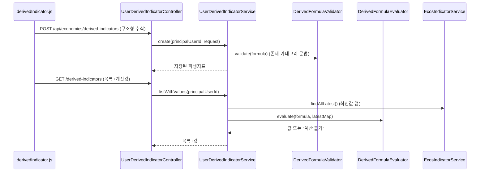
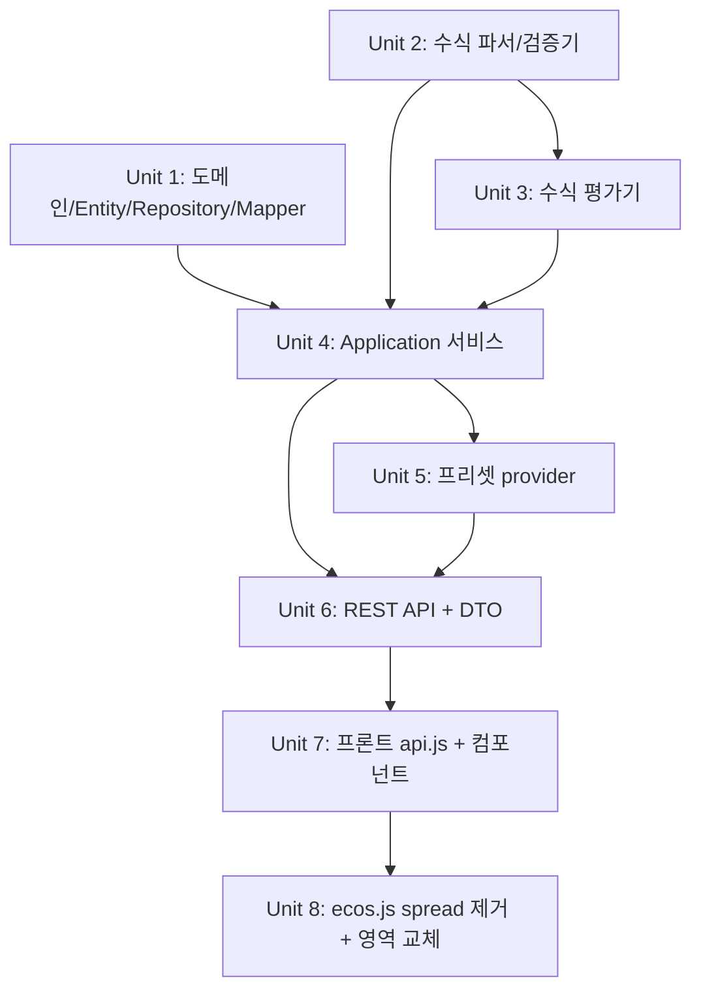

# feat: 사용자 커스텀 파생지표 기능

## Overview

국내경제지표(ECOS)를 2~3항 사칙연산으로 조합한 **사용자별 커스텀 파생지표**를 정의·저장·표시한다. 현재 프론트(`ecos.js`)에 고정 수식으로 박혀 있는 spread 계산을 제거하고, 사용자가 직접 정의한 파생지표 목록 + 필수 프리셋으로 대시보드 영역을 대체한다. 1차는 국내(ECOS)만, 글로벌은 후속.

## Problem Frame

파생지표가 프론트 고정 수식이라 운영 중 추가/변경 불가. 사용자가 코드 배포 없이 자신만의 파생지표를 구성하게 한다. (origin: docs/brainstorms/2026-05-25-custom-derived-indicators-requirements.md)

## Requirements Trace

- R1. 2~3항 제한 구조형 사칙연산 수식(`term op term (op term)?`, term=지표|상수)으로 파생지표 정의. **연산자 우선순위 적용(×÷ 먼저, +− 나중)** — 사용자 수학 직관과 일치 — Unit 2, 3, 4, 7
- R2. 사용 지표는 EcosIndicator **메타데이터에 정의된 지표**로 한정(최신값 캐시 적재 여부 무관), 메타 정의 부재 지표 거부 (글로벌 1차 제외) — Unit 2, 4, 6
- R3. **사용자 정의** 수식은 같은 `EcosIndicatorCategory` 내 지표만 조합. **시스템 프리셋은 검증된 교차 카테고리 조합 허용**(R3 예외) — Unit 2, 4, 5
- R4. 각 원시 지표 최신값 단일 시점 계산 — Unit 3, 4
- R5. 로그인 사용자별 저장, 본인 것만 CRUD (JWT principal 직접) — Unit 1, 4, 6
- R6. 생성/조회/수정/삭제 — Unit 4, 6, 7
- R7. 이름·단위 분리 입력 필드(사용자 입력) + 길이/문자/이스케이프 검증 — Unit 6, 7
- R8. 대시보드 spread 영역을 사용자 파생지표 목록+생성/관리 UI로 대체 — Unit 7, 8
- R9. 기존 프론트 고정 파생지표(ecos.js spread 로직) 제거 — Unit 8
- R10. 대표 파생지표 프리셋 필수 제공(1클릭 복제), 등급/해석 텍스트 손실 수용 — Unit 5, 7

성공 기준: 코드 배포 없이 생성·정확 계산·표시 / 잘못된 수식 생성 시점 거부 / 사용자 간 미노출 / 신규 사용자도 프리셋으로 빈화면 없음.

## Scope Boundaries

- 글로벌경제지표 1차 제외 (operand 매트릭스·신규 point-lookup 필요 → 후속)
- 히스토리/시계열 차트 비대상 (R4 최신값 단일 시점)
- 임의 중첩 수식·시계열 함수 비대상 (2~3항 제한). **4항 이상·괄호 중첩 수식(예: 수출÷(민간소비+설비투자+건설투자))은 표현 불가 → 프리셋에서도 제외**
- 카테고리 간 혼합 수식은 **사용자 정의** 비대상(프리셋은 R3 예외 허용)
- 기존 고정 파생지표의 등급/색상/해석 텍스트 이전 비대상 (손실 수용). **프리셋 표시값이 기존 대비 소수 자릿수/반올림 차이로 미세하게 다를 수 있음도 수용**(아키 F3)
- 파생지표 공유/공개 비대상 (사용자별 비공개)

## Context & Research

### Relevant Code and Patterns

- **레이어 규약**: `ARCHITECTURE.md §4–5` — `presentation → application → domain ← infrastructure`, Entity 연관관계 금지(ID 기반 참조만), DTO 변환 흐름 `Request DTO → Application DTO → Domain Model → Entity`.
- **user-owned Entity 청사진**: `favorite/infrastructure/persistence/UserFavoriteIndicatorEntity.java` — `@Id @GeneratedValue(IDENTITY)`, `@Column(name="user_id")`, `@Enumerated(STRING)`, `@Getter`만, `@PrePersist onCreate()`, `@Index`/`@UniqueConstraint`.
- **인증 패턴 (채택)**: **`glossary/presentation/GlossarySecurityContext.java`/`newsjournal/presentation/NewsJournalSecurityContext.java`의 가드형**(`Authentication==null` 및 `principal instanceof Long` 가드, 미인증 시 401 매핑). `favorite/.../FavoriteIndicatorController.getCurrentUserId(113)`의 raw cast는 dev/anonymous에서 500 누출 위험이라 **미채택**(반례). (보안 F1)
- **Mapper 템플릿**: `economics/infrastructure/persistence/mapper/EcosIndicatorLatestMapper.java` — `@Component`, `toEntity`/`toDomain`.
- **jsonb 매핑 선례**: `realestate/.../RealEstateMarketLatestEntity.java` — `@JdbcTypeCode(SqlTypes.JSON)` + `@Column(columnDefinition="jsonb")` String payload (Hibernate 6 네이티브, 별도 라이브러리 불요). Mapper(`RealEstateMarketLatestMapper`)는 String 통과만, 객체 직렬화 안 함.
- **메타 화이트리스트 소스**: `economics/application/EcosIndicatorMetadataService.java:getMetadataMap(39)` — `Map<compareKey, EcosIndicatorMetadata>`(키=`toCompareKey()`), `metadataRepository.findAll()` 적재. **캐시 독립 고정 메타**의 실제 소스(보안 F4 화이트리스트용).
- **지표 조회 재사용**: `economics/application/EcosIndicatorService.java:getIndicatorsByCategory(37)`(캐시, 폼 목록용), `findAllLatest(77)`(평가용 최신값), `EcosIndicatorLatestRepository.findByClassNameAndKeystatName(21)`.
- **계산 헬퍼 재사용**: `economics/application/EcosDerivedIndicatorService.java:buildIndicatorMap(41)/parseDouble(51)` — 단, key를 `keystatName` 단독 대신 `toCompareKey()`(className::keystatName)로 사용해 동명 충돌 회피.
- **카테고리/지표 식별**: `economics/domain/model/EcosIndicatorCategory.java`(15개, `fromClassName`/`contains`), `economics/domain/model/KeyStatIndicator.java`(record, `dataValue`는 String, `toCompareKey()`).
- **프론트 CRUD 선례**: `static/js/components/favorite.js`(`toggleFavorite:65`, `saveOrder:220`), 등록 3단계(`app.js:36–52` 스프레드 병합 + `index.html:99–115` script 추가).
- **API 진입점**: `static/js/api.js:request(15)`(JWT 헤더 자동 주입, 401 자동 로그아웃), favorite CRUD 래퍼 `153–180`(토큰 기반, userId 미부착).
- **프론트 교체 타겟**: `static/js/components/ecos.js:207–586`(`getCurrentSpreads:477`, `getSpreadSectionTitle:570`, 게이지/상태 헬퍼 500–568).

### Institutional Learnings

- `docs/solutions/architecture-patterns/spring-data-jpa-custom-impl-fragment-dynamic-sql-2026-05-10.md` — favorite 모듈이 user_id 스코프 데이터의 가장 가까운 선례. `findByUserId` derived query, 동적 SQL은 `setParameter` 바인딩만.
- `docs/solutions/architecture-patterns/deferred-unique-constraint-retry-requires-new-2026-05-10.md` — `UNIQUE(user_id, name)` race는 DEFERRABLE + `REQUIRES_NEW`(별도 `@Component`) 패턴. self-invocation `@Transactional` 주의.
- `docs/solutions/architecture-patterns/global-indicator-history-mirroring.md` — **PostgreSQL**(CLAUDE.md의 MariaDB 표기 outdated), **Flyway 없음 `ddl-auto:update`**(Entity로 테이블 자동 생성), `@Slf4j` 로깅.
- `docs/solutions/ui-bugs/responsive-design-tailwind-alpine.md` — 정적 HTML + Tailwind CDN + Alpine v3. 고정 픽셀 너비 금지, 반응형 유틸. Alpine reactive proxy가 외부 객체 감싸면 충돌 → `enumerable:false` 격리.
- 수식 AST 파싱/검증: `docs/solutions/` 선례 **없음** → 신규 설계, 화이트리스트 기반 검증.

### External References

외부 리서치 생략 — 로컬 패턴(favorite/economics)이 충분하고, 수식 파서는 2~3항 제한으로 단순해 외부 문헌 불요. 보안(인가·입력검증)은 origin Key Decisions에서 이미 제약 확정.

## Key Technical Decisions

- **패키지 = economics 내부** (`economics.derivedindicator.*`): EcosIndicator 재사용 응집도, API `/api/economics/derived-indicators`. (Approval Gate 확인 완료)
- **인증 = JWT principal 직접 (가드형)**: userId를 SecurityContext에서만 획득, 클라이언트 파라미터 미수신 → IDOR 표면 원천 제거. origin의 Portfolio `assertUserMatches` 결정을 보안상 더 우수한 패턴으로 갱신. 단 템플릿은 Favorite의 unguarded cast(`getCurrentUserId`)가 아니라 **`GlossarySecurityContext`/`NewsJournalSecurityContext`의 가드형**(`Authentication==null` 및 `principal instanceof Long` 가드 후 미인증 시 401 매핑 예외)을 따른다 — dev permitAll/anonymous principal에서 500 누출 방지(보안 deepening F1). 소유권은 `findByIdAndUserId` 쿼리로 검증, 미소유 시 404.
- **수식 모델 = 구조형(structured) 저장 + 연산자 우선순위**: 자유 문자열 파싱 대신 `{operands[], operators[]}` 구조로 저장·검증. term은 `{type: INDICATOR|CONSTANT, ref|value}`. 평가는 **연산자 우선순위 적용(×÷ 먼저)** — 좌→우 순차는 `A−B/C`를 사용자 직관과 다르게 계산하는 "그럴듯하지만 틀린 값" 위험이 있어 폐기(P1 결정). 2~3항·괄호 없음이라 우선순위 처리는 단순(×÷ 항을 먼저 접고 +−). (origin: 2~3항 제한 구조형)
- **JSON 직렬화 위치/안전성**: Entity는 `@JdbcTypeCode(SqlTypes.JSON)` + `@Column(columnDefinition="jsonb")` **String payload** 보유(`RealEstateMarketLatestEntity` 선례, Hibernate 6 네이티브). DerivedFormula↔String 직렬화는 **전용 컨버터(또는 application 경계)**가 담당하며 Mapper는 String 통과만 — `EcosIndicatorLatestMapper`의 객체 매핑 패턴은 직렬화엔 부적합. 역직렬화는 **폐쇄형(closed) 매핑**(`FormulaOperator`/`type` enum만, polymorphic/default typing 미사용, 미지 필드 거부), operands(2~3)/operators(1~2) 배열 길이 강제. **역직렬화 직후 저장 경로·로드 경로 모두 Validator 재통과**. 손상 JSON은 평가 "계산 불가"로 graceful 처리. (보안 F2 / 아키 F5 / feasibility)
- **수식 평가 안전성**: 범용 표현식 엔진 금지. 순수 도메인 평가기에서 화이트리스트 연산자(+,-,×,÷)만, 평가 시점에 0 나눗셈/null/오버플로/NaN/Infinity 안전 처리(예외 전파 금지, 결과 플래그). (origin 확정)
- **지표 식별자 = `(className, keystatName)` 복합키**: 한글 표시명 단독 대신 복합키로 저장·검증. INDICATOR 화이트리스트 소스는 **EcosIndicator 메타데이터 정의(고정 집합)** 기준이며 최신값 캐시 적재 상태와 독립 — 검증은 메타 존재성으로, 평가는 최신값 결측 시 "계산 불가"로 분리. (origin Deferred 해소 / 보안 F4)
- **검증 2단계**: 생성/수정 시점(지표 존재·카테고리 일치·문법·항 개수) + 평가 시점(0 나눗셈·결측·오버플로). (origin 확정)
- **순수 도메인 서비스 빈 등록**: `DerivedFormulaValidator`/`DerivedFormulaEvaluator`는 무상태 순수 객체로 **domain에 Spring 애너테이션 금지**(@Service/@Component 불가). application 서비스가 `new`로 보유하거나 `@Configuration`의 `@Bean`으로 등록·주입. (아키 F7)
- **숫자 파싱 헬퍼 domain 추출**: 쉼표 제거/null-safe 파싱(현재 `EcosDerivedIndicatorService.parseDouble`, private)을 economics 공유 domain 헬퍼로 추출해 기존 서비스와 신규 Evaluator가 공유. 기존 `EcosDerivedIndicatorService`의 public 시그니처는 불변(내부만 헬퍼 참조로 조정). "buildIndicatorMap 재사용"은 키 체계(keystatName 단독)가 달라 직접 재사용 불가 → compareKey 맵은 신규 작성. (아키 F1)
- **프리셋 = 코드 정의 provider (수동 전사, R3 예외, 최소 개수 보장)**: `DerivedIndicatorPresetProvider`가 대표 파생지표를 구조형 상수로 제공, 사용자가 1클릭 복제 시 본인 소유 레코드로 INSERT. 별도 테이블 불요. **프리셋은 R3 예외(교차 카테고리 허용)**, 4항 이상 표현 불가 항목은 제외, 최소 N개 보장(빈화면 방지). 기존 계산기는 구조형 표현이 없어 **자동 추출 불가 → 수동 전사**이며, 기존 `ratio`의 가변 소수/특수 반올림과 신규 평가의 차이로 **표시값이 미묘하게 달라질 수 있음**(Scope의 "손실 수용"에 수치 차이 포함). (아키 F3 / P1 결정)

## Open Questions

### Resolved During Planning

- 패키지 위치: economics 내부 — 확정
- 인증 패턴: 가드형 SecurityContext(GlossarySecurityContext 류) — 확정
- 수식 저장 포맷: 구조형 `{operands, operators}` jsonb String payload — 확정
- 지표 식별자: `(className, keystatName)` 복합키 — 확정
- 프리셋 저장: 코드 provider + 복제 INSERT, 별도 테이블 없음 — 확정
- **연산 순서: 연산자 우선순위 적용(×÷ 먼저) — 확정(P1)**
- **R3 적용 범위: 사용자 정의만 강제, 시스템 프리셋은 교차 카테고리 예외 — 확정(P1)**
- **dev 검증: 가드형 401 유지 + dev JWT 발급 절차 — 확정(P1)**
- **출시: U7+U8 한 배포 단위(단계 분리 안 함) — 확정(P1)**
- **4항 이상/괄호 중첩 수식: 표현 불가 → 프리셋·범위 제외 — 확정(P1)**

### Deferred to Implementation

- `name`/`unit` 입력 검증 **수치값**(길이 상한, 허용 문자셋): 검증 위치=서버 DTO는 확정, 수치만 구현 시 `CreateNewsEventRequest` 관례 따라 결정
- per-user 파생지표 **개수 상한 수치**: 상한 존재는 확정(보안 F5), 수치는 구현 시 결정
- 동시 생성 race(`UNIQUE(user_id, name)`) 처리 강도: 실제 충돌 빈도 낮음 → 1차는 제약 + 예외 처리, DEFERRABLE/REQUIRES_NEW는 필요 시 적용
- 참조 지표 단종/개명 시 저장 수식 처리(비활성화/숨김): 평가 시점 "계산 불가" 표시로 1차 대응, 통지/정리 정책은 후속
- 프리셋으로 제공할 대표 파생지표 최종 목록: 구현 시 기존 `EcosDerivedIndicatorService` 계산식을 수동 전사(R3 카테고리 정합 항목만)
- 기존 `EcosDerivedIndicatorService`(백엔드 하드코딩 계산기)가 프론트 spread 제거(Unit 8) 후 dead code화되는지: 확인 시 별도 후속 정리(본 plan 범위 밖)
- 표시 자릿수/반올림 정책(단위별 고정 소수 자리) 및 "정확 계산" 허용 오차 수치: Unit 3/6 구현 시 확정
- 수식 빌더 세부 인터랙션(operand type 토글, 2~3항 추가/제거 컨트롤, 검증 타이밍 실시간 vs 저장, 카테고리 변경 시 operand 초기화), 접근성(키보드/aria-live/터치 타깃): Unit 7 구현 시 결정(design 리뷰 항목)
- 프리셋 복제 UX 세부(이름 충돌 자동 접미사 vs 에러, 상한 도달 시 버튼 비활성/안내): Unit 7 구현 시 결정

## High-Level Technical Design

> *아래는 의도된 접근의 방향성 가이드이며 구현 명세가 아니다. 구현 에이전트는 참고 맥락으로만 다룬다.*

**수식 구조형 모델 (문자열 파서 대신 구조 저장):**

```
DerivedFormula
  operands : [ Operand, Operand, (Operand?) ]      # 2~3개
  operators: [ Operator, (Operator?) ]             # operands 개수 - 1
Operand   = { type: INDICATOR, className, keystatName }
          | { type: CONSTANT,  value: number }
Operator  = ADD | SUB | MUL | DIV
평가: 연산자 우선순위 적용 (×÷ 먼저 접고 +−). 괄호 없음(2~3항 제한). 예: A - B / C → A - (B/C)
검증(생성): INDICATOR operand는 EcosIndicator 메타에 존재 + (사용자정의) 동일 카테고리 / (프리셋) 교차 허용
검증(평가): 피연산자 null/blank → "계산 불가", DIV 분모 0 → "계산 불가", 결과 NaN/Inf → 거부
```

**컴포넌트 흐름 (생성/표시):**



## Implementation Units



- [ ] **Unit 1: 도메인 모델 + Entity + Repository + Mapper**

**Goal:** UserDerivedIndicator 영속 기반 구축 (도메인 모델, 구조형 수식 VO, JPA Entity, 포트+구현, Mapper)

**Requirements:** R1, R5

**Dependencies:** 없음

**Files:**
- Create: `economics/derivedindicator/domain/model/UserDerivedIndicator.java` (도메인 모델: id, userId, name, unit, DerivedFormula, category, createdAt)
- Create: `economics/derivedindicator/domain/model/DerivedFormula.java` (VO: operands, operators)
- Create: `economics/derivedindicator/domain/model/FormulaOperand.java`, `FormulaOperator.java` (enum)
- Create: `economics/derivedindicator/domain/repository/UserDerivedIndicatorRepository.java` (포트: save, findByUserId, findByIdAndUserId, deleteByIdAndUserId)
- Create: `economics/derivedindicator/infrastructure/persistence/UserDerivedIndicatorEntity.java`
- Create: `economics/derivedindicator/infrastructure/persistence/UserDerivedIndicatorJpaRepository.java`
- Create: `economics/derivedindicator/infrastructure/persistence/UserDerivedIndicatorRepositoryImpl.java`
- Create: `economics/derivedindicator/infrastructure/persistence/mapper/UserDerivedIndicatorMapper.java`
- Test: `src/test/java/.../economics/derivedindicator/infrastructure/persistence/mapper/UserDerivedIndicatorMapperTest.java`

**Approach:**
- Entity: `@Table(name="user_derived_indicator")` 명시, `@Id @GeneratedValue(IDENTITY)`, `Long userId`(@Column user_id, @Index), `name`/`unit`(@Column), 구조형 수식은 **`@JdbcTypeCode(SqlTypes.JSON)` + `@Column(columnDefinition="jsonb")` String payload**(`RealEstateMarketLatestEntity` 선례, Hibernate 6 네이티브, 별도 라이브러리 불요). `category`는 `@Enumerated(STRING)`. `@PrePersist onCreate()`로 createdAt. `@UniqueConstraint(user_id, name)`. (아키 F5: 정규화는 Entity 연관관계 금지 규약상 복잡도만 증가, 조회가 user 전량 로드라 jsonb 채택 사유는 타입 무결성 — 운영 쿼리/인덱스는 본 plan 범위 밖)
- DerivedFormula↔String 직렬화는 전용 컨버터/application 경계, Mapper는 String 통과만(객체 매핑 아님). 역직렬화는 폐쇄형 enum 매핑 + 미지 필드 거부, operands/operators 길이 상한 강제. 역직렬화 실패 시 평가 "계산 불가" graceful(목록 미파손). (schemaVersion 필드는 1차 제외 — jsonb는 스키마리스라 항 수 확장 후속 시 무중단 추가 가능, scope-guardian)
- 연관관계 금지(ARCHITECTURE §5): userId는 Long 컬럼만.
- Mapper는 `EcosIndicatorLatestMapper` 형태 복제. 수식 JSON ↔ DerivedFormula 변환은 Mapper 책임.

**Patterns to follow:** `favorite/.../UserFavoriteIndicatorEntity.java`, `economics/.../mapper/EcosIndicatorLatestMapper.java`

**Test scenarios:**
- Happy path: 도메인 모델 ↔ Entity 양방향 매핑 시 모든 필드 보존 (수식 JSON 직렬화/역직렬화 포함)
- Edge case: operands 2개(operator 1개), 3개(operator 2개) 모두 매핑 정확
- Edge case: CONSTANT operand와 INDICATOR operand 혼합 매핑

**Verification:** Mapper/컨버터 라운드트립 테스트 통과. jsonb DDL/round-trip은 실 PostgreSQL(또는 Testcontainers) 슬라이스로 1회 확인 — H2는 jsonb 미지원 가능(feasibility). `ddl-auto:update`로 테이블 자동 생성 확인

---

- [ ] **Unit 2: 수식 검증기 (DerivedFormulaValidator)**

**Goal:** 구조형 수식의 문법·항 개수·지표 존재·카테고리 일치를 생성 시점에 검증

**Requirements:** R1, R2, R3

**Dependencies:** Unit 1 (DerivedFormula VO)

**Files:**
- Create: `economics/derivedindicator/domain/service/DerivedFormulaValidator.java` (순수 도메인 서비스, Spring 의존 없음)
- Test: `src/test/java/.../economics/derivedindicator/domain/service/DerivedFormulaValidatorTest.java`

**Approach:**
- **입력 계약(Unit 4가 구성·주입, Unit 2는 순수 로직만)**: DerivedFormula + 사용 가능 지표 맵 `Map<compareKey, EcosIndicatorCategory>`(존재성 + 카테고리 동시). U2 시점에 계약(주입 파라미터 타입) 확정 후 U4에서 변경 불가. (아키 F8 / coherence)
- 화이트리스트 소스는 **EcosIndicator 메타 정의(고정 집합)** — 최신값 캐시 적재 상태와 무관. (보안 F4)
- 검증 규칙: operands 2~3개 / operators = operands-1 / 모든 INDICATOR operand 존재 / 연산자 화이트리스트(+,-,×,÷)만. **카테고리 동일성은 사용자 정의에만 강제, 프리셋은 면제**(검증 호출 시 `allowCrossCategory` 플래그로 구분 — 프리셋 경로만 true).
- 위반 시 검증 실패 결과(사유 enum) 반환 — 예외보다 결과 객체로 사유 전달.
- **domain 클래스에 Spring 애너테이션 금지**(@Service/@Component 불가). application이 `new` 또는 `@Bean`으로 주입. (아키 F7)

**Execution note:** 순수 로직이므로 test-first로 검증 규칙부터 작성.

**Patterns to follow:** `EcosDerivedIndicatorService`의 null-safe 헬퍼 스타일, code-convention(guard clause, 메서드 짧게)

**Test scenarios:**
- Happy path: 2항 `A - B` (동일 카테고리 지표) → 통과
- Happy path: 3항 `(A - B) / C` 형태 구조 → 통과
- Edge case: operand 1개 또는 4개 → 거부
- Error path: 존재하지 않는 지표 참조 → 거부 (사유: UNKNOWN_INDICATOR)
- Error path: `fromClassName`이 null인 className operand → UNKNOWN_INDICATOR로 귀결 (아키 F6)
- Error path: 사용자 정의에서 서로 다른 카테고리 지표 조합 → 거부 (사유: CATEGORY_MISMATCH)
- Happy path: 프리셋 경로(allowCrossCategory=true)에서 교차 카테고리 조합 → 통과 (R3 예외)
- Error path: operators 개수 불일치 → 거부
- Edge case: 최신값 캐시가 비어도 메타상 존재하는 지표는 검증 통과(거부 아님) (보안 F4)

**Verification:** 모든 검증 규칙 단위 테스트 통과

---

- [ ] **Unit 3: 수식 평가기 (DerivedFormulaEvaluator)**

**Goal:** 최신값 맵을 받아 구조형 수식을 평가, 평가 시점 안전 처리(0 나눗셈/결측/오버플로)

**Requirements:** R4

**Dependencies:** Unit 2 (검증된 수식 가정)

**Files:**
- Create: `economics/derivedindicator/domain/service/DerivedFormulaEvaluator.java` (순수 도메인 서비스)
- Test: `src/test/java/.../economics/derivedindicator/domain/service/DerivedFormulaEvaluatorTest.java`

**Approach:**
- 입력: DerivedFormula + `Map<String, Double>` 최신값(키=compareKey). **연산자 우선순위 적용**(×÷ 먼저 평가 후 +−). **Evaluator는 economics 타 도메인 모델(EcosIndicatorLatest/KeyStatIndicator) import 금지** — application이 변환해 순수 맵만 주입. (아키 F2)
- INDICATOR operand 해석: compareKey로 맵 조회. CONSTANT는 value.
- 안전 처리: 피연산자 null/blank → 결과 "계산 불가"(null + 사유). DIV 분모 0 → "계산 불가". 결과 NaN/Infinity → "계산 불가". 예외 전파 금지.
- 숫자 파싱은 domain 공유 헬퍼(`EcosDerivedIndicatorService.parseDouble`에서 추출, 아키 F1)를 참조. domain 클래스에 Spring 애너테이션 금지.

**Execution note:** test-first.

**Patterns to follow:** `EcosDerivedIndicatorService.calc/ratio`의 null 전파 + 0 division guard (단 시그니처 변경 없이 파싱 헬퍼만 domain으로 추출)

**Test scenarios:**
- Happy path: `A - B`, A=5 B=2 → 3
- Happy path(우선순위): `A - B / C`, A=10 B=6 C=2 → A-(B/C)=7 (좌→우면 2가 되는 오답 회피)
- Happy path: `A × B + C` → (A×B)+C
- Edge case: CONSTANT 포함 `A / 100` → 정확 계산
- Error path: 분모 지표 최신값 0 → "계산 불가"(예외 없음)
- Error path: 피연산자 지표 최신값 결측(맵에 없음) → "계산 불가"
- Error path: 오버플로로 Infinity → "계산 불가"

**Verification:** 안전 처리 케이스 전부 예외 없이 "계산 불가" 반환

---

- [ ] **Unit 4: Application 서비스 (UserDerivedIndicatorService)**

**Goal:** CRUD + 프리셋 복제 + 생성 시 검증(Unit 2) + 조회 시 평가(Unit 3) 오케스트레이션, 지표 메타/최신값 변환 주입

**Requirements:** R1~R6, R10(copyPreset)

**Dependencies:** Unit 1, 2, 3 (프리셋 상수는 Unit 5 Provider 주입)

**Files:**
- Create: `economics/derivedindicator/application/UserDerivedIndicatorService.java` (`@Service @Transactional`)
- Create: `economics/derivedindicator/application/dto/` (필요 시 application DTO)
- Test: `src/test/java/.../economics/derivedindicator/application/UserDerivedIndicatorServiceTest.java`

**Approach:**
- **검증용 메타 맵 구성**: **`EcosIndicatorMetadataService.getMetadataMap()`(캐시 독립 고정 메타, `Map<compareKey, EcosIndicatorMetadata>`)** 기반으로 화이트리스트 구성. 카테고리는 meta의 className에 `EcosIndicatorCategory.fromClassName` 적용 → `Map<compareKey, EcosIndicatorCategory>`. `fromClassName` null인 className은 제외(R2 거부). cache-backed `getIndicatorsByCategory`/`findAllLatest`는 검증 화이트리스트 소스로 쓰지 않음(보안 F4 위반 방지 — feasibility F1). (아키 F6)
- **평가용 최신값 맵 변환**: `findAllLatest()`의 `EcosIndicatorLatest`(dataValue=String)를 `toCompareKey()` → Double(공유 파싱 헬퍼) 맵으로 변환해 Evaluator에 `Map<String,Double>`로 주입. 파싱 실패/blank는 맵에서 제외(평가 시 "계산 불가"). (아키 F2)
- `create(userId, command)`: 메타 맵 구성 → Validator 호출 → 통과 시 save. **per-user 개수 상한 확인**(초과 시 거부, 보안 F5).
- `listWithValues(userId)`: findByUserId → 최신값 맵 1회 구축 → 각 수식 Evaluator 평가 → 값 포함 결과(N+1 방지).
- `update(userId, id, command)`: findByIdAndUserId(소유권) → **create와 동일한 전체 검증 파이프라인 재사용**(메타 화이트리스트·카테고리·항 개수). category 임의 변경 불가(변경 시 동일 검증). `delete(userId, id)`: deleteByIdAndUserId. (보안: update 검증 parity)
- `copyPreset(userId, presetKey)`: Provider(Unit 5)에서 presetKey 화이트리스트 조회(미존재 404) → create 경로 재사용해 본인 레코드 INSERT. (아키 F4: copyPreset을 본 유닛에 포함, Unit 5는 Provider만)
- `availableIndicators(category?)`: 사용 가능 지표 목록(생성 폼용) — `getIndicatorsByCategory`/`findAllLatest` 재사용.
- 소유권 미존재 시 404 매핑용 예외.

**Patterns to follow:** `PortfolioService.findUserItem`(소유권 검증 의미), `EcosIndicatorService` 캐시 조회, `EcosIndicatorCategory.fromClassName`

**Test scenarios:**
- Happy path: create → 검증 통과 → 저장, 반환 모델에 category 자동 설정
- Happy path: listWithValues → 각 항목 최신값 계산 포함, 최신값 맵 1회만 조회(N+1 방지)
- Error path: create에 잘못된 수식 → 검증 실패 예외, 저장 안 됨
- Error path: update/delete에 타 사용자 id → 404 예외 (소유권)
- Error path: update에 다른 카테고리/미존재 지표 수식 → 400 (create와 동일 검증)
- Error path: per-user 개수 상한 초과 생성 → 거부 (보안 F5)
- Integration: create 후 listWithValues가 방금 만든 항목을 평가값과 함께 반환
- Integration: copyPreset → 본인 레코드 생성 후 목록에 표시
- Edge case: 최신값 결측 지표 포함 항목도 목록에는 포함되되 값은 "계산 불가"

**Verification:** CRUD + 프리셋 복제 + 소유권 + 평가 통합 동작, 타 사용자 격리 확인

---

- [ ] **Unit 5: 프리셋 provider (DerivedIndicatorPresetProvider)**

**Goal:** 대표 파생지표 프리셋을 구조형으로 제공, 사용자 1클릭 복제 지원 (R10 빈화면 회귀 방지)

**Requirements:** R10

**Dependencies:** Unit 1, 2 (구조형 VO + Validator로 자기검증). copyPreset 자체는 Unit 4 소속.

**Files:**
- Create: `economics/derivedindicator/application/DerivedIndicatorPresetProvider.java` (프리셋 상수 정의 + key 화이트리스트, **Service Modify 없음** — 아키 F4)
- Test: `src/test/java/.../economics/derivedindicator/application/DerivedIndicatorPresetProviderTest.java`

**Approach:**
- 기존 `EcosDerivedIndicatorService` 카테고리 계산식을 **수동 전사**해 대표 spread를 구조형 수식 프리셋 상수로 정의. 자동 추출 아님(기존은 private 하드코딩, 구조형 표현 부재 — 아키 F3). 등급/해석 텍스트 비포함, 표시값 미세 차이 수용.
- **프리셋은 R3 예외**: 교차 카테고리 조합(가계신용÷예금 등)도 검증된 안전 조합으로 허용(Validator를 `allowCrossCategory=true`로 호출). 사용자 정의는 R3 유지.
- **2~3항 표현 불가 항목 제외**: 4항 이상·괄호 중첩(수출÷(민간소비+설비투자+건설투자)) 등은 프리셋에서 제외(Scope 비대상). 특수 반올림 항목은 신규 자릿수 정책으로 근사.
- **최소 보장 개수(수용 기준)**: 프리셋은 최소 N개(예: 주요 카테고리별 1개 이상) 제공해 신규 사용자 빈화면 방지(R10). 전사 후보 목록은 본 plan의 Deferred에서 Unit 5 착수 시 확정.
- presetKey 화이트리스트 제공(copyPreset/조회 API가 참조). 미존재 key는 404.

**Patterns to follow:** `EcosDerivedIndicatorService`의 카테고리별 수식 정의(전사 참조 원본, 변경하지 않음)

**Test scenarios:**
- Happy path: 프리셋 목록 반환, 각 프리셋 수식이 Validator(allowCrossCategory=true) 통과(자기 정합성)
- Happy path: 교차 카테고리 프리셋(가계신용÷예금)이 R3 예외로 통과
- Happy path: copyPreset → 사용자 소유 레코드 생성
- Edge case: 최소 보장 개수(N개) 충족 확인 — 빈화면 방지
- Edge case: 동일 프리셋 2회 복제 시 이름 충돌 처리

**Verification:** 모든 프리셋이 검증 규칙을 통과(잘못된 프리셋 출하 방지), 복제 후 본인 목록에 표시

---

- [ ] **Unit 6: REST API (Controller + DTO)**

**Goal:** CRUD + 사용 가능 지표 조회 + 프리셋 조회/복제 엔드포인트, JWT principal 인가

**Requirements:** R5, R6, R7, R2

**Dependencies:** Unit 4, 5

**Files:**
- Create: `economics/derivedindicator/presentation/UserDerivedIndicatorController.java`
- Create: `economics/derivedindicator/presentation/dto/DerivedIndicatorCreateRequest.java` (record + `@Valid`)
- Create: `.../dto/DerivedIndicatorUpdateRequest.java`, `.../dto/DerivedIndicatorResponse.java`(from()), `.../dto/AvailableIndicatorResponse.java`, `.../dto/DerivedIndicatorPresetResponse.java`
- Test: `src/test/java/.../economics/derivedindicator/presentation/UserDerivedIndicatorControllerTest.java`

**Approach:**
- base path `/api/economics/derived-indicators`. userId는 **가드형 SecurityContext 헬퍼**(`GlossarySecurityContext`/`NewsJournalSecurityContext` 패턴 — null/Long 가드, 미인증 401)로만 획득. Favorite의 raw cast(`getCurrentUserId`) 금지. 요청 파라미터/바디에 userId 없음. (보안 F1)
- 엔드포인트(모두 base path 하위 명시): `GET /api/economics/derived-indicators`(목록+값), `POST`, `PUT /{id}`, `DELETE /{id}`, `GET /api/economics/derived-indicators/available-indicators?category=`, `GET /api/economics/derived-indicators/presets`, `POST /api/economics/derived-indicators/presets/{key}/copy`. `{key}`는 Provider 화이트리스트 검증, 미존재 404(보안 F6).
- **읽기 엔드포인트(available-indicators, presets)도 인증 필수** — CRUD와 동일 Security 필터/가드 적용, 미인증 401. userId 불요 경로라도 인증 일관 적용(보안: read 엔드포인트 인가).
- **dev 검증 방식(P1 결정)**: 가드형 401을 dev에서도 유지(Portfolio식 skip 미채택). dev/로컬 수동 검증은 **유효 JWT 발급 절차**로 토큰을 얻어 호출 — 발급 절차는 Documentation 노트에 명시.
- DTO: record + 정적 `from()`. 입력 검증 `@Valid` + **name/unit 서버 검증 필수**(`@NotBlank @Size(max=...)` + 허용 문자셋, 선례 `CreateNewsEventRequest`). 검증 위치=서버 DTO 확정(Deferred 아님), 상한 수치만 구현 시 결정. 수식 구조는 DTO에서 도메인 VO로 변환. (보안 F3)
- **400 응답 본문은 안정된 사유 enum/메시지만 노출** — 역직렬화 예외 원문·스택트레이스·내부 className 구조 비노출. 전역 예외 핸들러가 deserialization 실패를 일반화된 400으로 매핑. (보안: 정보 노출)
- 소유권 예외 → 404, 검증 실패 → 400(사유 enum), 미인증 → 401.

**Patterns to follow:** `GlossarySecurityContext`/`NewsJournalSecurityContext`(가드형 principal), `FavoriteIndicatorController`(`@Valid @RequestBody`, record DTO + from()), `EcosIndicatorController`(URL 네이밍), `CreateNewsEventRequest`(검증)

**Test scenarios:**
- Happy path: POST 유효 수식 → 201/200, 본인 목록에 추가
- Happy path: GET 목록 → 본인 것만, 평가값 포함
- Error path: 잘못된 수식 POST → 400 + 사유
- Error path: 타 사용자 리소스 PUT/DELETE → 404
- Error path: name 길이 초과/금지 문자 → 400 (R7)
- Error path: name에 `<script>`/`` → 서버 거부 또는 저장 시 프론트 x-text로 무해 렌더 (보안 F3)
- Error path: 토큰 없음/anonymous principal → 401(500 아님), principal이 Long 아님 → 401 (보안 F1)
- Error path: 미인증 상태로 GET /available-indicators, GET /presets 호출 → 401 (read 엔드포인트 인가)
- Error path: 알 수 없는 presetKey → 404 (보안 F6)
- Integration: POST → GET 라운드트립, principal 기반 격리(다른 토큰은 미조회)

**Verification:** 전 엔드포인트 인가/검증/CRUD 동작, userId 파라미터 부재 확인, 미인증 401 매핑 확인

---

- [ ] **Unit 7: 프론트 api.js + 신규 컴포넌트 (derivedIndicator.js)**

**Goal:** 파생지표 목록/생성/수정/삭제 + 프리셋 복제 UI, 사용 가능 지표 선택·수식 구성·검증 피드백

**Requirements:** R1, R6, R7, R8, R10

**Dependencies:** Unit 6

**Files:**
- Modify: `static/js/api.js` (derived-indicators CRUD 래퍼 추가, favorite 스타일 토큰 기반)
- Create: `static/js/components/derivedIndicator.js` (`DerivedIndicatorComponent` 믹스인)
- Modify: `static/index.html` (script 태그 추가)
- Modify: `static/js/app.js` (스프레드 병합 목록에 추가)
- Create/Modify: 파생지표 영역 partial (`static/partials/` ecos 관련 partial)
- Test: 수동 검증(프론트 단위 테스트 인프라 부재) — `Test expectation: none -- 정적 HTML+Alpine, 자동 테스트 인프라 없음. 수동 시나리오로 검증`

**Approach:**
- 컴포넌트 등록 3단계(컴포넌트 파일 → index.html script → app.js 스프레드).
- 생성 폼: 카테고리 선택 → 해당 카테고리 지표 드롭다운에서 2~3개 operand 선택 + 연산자 선택 + 상수 입력, 이름·단위 **분리 입력 필드**. 검증 에러는 인라인 표시.
- **평가 순서 미리보기**: 입력 즉시 우선순위 반영 수식(예: `A − (B ÷ C)`)과 현재 최신값 기준 결과를 프리뷰로 표시 — 사용자가 저장 전 의미·예상값 확인(design·adversarial P1 연계).
- **계산 불가 표시 구분**: 일시적 데이터 결측("최신값 없음")과 분모 0("0으로 나눔")을 사용자 친화 문구로 구분, 값 자리 placeholder + 보조텍스트. 수식 오류로 오인 방지.
- 목록: 본인 파생지표 + 계산값(또는 "계산 불가"), 빈 상태 시 프리셋 추천 + 1클릭 복제 CTA. 신규 영역에 **산출 방식 변경 안내**(기존 spread 대체, 해석 텍스트 비제공).
- **XSS 정책 준수(보안 F3)**: name/unit/계산값 등 모든 사용자 출처 렌더링은 `x-text`/`textContent`만 사용, `x-html`/`innerHTML` 금지(`glossary.js` 정책 인용).
- 반응형(고정 px 금지), Alpine reactive 격리(generation counter — stale 응답 무시).

**Patterns to follow:** `favorite.js`(CRUD/정렬), `api.js:request` 래퍼, `responsive-design-tailwind-alpine` 학습

**Test scenarios:** `Test expectation: manual` —
- 수동: 카테고리 선택 → 지표 드롭다운 갱신
- 수동: 2~3항 수식 생성 → 목록 즉시 반영
- 수동: 잘못된 수식(다른 카테고리) → 인라인 에러
- 수동: 빈 상태 → 프리셋 복제 → 목록 표시
- 수동: 모바일 폭에서 폼/목록 레이아웃 정상

**Verification:** 로컬 구동 후 생성·표시·프리셋 복제·빈 상태 흐름 수동 확인. **가드형 401 유지로 dev 수동 검증 시 유효 JWT 발급 절차로 토큰 획득 후 호출**(Documentation 노트 참조).

---

- [ ] **Unit 8: ecos.js spread 제거 + 대시보드 영역 교체**

**Goal:** 기존 고정 파생지표 계산/표시 제거하고 신규 파생지표 영역으로 교체 (R9)

**Requirements:** R8, R9

**Dependencies:** Unit 7 — **U7와 U8은 한 배포 단위로 함께 출시**(P1 결정: 단계 분리 안 함). U8만 먼저 반영되어 대시보드 공백이 생기는 사고 방지.

**Files:**
- Modify: `static/js/components/ecos.js` (라인 207–586 `get*Spreads`/`getCurrentSpreads`/`getSpreadSectionTitle`/게이지 헬퍼 제거)
- Modify: 대시보드 partial/HTML (spread 렌더 영역 → DerivedIndicatorComponent 영역으로 교체)
- Test: `Test expectation: none -- 제거 + 영역 교체, 동작은 Unit 7에서 검증`

**Approach:**
- ecos.js의 spread 계산·렌더 의존 제거. 다른 ecos 기능(지표 표시, 차트 등)에 영향 없는지 참조 확인 후 제거.
- 대시보드에서 해당 영역을 derivedIndicator 컴포넌트로 연결.

**Patterns to follow:** 기존 컴포넌트 영역 마크업 구조

**Test scenarios:** `Test expectation: manual` —
- 수동: spread 제거 후 ecos 대시보드 나머지 기능 정상
- 수동: 교체 영역에 파생지표 목록 정상 표시

**Verification:** 고정 spread 흔적 제거 + 신규 영역 정상 동작, ecos 잔여 기능 회귀 없음

## System-Wide Impact

- **Interaction graph:** 신규 컨트롤러는 Spring Security 필터 체인(JWT) 경유. `EcosIndicatorService` 캐시(`ECOS_INDICATOR_CACHE`) 읽기 재사용 — 쓰기 없음.
- **Error propagation:** 검증 실패 400(사유), 소유권 위반 404, 평가 실패는 예외 아닌 "계산 불가" 값. 외부 ECOS API 실패는 기존 캐시/fallback 경로 그대로.
- **State lifecycle risks:** `UNIQUE(user_id, name)` 동시 생성 race(낮음). `ddl-auto:update`로 테이블 자동 생성 — 운영 배포 시 스키마 반영 확인.
- **API surface parity:** 신규 공개 API(Approval Gate 통과). 글로벌 후속 단계에서 동일 패턴 확장 예정.
- **Integration coverage:** create→list 평가 라운드트립, principal 기반 사용자 격리는 컨트롤러 통합 테스트로 증명(목 단독 불가).
- **Unchanged invariants:** 기존 EcosIndicator/economics 조회 API·캐시·배치 미변경. ecos.js의 spread 외 기능(지표/차트) 미변경.

## Risks & Dependencies

| Risk | Mitigation |
|------|------------|
| 기존 고정 spread 제거로 사용자 가치 공백 | 필수 프리셋(R10, Unit 5, 최소 N개 보장, R3 예외로 교차 카테고리 포함) + 빈 상태 복제 CTA(Unit 7) + U7/U8 동일 릴리스 |
| 연산 순서 오해로 잘못된 값 신뢰 | 연산자 우선순위 적용(×÷ 먼저) + 프론트 수식/결과 미리보기(Unit 7) |
| 프리셋 표시값이 기존과 달라 버그 오인 | 표시 자릿수/반올림 정책 명시 + 신규 영역에 산출 방식 변경 안내(Unit 7) |
| 사용자 입력 수식의 인가/주입 위험 | principal 직접 인증(userId 미수신) + 구조형 저장(자유 문자열 eval 없음) + 화이트리스트 검증 |
| 평가 시점 0 나눗셈/결측으로 대시보드 깨짐 | 평가기 안전 처리(예외 전파 금지, "계산 불가" 표시) |
| 참조 지표 단종/개명 시 수식 깨짐 | 평가 시 "계산 불가" 표시로 graceful, 통지/정리는 후속(Deferred) |
| 동명 지표 충돌(keystatName 단독) | `(className,keystatName)` 복합키 사용 |
| dev permitAll/anonymous principal에서 인증 500 누출 | 가드형 SecurityContext 헬퍼(null/Long 가드, 401 매핑) — Favorite raw cast 금지 (보안 F1) |
| 사용자 입력 name/unit 저장형 XSS(→ JWT 탈취 경로) | 프론트 x-text only + 서버 DTO 검증 필수 (보안 F3) |
| 조작된 수식 JSON 역직렬화 우회 | 폐쇄형 enum 매핑 + 미지 필드 거부 + 로드 시 Validator 재통과 (보안 F2) |
| 인증 사용자 대량 생성/프리셋 복제 자원 고갈 | per-user 개수 상한(서버 검증, 초과 400), 필요 시 rate limit(`RefreshRateLimiter` 선례) — 상한 존재는 확정, 수치는 구현 시 (보안 F5) |
| `ddl-auto:update` 스키마 자동변경 부작용 | 신규 테이블만 추가(기존 미변경), 배포 시 스키마 검토 |

## Documentation / Operational Notes

- 신규 테이블 `user_derived_indicator`는 `ddl-auto:update`로 자동 생성. 운영 배포 시 스키마 반영 확인. 추가 제약(DEFERRABLE 등) 필요 시 `src/main/resources/db/migration/*.sql` 수동 SQL.
- **dev JWT 발급 절차**: 가드형 401을 dev에서도 유지하므로, 로컬 수동 검증 시 기존 인증 경로(로그인 API/토큰 발급)로 유효 JWT를 받아 `Authorization` 헤더에 사용. 절차/스크립트는 구현 시 README 또는 dev 가이드에 명문화.
- **출시 단위**: U7(신규 영역)과 U8(기존 spread 제거)은 한 배포로 함께 출시. U7→U8 순서 + 동일 릴리스 강제로 대시보드 공백 구간 없음.
- 글로벌경제지표 확장은 별도 후속 plan(operand 매트릭스 + GlobalIndicatorLatest point-lookup 쿼리).

## Sources & References

- **Origin document:** [2026-05-25-custom-derived-indicators-requirements.md](../brainstorms/2026-05-25-custom-derived-indicators-requirements.md)
- 관련 이슈: #36
- 핵심 참고 코드: `favorite/.../UserFavoriteIndicatorEntity.java`, `favorite/presentation/FavoriteIndicatorController.java`, `economics/application/EcosIndicatorService.java`, `economics/application/EcosDerivedIndicatorService.java`, `static/js/components/{ecos.js,favorite.js,api.js}`
- 학습: `docs/solutions/architecture-patterns/{spring-data-jpa-custom-impl-fragment-dynamic-sql,deferred-unique-constraint-retry-requires-new,global-indicator-history-mirroring}-*.md`, `docs/solutions/ui-bugs/responsive-design-tailwind-alpine.md`
